# 一、从原生jdbc到MyBatis3.x

## 1. 原生jdbc访问数据库

>注意：本地安装Myql使用5.7版本

1、原生jdbc访问数据库步骤

* 加载JDBC驱动程序
* 创建数据库的连接
* 创建preparedStatement
* 执行SQL语句
* 处理结果集
* 关闭JDBC对象资源

2、Maven 项目测试原生JDBC连接

* 加载依赖包

```xml
<dependency>
	<groupId>mysql</groupId>
	<artifactId>mysql-connector-java</artifactId>
	<version>8.0.21</version>
</dependency>
```

* Main函数访问代码实操

```java
public class Main {
    public static void main(String [] args) throws Exception {
        //加载驱动类
        Class.forName("com.mysql.cj.jdbc.Driver");
        //连接配置
        String url = "jdbc:mysql://127.0.0.1:3306/xdclass?useUnicode=true&characterEncoding=utf-8&useSSL=false&serverTimezone=Asia/Shanghai";
        String username = "root";
        String password = "123456";
        //获取连接对象，并连接数据库
        Connection connection = DriverManager.getConnection(url,username,password);
        //获取语句对象
        Statement statement = connection.createStatement();
        //执行查询，返回结果集
        ResultSet resultSet =  statement.executeQuery("select * from video");
        while (resultSet.next()){
            System.out.println("视频标题:"+resultSet.getString("title"));
        }
        statement.close();
    }
}
```

注意：

1. 高版本的驱动类需要指定 `serverTimezone` 时区字段，否则报错。具体报错信息如下：
```
Caused by: com.mysql.cj.exceptions.InvalidConnectionAttributeException: The server time zone value '�й���׼ʱ��' is unrecognized or represents more than one time zone. You must configure either the server or JDBC driver (via the 'serverTimezone' configuration property) to use a more specifc time zone value if you want to utilize time zone support.
	at sun.reflect.NativeConstructorAccessorImpl.newInstance0(Native Method)
	at sun.reflect.NativeConstructorAccessorImpl.newInstance(NativeConstructorAccessorImpl.java:62)
	at sun.reflect.DelegatingConstructorAccessorImpl.newInstance(DelegatingConstructorAccessorImpl.java:45)
	at java.lang.reflect.Constructor.newInstance(Constructor.java:423)
	at com.mysql.cj.exceptions.ExceptionFactory.createException(ExceptionFactory.java:61)
```

* `serverTimezone=UTC`  UTC 表示不属于任意时区  。协调世界时间，又称世界统一时间，世界标准时间，国际协调时间，简称UTC。
* `serverTimezone=Asia/Shanghai`  修改成服务器所在地的真实时区，北京(东八区)的区时。

2. 注意资源的释放，资源包括 数据库连接，语句对象，为了代码简洁，可以使用 `try-with-resource` 方式进行关闭。

### 1.1. 原生jdbc访问数据库缺点

1. 每次要加载驱动，连接信息是硬编码
2. sql和java代码耦合一起，改动不易
3. 参数设置缺少灵活性
4. 处理结果集麻烦，不能自动映射到实体类
5. 连接资源不能复用，资源浪费。
6. 资源需要手动去关闭。

### 1.2. 什么是ORM框架

ORM即 Object Relation Mapping。对数据库的表和POJO(Plain Ordinary Java Object)Java对象的做映射的框架

市面上的ORM框架：

1. hibernate (ssh)
    * 比较笨重，sql调优麻烦
    * 推荐指数：不推荐

2. JPA - Spring Data JPA
    * Java Persistence API, 轻量级，部分中小项目适合。hibernate也有JPA的实现。
    * 推荐指数：次之

3. mybatis
    * 半自动化(半ORM框架)，便于写sql，轻量级，在阿里等大厂广泛使用
      * 简单易学：本身就很小且简单。没有任何第三方依赖，最简单安装只要两个jar文件+配置几个sql映射文件就可以了，易于学习，易于使用，通过文档和源代码，可以比较完全的掌握它的设计思路和实现
      * 灵活：mybatis不会对应用程序或者数据库的现有设计强加任何影响。sql写在xml里，便于统一管理和优化。通过sql语句可以满足操作数据库的所有需求
      * 解除sql与程序代码的耦合：通过提供DAO层，将业务逻辑和数据访问逻辑分离，使系统的设计更清晰，更易维护，更易单元测试。sql和代码的分离，提高了可维护性。
      * 提供xml标签，支持编写动态sql。
    * 推荐指数：推荐

## 2. Mybatis 3.x 基础知识

### 2.1. MyBatis简介与核心流程

1、什么是 MyBatis ？

Apahce的一个开源项目，一款优秀的持久层框架，它支持自定义 SQL、存储过程以及高级映射，免除了几乎所有的 JDBC 代码以及设置参数和获取结果集的工作，通过简单的 <u>XML 或注解来配置和映射 Java对象 到 数据库中的记录</u>。

- MyBatis 可以使用简单的 XML 或注解来配置和映射原生信息，将接口和Java的实体类 【Plain Old Java Objects,普通的 Java对象】映射成数据库中的记录。
- MyBatis 本是apache的一个开源项目ibatis, 2010年这个项目由apache 迁移到了google code，并且改名为MyBatis 。
- 2013年11月迁移到Github .
- Mybatis官方文档 : http://www.mybatis.org/mybatis-3/zh/index.html
- GitHub : https://github.com/mybatis/mybatis-3

2、Mybatis 3.x 核心流程：

>参考：https://mybatis.org/mybatis-3/zh/getting-started.html

* 每个基于 MyBatis 的应用服务都是以一个 `SqlSessionFactory` 的单例实例为核心
* `SqlSessionFactory` 的实例可以通过 `SqlSessionFactoryBuilder` 获得。`SqlSessionFactoryBuilder` 可以从 XML 配置文件或一个预先配置的 `Configuration` 实例来构建出 `SqlSessionFactory` 单例实例
* 工厂设计模式里面通过 `SqlSessionFactory` 获取 `SqlSession` ， `SqlSession` 里面提供了在数据库执行 SQL 命令所需的所有方法
* 每个线程都应该有它自己的 `SqlSession` 实例。`SqlSession` 的实例不是线程安全的，因此是不能被共享的，所以它的最佳的作用域是请求或方法作用域
  * 每次收到 HTTP 请求，就可以打开一个 `SqlSession`，返回一个响应后，就关闭它。 这个关闭操作很重要，为了确保每次都能执行关闭操作，你应该把这个关闭操作放到 finally 块中

流程图：

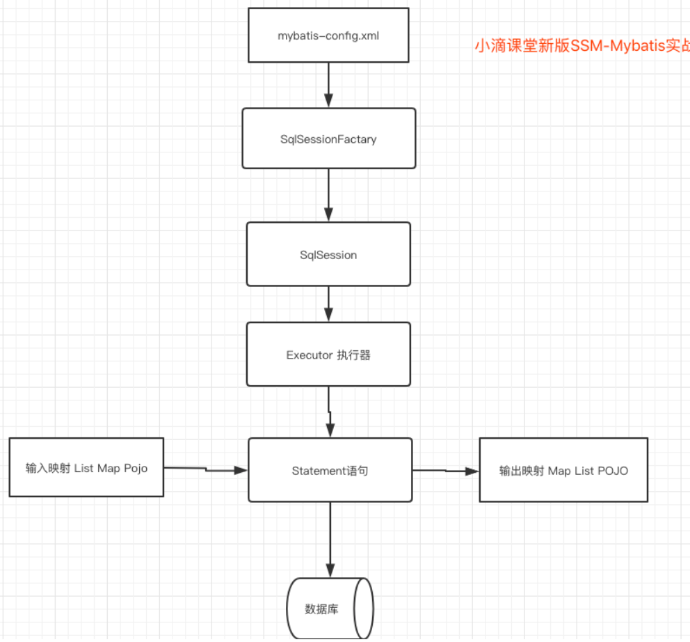

### 2.2. 生命周期和作用域

作用域（Scope）和生命周期

- 理解我们目前已经讨论过的不同作用域和生命周期类是至关重要的，因为错误的使用会导致非常严重的并发问题。
- 我们可以先画一个流程图，分析一下Mybatis的执行过程！

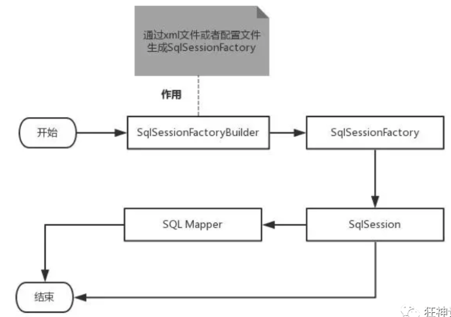

作用域理解:

- SqlSessionFactoryBuilder 的作用在于创建 SqlSessionFactory，创建成功后，SqlSessionFactoryBuilder 就失去了作用，所以它只能存在于创建 SqlSessionFactory 的方法中，而不要让其长期存在。因此 SqlSessionFactoryBuilder 实例的最佳作用域是方法作用域（也就是局部方法变量）。
- SqlSessionFactory 可以被认为是一个数据库连接池，它的作用是创建 SqlSession 接口对象。因为 MyBatis 的本质就是 Java 对数据库的操作，所以 SqlSessionFactory 的生命周期存在于整个 MyBatis 的应用之中，所以一旦创建了 SqlSessionFactory，就要长期保存它，直至不再使用 MyBatis 应用，所以可以认为 SqlSessionFactory 的生命周期就等同于 MyBatis 的应用周期。
  - 由于 SqlSessionFactory 是一个对数据库的连接池，所以它占据着数据库的连接资源。如果创建多个 SqlSessionFactory，那么就存在多个数据库连接池，这样不利于对数据库资源的控制，也会导致数据库连接资源被消耗光，出现系统宕机等情况，所以尽量避免发生这样的情况。
  - 因此在一般的应用中我们往往希望 SqlSessionFactory 作为一个单例，让它在应用中被共享。所以说 SqlSessionFactory 的最佳作用域是应用作用域。
- 如果说 SqlSessionFactory 相当于数据库连接池，那么 SqlSession 就相当于一个数据库连接（Connection 对象），你可以在一个事务里面执行多条 SQL，然后通过它的 commit、rollback 等方法，提交或者回滚事务。所以它应该存活在一个业务请求中，处理完整个请求后，应该关闭这条连接，让它归还给 SqlSessionFactory，否则数据库资源就很快被耗费精光，系统就会瘫痪，所以用 try...catch...finally... 语句来保证其正确关闭。
- 所以 SqlSession 的最佳的作用域是请求或方法作用域。


## 3. Mybatis 3.x 使用快速入门

>参考官方文档 http://www.mybatis.org/mybatis-3/zh/index.html

### 3.1. 业务开发以及配置映射

1、添加maven依赖

```xml
<dependencies>
        <!-- https://mvnrepository.com/artifact/org.mybatis/mybatis -->
        <dependency>
            <groupId>org.mybatis</groupId>
            <artifactId>mybatis</artifactId>
            <version>3.5.4</version>
        </dependency>

        <!-- 使用JDBC链接mysql的驱动-->
        <dependency>
            <groupId>mysql</groupId>
            <artifactId>mysql-connector-java</artifactId>
            <version>8.0.19</version>
        </dependency>
</dependencies>
```

2、resource/config 下新建并配置MyBatis核心配置文件 `mybatis-config.xml`

```xml
<?xml version="1.0" encoding="UTF-8" ?>
<!DOCTYPE configuration
        PUBLIC "-//mybatis.org//DTD Config 3.0//EN"
        "http://mybatis.org/dtd/mybatis-3-config.dtd">
<configuration>
    <environments default="development">
        <environment id="development">
            <transactionManager type="JDBC"/>
            <dataSource type="POOLED">
                <property name="driver" value="com.mysql.cj.jdbc.Driver"/>
                <property name="url" value="jdbc:mysql://127.0.0.1:3306/xdclass?useUnicode=true&amp;characterEncoding=utf-8&amp;useSSL=false&amp;serverTimezone=Asia/Shanghai"/>
                <property name="username" value="root"/>
                <property name="password" value="123456"/>
            </dataSource>
        </environment>
    </environments>
    <mappers>
        <!--resource 相对于资源根路径 -->
        <mapper resource="config/mapper/VideoMapper.xml"/>
    </mappers>
</configuration>
```
- `"http://mybatis.org/dtd/mybatis-3-config.dtd"` 提醒未注册，是因为没有引入mybatis依赖，引入依赖之后重新复制。

3、编写MyBatis工具类

```java
import org.apache.ibatis.io.Resources;
import org.apache.ibatis.session.SqlSession;
import org.apache.ibatis.session.SqlSessionFactory;
import org.apache.ibatis.session.SqlSessionFactoryBuilder;
import java.io.IOException;
import java.io.InputStream;

public class MybatisUtils {

   private static SqlSessionFactory sqlSessionFactory;

   static {
       try {
           String resource = "config/mybatis-config.xml";
           InputStream inputStream = Resources.getResourceAsStream(resource);
           sqlSessionFactory = new SqlSessionFactoryBuilder().build(inputStream);
      } catch (IOException e) {
           e.printStackTrace();
      }
  }

   //获取SqlSession连接
   public static SqlSession getSession(){
       return sqlSessionFactory.openSession();
  }

}
```

4、创建业务实体类与mapper接口

- mapper接口定义了数据库相关操作接口，mapper文件定义了接口的具体实现。
- 实体类用于结果集的映射。

```java
public class Video {
    private int id;
    private String title;
    //getter 和 setter 方法
    public int getId() {
        return id;
    }
    public void setId(int id) {
        this.id = id;
    }
    public String getTitle() {
        return title;
    }
    public void setTitle(String title) {
        this.title = title;
    }

    @Override
    public String toString() {
        return "Video{" +
                "id=" + id +
                ", title='" + title + '\'' +
                '}';
    }
}
```
```java
public interface VideoMapper {

    /**
     * 根据视频id查找视频对象
     * @param videoId
     * @return
     */
    Video selectById(@Param("video_id") int videoId);
}
```

>注意 ：接口方法的参数如果有多个,需要使用`@Param()`注解注释方法的参数起个别名，mapper文件中的sql语句可以使用别名来获取方法的参数值。如果方法只有一个参数且与mapper文件的sql语句使用的参数名一致，才可以忽略

5、新建mapper文件。

- `resource/config/mapper` 下新建并配置 `VideoMapper.xml` 或者在mapper接口同级包目录下创建`VideoMapper.xml`

  - 在mapper接口同级包目录下创建`VideoMapper.xml` 涉及到Maven静态资源过滤，需要进行如下配置才可以在resources下生成

    - 在我们使用Maven构建项目的时候，会默认过滤掉静态资源，所以，需要手动来配置
    
    - ```xml
      <build>
              <resources>
                  <resource>
                      <directory>src/main/java</directory>
                      <includes>
                          <include>**/*.properties</include>
                          <include>**/*.xml</include>
                      </includes>
                      <filtering>false</filtering>
                  </resource>
                  <resource>
                      <directory>src/main/resources</directory>
                      <includes>
                          <include>**/*.properties</include>
                          <include>**/*.xml</include>
                      </includes>
                      <filtering>false</filtering>
                  </resource>
              </resources>
      </build>
      ```

- mapper 文件定义了多个sql语句，每个sql语句通过 `id` 与接口的方法名进行映射。
  
  - 可以映射sql语句到对应方法的方法名称、参数、返回类型。
  - 接口中不能使用重载方法。

* namespace 名称空间，一般需要保持全局唯一，最好是和dao层的 java mapper 接口的完全限定名一致
* 将sql与mapper接口的方法进行映射。mybatis 通过接口动态代理来生成对应接口的代理类。

```xml
<?xml version="1.0" encoding="UTF-8" ?>
<!DOCTYPE mapper
        PUBLIC "-//mybatis.org//DTD Mapper 3.0//EN"
        "http://mybatis.org/dtd/mybatis-3-mapper.dtd">

<mapper namespace="dao.VideoMapper">
    <select id="selectById" resultType="domain.Video">
        select * from video where id = #{video_id}
    </select>
</mapper>
```

某一sql语句获取接口方法参数的值：

* `#{value}` ： 推荐使用, 是java的名称
* `${value}` ： 不推荐使用，存在sql注入风险

`value` 为对应到接口方法的参数别名（`@Param()`注解为方法的参数起的别名）

6、配置文件里面指定mapper文件

- resource 相对路径，相对于resource资源根路径，编译之后的classes根目录

```xml
<mappers>
    <!--resource 相对于资源根路径 -->
    <mapper resource="config/mapper/VideoMapper.xml"/>
</mappers>
```
#### 1. `#{}`和`${}`的区别是什么？

- `${}`是 Properties 文件中的变量占位符，它可以用于标签属性值和 sql 内部，属于<u>静态文本替换</u>，比如`${driver}`会被静态替换为`com.mysql.jdbc.Driver`。
- `#{}`是 <u>sql 的参数占位符</u>，MyBatis 会将 sql 中的`#{}`替换为 `?` 号，在 sql 执行前会使用 `PreparedStatement` 的参数设置方法，按序给 sql 的`?`号占位符设置参数值
  - 比如 `ps.setInt(0, parameterValue)`，`#{item.name}`的取值方式为使用反射从参数对象中获取 `item` 对象的 `name` 属性值，相当于 `param.getItem().getName()`。

#### 2. 相关问题

1、最佳实践中，通常一个 Xml 映射文件，都会写一个 Dao 接口与之对应，这个 Dao 接口的工作原理是什么？

- Dao 接口，就是人们常说的 Mapper接口。
  - 接口的全限名，就是映射文件中的 namespace 的值，接口的方法名，就是映射文件中MappedStatement的 id 值，接口方法内的参数，就是传递给 sql 的参数。
  - Mapper接口是没有实现类的，当调用接口方法时，接口全限名+方法名拼接字符串作为 key 值，可唯一定位一个MappedStatement
    - 举例：com.mybatis3.mappers.StudentDao.findStudentById，可以唯一找到 namespace 为com.mybatis3.mappers.StudentDao下面id = findStudentById的MappedStatement。在 MyBatis 中，每一个`<select>`、`<insert>`、`<update>`、`<delete>`标签，都会被解析为一个`MappedStatement`对象。

- Dao 接口的<u>工作原理是 JDK 动态代理</u>，MyBatis 运行时会使用 JDK 动态代理为 Dao 接口生成代理 proxy 对象，代理对象 proxy 会拦截接口方法，转而执行`MappedStatement`所代表的 sql，然后将 sql 执行结果返回。

2、Dao 接口里的方法，参数不同时，方法能重载吗？

- Dao 接口里的方法，是不能重载的，因为是<u>全限名+方法名</u>的保存和寻找策略。

### 3.2. SqlSession完成数据库的读取

1、以xml方式读取数据库

* 补齐 Video 对象字段、重写 `toString()`方法
* 编写代码获取 `SqlSession`，通过`SqlSession`获取`videoMapper`dao对象，以xml方式读取数据库

```java
public class MybatisDemo {
    public static void main(String [] args) throws IOException {
        String resouce = "config/mybatis-config.xml";
        //读取配置文件
        InputStream inputStream =  Resources.getResourceAsStream(resouce);
        //构建Session工厂
        SqlSessionFactory sqlSessionFactory = new SqlSessionFactoryBuilder().build(inputStream);
        //获取Session
        try(SqlSession sqlSession = sqlSessionFactory.openSession()){
            VideoMapper videoMapper = sqlSession.getMapper(VideoMapper.class);
            Video video = videoMapper.selectById(44);
            System.out.println(video.toString());
            //List<Video> videoList =  videoMapper.selectList();
            //System.out.println(videoList.toString());
        }
    }
}
```

>使用 `try-with-resource` 关闭 `sqlSession` 对象

2、以注解方式读取数据库

>简单的sql查询，没有过多的表关联，则用注解相对简单

mapper接口类定义方法。在方法上使用mybatis相关sql的注解进行注释。与mapper.xml文件无关

```java
/**
 * 查询全部视频列表
 * @return
 */
@Select("select * from video")
List<Video> selectList();
```


# 二、MyBatis3.X 查删改增

## 1. 调试：控制台打印Sql

内置的日志工厂提供日志功能, 使用log4j配置打印sql

1、添加依赖

```xml
<dependency>
    <groupId>org.slf4j</groupId>
    <artifactId>slf4j-log4j12</artifactId>
    <version>1.7.30</version>
</dependency>
```

2、在应用的classpath中，`resources`根目录下创建名称为`log4j.properties` 的文件

三个级别的sql执行日志打印: 

* 整个项目打印sql执行日志
* 某一包下面打印sql执行日志
* 某一mapper接口的方法打印sql执行日志

>如果只想看到当前方法的执行日志，则需要把其他级别的日志进行注释。


```properties
log4j.rootLogger=ERROR, stdout
log4j.appender.stdout=org.apache.log4j.ConsoleAppender
log4j.appender.stdout.layout=org.apache.log4j.PatternLayout
log4j.appender.stdout.layout.ConversionPattern=%5p [%t] - %m%n

## log4j.logger.mapper=DEBUG
## trace 打印更多内容日志
##log4j.logger.dao=TRACE
## 具体到某一方法的sql执行日志
log4j.logger.mapper.VideoMapper.selectById=DEBUG
```


## 2. 查询操作

### 2.1. 常用的查询

* 默认参数查询
    * 单个参数，可以使用别名，也可以使用默认的名称，使用默认名称的话，mapper文件里面取值的参数名任意，都可以不用与方法参数名一致。
* 使用参数别名
    * mapper文件里面取值的参数名要和别名一致。
* 模糊查询
    * mysql自带函数使用


>重点：参数记得取别名，方便识别和使用

#### 1. 默认参数查询

默认参数查询只允许单个参数的方法，如果有多个参数则必须使用参数别名来指定。

```java
/**
 * 根据视频id查找视频对象
 * @param videoId
 * @return
 */
Video selectById(int videoId);
```

```xml
<select id="selectById" resultType="domain.Video">
	select * from video where id = #{obj}
</select>
```

单个参数查询，使用默认名称的话，mapper文件里面取值的参数名任意，都可以不用与方法参数名一致

#### 2. 使用参数别名

>推荐使用参数别名。

- 多个方法参数，不管sql的取值参数名与方法默认参数名是否一致，都必须`@Param` 注解来显示的指定参数别名。否则执行的时候会报错：`xxx not found` 表示sql语句中指定的参数不存在

- 使用参数别名，`@Param`指定的别名要和mapper文件sql中取值的参数名一致。


```java
/**
 * 根据视频id查找视频对象
 * @param videoId
 * @return
 */
Video selectById(@Param("video_id") int videoId);
```

```xml
<select id="selectById" resultType="domain.Video">
	select * from video where id = #{video_id}
</select>
```

#### 3. 模糊查询

第1种：在Java代码中拼接上sql通配符。

```java
string wildcardname = "%smi%";
list<name> names = mapper.selectlike(wildcardname);


<select id="selectlike">
	select * from foo where bar like #{value}
</select>
```

第2种：在sql语句中拼接通配符，会引起sql注入

```java
string wildcardname = "smi";
list<name> names = mapper.selectlike(wildcardname);

<select id=”selectlike”>
    select * from foo where bar like "%"#{value}"%"
</select>
```

第三种：使用mysql自带的拼接函数 `concat` 

- 进行模糊查询时，不能直接使用 `|` 拼接 "%", 需要使用mysql自带的拼接函数 `concat` 


```java
List<Video> selectByPointAndTitleLike(@Param("point") double point, @Param("title") String title);
```

```xml
<select id="selectByPointAndTitleLike" resultType="domain.Video">
	select * from video where point=#{point} and title like concat('%', #{title}, '%')
</select>
```

### 2.2. 数据库字段到对象属性映射

一般的数据库字段命名使用下划线，而java对象的属性命名使用驼峰标识，怎么将查询到的下划线数据库字段映射到java驼峰标识属性上。

方法一： 对查询的数据库字段起驼峰标识的别名

```
select cover_img as coverImg from video 
```

多字段怎么办？

方法二：Mybatis自带配置(加在文件顶部)

`<configuration>`标签下的 `<settings>` 标签下增加 `mapUnderscoreToCamelCase` 配置

> `<settings>`节点不能加在 `<environments>`节点之后，因为mybatis的配置文件里面的配置节点有先后顺序。具体顺序参考`<!ELEMENT configuration (properties?, settings?, typeAliases?, typeHandlers?, objectFactory?, objectWrapperFactory?, reflectorFactory?, plugins?, environments?, databaseIdProvider?, mappers?)>
> `

```xml
<!--下划线自动映射驼峰字段-->
<settings>
    <setting name="mapUnderscoreToCamelCase" value="true"/>
</settings>
```

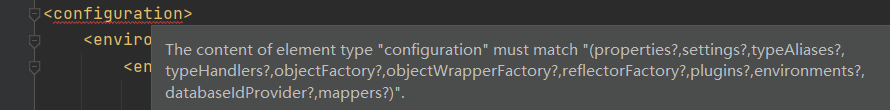

原先查询的video对象的 `coverImg` 属性没有值，增加该配置之再次查询，发现返回了数据


### 2.3. Java入参类型 parameterType (公有配置)

1、`parameterType` 指定参数类型。可以通过`parameterType` 在mapper文件的sql语句中指定java的参数类型

```xml
<select id="selectById" parameterType="java.lang.Integer" resultType="domain.Video">
	select * from video where id = #{video_id}
</select>
```

* 可以是基本类型(指定基本类型或者基本类型的包装类)和 String类型

```java
parameterType="int"
parameterType="java.lang.Long"
parameterType="java.lang.String"
```

* 可以是Java集合List或者Map

```java
parameterType="java.util.Map"
parameterType="java.util.List"
```

* 可以是Java自定义对象

```java
parameterType="net.xdclass.online_class.domain.Video"
```

- 传入参数如果是复杂对象类型（pojo或者map集合）
  - 如果为实体类型。则对应的字段的值为实体类的属性值，直接使用对象的属性名获取即可，不需要再通过参数别名.属性名获取。
  - 如果为map类型，则对应字段的值为key对应的value值，直接使用key获取即可，不需要再通过参数别名.key获取

```xml
<insert id="add" parameterType="domain.Video">
	INSERT INTO `video` ( `title`, `summary`, `cover_img`, `price`, `create_time`, `point`)
	VALUES
	(#{title,jdbcType=VARCHAR},#{summary,jdbcType=VARCHAR},#{coverImg,jdbcType=VARCHAR},#{price,jdbcType=INTEGER},
	 #{createTime,jdbcType=TIMESTAMP},#{point,jdbcType=DOUBLE});
</insert>
<delete id="deleteByCreateTimeAndPrice" parameterType="java.util.Map">
	delete from video where create_time <![CDATA[ > ]]> #{createTime} and price <![CDATA[ >= ]]> #{price}
</delete>
```

### 2.4. 使用万能的Map传递参数 (公有)

1、在接口方法中，参数直接传递Map；

```java
User selectUserByNP2(Map<String,Object> map);
```

2、编写sql语句的时候，需要传递参数类型，参数类型为map。这里map使用了内置的类型别名。

```xml
<select id="selectUserByNP2" parameterType="map" resultType="com.kuang.pojo.User">
	select * from user where name = #{username} and pwd = #{pwd}
</select>
```

3、在使用方法的时候，Map的 key 为 sql中取的值即可，没有顺序要求！

```java
Map<String, Object> map = new HashMap<String, Object>();
map.put("username","小明");
map.put("pwd","123456");
User user = mapper.selectUserByNP2(map);
```

总结：如果参数过多，我们可以考虑直接使用Map实现，如果参数比较少，直接传递参数即可

### 2.5. 入参到数据库类型  (公有配置)

入参取值java类型到数据库字段类型映射

- 取参数值，具体到某个字段的类型，即从java类型映射到数据库类型。
- 通过参数的 `jdbcType` 属性指定该参数类型映射到数据库的哪种类型。

例子： `#{title, jdbcType=VARCHAR}`

```xml
<select id="selectByPointAndTitleLike" resultType="domain.Video">
	select * from video where point=#{point,jdbcType=DOUBLE} and title like concat('%', #{title,jdbcType=VARCHAR},'%')
</select>
```


注意:

* 多数情况不加是正常使用，但是如果出现报错：`无效的列类型`，则是缺少 `jdbcType`;
* 只有当字段可为 `NULL` 时才需要 `jdbcType` 属性

> 参数取值的时候，建议通过 `jdbcType` 显示指定参数映射到数据库字段的类型。


常见的数据库类型和java类型映射：

| JDBC Type     | Java Type                  |
| ------------- | :------------------------- |
| CHAR          | String                     |
| VARCHAR       | String                     |
| LONGVARCHAR   | String                     |
| NUMERIC       | java.math.BigDecimal       |
| DECIMAL       | java.math.BigDecimal       |
| BIT           | boolean                    |
| BOOLEAN       | boolean                    |
| TINYINT       | byte                       |
| SMALLINT      | short                      |
| INTEGER       | INTEGER                    |
| INTEGER       | int                        |
| BIGINT        | long                       |
| REAL          | float                      |
| FLOAT         | double                     |
| DOUBLE        | double                     |
| BINARY        | byte[]                     |
| VARBINARY     | byte[]                     |
| LONGVARBINARY | byte[]                     |
| DATE          | java.sql.Date              |
| TIME          | java.sql.Time              |
| TIMESTAMP     | java.sql.Timestamp         |
| CLOB          | Clob                       |
| BLOB          | Blob                       |
| ARRAY         | Array                      |
| DISTINCT      | mapping of underlying type |
| STRUCT        | Struct                     |
| REF           | Ref                        |
| DATALINK      | java.net.URL               |

## 3. 新增操作

### 3.1. 编写insert语句

1、编写mapper文件里面的insert语句

mapper文件中新增 `<insert>` 语句，用于执行 `insert` 操作。

>insert操作默认返回 `int` 类型的插入的条数。

```xml
<insert id="add" parameterType="domain.Video">
	INSERT INTO `video` ( `title`, `summary`, `cover_img`, `price`, `create_time`, `point`)
	VALUES
	(#{title,jdbcType=VARCHAR},#{summary,jdbcType=VARCHAR},#{coverImg,jdbcType=VARCHAR},#{price,jdbcType=INTEGER},
	 #{createTime,jdbcType=TIMESTAMP},#{point,jdbcType=DOUBLE});
</insert>
```

* INSERT INTO 部分不需要显示的插入 `id` 字段，因为 `id` 字段在建表的时候指定为主键且自动递增。mybatis 插入记录时会自动获取递增的主键进行插入。
* VALUES 里面的各个参数值为对应实体类里面的属性值，参数名要和实体类里面的属性名一致，而不是和数据库字段名一致。
  * parameterType="domain.Video" 传入参数如果是实体类型，则对应的字段的值为实体类的属性值，直接使用属性名获取即可，不需要再通过参数别名.属性名获取。
  * 数据库字段名要和参数名（属性名）符合驼峰标识与下划线对应关系。（前提是加了配置，如果没加配置则需要保持一致关系）

> 要编写的 `insert into` 可以自动生成。使用数据库工具，选择某一行记录右击进行标题复制，然后values部分删除。


2、编写mapper接口里面的方法

```java
int add(Video video);
```
返回 `int` 类型的插入的条数。


3、执行insert操作

```java
//新增一条记录
Video video =  new Video();
video.setTitle("小滴课堂面试专题900道");
video.setCoverImg("xdclass.net/aaa.png");
video.setPoint(9.4);
video.setCreateTime(new Date());
video.setPrice(9900);
video.setSummary("这个是面试专题概要");
int rows = videoMapper.add(video);
System.out.println(rows);
System.out.println(video.toString());
//需要显示的提交事务，否则不会真正插入数据库
sqlSession.commit();
```

执行insert 成功之后，发现Video对象的id为0，id为int类型此时需要获得插入的自增主键的值。
```
Video{id=0, title='小滴课堂面试专题900道', summary='这个是面试专题概要', coverImg='xdclass.net/aaa.png', price=9900, createTime=Fri Oct 16 17:39:01 CST 2020, point=9.4}
```


### 3.2. 如何获得插入的自增主键

```xml
<insert id="add" parameterType="domain.Video" useGeneratedKeys="true" 
keyProperty="id" keyColumn="id">
```
- 使用 `useGeneratedKeys="true"  keyProperty="id"  keyColumn="id"` 三个属性来指定使用自增主键以及自增主键的属性名和字段名。
- 这三个属性的作用是<u>将自增主键字段的值更新到对应的java对象的属性字段</u>，而不是决定要使用自增主键对主键进行插入。
  - 决定要使用自增主键对主键进行插入的是建表的时候指定主键递增


```java
//新增一条记录
Video video =  new Video();
video.setTitle("小滴课堂面试专题900道");
video.setCoverImg("xdclass.net/aaa.png");
video.setPoint(9.4);
video.setCreateTime(new Date());
video.setPrice(9900);
video.setSummary("这个是面试专题概要");
int rows = videoMapper.add(video);
System.out.println(rows);
System.out.println(video.toString());
//需要显示的提交事务，否则不会真正插入数据库
sqlSession.commit();
```
insert 完成之后，可以返回插入的条数，对于插入的每条记录，如果使用了自增主键，mybatis会将自增字段的值更新到对应java对象的属性中
```
Video{id=51, title='小滴课堂面试专题900道', summary='这个是面试专题概要', coverImg='xdclass.net/aaa.png', price=9900, createTime=Fri Oct 16 17:32:03 CST 2020, point=9.4}
```

可以看到前面并没有给`id`赋值，但是执行完 insert 操作之后，`id`属性值变为 `51`，是因为启用了mysql的自增主键，当插入记录成功之后，mybatis将数据库自增主键字段的值赋值给java对象。

### 3.3. foreach 批量插入

批量插入多条视频记录

* 方法一：java for循环批量插入，效率很低。
* 方法二：使用mybatis的内置函数 `foreach`。推荐


foreach: 用于循环拼接的内置标签，常用于 批量新增、in查询等

包含以下属性：
| 属性         | 说明                                                         |
| ------------ | ------------------------------------------------------------ |
| `collection` | 必填，值为要迭代循环的集合类型，情况有多种  <br />1. 入参是List类型的时候，collection属性值为固定的`list` (不是别名) <br />2. 入参是Map类型的时候，collection属性值为map的 `key` 值 |
| `item`       | 每一个元素进行迭代时的别名, 通过别名来取每个对象的值         |
| `index`      | 索引的属性名，在集合数组情况下值为当前索引值，当迭代对象是map时，这个值是map的key |
| `open`       | 整个循环内容的开头字符串                                     |
| `close`      | 整个循环内容的结尾字符串                                     |
| `separator`  | 每次循环的分隔符                                             |

1、编写 `foreach` 批量插入语句

```xml
<insert id="addBatch" parameterType="domain.Video" useGeneratedKeys="true" keyProperty="id" keyColumn="id" >
	INSERT INTO `video` ( `title`, `summary`, `cover_img`, `price`, `create_time`, `point`)
	VALUES
		<foreach collection="list" item="video" separator=",">
			(#{video.title,jdbcType=VARCHAR},#{video.summary,jdbcType=VARCHAR},#{video.coverImg,jdbcType=VARCHAR},
			#{video.price,jdbcType=INTEGER},
			#{video.createTime,jdbcType=TIMESTAMP},#{video.point,jdbcType=DOUBLE})
		</foreach>
</insert>
```

* 通过指定的`video` 别名取对象属性的值(video.xxx)
* 每次遍历时生成 `foreach` 标签里面的内容，内容之间使用 `separator` 属性指定的分隔符 `,` 进行分隔开。

>如果批量插入要获取插入之后的自增id, 可以按照单条记录获得自增id的方式


2、mapper接口新增 `addBatch` 方法，方法参数类型为 `List` ,方法返回值为`int`。

```java
int addBatch(List<Video> videos);
```

>insert操作默认返回 `int` 类型的插入条数。循环插入也是返回`int` 类型的插入条数。

3、执行批量插入操作

```java
List<Video> videos = new ArrayList<>();
videos.add(video1);
videos.add(video2);
videoMapper.addBatch(videos);
//提交事务
sqlSession.commit();
```

查看生成的sql语句：
```sql
 INSERT INTO `video` ( `title`, `summary`, `cover_img`, `price`, `create_time`, `point`) VALUES (?,?,?, ?, ?,?) , (?,?,?, ?, ?,?)
```

## 4. 更新操作

### 4.1. update 更新语法

update 语法更新

1、编写mapper里面的sql语句

```xml
<update id="updateVideo" parameterType="domain.Video">
	UPDATE video
	set
	  title = #{title,jdbcType=VARCHAR},
	  summary = #{summary,jdbcType=VARCHAR},
	  cover_img = #{coverImg,jdbcType=VARCHAR},
	  price = #{price,jdbcType=INTEGER},
	  create_time = #{createTime,jdbcType=TIMESTAMP},
	  point = #{point,jdbcType=DOUBLE}
	 WHERE
	  id = #{id}
</update>
```

- `update` 语句左边为数据库字段，右边为参数或者实体类属性的值。

- `parameterType` 指定传入参数为 `Video` 实体类。传入参数如果是实体类型，则对应的更新字段的值为实体类的属性值，直接使用属性名获取即可。
- 获取参数值时，使用 `jdbcType` 来显示的指定映射到数据库字段的类型
- `update` 方法，返回 `int` 类型，表示更新的条数

2、定义mapper接口的 `update` 方法，返回 `int` 类型，表示更新的条数。

```java
int updateVideo(Video video);
```


3、编写代码，完成更新操作

```java
Video video1 =  new Video();
video1.setId(56); //设置要更改的记录id
video1.setTitle("小滴课堂面试专题900道 2020-10-18");
videoMapper.updateVideo(video1);
//提交事务
sqlSession.commit();
```

4、执行结果

```sql
DEBUG [main] - ==>  Preparing: UPDATE video set title = ?, summary = ?, cover_img = ?, price = ?, create_time = ?, point = ? WHERE id = ? 
DEBUG [main] - ==> Parameters: 小滴课堂面试专题900道 2020-10-18(String), null, null, 0(Integer), null, 0.0(Double), 56(Integer)
DEBUG [main] - <==    Updates: 1
```

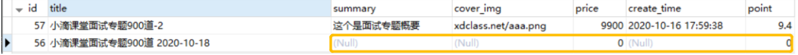

存在其他不想被更新的字段却置为 `null` 或者默认值了。所以要有选择性的更新字段。

### 4.2. 选择性更新标签使用


更新标签使用：可以选择性更新数据库字段(例如：非空字段）

`if test` 标签介绍：

* `if` 标签可以通过判断传入的值来确定查询条件，`test` 指定一个OGNL 表达式。test 里面使用的名称为对应的参数名。如果入参为pojo类型，则为对应的pojo的属性名。

> OGNL 表达式 进行百度。

常见写法：

```xml
//当前字段符合条件才更新这个字段的值
<if test='title != null and id == 87 '> title = #{title}, </if>

<if test="title!=null"> title = #{title}, </if>
```

1、编写SQL语句

```xml
<update id="updateVideoSelective" parameterType="net.xdclass.online_class.domain.Video">
	update video
	<trim prefix="set" suffixOverrides=",">
		<if test="title != null "> title = #{title,jdbcType=VARCHAR},</if>
		<if test="summary != null "> summary = #{summary,jdbcType=VARCHAR},</if>
		<if test="coverImg != null "> cover_img = #{coverImg,jdbcType=VARCHAR},</if>
		<if test="price != 0 "> price = #{price,jdbcType=INTEGER},</if>
		<if test="createTime !=null "> create_time = #{createTime,jdbcType=TIMESTAMP},</if>
		<!-- 特别注意： 一定要看pojo类里面的是基本数据类型，还是包装数据类型-->
		<if test="point != null "> point = #{point,jdbcType=DOUBLE},</if>
	</trim>
	where
		id = #{id}
</update>
```

选择性更新字段，需要使用 `trim` 标签，因为编写sql语句时无法确认最后更新的字段是哪个字段，所以通过 `trim` 标签的 `suffixOverrides` 属性来指定生成的语句最后要去掉 `,` 。`prefix`属性来指定生成的语句最前面要加上 `set`。

2、编写mapper接口

```java
int updateVideoSelective(Video video);
```


3、执行更新操作

```java
Video video1 =  new Video();
video1.setId(57); //设置要更改的记录id
video1.setTitle("小滴课堂面试专题900道 2 : 2020-10-18");
videoMapper.updateVideoSelective(video1);
//提交事务
sqlSession.commit();
```

执行结果：选择性更新数据库字段(非空字段）

```sql
DEBUG [main] - ==>  Preparing: update video set title = ?, point = ? where id = ? 
DEBUG [main] - ==> Parameters: 小滴课堂面试专题900道 2 : 2020-10-18(String), 0.0(Double), 57(Integer)
DEBUG [main] - <==    Updates: 1
```
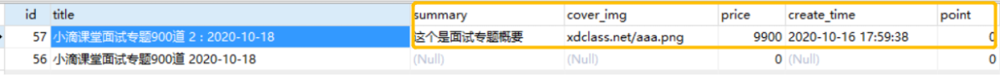

>注意：point字段的值被更改了，但是业务的意思是不应该更改。

代码里面包含一个惨痛教训，<u>一定要看pojo类里面的是基本数据类型，还是包装数据类型。基本类型的包装类，才能与 `null` 进行判断</u>

将Video类里面的point属性类型为 `double` 基本类型，则在进行if test判断时，不能使用`<if test="point != null ">` 进行判断，不会报错，但是会更新字段。所以要将Video类里面的point的属性类型改为 `Double` 基本类型的包装类，才能与 `null` 进行判断。

> pojo推荐使用基本类型的包装类，而不要使用基本类型，在 `if test`时,如果值为空，使用 `null` 进行判断。

## 5. 删除操作

### 5.1. delete 删除语法

delete 删除语法：

* 需求：删除某个时间段之后 且金额大于 10元的数据

1、编写sql语句
```xml
<delete id="deleteByCreateTimeAndPrice" parameterType="java.util.Map">
	delete from video where create_time <![CDATA[ > ]]> #{createTime} and price <![CDATA[ >= ]]> #{price}
</delete>
```

* 入参类型为 `java.util.Map` 类型。
* 不能直接使用 `>`, `<` 因为与xml标签一致，需要进行转义。可以使用 `&gt;`  `&lt;`，但是不够形象。

 2、编写mapper接口，返回`int`类型删除的记录条数

```java
int deleteByCreateTimeAndPrice(Map<String,Object> map);
```

3、编写删除操作

```java
HashMap<String,Object> map = new HashMap<>(2);
//日期使用mysql默认字符串格式，会进行自动转换。
map.put("createTime","2021-12-11 09:33:20");
map.put("price",9000);
int rows = videoMapper.deleteByCreateTimeAndPrice(map);
System.out.println(rows);
```

* createTime对应字符串类型，需要符合对应的日期格式`
YYYY-mm-dd HH:ss:mm` mybatis 才能进行转换。

执行结果：
```
DEBUG [main] - ==>  Preparing: delete from video where create_time > ? and price >= ? 
DEBUG [main] - ==> Parameters: 2021-12-11 09:33:20(String), 9000(Integer)
DEBUG [main] - <==    Updates: 0
```

### 5.2. 为什么要转义字符

由于MyBatis的sql写在XML里面， 有些sql的语法符号和xml里面的冲突
```
大于等于 <![CDATA[ >= ]]>

小于等于 <![CDATA[ <= ]]>
```


# 三、mybatis-config.xml常见配置


## 1. 配置文件mybatis-config.xml常见属性

>具体使用，参考官方文档：https://mybatis.org/mybatis-3/zh/configuration.html#

核心配置文件（dom节点顺序要求，不然报错）

* 记住常用的，不常用的简单介绍
* 我们可以阅读 mybatis-config.xml 上面的dtd的头文件！

```
configuration（配置）
    properties（属性）
    settings（设置）
    typeAliases（类型别名）
    typeHandlers（类型处理器）
    objectFactory（对象工厂）
    plugins（插件，少用）
    environments（环境配置，不配多环境，基本在Spring里面配置）
        environment（环境变量）
            transactionManager（事务管理器）
            dataSource（数据源）
  databaseIdProvider（数据库厂商标识）
  mappers（映射器）
```

### 1.1. environments元素

```xml
<environments default="development">
 <environment id="development">
   <transactionManager type="JDBC">
     <property name="..." value="..."/>
   </transactionManager>
   <dataSource type="POOLED">
     <property name="driver" value="${driver}"/>
     <property name="url" value="${url}"/>
     <property name="username" value="${username}"/>
     <property name="password" value="${password}"/>
   </dataSource>
 </environment>
</environments>
```

配置MyBatis的多套运行环境，将SQL映射到多个不同的数据库上，必须指定其中一个为默认运行环境（通过default指定）

- 子元素节点：environment

  - 子元素节点：数据源（dataSource）
    - dataSource 元素使用标准的 JDBC 数据源接口来配置 JDBC 连接对象的资源。
    - 数据源是必须配置的。有三种内建的数据源类型 type="[UNPOOLED|POOLED|JNDI]"）
      - unpooled：这个数据源的实现只是每次被请求时打开和关闭连接。
      - pooled：这种数据源的实现利用“池”的概念将 JDBC 连接对象组织起来 , 这是一种使得并发 Web 应用快速响应请求的流行处理方式。
      - jndi：这个数据源的实现是为了能在如 Spring 或应用服务器这类容器中使用，容器可以集中或在外部配置数据源，然后放置一个 JNDI 上下文的引用。
    - 数据源也有很多第三方的实现，比如dbcp，c3p0，druid等等....
    
  - 子元素节点：transactionManager - [ 事务管理器 ]

    - ```
      <!-- 语法 -->
      <transactionManager type="[ JDBC | MANAGED ]"/>
      ```

  - 这两种事务管理器类型都不需要设置任何属性

- 具体的一套环境，通过设置id进行区别，id保证唯一

### 1.2. mappers元素

mappers

- 映射器 : 定义映射SQL语句文件
- 既然 MyBatis 的行为其他元素已经配置完了，我们现在就要定义 SQL 映射语句了。但是首先我们需要告诉 MyBatis 到哪里去找到这些语句。Java 在自动查找这方面没有提供一个很好的方法，所以最佳的方式是告诉 MyBatis 到哪里去找映射文件。你可以使用相对于类路径的资源引用， 或完全限定资源定位符（包括 `file:///` 的 URL），或类名和包名等。映射器是MyBatis中最核心的组件之一，在MyBatis 3之前，只支持xml映射器，即：所有的SQL语句都必须在xml文件中配置。而从MyBatis 3开始，还支持接口映射器，这种映射器方式允许以Java代码的方式注解定义SQL语句，非常简洁。

1、引入资源方式

```xml
<!-- 使用相对于类路径的资源引用 -->
<mappers>
 <mapper resource="org/mybatis/builder/PostMapper.xml"/>
</mappers>
```

```xml
<!-- 使用完全限定资源定位符（URL） -->
<mappers>
 <mapper url="file:///var/mappers/AuthorMapper.xml"/>
</mappers>
```

```xml
<!--
使用映射器接口实现类的完全限定类名
需要配置文件名称和接口名称一致，并且位于同一目录下
-->
<mappers>
 <mapper class="org.mybatis.builder.AuthorMapper"/>
</mappers>
```

```xml
<!--
将包内的映射器接口实现全部注册为映射器
但是需要配置文件名称和接口名称一致，并且位于同一目录下
-->
<mappers>
 <package name="org.mybatis.builder"/>
</mappers>
```

2、Mapper文件

```xml
<?xml version="1.0" encoding="UTF-8" ?>
<!DOCTYPE mapper
       PUBLIC "-//mybatis.org//DTD Mapper 3.0//EN"
       "http://mybatis.org/dtd/mybatis-3-mapper.dtd">
<mapper namespace="com.kuang.mapper.UserMapper">
   
</mapper>
```

- namespace中文意思：命名空间，作用如下：

  - namespace的命名必须跟某个接口同名
    - namespace命名规则 : `包名+类名`
  - 接口中的方法与映射文件中sql语句id应该一一对应
  - namespace和子元素的id联合保证唯一, 区别不同的mapper
  - 绑定DAO接口

MyBatis 的真正强大在于它的映射语句，这是它的魔力所在。由于它的异常强大，映射器的 XML 文件就显得相对简单。如果拿它跟具有相同功能的 JDBC 代码进行对比，你会立即发现省掉了将近 95% 的代码。MyBatis 为聚焦于 SQL 而构建，以尽可能地为你减少麻烦

### 1.3. Properties优化

数据库这些属性都是可外部配置且可动态替换的，既可以在典型的 Java 属性文件中配置，亦可通过 properties 元素的子元素来传递。具体的官方文档

我们来优化我们的配置文件

第一步 ; 在资源目录下新建一个db.properties

```properties
driver=com.mysql.jdbc.Driver
url=jdbc:mysql://localhost:3306/mybatis?useSSL=true&useUnicode=true&characterEncoding=utf8
username=root
password=123456
```

第二步 : 将文件导入properties 配置文件

```xml
<configuration>
   <!--导入properties文件-->
   <properties resource="db.properties"/>

   <environments default="development">
       <environment id="development">
           <transactionManager type="JDBC"/>
           <dataSource type="POOLED">
               <property name="driver" value="${driver}"/>
               <property name="url" value="${url}"/>
               <property name="username" value="${username}"/>
               <property name="password" value="${password}"/>
           </dataSource>
       </environment>
   </environments>
   <mappers>
       <mapper resource="mapper/UserMapper.xml"/>
   </mappers>
</configuration>
```

更多操作，可以查看官方文档！

- 配置文件优先级问题
  - 配置文件定义的变量优先标签内property定义的变量
- 新特性：使用占位符${}

### 1.4. 查询类型别名typeAlias

`typeAlias` : 类型别名，给类取个别名，可以不用输入类的全限定名。

类型别名是为 Java 类型设置一个短的名字。它只和 XML 配置有关，存在的意义仅在于用来减少类完全限定名的冗余。

`mybatis-config.xml` 文件 `typeAliases` 节点下配置别名：

```xml
<!--配置别名,注意标签顺序-->
<typeAliases>
	<typeAlias type="net.xdclass.online_class.domain.Video" alias="Video"/>
</typeAliases>
```

* 直接在mapper文件中使用别名

```xml
<select id="selectById" parameterType="java.lang.Integer" resultType="Video">
	select * from video where id = #{video_id}
</select>
```

- 
  如果有很多类，是否需要一个个配置？不用一个个配置，指定包配置，使用包扫描即可


```xml
<typeAliases>
	<!--<typeAlias type="net.xdclass.online_class.domain.Video" alias="Video"/>-->
	<package name="net.xdclass.online_class.domain"/>
</typeAliases>
```

每一个在包 `net.xdclass.online_class.domain` 中的 Java Bean，在没有注解的情况下，会使用 Bean 的首字母小写的非限定类名来作为它的别名。

若有注解，则别名为其注解值。见下面的例子：

```java
@Alias("user")
public class User {
  ...
}
```

>Mybatis本身内置很多类型别名，比如 `Integer(int)`、`String(string)`、`List(list)`、`Map(map)` 等。具体参考：https://mybatis.org/mybatis-3/zh/configuration.html#typeAliases

## 2. 其他配置浏览

### 1. 设置

- 设置（settings）相关 => 查看帮助文档
  - 懒加载
  - 日志实现
  - 缓存开启关闭

- 一个配置完整的 settings 元素的示例如下：

  - ```xml
    <settings>
     <setting name="cacheEnabled" value="true"/>
     <setting name="lazyLoadingEnabled" value="true"/>
     <setting name="multipleResultSetsEnabled" value="true"/>
     <setting name="useColumnLabel" value="true"/>
     <setting name="useGeneratedKeys" value="false"/>
     <setting name="autoMappingBehavior" value="PARTIAL"/>
     <setting name="autoMappingUnknownColumnBehavior" value="WARNING"/>
     <setting name="defaultExecutorType" value="SIMPLE"/>
     <setting name="defaultStatementTimeout" value="25"/>
     <setting name="defaultFetchSize" value="100"/>
     <setting name="safeRowBoundsEnabled" value="false"/>
     <setting name="mapUnderscoreToCamelCase" value="false"/>
     <setting name="localCacheScope" value="SESSION"/>
     <setting name="jdbcTypeForNull" value="OTHER"/>
     <setting name="lazyLoadTriggerMethods" value="equals,clone,hashCode,toString"/>
    </settings>
    ```

### 2. 类型处理器

- 无论是 MyBatis 在预处理语句（PreparedStatement）中设置一个参数时，还是从结果集中取出一个值时， 都会用类型处理器将获取的值以合适的方式转换成 Java 类型。
- 你可以重写类型处理器或创建你自己的类型处理器来处理不支持的或非标准的类型。【了解即可】

### 3. 对象工厂

- MyBatis 每次创建结果对象的新实例时，它都会使用一个对象工厂（ObjectFactory）实例来完成。
- 默认的对象工厂需要做的仅仅是实例化目标类，要么通过默认构造方法，要么在参数映射存在的时候通过有参构造方法来实例化。
- 如果想覆盖对象工厂的默认行为，则可以通过创建自己的对象工厂来实现。【了解即可】

## 3. Sql片段使用（mapper.xml配置）

你是否常用 `select *` 去查询数据库表的所有字段。小项目没问题，高并发项目不推荐这样使用，查询性能低，还占内存大，应该选择需要的字段进行查询。


什么是sql片段 ：根据业务需要，自定制要查询的字段，并可以复用

* 每个mapper文件中使用`<sql>`标签定义sql片段，`id` 属性进行唯一标识

```xml
<sql id="base_video_field">
    id,title,summary,cover_img
</sql>
```

* 使用 `<include>`  标签来引入sql片段，`refid` 属性来指定要引入sql 片段的id

```xml
 <select id="selectById" parameterType="java.lang.Integer" resultType="Video">
    select <include refid="base_video_field"/>  from video where id = #       {video_id,jdbcType=INTEGER}
</select>
```

```xml
<select id="selectListByXML" resultType="Video">
    select <include refid="base_video_field"/>  from video
</select>
```


# 四、复杂Sql查询 resultMap

resultMap解决的问题：属性名和字段名不一致

## 1. 简单对象自定义查询结果映射

Mybatis的SQL语句返回结果有两种：

- `resultType`
  - 自动映射。使用默认映射。可以映射到基本类型或者pojo实体类
    * 映射到pojo实体类：查询出的字段在相应的pojo中必须有和它相同的字段对应(名称要一一对应，可以使用驼峰标识映射到下划线字段)
    * 映射到基本数据类型
  - 适合简单查询

- `resultMap`
  - 手动映射。自定义字段映射，或者多表查询，一对多等关系，比 `resultType` 更强大
  - ResultMap 的设计思想是，对于简单的语句根本不需要配置显式的结果映射，而对于复杂一点的语句只需要描述它们的关系就行了
    - 对于可以自动映射的字段(字段与属性名一致或者下划线字段映射到驼峰标识属性)可以不写，只需要写需要的映射。
  - 适合复杂查询

>对于返回集合的查询语句，`resultMap` 确定的是集合里面的元素类型。

`resultMap` 模板：

```xml
<resultMap id="唯一的标识" type="映射的pojo对象">
  <id column="表的主键字段,或查询语句中的别名字段" jdbcType="字段类型" property="映射pojo对象的主键属性" />
  <result column="表的一个字段" jdbcType="字段类型" property="映射到pojo对象的一个属性"/>
  ...
</resultMap>
```

1、使用 `resultMap` 自定义pojo属性到字段的映射。一般在mapper文件的最顶部进行定义。

```xml
<resultMap id="VideoResultMap" type="Video">
	<!--
	id 指定查询列的唯一标示
	column 数据库字段的名称
	property pojo类属性的名称
	-->
	<id column="id" property="id" jdbcType="INTEGER" />
	<result column="video_tile" property="title"  jdbcType="VARCHAR" />
	<result column="summary" property="summary"  jdbcType="VARCHAR" />
	<result column="cover_img"  property="coverImg"  jdbcType="VARCHAR" />
</resultMap>
```
`resultMap` 属性：

* `id` 定义 `resultMap` 的唯一标识。
* `type` 定义`resultMap` 结果类型，确定了sql 语句以及对应方法返回的Java类型。

`resultMap`  标签内容为查询数据库字段到pojo属性的映射。包含 `<id>` 映射 和 `<result>` 映射。

- `<id>`映射用于映射表的主键字段。可以不使用该标签
- `<result>` 映射用于映射普通字段

- `<result>`、`<id>` 属性如下：
  - `column` 数据库字段的名称
  - `property` pojo类属性的名称
  - `jdbcType` 映射到数据库字段的类型,可省略。
- `<select>` 的`resultMap`属性指定使用的 `resultMap` 的 `id`

```xml
<select id="selectBaseFieldByIdWithResultMap" resultMap="VideoResultMap">
	select id , title as video_tile, summary, cover_img from video where id = #{video_id}
</select>
```

2、mapper接口定义方法

```java
Video selectBaseFieldByIdWithResultMap(@Param("video_id") int id);
```
返回类型为 `Video`，是因为指定了 `id` 为 `VideoResultMap` 的  `resultMap` 的 `type` 属性确定了返回结果类型，且为单条记录查询。

3、执行查询

```java
Video video  = videoMapper.selectBaseFieldByIdWithResultMap(45);
System.out.println(video);
```

## 2. 复杂对象一对一映射配置`ResultMap` 的 `association`

`association`: 映射到POJO的某个复杂类型属性(对象类型的属性)，比如订单 `order` 对象里面包含 `user` 对象

`<resultMap>`>内部使用`<association>` 映射一对一的关联对象的属性，将查询到的字段映射到关联普通对象的属性。

```xml
  <association property="pojo的一个对象属性" javaType="pojo关联的pojo对象">
    <id column="关联pojo对象对应表的主键字段" jdbcType="字段类型" property="关联pojo对象的属性"/>
    <result  column="表的字段" jdbcType="字段类型" property="关联pojo对象的属性"/>
  </association>
```

`<association>` 标签配置属性一对一，属性有：

*  `property`  对应pojo里面的复杂属性名
*  `javaType`  这个属性的类型

`<association>` 包含`<id>`映射和`<result>`映射。

- `<id>` 映射用于映射表的主键字段到 `javaType` 的对象属性
- `<result>`映射用于映射普通字段到`javaType` 的对象属性

1、参考user表，创建 `User` 对象

```java
public class User {

    private int id;
    private String name;
    private String pwd;
    private String headImg;
    private String phone;
    private String createTime;
    ...
    //getter and setter
    //toString()
    ...
}
```

2、参考video_user表，创建 `VideoOrder` 对象,包含 `User` 对象

```java
public class VideoOrder {

    private int id;
    private String outTradeNo;
    private int  state;
    private Date createTime;
    private int  totalFee;
    private int videoId ;
    private String videoTitle;
    private String videoImg;
    private int userId;
    private User user;
    //getter and setter
    //toString()
    ...
}
```

3、创建 `VideoOrderMapper` 接口以及 `videoOrderMapper.xml` 文件。

记得 `mybatis-config.xml` 添加mapper文件。

```xml
<mappers>
	<mapper resource="config/mapper/VideoMapper.xml"/>
	<mapper resource="config/mapper/VideoOrderMapper.xml"/>
</mappers>
```


4、 `videoOrderMapper.xml` 文件定义结果映射 `resultMap`，结果类型为 `VideoOrder`。

```xml
<resultMap id="VideoOrderResultMap" type="VideoOrder">
	<id column="id" property="id"/>
	<result column="user_id" property="userId"/>
	<result column="out_trade_no" property="outTradeNo"/>
	<result column="create_time" property="createTime"/>
	<result column="state" property="state"/>
	<result column="total_fee" property="totalFee"/>
	<result column="video_id" property="videoId"/>
	<result column="video_title" property="videoTitle"/>
	<result column="video_img" property="videoImg"/>
	<!--
	 association 配置属性一对一
	 property 对应videoOrder里面的user属性名
	 javaType 这个属性的类型
	 -->
	<association property="user" javaType="User">
		<id property="id"  column="user_id"/>
		<result property="name" column="name"/>
		<result property="headImg" column="head_img"/>
		<result property="createTime" column="create_time"/>
		<result property="phone" column="phone"/>
	</association>
</resultMap>
```

5、编写sql语句，使用 `resultMap` 属性指定要使用的映射关系。对返回结果进行映射。

```xml
 <!--一对一管理查询订单， 订单内部包含用户属性-->
<select id="queryVideoOrderList" resultMap="VideoOrderResultMap">
	select
	 o.id id,
	 o.user_id ,
	 o.out_trade_no,
	 o.create_time,
	 o.state,
	 o.total_fee,
	 o.video_id,
	 o.video_title,
	 o.video_img,
	 u.name,
	 u.head_img,
	 u.create_time,
	 u.phone
	 from video_order o left join user u on o.user_id = u.id
</select>
```

6、编写mapper接口的方法，返回集合，集合里面的类型为使用的 `resultMap` 的 `type` 属性指定的类型

```java
List<VideoOrder> queryVideoOrderList();
```

7、编写查询代码

```java
// resultmap association关联查询
VideoOrderMapper videoOrderMapper = sqlSession.getMapper(VideoOrderMapper.class);
List<VideoOrder> videoOrderList  = videoOrderMapper.queryVideoOrderList();
System.out.println(videoOrderList);
```

返回结果：

```json
[VideoOrder{id=38, outTradeNo='e21f9994-8054-4760-b37d-dbc24c5883c6', state=1, createTime=Fri May 01 21:35:51 CST 2020, totalFee=5980, videoId=45, videoTitle='Docker实战视频教程入门到高级dockerfile/compose-Harbor', videoImg='https://xdvideo-file.oss-cn-shenzhen.aliyuncs.com/video/2020/Docker/%E5%AE%98%E7%BD%91%E4%B8%BB%E5%9B%BE-docker.png', userId=18, user=User{id=18, name='xdclass', pwd='null', headImg='https://xd-video-pc-img.oss-cn-beijing.aliyuncs.com/xdclass_pro/default/head_img/14.jpeg', phone='123', createTime='2020-05-01 21:35:51'}}]
```

返回VideoOrder对象里面的一对一User对象已被查询并进行映射到属性中。

### 2.1. 按照查询进行嵌套

按照查询进行嵌套处理就像SQL中的子查询

```xml
<resultMap id="StudentTeacher" type="Student">
   <!--association关联属性 property属性名 javaType属性类型 column在多的一方的表中的列名-->
   <association property="teacher"  column="{id=tid,name=tid}" javaType="Teacher" select="getTeacher"/>
</resultMap>
<!--
这里传递过来的id，只有一个属性的时候，下面可以写任何值
association中column多参数配置：
   column="{key=value,key=value}"
   其实就是键值对的形式，key是传给下个sql的取值名称，value是片段一中sql查询的字段名。
-->
<select id="getTeacher" resultType="teacher">
  select * from teacher where id = #{id} and name = #{name}
</select>
```

### 2.2. 按照结果进行嵌套

按照结果进行嵌套处理就像SQL中的联表查询

```xml
<!--
按查询结果嵌套处理
思路：
   1. 直接查询出结果，进行结果集的映射
-->
<select id="getStudents2" resultMap="StudentTeacher2" >
  select s.id sid, s.name sname , t.name tname
  from student s,teacher t
  where s.tid = t.id
</select>

<resultMap id="StudentTeacher2" type="Student">
   <id property="id" column="sid"/>
   <result property="name" column="sname"/>
   <!--关联对象property 关联对象在Student实体类中的属性-->
   <association property="teacher" javaType="Teacher">
       <result property="name" column="tname"/>
   </association>
</resultMap>
```

## 3. 复杂对象一对多映射配置 `ResultMap` 的 `collection`

`ResultMap` 的 `collection` ：  一对多查询结果查询映射。<u>映射到对象的集合类型的属性</u>。


```xml
  <!-- 集合中的property 需要为oftype定义的pojo对象的属性-->
  <collection property="pojo的集合属性名称" ofType="集合中单个的pojo对象类型">
    <id column="集合中pojo对象对应在表的主键字段" jdbcType="字段类型" property="集合中pojo对象的主键属性" />
    <result column="任意表的字段" jdbcType="字段类型" property="集合中的pojo对象的属性" />  
  </collection>
```

`<collection>` 标签的属性：

* `property` 对应pojo类中集合类属性的名称
* `ofType` 集合里面的pojo对象类型

`<collection>` 标签里的字段映射对应到 `ofType` 指定的对象类型的属性映射

* `<collection>` 包含 `<id>` 映射 和 `<result>` 映射。
  * `<id>`映射用于映射表的主键字段到 `ofType` 的对象属性。 
  * `<result>`映射用于映射普通字段到 `ofType` 的对象属性


比如user有多个订单：

1、`User` 对象新增 `List<VideoOrder> videoOrderList` 属性。并生成相应的getter和setter方法，重写`toString()`方法


2、编写mapper文件的结果映射，使用 `<collection>` 标签进行一对多的集合类型的属性映射。

```xml
<resultMap id="UserOrderResultMap" type="User">
	<id property="id"  column="id"/>
	<result property="name" column="name"/>
	<result property="headImg" column="head_img"/>
	<result property="createTime" column="create_time"/>
	<result property="phone" column="phone"/>
	<!--
	property 填写pojo类中集合类属性的名称
	ofType 集合里面的pojo对象
	-->
	<collection property="videoOrderList" ofType="VideoOrder">
		<!--配置主键，管理order的唯一标识-->
		<id column="order_id" property="id"/>
		<result column="user_id" property="userId"/>
		<result column="out_trade_no" property="outTradeNo"/>
		<result column="create_time" property="createTime"/>
		<result column="state" property="state"/>
		<result column="total_fee" property="totalFee"/>
		<result column="video_id" property="videoId"/>
		<result column="video_title" property="videoTitle"/>
		<result column="video_img" property="videoImg"/>
	</collection>
</resultMap>
```

3、编写查询语句

```xml
    <select id="queryUserOrder" resultMap="UserOrderResultMap">
        select
        u.id,
        u.name,
        u.head_img,
        u.create_time,
        u.phone,
        o.id order_id,
        o.out_trade_no,
        o.user_id,
        o.create_time,
        o.state,
        o.total_fee,
        o.video_id,
        o.video_title,
        o.video_img
        from user u left join video_order o on u.id = o.user_id

    </select>
```

4、编写mapper接口的方法，方法返回值为`List<User>`

```java
List<User> queryUserOrder();
```

5、编写执行查询代码

```java
//resultmap collection测试
List<User> userList = videoOrderMapper.queryUserOrder();
System.out.println(userList.toString());
```

### 3.1. 按结果嵌套处理

```xml
<mapper namespace="com.kuang.mapper.TeacherMapper">

   <!--
   思路:
       1. 从学生表和老师表中查出学生id，学生姓名，老师姓名
       2. 对查询出来的操作做结果集映射
           1. 集合的话，使用collection！
               JavaType和ofType都是用来指定对象类型的
               JavaType是用来指定pojo中属性的类型
               ofType指定的是映射到list集合属性中pojo的类型。
   -->
   <select id="getTeacher" resultMap="TeacherStudent">
      select s.id sid, s.name sname , t.name tname, t.id tid
      from student s,teacher t
      where s.tid = t.id and t.id=#{id}
   </select>

   <resultMap id="TeacherStudent" type="Teacher">
       <result  property="name" column="tname"/>
       <collection property="students" ofType="Student">
           <result property="id" column="sid" />
           <result property="name" column="sname" />
           <result property="tid" column="tid" />
       </collection>
   </resultMap>
</mapper>
```

### 3.2. 按查询嵌套处理

```xml
<select id="getTeacher2" resultMap="TeacherStudent2">
select * from teacher where id = #{id}
</select>
<resultMap id="TeacherStudent2" type="Teacher">
   <!--column是一对多的外键 , 写的是一的主键的列名-->
   <collection property="students" javaType="ArrayList" ofType="Student" column="id" select="getStudentByTeacherId"/>
</resultMap>
<select id="getStudentByTeacherId" resultType="Student">
  select * from student where tid = #{id}
</select>
```

 ## 4. 复杂对象查询总结

`association` 映射的是一个pojo类，处理一对一的关联关系。

`collection` 映射的一个集合列表，处理的是一对多的关联关系。

1、关联-association

2、集合-collection

3、所以association是用于一对一和多对一，而collection是用于一对多的关系

4、JavaType和ofType都是用来指定对象类型的

- JavaType是用来指定pojo中关联的属性的类型


- ofType指定的是映射到list集合属性中pojo的类型。


模板：

```xml
<!-- column不做限制，可以为任意表的字段，而property须为type 定义的pojo属性-->
<resultMap id="唯一的标识" type="映射的pojo对象">
  <id column="表的主键字段,或查询语句中的别名字段" jdbcType="字段类型" property="映射pojo对象的主键属性" />
  <result column="表的一个字段" jdbcType="字段类型" property="映射到pojo对象的一个属性"/>

  <association property="pojo的一个对象属性" javaType="pojo关联的pojo对象">
    <id column="关联pojo对象对应表的主键字段" jdbcType="字段类型" property="关联pojo对象的属性"/>
    <result  column="表的字段" jdbcType="字段类型" property="关联pojo对象的属性"/>
  </association>

  <!-- 集合中的property 需要为oftype定义的pojo对象的属性-->
  <collection property="pojo的集合属性名称" ofType="集合中单个的pojo对象类型">
    <id column="集合中pojo对象对应在表的主键字段" jdbcType="字段类型" property="集合中pojo对象的主键属性" />
    <result column="任意表的字段" jdbcType="字段类型" property="集合中的pojo对象的属性" />  
  </collection>
</resultMap>
```


# 五、多级缓存和懒加载


## 1. Mybatis一级缓存


1、什么是缓存

程序经常要调用的对象存在内存中,方便其使用时可以快速调用,不必去数据库或者其他持久化设备中查询，主要就是提高性能

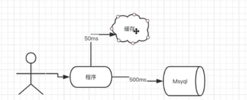

2、Mybatis一级缓存

* 简介：一级缓存的作用域是 `SqlSession`，同一个 `SqlSession` 中执行相同的SQL查询(相同的SQL和参数)，第一次会去查询数据库并写在缓存中，第二次会直接从缓存中取
* SqlSession级别的缓存，也称为本地缓存，每个sqlSession中的缓存相互独立
* 基于 `PerpetualCache` 的 `HashMap` 本地缓存
    * 查看 `PerpetualCache` 源码
* 默认开启一级缓存

>一级缓存是存在于 `sqlSession` 中的， 但是在开发的时候很少在同一个sqlSession对象里面执行同一个sql的。一级缓存的命中率相对低。


for循环在同一个 `sqlSession` 对象中执行多次相同查询，使用缓存
```java
try(SqlSession sqlSession = sqlSessionFactory.openSession()){
	VideoMapper videoMapper = sqlSession.getMapper(VideoMapper.class);
	for(int i=0;i<2;i++) {
		Video video = videoMapper.selectById(44);
		System.out.println(video.toString());
	}
	...
}
```
查看日志：

```
DEBUG [main] - ==>  Preparing: select * from video where id = ? 
DEBUG [main] - ==> Parameters: 44(Integer)
TRACE [main] - <==    Columns: id, title, summary, cover_img, price, create_time, point
TRACE [main] - <==        Row: 44, 2020版全新JDK8~JDK13全套新特性教程, https://xdvideo-file.oss-cn-shenzhen.aliyuncs.com/video/2020/JDK8/%E8%AF%A6%E6%83%85%E5%9B%BE.png, https://file.xdclass.net/video/2020/JDK8/%E5%AE%98%E7%BD%91%E4%B8%BB%E5%9B%BE-JDK.png, 3980, 2021-01-10 22:14:00, 9.3
DEBUG [main] - <==      Total: 1
Video{id=44, title='2020版全新JDK8~JDK13全套新特性教程', summary='https://xdvideo-file.oss-cn-shenzhen.aliyuncs.com/video/2020/JDK8/%E8%AF%A6%E6%83%85%E5%9B%BE.png', coverImg='https://file.xdclass.net/video/2020/JDK8/%E5%AE%98%E7%BD%91%E4%B8%BB%E5%9B%BE-JDK.png', price=3980, createTime=Sun Jan 10 22:14:00 CST 2021, point=9.3}
Video{id=44, title='2020版全新JDK8~JDK13全套新特性教程', summary='https://xdvideo-file.oss-cn-shenzhen.aliyuncs.com/video/2020/JDK8/%E8%AF%A6%E6%83%85%E5%9B%BE.png', coverImg='https://file.xdclass.net/video/2020/JDK8/%E5%AE%98%E7%BD%91%E4%B8%BB%E5%9B%BE-JDK.png', price=3980, createTime=Sun Jan 10 22:14:00 CST 2021, point=9.3}
```
只运行了一次sql查询。

3、Mybatis一级缓存失效策略

失效策略：

- 当执行SQL时候两次查询中间发生了增删改的操作，即 `insert`、`update`、`delete` 等操作 `commit` 后会清空该SQLSession缓存; 或者其他情况，比如sqlsession关闭，或者清空等

- 即使没有增删改操作，单独进行`sqlSession1.commit();` 也会清除一级缓存。

## 2. Mybatis二级缓存

### 2.1. Mybatis的二级缓存

1、二级缓存

* 简介：二级缓存是 `namespace` 级别的，多个 `SqlSession` 去操作同一个 `namespace` 下的Mapper的sql语句，多个 `SqlSession` 可以共用二级缓存。如果两个mapper文件的 `namespace` 相同，那么这两个mapper中执行sql查询到的数据也将存在相同的二级缓存区域中，但是最好是每个Mapper有单独的名称空间。
    * 基于namespace级别的缓存，一个名称空间，对应一个二级缓存；
* 基于 `PerpetualCache` 的 `HashMap` 本地缓存，可扩展，自定义存储源，如 Ehcache/Redis 等
* 默认是没有开启二级缓存
* 操作流程：
    * 第一次调用某个 `namespace` 下的SQL去查询信息，查询到的信息会存放该mapper对应的二级缓存区域。 
    * 第二次调用同个 `namespace` 下的mapper映射文件中，相同的sql去查询信息，会去对应的二级缓存内取结果

2、二级缓存失效策略

- 失效策略：执行同个 `namespace` 下的mappr映射文件中增删改sql，并执行了 `commit` 操作,才会清空该二级缓存。


3、注意点

注意：实现二级缓存的时候，MyBatis建议返回的POJO是可序列化的， 也就是建议实现 `Serializable` 接口

```java
public class Video implements Serializable {
    ...
}
```
4、使用的缓存淘汰策略

缓存淘汰策略：会使用默认的 LRU 算法来收回（最近最少使用的）

5、如何开启某个mapper的二级缓存 

* 某个mapper.xml里面配置：

```xml
<!--开启mapper的namespace下的二级缓存-->
    <!--
        eviction:代表的是缓存回收策略，常见下面两种。
        (1) LRU,最近最少使用的，移除最长时间不用的对象
        (2) FIFO,先进先出，按对象进入缓存的顺序来移除他们

        flushInterval:刷新间隔时间，单位为毫秒，这里配置的是100秒刷新，如果不配置它，当SQL被执行的时候才会去刷新缓存。

        size:引用数目，代表缓存最多可以存储多少个对象，设置过大会导致内存溢出

        readOnly:只读，缓存数据只能读取而不能修改，默认值是false
    -->
<cache eviction="LRU" flushInterval="100000" readOnly="true" size="1024"/>
```


* 全局配置：

```xml
<settings>
<!--这个配置使全局的映射器(二级缓存)启用或禁用缓存，全局总开关，这里关闭，mapper中开启了也没用-->
        <setting name="cacheEnabled" value="true" />
</settings>
```
> 全局总开关，这里关闭，mapper中开启了也没用


 *  控制某一sql不走二级缓存。如果需要控制全局mapper里面某个方法不使用缓存，可以配置 `useCache="false"` 进行更小粒度的配置。

```xml
<select id="selectById" parameterType="java.lang.Integer" resultType="Video" useCache="false">
    select <include refid="base_video_field"/>  from video where id = #{video_id,jdbcType=INTEGER}
</select>
```

6、一级缓存和二级缓存使用顺序

优先查询二级缓存-》查询一级缓存-》数据库

- 只要开启了二级缓存，我们在同一个Mapper中的查询，可以在二级缓存中拿到数据
- 查出的数据都会被默认先放在一级缓存中
- 只有会话提交或者关闭以后，一级缓存中的数据才会转到二级缓存中

### 2.2. 使用

```java
try{
	SqlSession sqlSession1 = sqlSessionFactory.openSession();
	VideoMapper videoMapper1 = sqlSession1.getMapper(VideoMapper.class);
	Video video1 = videoMapper1.selectById(44);
	System.out.println(video1.toString());
	//清除一级缓存
	sqlSession1.commit();

	SqlSession sqlSession2 = sqlSessionFactory.openSession();
	VideoMapper videoMapper2 = sqlSession2.getMapper(VideoMapper.class);
	Video video2 = videoMapper2.selectById(44);
	System.out.println(video2.toString());
	//清除一级缓存
	sqlSession2.commit();
}catch (Exception e){
	e.printStackTrace();
}
```

创建同一个 `namespace` 的多个 `SqlSession` 对象来模拟二级缓存。进行相同的sql查询。如果未配置缓存。则发起两次查询，开启二级缓存之后(总开关以及mapper文件)，只发起一次查询。

缓存原理图


## 3. Mybatis3.X 懒加载

什么是懒加载： 按需加载，先从单表查询，需要时再从关联表去关联查询，能大大提高数据库性能,并不是所有场景下使用懒加载都能提高效率

Mybatis懒加载： 

- `resultMap` 里面的 `association`、`collection` 有延迟加载功能。

- Mybatis懒加载使用的是同一个 `sqlSession` 对象进行的查询，所以会走一级缓存。

1、全局参数设置

```xml
<!--全局参数设置-->
<settings>
    <!--延迟加载总开关-->
    <setting name="lazyLoadingEnabled" value="true"/>
    <!--将aggressiveLazyLoading设置为false表示按需加载，默认为true-->
    <setting name="aggressiveLazyLoading" value="false"/>
</settings>
```

2、mapper文件配置。

`<association>` 标签里面懒加载相关属性：

* `select`  定义延迟加载需要执行的其他select语句id statement id。
* `column`： 和 `select` 定义的查询关联的入参字段

```xml
<resultMap id="VideoOrderResultMapLazy" type="VideoOrder">
        <id column="id" property="id"/>
        <result column="user_id" property="userId"/>
        <result column="out_trade_no" property="outTradeNo"/>
        <result column="create_time" property="createTime"/>
        <result column="state" property="state"/>
        <result column="total_fee" property="totalFee"/>
        <result column="video_id" property="videoId"/>
        <result column="video_title" property="videoTitle"/>
        <result column="video_img" property="videoImg"/>
<!-- 
select： 指定延迟加载需要执行的statement id 
column： 和select查询关联的字段
-->
        <association property="user" javaType="User" column="user_id" select="findUserByUserId"/>
</resultMap>
```

```xml
<!-- 延迟加载需要执行的statement id -->
<select id="findUserByUserId" resultType="User">
       select  * from user where id=#{id}
</select>
```
```xml
<!--一对一管理查询订单， 订单内部包含用户属性  懒加载-->
<select id="queryVideoOrderListLazy" resultMap="VideoOrderResultMapLazy">
        select
         o.id id,
         o.user_id ,
         o.out_trade_no,
         o.create_time,
         o.state,
         o.total_fee,
         o.video_id,
         o.video_title,
         o.video_img
         from video_order o
</select>
```

3、编写懒加载查询执行代码：
```java
SqlSession sqlSession1 = sqlSessionFactory.openSession();
VideoOrderMapper videoOrderMapper = sqlSession1.getMapper(VideoOrderMapper.class);
List<VideoOrder> list =videoOrderMapper.queryVideoOrderListLazy();
for(VideoOrder videoOrder : list){
	System.out.println(videoOrder.getVideoTitle());
	System.out.println(videoOrder.getUser().getName());
}
```


4、执行结果：

```
DEBUG [main] - ==> Parameters: 
TRACE [main] - <==    Columns: id, user_id, out_trade_no, create_time, state, total_fee, video_id, video_title, video_img
TRACE [main] - <==        Row: 38, 18, e21f9994-8054-4760-b37d-dbc24c5883c6, 2020-05-01 21:35:51, 1, 5980, 45, Docker实战视频教程入门到高级dockerfile/compose-Harbor, https://xdvideo-file.oss-cn-shenzhen.aliyuncs.com/video/2020/Docker/%E5%AE%98%E7%BD%91%E4%B8%BB%E5%9B%BE-docker.png
DEBUG [main] - <==      Total: 1
Docker实战视频教程入门到高级dockerfile/compose-Harbor
DEBUG [main] - Cache Hit Ratio [dao.VideoOrderMapper]: 0.0
DEBUG [main] - ==>  Preparing: select * from user where id=? 
DEBUG [main] - ==> Parameters: 18(Integer)
TRACE [main] - <==    Columns: id, name, pwd, head_img, phone, create_time
TRACE [main] - <==        Row: 18, xdclass, 202CB962AC59075B964B07152D234B70, https://xd-video-pc-img.oss-cn-beijing.aliyuncs.com/xdclass_pro/default/head_img/14.jpeg, 123, 2020-04-30 22:44:28
DEBUG [main] - <==      Total: 1
```

>dubug模式测试懒加载不准确，会全部加载。因为debug模式下需要获取关联对象的属性进行显示。可以直接run。

如果不获取相关的User信息，则不会执行 `findUserByUserId` 的查询。如果执行了`videoOrder.getUser().getName()`获取用户信息，则执行懒加载配置的`findUserByUserId` 查询sql.

>课程里面演示是6条订单记录，但是只查询3次用户信息，因为懒加载使用的是同一个sqlSession对象进行的查询，所以部分用户信息的查询走了一级缓存 `sqlsession`。


# 六、整合Mysql数据库事务


## 1. Mybatis的事务管理形式


1、使用JDBC的事务管理

使用原生的 `java.sql.Connection` 对象完成对事务的提交（`commit()`）、回滚（`rollback()`）、关闭（`close()`）
```xml
<environment id="development">
	<transactionManager type="JDBC"/>
	<dataSource type="POOLED">
		<property name="driver" value="com.mysql.cj.jdbc.Driver"/>
		<property name="url" value="jdbc:mysql://127.0.0.1:3306/xdclass?useUnicode=true&amp;characterEncoding=utf-8&amp;useSSL=false&amp;serverTimezone=Asia/Shanghai"/>
		<property name="username" value="root"/>
		<property name="password" value="123456"/>
	</dataSource>
</environment>
```

2、使用 `MANAGED` 的事务管理

MyBatis自身不会去实现事务管理，而让程序的外部容器如（Spring, JBOSS）来实现对事务的管理

```xml
<environment id="development">
	<transactionManager type="MANAGED"/>
	<dataSource type="POOLED">
		<property name="driver" value="com.mysql.cj.jdbc.Driver"/>
		<property name="url" value="jdbc:mysql://127.0.0.1:3306/xdclass?useUnicode=true&amp;characterEncoding=utf-8&amp;useSSL=false&amp;serverTimezone=Asia/Shanghai"/>
		<property name="username" value="root"/>
		<property name="password" value="123456"/>
	</dataSource>
</environment>
```

3、事务工厂 `TransactionFactory` 的两个实现类。

* `JdbcTransactionFactory` -> `JdbcTransaction`
* `ManagedTransactionFactory` -> `ManagedTransaction`

>IDEA使用 `alt+enter` 查看  `TransactionFactory`  接口的实现。


`JdbcTransaction` 源码分析：

获取数据库连接，使用原生的 `java.sql.Connection` 对象完成对事务的提交（`commit()`）、回滚（`rollback()`）、关闭（`close()`）

```java
  protected void openConnection() throws SQLException {
    if (log.isDebugEnabled()) {
      log.debug("Opening JDBC Connection");
    }
    connection = dataSource.getConnection();
    if (level != null) {
      connection.setTransactionIsolation(level.getLevel());
    }
    setDesiredAutoCommit(autoCommit);
  }
  
  
  @Override
  public void commit() throws SQLException {
    if (connection != null && !connection.getAutoCommit()) {
      if (log.isDebugEnabled()) {
        log.debug("Committing JDBC Connection [" + connection + "]");
      }
      connection.commit();
    }
  }
```

`ManagedTransaction` 源码分析：

获取连接之后，MyBatis自身不会去实现事务管理，而是委托给外部的容器如（Spring, JBOSS）来实现对事务的管理

```java
  protected void openConnection() throws SQLException {
    if (log.isDebugEnabled()) {
      log.debug("Opening JDBC Connection");
    }
    this.connection = this.dataSource.getConnection();
    if (this.level != null) {
      this.connection.setTransactionIsolation(this.level.getLevel());
    }
  }
 
  
  @Override
  public void commit() throws SQLException {
    // Does nothing
  }

  @Override
  public void rollback() throws SQLException {
    // Does nothing
  }
```

>注意：如果不是web程序，然后使用的事务管理形式是 `MANAGED`, 那么将没有事务管理功能


## 2. Mysql的Innodb和MyISAM引擎的区别


>数据库引擎是针对数据库表进行设置


| 区别项   | `Innodb`                                | `myisam`                 |
| -------- | --------------------------------------- | ------------------------ |
| 事务     | 支持                                    | 不支持                   |
| 锁粒度   | 行锁，适合高并发                        | 表锁，不适合高并发       |
| 是否默认 | 默认                                    | 非默认                   |
| 支持外键 | 支持外键                                | 不支持                   |
| 适合场景 | 读写均衡,写大于读场景，需要事务         | 读多写少场景，不需要事务 |
| 全文索引 | 可以通过插件实现, 更多使用ElasticSearch | 支持全文索引             |
>重点：MyISAM不支持事务，如果需要事务则改为innodb引擎，更改数据库的表里面的引擎

## 3. MyBatis3.x 的事务控制


1、为什么原先没进行 `commit` 操作，也可以插入成功？

* 因为原先是 `myisam` 引擎,没有事务，直接插入成功

2、检查数据库的引擎 ，改为 `innodb`

- 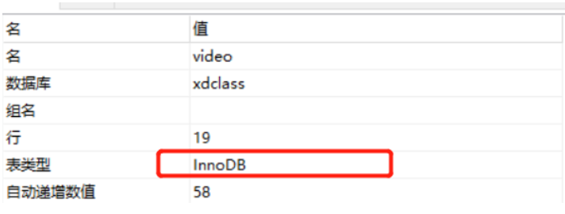

3、事务控制实战

* 修改事务管理为 `JDBC`。`mybatis-config.xml` 文件进行设置

```
<transactionManager type="JDBC"/>
```

查看 `sqlSessionFactory.openSession();` 源码 `DefaultSqlSessionFactory#openSession`

```java
@Override
public SqlSession openSession() {
	return openSessionFromDataSource(configuration.getDefaultExecutorType(), null, false);
}
```
获取连接的时候如果不显示的指定事务是否自动提交，默认事务的自动提交autoCommit是 `false` .不进行自动提交，需要手动提交。

```java
//获取Session
try(SqlSession sqlSession = sqlSessionFactory.openSession()){
	VideoMapper videoMapper = sqlSession.getMapper(VideoMapper.class);
	Video video = new Video();
	video.setTitle("测试demo");
	videoMapper.add(video);
    //手动进行事务提交
	sqlSession.commit();
}
```
`sqlSession.commit();`手动进行事务提交

```java
//获取Session
//设置自动提交并获取sqlSession对象
try(SqlSession sqlSession = sqlSessionFactory.openSession(true)){
	VideoMapper videoMapper = sqlSession.getMapper(VideoMapper.class);
	Video video = new Video();
	video.setTitle("测试demo");
	videoMapper.add(video);
}
```
>`sqlSessionFactory.openSession(true)` 获取sqlSession的时候指定自动提交为 `true` ，不需再手动提交。

>如果设置为自动提交，抛出异常的情况下不能事务回滚。因为已经自动进行了事务提交

4、事务管理形式 `MANAGED`，设置非自动提交，然后注释 `commit` 语句, 依旧可以保存成功，因为没有使用第三方容器，所以 `MANAGED` 类型下没有进行事务管理。

5、如果处理过程出现异常，进行事务回滚。不能使用自动提交

```java
//获取Session
SqlSession sqlSession = sqlSessionFactory.openSession(false);
try{
	VideoMapper videoMapper = sqlSession.getMapper(VideoMapper.class);
	Video video = new Video();
	video.setTitle("测试demo44");
	videoMapper.add(video);
	int i = 1/0;
	sqlSession.commit();
}catch(Exception e){
	e.printStackTrace();
	sqlSession.rollback();
}
```
6、不用重点关注，公司开发项目的事务控制基本是交给Spring AOP进行事务管理，或者使用分布式事务


# 七、日志工厂

思考：我们在测试SQL的时候，要是能够在控制台输出 SQL 的话，是不是就能够有更快的排错效率？

如果一个数据库相关的操作出现了问题，我们可以根据输出的SQL语句快速排查问题。

对于以往的开发过程，我们会经常使用到debug模式来调节，跟踪我们的代码执行过程。但是现在使用Mybatis是基于接口，配置文件的源代码执行过程。因此，我们必须选择日志工具来作为我们开发，调节程序的工具。

Mybatis内置的日志工厂提供日志功能，具体的日志实现有以下几种工具：

- SLF4J
- Apache Commons Logging
- Log4j 2
- Log4j
- JDK logging

具体选择哪个日志实现工具由MyBatis的内置日志工厂确定。它会使用最先找到的（按上文列举的顺序查找）。如果一个都未找到，日志功能就会被禁用。

## 1. 标准日志实现

指定 MyBatis 应该使用哪个日志记录实现。如果此设置不存在，则会自动发现日志记录实现。

```xml
<settings>
       <setting name="logImpl" value="STDOUT_LOGGING"/>
</settings>
```

测试，可以看到控制台有大量的输出！我们可以通过这些输出来判断程序到底哪里出了Bug

## 2. Log4j

简介：

- Log4j是Apache的一个开源项目
- 通过使用Log4j，我们可以控制日志信息输送的目的地：控制台，文本，GUI组件....
- 我们也可以控制每一条日志的输出格式；
- 通过定义每一条日志信息的级别，我们能够更加细致地控制日志的生成过程。最令人感兴趣的就是，这些可以通过一个配置文件来灵活地进行配置，而不需要修改应用的代码。

使用步骤：

1、导入log4j的包

```xml
<dependency>
   <groupId>log4j</groupId>
   <artifactId>log4j</artifactId>
   <version>1.2.17</version>
</dependency>
```

2、在应用的classpath中，`resources` 根目录下创建名称为`log4j.properties` 的文件

- 配置文件编写

```properties
#将等级为DEBUG的日志信息输出到console和file这两个目的地，console和file的定义在下面的代码
log4j.rootLogger=DEBUG,console,file

#控制台输出的相关设置
log4j.appender.console = org.apache.log4j.ConsoleAppender
log4j.appender.console.Target = System.out
log4j.appender.console.Threshold=DEBUG
log4j.appender.console.layout = org.apache.log4j.PatternLayout
log4j.appender.console.layout.ConversionPattern=[%c]-%m%n

#文件输出的相关设置
log4j.appender.file = org.apache.log4j.RollingFileAppender
log4j.appender.file.File=./log/kuang.log
log4j.appender.file.MaxFileSize=10mb
log4j.appender.file.Threshold=DEBUG
log4j.appender.file.layout=org.apache.log4j.PatternLayout
log4j.appender.file.layout.ConversionPattern=[%p][%d{yy-MM-dd}][%c]%m%n

#日志输出级别
log4j.logger.org.mybatis=DEBUG
log4j.logger.java.sql=DEBUG
log4j.logger.java.sql.Statement=DEBUG
log4j.logger.java.sql.ResultSet=DEBUG
log4j.logger.java.sql.PreparedStatement=DEBUG
```

3、setting设置日志实现

```xml
<settings>
   <setting name="logImpl" value="LOG4J"/>
</settings>
```

4、在程序中使用Log4j进行输出！

```java
//注意导包：org.apache.log4j.Logger
static Logger logger = Logger.getLogger(MyTest.class);

@Test
public void selectUser() {
   logger.info("info：进入selectUser方法");
   logger.debug("debug：进入selectUser方法");
   logger.error("error: 进入selectUser方法");
   SqlSession session = MybatisUtils.getSession();
   UserMapper mapper = session.getMapper(UserMapper.class);
   List<User> users = mapper.selectUser();
   for (User user: users){
       System.out.println(user);
  }
   session.close();
}
```

5、测试，看控制台输出！

- 使用Log4j 输出日志
- 可以看到还生成了一个日志的文件 【需要修改file的日志级别】

6、调试：控制台打印Sql

三个级别的sql执行日志打印: 

* 整个项目打印sql执行日志
* 某一包下面打印sql执行日志
* 某一mapper接口的方法打印sql执行日志

如果只想看到当前方法的执行日志，则需要把其他级别的日志进行注释。

```properties
log4j.rootLogger=ERROR, stdout
log4j.appender.stdout=org.apache.log4j.ConsoleAppender
log4j.appender.stdout.layout=org.apache.log4j.PatternLayout
log4j.appender.stdout.layout.ConversionPattern=%5p [%t] - %m%n
## log4j.logger.dao=DEBUG
## trace 打印更多内容日志
##log4j.logger.dao=TRACE
## 具体到某一方法的sql执行日志
log4j.logger.dao.VideoMapper.selectById=DEBUG
```


# 八、分页


思考：为什么需要分页？

在学习mybatis等持久层框架的时候，会经常对数据进行增删改查操作，使用最多的是对数据库进行查询操作，如果查询大量数据的时候，我们往往使用分页进行查询，也就是每次处理小部分数据，这样对数据库压力就在可控范围内。

## 1. 使用Limit实现分页

```sql
#语法
SELECT * FROM table LIMIT stratIndex，pageSize

SELECT * FROM table LIMIT 5,10; // 检索记录行 6-15  

#为了检索从某一个偏移量到记录集的结束所有的记录行，可以指定第二个参数为 -1：   
SELECT * FROM table LIMIT 95,-1; // 检索记录行 96-last.  

#如果只给定一个参数，它表示返回最大的记录行数目：   
SELECT * FROM table LIMIT 5; //检索前 5 个记录行  

#换句话说，LIMIT n 等价于 LIMIT 0,n。 
```

步骤：

1、修改Mapper文件

```xml
<select id="selectUser" parameterType="map" resultType="user">
  select * from user limit #{startIndex},#{pageSize}
</select>
```

2、Mapper接口，参数为map

```java
//选择全部用户实现分页
List<User> selectUser(Map<String,Integer> map);
```

3、在测试类中传入参数测试

- 推断： 起始位置 = （当前页面 - 1 ） * 页面大小

```java
//分页查询 , 两个参数startIndex , pageSize
@Test
public void testSelectUser() {
   SqlSession session = MybatisUtils.getSession();
   UserMapper mapper = session.getMapper(UserMapper.class);

   int currentPage = 1;  //第几页
   int pageSize = 2;  //每页显示几个
   Map<String,Integer> map = new HashMap<String,Integer>();
   map.put("startIndex",(currentPage-1)*pageSize);
   map.put("pageSize",pageSize);

   List<User> users = mapper.selectUser(map);

   for (User user: users){
       System.out.println(user);
  }

   session.close();
}
```

## 2. RowBounds分页

我们除了使用Limit在SQL层面实现分页，也可以使用RowBounds在Java代码层面实现分页，当然此种方式作为了解即可。我们来看下如何实现的！

步骤：

1、mapper接口

```java
//选择全部用户RowBounds实现分页
List<User> getUserByRowBounds();
```

2、mapper文件

```xml
<select id="getUserByRowBounds" resultType="user">
select * from user
</select>
```

3、测试类

在这里，我们需要使用RowBounds类

```java
@Test
public void testUserByRowBounds() {
   SqlSession session = MybatisUtils.getSession();

   int currentPage = 2;  //第几页
   int pageSize = 2;  //每页显示几个
   RowBounds rowBounds = new RowBounds((currentPage-1)*pageSize,pageSize);

   //通过session.**方法进行传递rowBounds，[此种方式现在已经不推荐使用了]
   List<User> users = session.selectList("com.kuang.mapper.UserMapper.getUserByRowBounds", null, rowBounds);

   for (User user: users){
       System.out.println(user);
  }
   session.close();
}
```

## 3. PageHelper

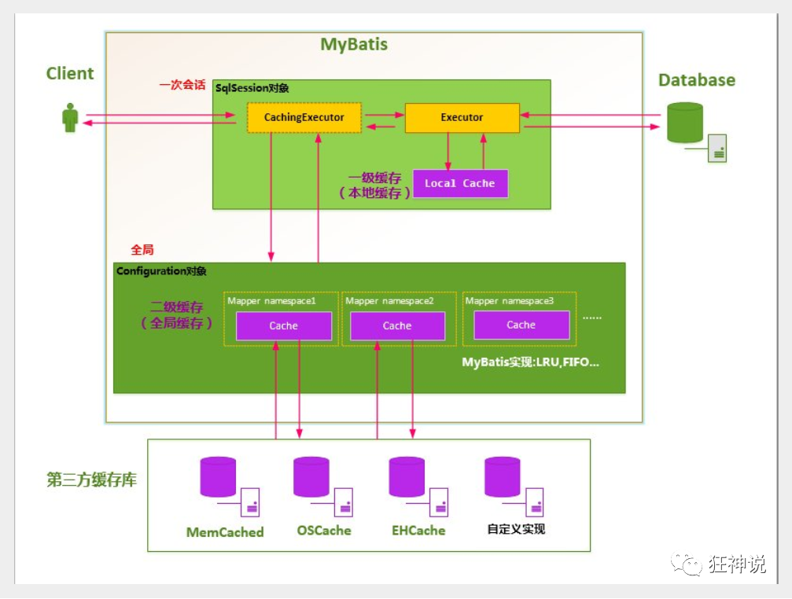

了解即可，可以自己尝试使用

官方文档：https://pagehelper.github.io/

> 在MyBatisPlus中，我们也讲解到了分页实现，所以实现方式很多，看自己的理解和熟练程度进行掌握即可！


# 九、使用注解开发

## 1. 利用注解开发

- mybatis最初配置信息是基于 XML ,映射语句(SQL)也是定义在 XML 中的。而到MyBatis 3提供了新的基于注解的配置。不幸的是，Java 注解的的表达力和灵活性十分有限。最强大的 MyBatis 映射并不能用注解来构建

- sql 类型主要分成 :

  - @select ()
  - @update ()
  - @Insert ()
  - @delete ()

注意：利用注解开发可以不需要mapper.xml映射文件了 .

1、我们在我们的接口中添加注解

```java
//查询全部用户
@Select("select id,name,pwd password from user")
public List<User> getAllUser();
```

2、在mybatis的核心配置文件中绑定接口

- 使用class绑定接口

```xml
<!--使用class绑定接口-->
<mappers>
   <mapper class="com.kuang.mapper.UserMapper"/>
</mappers>
```

3、我们去进行测试

```java
@Test
public void testGetAllUser() {
   SqlSession session = MybatisUtils.getSession();
   //本质上利用了jvm的动态代理机制
   UserMapper mapper = session.getMapper(UserMapper.class);

   List<User> users = mapper.getAllUser();
   for (User user : users){
       System.out.println(user);
  }

   session.close();
}
```

4、利用Debug查看本质

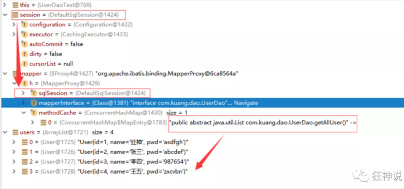

5、本质上利用了jvm的动态代理机制

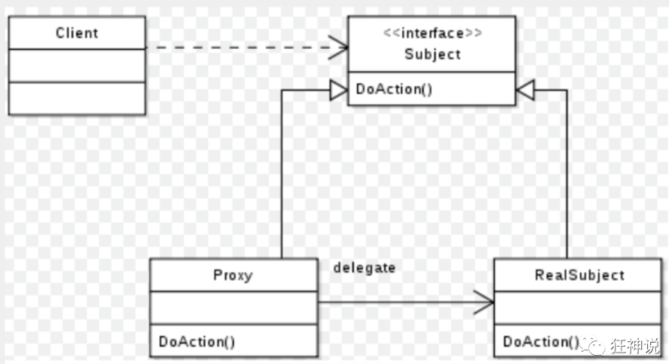

6、Mybatis详细的执行流程

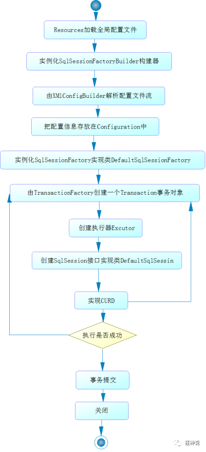


## 2. 注解增删改

改造MybatisUtils工具类的getSession() 方法，重载实现。

```java
  //获取SqlSession连接
  public static SqlSession getSession(){
      return getSession(true); //事务自动提交
  }
 
  public static SqlSession getSession(boolean flag){
      return sqlSessionFactory.openSession(flag);
  }
```

【注意】确保实体类和数据库字段对应

查询：

1、编写接口方法注解

```java
//根据id查询用户
@Select("select * from user where id = #{id}")
User selectUserById(@Param("id") int id);
```

2、测试

```java
@Test
public void testSelectUserById() {
   SqlSession session = MybatisUtils.getSession();
   UserMapper mapper = session.getMapper(UserMapper.class);

   User user = mapper.selectUserById(1);
   System.out.println(user);

   session.close();
}
```

新增：

1、编写接口方法注解

```java
//添加一个用户
@Insert("insert into user (id,name,pwd) values (#{id},#{name},#{pwd})")
int addUser(User user);
```

2、测试

```java
@Test
public void testAddUser() {
   SqlSession session = MybatisUtils.getSession();
   UserMapper mapper = session.getMapper(UserMapper.class);

   User user = new User(6, "秦疆", "123456");
   mapper.addUser(user);

   session.close();
}
```

修改：

1、编写接口方法注解

```java
//修改一个用户
@Update("update user set name=#{name},pwd=#{pwd} where id = #{id}")
int updateUser(User user);
```

2、测试

```java
@Test
public void testUpdateUser() {
   SqlSession session = MybatisUtils.getSession();
   UserMapper mapper = session.getMapper(UserMapper.class);

   User user = new User(6, "秦疆", "zxcvbn");
   mapper.updateUser(user);

   session.close();
}
```

删除：

1、编写接口方法注解

```java
//根据id删除用
@Delete("delete from user where id = #{id}")
int deleteUser(@Param("id")int id);
```

2、测试

```java
@Test
public void testDeleteUser() {
   SqlSession session = MybatisUtils.getSession();
   UserMapper mapper = session.getMapper(UserMapper.class);

   mapper.deleteUser(6);
   
   session.close();
}
```

【注意点：增删改一定记得对事务的处理】

## 3. 关于@Param

@Param注解用于给方法参数起一个名字。以下是总结的使用原则：

- 在方法只接受一个参数的情况下，可以不使用@Param。
  - 不使用@Param注解时，参数只能有一个。参数名可以是任意值
- 在方法接受多个参数的情况下，建议一定要使用@Param注解给参数命名。

## 4. #与$的区别

- \#{} 的作用主要是替换预编译语句(PrepareStatement)中的占位符? 【推荐使用】

  ```java
  INSERT INTO user (name) VALUES (#{name});
  INSERT INTO user (name) VALUES (?);
  ```

- ${} 的作用是直接进行字符串替换

  ```java
  INSERT INTO user (name) VALUES ('${name}');
  INSERT INTO user (name) VALUES ('kuangshen');
  ```

> 使用注解和配置文件协同开发，才是MyBatis的最佳实践！


# 十、动态SQL

什么是动态SQL：动态SQL指的是根据不同的查询条件 , 生成不同的Sql语句.

```
官网描述：
MyBatis 的强大特性之一便是它的动态 SQL。如果你有使用 JDBC 或其它类似框架的经验，你就能体会到根据不同条件拼接 SQL 语句的痛苦。例如拼接时要确保不能忘记添加必要的空格，还要注意去掉列表最后一个列名的逗号。利用动态 SQL 这一特性可以彻底摆脱这种痛苦。
虽然在以前使用动态 SQL 并非一件易事，但正是 MyBatis 提供了可以被用在任意 SQL 映射语句中的强大的动态 SQL 语言得以改进这种情形。
动态 SQL 元素和 JSTL 或基于类似 XML 的文本处理器相似。在 MyBatis 之前的版本中，有很多元素需要花时间了解。MyBatis 3 大大精简了元素种类，现在只需学习原来一半的元素便可。MyBatis 采用功能强大的基于 OGNL 的表达式来淘汰其它大部分元素。

  -------------------------------
  - if
  - choose (when, otherwise)
  - trim (where, set)
  - foreach
  -------------------------------
```

我们之前写的 SQL 语句都比较简单，如果有比较复杂的业务，我们需要写复杂的 SQL 语句，往往需要拼接，而拼接 SQL ，稍微不注意，由于引号，空格等缺失可能都会导致错误。

那么怎么去解决这个问题呢？这就要使用 mybatis 动态SQL，通过 if, choose, when, otherwise, trim, where, set, foreach等标签，可组合成非常灵活的SQL语句，从而在提高 SQL 语句的准确性的同时，也大大提高了开发人员的效率

## 1. if 语句

需求：根据作者名字和博客名字来查询博客！如果作者名字为空，那么只根据博客名字查询，反之，则根据作者名来查询

编写sql语句：

```xml
<!--需求1：
根据作者名字和博客名字来查询博客！
如果作者名字为空，那么只根据博客名字查询，反之，则根据作者名来查询
select * from blog where title = #{title} and author = #{author}
-->
<select id="queryBlogIf" parameterType="map" resultType="blog">
  select * from blog where
   <if test="title != null">
      title = #{title}
   </if>
   <if test="author != null">
      and author = #{author}
   </if>
</select>
```

测试：

```java
@Test
public void testQueryBlogIf(){
   SqlSession session = MybatisUtils.getSession();
   BlogMapper mapper = session.getMapper(BlogMapper.class);

   HashMap<String, String> map = new HashMap<String, String>();
   map.put("title","Mybatis如此简单");
   map.put("author","狂神说");
   List<Blog> blogs = mapper.queryBlogIf(map);

   System.out.println(blogs);

   session.close();
}
```

这样写我们可以看到，如果 author 等于 null，那么查询语句为 select * from user where title=#{title},但是如果title为空呢？那么查询语句为 select * from user where and author=#{author}，这是错误的 SQL 语句，如何解决呢？请看下面的 where 语句！

## 2. Where

修改上面的SQL语句；

```xml
<select id="queryBlogIf" parameterType="map" resultType="blog">
  select * from blog
   <where>
       <if test="title != null">
          title = #{title}
       </if>
       <if test="author != null">
          and author = #{author}
       </if>
   </where>
</select>
```

这个“where”标签会知道如果它包含的标签中有返回值的话，它就插入一个‘where’。此外，如果标签返回的内容是以AND 或OR 开头的，则它会剔除掉。

## 3. Set

同理，上面的对于查询 SQL 语句包含 where 关键字，如果在进行更新操作的时候，含有 set 关键词，我们怎么处理呢？

1、编写接口方法

```java
int updateBlog(Map map);
```

2、sql配置文件

```xml
<!--注意set是用的逗号隔开-->
<update id="updateBlog" parameterType="map">
  update blog
     <set>
         <if test="title != null">
            title = #{title},
         </if>
         <if test="author != null">
            author = #{author}
         </if>
     </set>
  where id = #{id};
</update>
```

3、测试

```java
@Test
public void testUpdateBlog(){
   SqlSession session = MybatisUtils.getSession();
   BlogMapper mapper = session.getMapper(BlogMapper.class);

   HashMap<String, String> map = new HashMap<String, String>();
   map.put("title","动态SQL");
   map.put("author","秦疆");
   map.put("id","9d6a763f5e1347cebda43e2a32687a77");

   mapper.updateBlog(map);


   session.close();
}
```

## 4. choose语句

有时候，我们不想用到所有的查询条件，只想选择其中的一个，查询条件有一个满足即可，使用 choose 标签可以解决此类问题，类似于 Java 的 switch 语句

1、编写接口方法

```java
List<Blog> queryBlogChoose(Map map);
```

2、sql配置文件

```xml
<select id="queryBlogChoose" parameterType="map" resultType="blog">
  select * from blog
   <where>
       <choose>
           <when test="title != null">
                title = #{title}
           </when>
           <when test="author != null">
              and author = #{author}
           </when>
           <otherwise>
              and views = #{views}
           </otherwise>
       </choose>
   </where>
</select>
```

3、测试类

```java
@Test
public void testQueryBlogChoose(){
   SqlSession session = MybatisUtils.getSession();
   BlogMapper mapper = session.getMapper(BlogMapper.class);

   HashMap<String, Object> map = new HashMap<String, Object>();
   map.put("title","Java如此简单");
   map.put("author","狂神说");
   map.put("views",9999);
   List<Blog> blogs = mapper.queryBlogChoose(map);

   System.out.println(blogs);

   session.close();
}
```

## 5. SQL片段

有时候可能某个 sql 语句我们用的特别多，为了增加代码的重用性，简化代码，我们需要将这些代码抽取出来，然后使用时直接调用。

提取SQL片段：

```xml
<sql id="if-title-author">
   <if test="title != null">
      title = #{title}
   </if>
   <if test="author != null">
      and author = #{author}
   </if>
</sql>
```

引用SQL片段：

```xml
<select id="queryBlogIf" parameterType="map" resultType="blog">
  select * from blog
   <where>
       <!-- 引用 sql 片段，如果refid 指定的不在本文件中，那么需要在前面加上 namespace -->
       <include refid="if-title-author"></include>
       <!-- 在这里还可以引用其他的 sql 片段 -->
   </where>
</select>
```

注意：

- 最好基于 单表来定义 sql 片段，提高片段的可重用性
- 在 sql 片段中不要包括 where

## 6. foreach

将数据库中前三个数据的id修改为1,2,3；

需求：我们需要查询 blog 表中 id 分别为1,2,3的博客信息

1、编写接口

```java
List<Blog> queryBlogForeach(Map map);
```

2、编写SQL语句

```xml
<select id="queryBlogForeach" parameterType="map" resultType="blog">
  select * from blog
   <where>
       <!--
       collection:指定输入对象中的集合属性
       item:每次遍历生成的对象
       open:开始遍历时的拼接字符串
       close:结束时拼接的字符串
       separator:遍历对象之间需要拼接的字符串
       select * from blog where 1=1 and (id=1 or id=2 or id=3)
     -->
       <foreach collection="ids"  item="id" open="and (" close=")" separator="or">
          id=#{id}
       </foreach>
   </where>
</select>
```

3、测试

```java
@Test
public void testQueryBlogForeach(){
   SqlSession session = MybatisUtils.getSession();
   BlogMapper mapper = session.getMapper(BlogMapper.class);

   HashMap map = new HashMap();
   List<Integer> ids = new ArrayList<Integer>();
   ids.add(1);
   ids.add(2);
   ids.add(3);
   map.put("ids",ids);

   List<Blog> blogs = mapper.queryBlogForeach(map);

   System.out.println(blogs);

   session.close();
}
```

小结：其实动态 sql 语句的编写往往就是一个拼接的问题，为了保证拼接准确，我们最好首先要写原生的 sql 语句出来，然后在通过 mybatis 动态sql 对照着改，防止出错。多在实践中使用才是熟练掌握它的技巧。