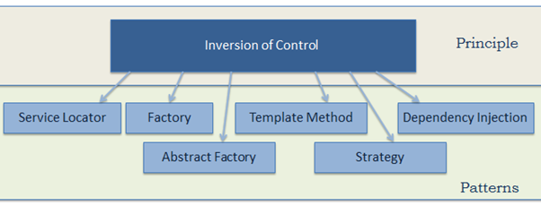
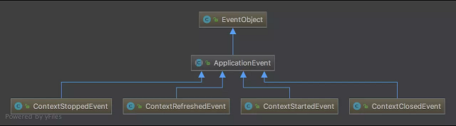

# 一、Spring 是什么

## 1. 简介

什么是Spring：轻量级的 DI / IoC 和 AOP 的开源框架

>官方文档 [https://spring.io/projects/spring-framework](https://spring.io/projects/spring-framework)

我们一般说 Spring 框架指的都是 Spring Framework，<u>它是很多模块的集合</u>，使用这些模块可以很方便地协助我们进行开发。

- Spring : 春天 --->给软件行业带来了春天
- 2002年，Rod Jahnson首次推出了Spring框架雏形interface21框架。
    - 很难想象Rod Johnson的学历 , 他是悉尼大学的博士，然而他的专业不是计算机，而是音乐学。
- 2004年3月24日，Spring框架以interface21框架为基础，经过重新设计，发布了1.0正式版。
- Spring理念 : 使现有技术更加实用. 本身就是一个大杂烩 , 整合现有的框架技术
    - 官网 : http://spring.io/
    - 官方下载地址 : https://repo.spring.io/libs-release-local/org/springframework/spring/
    - GitHub : https://github.com/spring-projects
- Maven依赖
    - `spring-webmvc`包含了`spring-context`、`spring-core`、`spring-beans`

```xml
<!-- https://mvnrepository.com/artifact/org.springframework/spring-webmvc -->
<dependency>
    <groupId>org.springframework</groupId>
    <artifactId>spring-webmvc</artifactId>
    <version>5.2.5.RELEASE</version>
</dependency>

<dependency>
    <groupId>org.springframework</groupId>
    <artifactId>spring-jdbc</artifactId>
    <version>5.2.3.RELEASE</version>
</dependency>
```

## 2. 优点

Spring的优点有很多：
- Spring是一个开源免费的框架，容器  .
- Spring是一个轻量级的框架，<u>非侵入式</u>的 .
- 控制反转 IoC，面向切面 Aop
- 对事务的支持，对框架的支持
- .......

一句话概括：Spring是一个轻量级的控制反转(IoC)和面向切面(AOP)的容器（框架）。

- 更详细的理解
    - 管理创建和组装对象之间的依赖关系 
        - 使用前：手工创建 
        - 使用后：Spring创建，自动注入
    ```java
    Controller -> Service -> Dao
    
    UserController{
        private UserService userService = new UserService();
    }
    ```
    - 面向切面编程（AOP）可以解耦核心业务和边缘业务(记录日志等)的关系
        - 场景：用户调用下单购买视频接口，需要判断登录，拦截器是AOP思想的一种实现
        - 使用前：代码写逻辑，每次下单都调用方法判断，多个方法需要判断登录则都需要 登录方法判断
        - 使用后：根据一定的方法或者路径规则进行判断是否要调用，降低代码耦合度
    - 包含java大型项目里面常见解决方案 web层、业务层、数据访问层等
    - 极其便利的整合其他主流技术栈，比如redis、mq、mybatis、jpa
    - 社区庞大和活跃，在微服务、大数据、云计算都有对应的组件
    

>使用springboot2.x后，大家很少接触到各种细化的bean配置，但是底层实现流程和原理是必须掌握的，面试+工作都是必备

## 3. 组成

Spring 官网列出的 Spring 的 6 个特征:

- 核心技术 ：依赖注入(DI)，AOP，事件(events)，资源，i18n，验证，数据绑定，类型转换，SpEL。
- 测试 ：模拟对象，TestContext框架，Spring MVC 测试，WebTestClient。
- 数据访问 ：事务，DAO支持，JDBC，ORM，编组XML。
- Web支持 : Spring MVC和Spring WebFlux Web框架。
- 集成 ：远程处理，JMS，JCA，JMX，电子邮件，任务，调度，缓存。
- 语言 ：Kotlin，Groovy，动态语言。


- Spring Core： 基础,可以说 Spring 其他所有的功能都需要依赖于该类库。主要提供 IoC 依赖注入功能。
- Spring Aspects ： 该模块为与AspectJ的集成提供支持。
- Spring AOP ：提供了面向切面的编程实现。
- Spring JDBC : Java数据库连接。
- Spring JMS ：Java消息服务。
- Spring ORM : 用于支持Hibernate等ORM工具。
- Spring Web : 为创建Web应用程序提供支持。
- Spring Test : 提供了对 JUnit 和 TestNG 测试的支持。


Spring 框架是一个分层架构，由 7 个定义良好的模块组成。Spring 模块构建在核心容器之上，核心容器定义了创建、配置和管理 bean 的方式 .


<u>组成 Spring 框架的每个模块（或组件）都可以单独存在，或者与其他一个或多个模块联合实现</u>。每个模块的功能如下：

- 核心容器
    - 核心容器提供 Spring 框架的基本功能。核心容器的主要组件是 BeanFactory，它是工厂模式的实现。BeanFactory 使用控制反转（IOC） 模式将应用程序的配置和依赖性规范与实际的应用程序代码分开。
- Spring 上下文
    - Spring 上下文是一个配置文件，向 Spring 框架提供上下文信息。Spring 上下文包括企业服务，例如 JNDI、EJB、电子邮件、国际化、校验和调度功能。
- Spring AOP
    - 通过配置管理特性，Spring AOP 模块直接将面向切面的编程功能 , 集成到了 Spring 框架中。所以，可以很容易地使 Spring 框架管理任何支持 AOP的对象。Spring AOP 模块为基于 Spring 的应用程序中的对象提供了事务管理服务。通过使用 Spring AOP，不用依赖组件，就可以将声明性事务管理集成到应用程序中。
- Spring DAO
    - JDBC DAO 抽象层提供了有意义的异常层次结构，可用该结构来管理异常处理和不同数据库供应商抛出的错误消息。异常层次结构简化了错误处理，并且极大地降低了需要编写的异常代码数量（例如打开和关闭连接）。Spring DAO 的面向 JDBC 的异常遵从通用的 DAO 异常层次结构。
- Spring ORM
    - Spring 框架插入了若干个 ORM 框架，从而提供了 ORM 的对象关系工具，其中包括 JDO、Hibernate 和 iBatis SQL Map。所有这些都遵从 Spring 的通用事务和 DAO 异常层次结构。
- Spring Web 模块
    - Web 上下文模块建立在应用程序上下文模块之上，为基于 Web 的应用程序提供了上下文。所以，Spring 框架支持与 Jakarta Struts 的集成。Web 模块还简化了处理多部分请求以及将请求参数绑定到域对象的工作。
- Spring MVC 框架
    - MVC 框架是一个全功能的构建 Web 应用程序的 MVC 实现。通过策略接口，MVC 框架变成为高度可配置的，MVC 容纳了大量视图技术，其中包括 JSP、Velocity、Tiles、iText 和 POI。

## 4. 拓展

- Spring发展的弊端
    - Spring发展了太久之后，配置太过繁杂。配置文件里面的东西很难理解
- Spring Boot与Spring Cloud
    - Spring Boot 是 Spring 的一套快速配置脚手架，可以基于Spring Boot 快速开发单个微服务;
    - Spring Cloud是基于Spring Boot实现的；
    - Spring Boot专注于快速、方便集成的单个微服务个体，Spring Cloud关注全局的服务治理框架；
    - Spring Boot使用了约束优于配置的理念，很多集成方案已经帮你选择好了，能不配置就不配置 , Spring Cloud很大的一部分是基于Spring Boot来实现，Spring Boot可以离开Spring Cloud独立使用开发项目，但是Spring Cloud离不开Spring Boot，属于依赖的关系。
    - SpringBoot在SpringClound中起到了承上启下的作用，如果你要学习SpringCloud必须要学习SpringBoot。


# 二、Spring IOC容器

## 1. IOC 控制反转

###  1.1. IOC理论推导(IOC原型)

新建一个空白的maven项目。我们先用我们原来的方式写一段代码 .

1、先写一个UserDao接口

```java
public interface UserDao {
   public void getUser();
}
```

2、再去写Dao的实现类

```java
public class UserDaoImpl implements UserDao {
   @Override
   public void getUser() {
       System.out.println("获取用户数据");
  }
}
```

3、然后去写UserService的接口

```java
public interface UserService {
   public void getUser();
}
```

4、最后写Service的实现类

```java
public class UserServiceImpl implements UserService {
   private UserDao userDao = new UserDaoImpl();

   @Override
   public void getUser() {
       userDao.getUser();
  }
}
```

5、测试一下

```java
@Test
public void test(){
   UserService service = new UserServiceImpl();
   service.getUser();
}
```

这是我们原来的方式 , 开始大家也都是这么去写的对吧 . 那我们现在修改一下。把Userdao的实现类增加一个。

```java
public class UserDaoMySqlImpl implements UserDao {
   @Override
   public void getUser() {
       System.out.println("MySql获取用户数据");
  }
}
```

紧接着我们要去使用MySql的话 , 我们就需要去service实现类里面修改对应的实现

```java
public class UserServiceImpl implements UserService {
   private UserDao userDao = new UserDaoMySqlImpl();

   @Override
   public void getUser() {
       userDao.getUser();
  }
}
```

在假设, 我们再增加一个UserDao的实现类 .

```java
public class UserDaoOracleImpl implements UserDao {
   @Override
   public void getUser() {
       System.out.println("Oracle获取用户数据");
  }
}
```

那么我们要使用Oracle , 又需要去service实现类里面修改对应的实现 . 

假设我们的这种需求非常大 , 这种方式就根本不适用了, 甚至反人类对吧 , <u>每次变动 , 都需要修改大量代码 . 这种设计的耦合性太高了, 牵一发而动全身</u> .

那我们如何去解决呢 ? 我们可以在需要用到他的地方 , 不去实现它 , 而是留一个接口 , 面向接口编程。 利用set对实现类进行注入 。 我们去代码里修改下 .

```java
public class UserServiceImpl implements UserService {
   private UserDao userDao;
   // 利用set实现
   public void setUserDao(UserDao userDao) {
       this.userDao = userDao;
  }

   @Override
   public void getUser() {
       userDao.getUser();
  }
}
```

现在去我们的测试类里 , 进行测试 ;


```java
@Test
public void test(){
   UserServiceImpl service = new UserServiceImpl();
   service.setUserDao( new UserDaoMySqlImpl() );
   service.getUser();
   //那我们现在又想用Oracle去实现呢
   service.setUserDao( new UserDaoOracleImpl() );
   service.getUser();
}
```

大家发现了区别没有 ? 可能很多人说没啥区别 . 其实他们已经发生了根本性的变化 , 很多地方都不一样了 . 仔细去思考一下 , <u>以前所有东西都是由程序去进行控制创建 , 而现在是由我们自行控制创建对象 , 把主动权交给了调用者 . 程序不用去管怎么创建, 怎么实现了 . 它只负责提供一个接口 .</u>

这种思想 , 从本质上解决了问题 , 我们程序员不再去管理对象的创建了, 更多的去关注业务的实现 . 耦合性大大降低 . 这也就是IOC的原型 !

### 1.2. IOC设计思想

<u>控制反转IoC(Inversion of Control)，是一种设计思想</u>，由主动的编程变成被动的接收。<u>DI(依赖注入)是实现IoC的一种方法</u>，也有人认为DI只是IoC的另一种说法。


没有IoC的程序中 , 我们使用面向对象编程, 对象的创建与对象间的依赖关系完全硬编码在程序中，对象的创建由程序自己控制，控制反转后将对象的创建转移给第三方，个人认为所谓控制反转就是：获得依赖对象的方式反转了

- Inverse of Control（控制反转）是一种设计思想 将原本在程序中手动创建对象的流程，交由Spring框架来管理。
- 核心：把创建对象的控制权反转给Spring框架，<u>对象的生命周期以及对象之间的依赖关系</u>由Spring统一管理
    - 将对象之间的相互依赖关系交给 IoC 容器来管理，并由 IoC 容器完成对象的注入。这样可以很大程度上简化应用的开发，把应用从复杂的依赖关系中解放出来。 
- 把spring ioc 当成一个容器，里面存储管理的对象称为Bean 即类实例。
- IoC是Spring框架的核心内容，使用多种方式完美的实现了IoC，可以使用XML配置，也可以使用注解，新版本的Spring也可以零配置实现IoC。
    - 采用XML方式配置Bean的时候，Bean的定义信息是和实现分离的
    - 采用注解的方式可以把两者合为一体，Bean的定义信息直接以注解的形式定义在实现类中，从而达到了零配置的目的。

Spring容器在初始化时先读取配置文件，根据配置文件或元数据创建与组织对象并存入容器中，程序使用时再从Ioc容器中取出需要的对象。


Spring IoC的初始化过程：


总结：控制反转是一种通过描述（XML或注解）并通过第三方去生产或获取特定对象的方式。在Spring中实现控制反转的是IoC容器，其实现方法是依赖注入（Dependency Injection,DI）

### 1.3. Helloworld

使用 IDEA + Maven + Spring5创建项目

- 创建 maven 项目
- 添加依赖(可以直接添加`spring-webmvc`依赖，包含下面依赖)
    - `spring-context`
    - `spring-core`
    - `spring-beans`

```xml
<!-- https://mvnrepository.com/artifact/org.springframework/spring-context -->
<dependency>
	<groupId>org.springframework</groupId>
	<artifactId>spring-context</artifactId>
	<version>5.2.5.RELEASE</version>
</dependency>
<!-- https://mvnrepository.com/artifact/org.springframework/spring-core -->
<dependency>
	<groupId>org.springframework</groupId>
	<artifactId>spring-core</artifactId>
	<version>5.2.5.RELEASE</version>
</dependency>
<!-- https://mvnrepository.com/artifact/org.springframework/spring-beans -->
<dependency>
	<groupId>org.springframework</groupId>
	<artifactId>spring-beans</artifactId>
	<version>5.2.5.RELEASE</version>
</dependency>
```

- `classpath` 下（maven项目的 `resources`目录下）添加配置文件 `applicationContext.xml` 
    - 添加bean配置（bean定义）

```xml
<?xml version="1.0" encoding="UTF-8"?>
<beans xmlns="http://www.springframework.org/schema/beans"
       xmlns:xsi="http://www.w3.org/2001/XMLSchema-instance"
       xsi:schemaLocation="http://www.springframework.org/schema/beans
        https://www.springframework.org/schema/beans/spring-beans.xsd">

    <!--bean就是java对象 , 由Spring创建和管理-->
    <bean name="video" class="net.xdclass.sp.domain.Video">
        <property name="id" value="23"/>
        <property name="title" value="Spring 5.x"/>
    </bean>

</beans>
```

- 从容器中获取bean

```java
public static void main(String[] args) {
	//读取配置文件(可读取多个)，加载bean定义, 生成管理相应的Bean对象。
	ApplicationContext applicationContext = new ClassPathXmlApplicationContext("applicationContext.xml");
	Video video = (Video)applicationContext.getBean("video");
	System.out.println(video.getTitle());
}
```

- 思考
    - Video 对象是谁创建的 ?  Video 对象是由Spring创建的
    - Video 对象的属性是怎么设置的 ?  Video 对象的属性是由Spring容器设置的
    - 这个过程就叫控制反转
        - 控制 : 谁来控制对象的创建 , 传统应用程序的对象是由程序本身控制创建的 , 使用Spring后 , <u>对象是由Spring来创建的</u>
        - 反转 : 程序本身不创建对象 , 而变成被动的接收对象.
    - 可以通过newClassPathXmlApplicationContext去浏览一下底层源码 .
    - 依赖注入 : 就是利用set方法来进行注入的.

## 2. Spring Bean配置

### 2.1. 别名

alias 设置别名，为bean设置别名，可以设置多个别名

```xml
<!--设置别名：在获取Bean的时候可以使用别名获取-->
<alias name="userT" alias="userNew"/>
```

### 2.2. Bean的配置

`<bean>`标签属性

- `id` 属性：指定bean定义的标识符,要唯一，在bean被别的对象依赖时使用。
    - 如果没有配置id,name就是默认标识符
    - 如果配置id,又配置了name,那么name是别名
- `name` 属性：用于指定bean的别名，如果没有 `id`，也可以用 `name`
    - name可以设置多个别名,可以用逗号,分号,空格隔开
- `class` 属性：用于指定bean的来源，要创建的bean的`class`类，需要类的完全限定名(包名+类名)

```xml
<!--bean就是java对象,由Spring创建和管理-->

<!--
   id 是bean的标识符,要唯一,如果没有配置id,name就是默认标识符
   如果配置id,又配置了name,那么name是别名
   
   name可以设置多个别名,可以用逗号,分号,空格隔开
   如果不配置id和name,可以根据applicationContext.getBean(.class)获取对象;
   
   class是bean的全限定名=包名+类名
-->
<bean id="hello" name="hello2 h2,h3;h4" class="com.kuang.pojo.Hello">
   <property name="name" value="Spring"/>
</bean>
```

### 2.3. import

团队的合作通过import来实现.  在配置文件中导入其他配置文件

```xml
<import resource="{path}/beans.xml"/>
```

## 3. IOC创建对象方式

### 3.1. 通过无参构造方法来创建

1、User.java

```java
public class User {

   private String name;

   public User() {
       System.out.println("user无参构造方法");
  }

   public void setName(String name) {
       this.name = name;
  }

   public void show(){
       System.out.println("name="+ name );
  }

}
```

2、beans.xml


```xml
<?xml version="1.0" encoding="UTF-8"?>
<beans xmlns="http://www.springframework.org/schema/beans"
      xmlns:xsi="http://www.w3.org/2001/XMLSchema-instance"
      xsi:schemaLocation="http://www.springframework.org/schema/beans
       http://www.springframework.org/schema/beans/spring-beans.xsd">

   <bean id="user" class="com.kuang.pojo.User">
       <property name="name" value="kuangshen"/>
   </bean>

</beans>
```

3、测试类


```java
@Test
public void test(){
   ApplicationContext context = new ClassPathXmlApplicationContext("beans.xml");
   //在执行getBean的时候, user已经创建好了 , 通过无参构造
   User user = (User) context.getBean("user");
   //调用对象的方法 .
   user.show();
}
```

结果可以发现，在调用show方法之前，User对象已经通过无参构造初始化了！


### 3.2. 通过有参构造方法来创建

1、UserT.java

```java
public class UserT {

   private String name;

   public UserT(String name) {
       this.name = name;
  }

   public void setName(String name) {
       this.name = name;
  }

   public void show(){
       System.out.println("name="+ name );
  }

}
```

2、beans.xml 有三种方式编写

```xml
<!-- 第一种根据index参数下标设置 -->
<bean id="userT" class="com.kuang.pojo.UserT">
   <!-- index指构造方法 , 下标从0开始 -->
   <constructor-arg index="0" value="kuangshen2"/>
</bean>
<!-- 第二种根据参数名字设置 -->
<bean id="userT" class="com.kuang.pojo.UserT">
   <!-- name指参数名 -->
   <constructor-arg name="name" value="kuangshen2"/>
</bean>
<!-- 第三种根据参数类型设置 -->
<bean id="userT" class="com.kuang.pojo.UserT">
   <constructor-arg type="java.lang.String" value="kuangshen2"/>
</bean>
```

3、测试

```java
@Test
public void testT(){
   ApplicationContext context = new ClassPathXmlApplicationContext("beans.xml");
   UserT user = (UserT) context.getBean("userT");
   user.show();
}
```

结论：在配置文件加载的时候。其中管理的对象都已经初始化了！


# 三、Spring 依赖注入

## 1. 概念

什么是DI Dependency Injection ,依赖注入

- IOC容器在运行期间，动态地将对象的某种依赖关系注入到对象之中。


- 比如视频订单对象，依赖用视频对象


编写代码

* 创建 `VideoOrder` 类，`VideoOrder`类的实例依赖于 `Video` 类的实例

```java
public class VideoOrder {

    private int id;
    private String outTradeNo;
    private Video video;
	//getter and setter
	...
}
```


*  编写Bean定义，使用 `ref` 属性指定要注入的Bean定义依赖。

```xml
<bean id="video" class="net.xdclass.sp.domain.Video">
	<property name="id" value="9"/>
	<property name="title" value="Spring 5.X课程" />
</bean>

<bean id="videoOrder" class="net.xdclass.sp.domain.VideoOrder" >
	<property name="id" value="8" />
	<property name="outTradeNo" value="23432fnfwedwefqwef2"/>
	<property name="video" ref="video"/>
</bean>
```

* 从容器获取依赖注入之后的对象

```java
ApplicationContext context = new ClassPathXmlApplicationContext("applicationContext.xml");
Video  video = (Video)context.getBean("video");
System.out.println(video.getTitle());

VideoOrder videoOrder = (VideoOrder) context.getBean("videoOrder");
System.out.println(videoOrder.getOutTradeNo());
System.out.println(videoOrder.getVideo().getTitle());
```

## 2. 常见的注入方式

### 2.1. 带参构造方法注入

需要重写相应的构造方法，bean定义指定的构造参数要与类构造方法里面的参数一一对应（名称或者类型或者顺序）

>注意: 类的构造方法重写的时候，一定要保留空构造函数！！！

* 构造方法基本类型属性注入

```xml
<bean id="video" class="net.xdclass.sp.domain.Video" >
    <constructor-arg name="title" value="面试专题课程第一季"></constructor-arg>
</bean>
```

* 构造方法POJO类型属性注入。 `<constructor-arg>` 标签没有使用 `value` 属性，而是使用了 `ref` 属性)
```xml
<bean id="videoOrder" class="net.xdclass.sp.domain.VideoOrder" >
	<constructor-arg name="video" ref="video"/>
</bean>
```

- 多种方式进行构造函数属性的注入

```xml
<!-- 第一种根据index参数下标设置 -->
<bean id="userT" class="com.kuang.pojo.UserT">
   <!-- index指构造方法 , 下标从0开始 -->
   <constructor-arg index="0" value="kuangshen2"/>
</bean>
<!-- 第二种根据参数名字设置 -->
<bean id="userT" class="com.kuang.pojo.UserT">
   <!-- name指参数名 -->
   <constructor-arg name="name" value="kuangshen2"/>
</bean>
<!-- 第三种根据参数类型设置 -->
<bean id="userT" class="com.kuang.pojo.UserT">
   <constructor-arg type="java.lang.String" value="kuangshen2"/>
</bean>
```

### 2.2. 使用set方法注入属性

Bean定义对应的类要有默认的构造方法。要注入类的属性要有相应的setter方法。容器先使用类的默认构造方法创建类的实例对象，然后使用setter方法进行属性注入。

- 要求被注入的属性 , 必须有set方法 。
- set方法的方法名由set + 属性首字母大写 , 如果属性是boolean类型 , 没有set方法 , 是 is

1、常量注入

```xml
<bean id="video" class="net.xdclass.sp.domain.Video" scope="singleton">
        <property name="id" value="9"/>
        <property name="title" value="Spring 5.X课程" />
</bean>
```

2、Bean注入

注意点：这里的值是一个引用，ref

```xml
<bean id="video" class="net.xdclass.sp.domain.Video">
	<property name="id" value="9"/>
	<property name="title" value="Spring 5.X课程" />
</bean>

<bean id="videoOrder" class="net.xdclass.sp.domain.VideoOrder" >
	<property name="id" value="8" />
	<property name="outTradeNo" value="23432fnfwedwefqwef2"/>
	<property name="video" ref="video"/>
</bean>
```

3、数组注入

```xml
 <bean id="student" class="com.kuang.pojo.Student">
     <property name="name" value="小明"/>
     <property name="address" ref="addr"/>
     <property name="books">
         <array>
             <value>西游记</value>
             <value>红楼梦</value>
             <value>水浒传</value>
         </array>
     </property>
 </bean>
```

4、List与Map类型注入

```xml
<!--list类型注入-->
<property name="chapterList">
    <list>
        <value>第一章SpringBoot</value>
        <value>第二章Mybatis</value>
        <value>第三章Spring</value>
    </list>
</property>
<!-- map类型注入 -->
<property name="videoMap">
    <map>
        <entry key="1" value="SpringCloud课程"></entry>
        <entry key="2" value="面试课程"></entry>
        <entry key="3" value="javaweb课程"></entry>
    </map>
</property>
```

5、set注入

```xml
<property name="games">
     <set>
         <value>LOL</value>
         <value>BOB</value>
         <value>COC</value>
     </set>
 </property>
```

6、Null注入

```xml
 <property name="wife"><null/></property>
```

7、Properties注入

```xml
 <property name="info">
     <props>
         <prop key="学号">20190604</prop>
         <prop key="性别">男</prop>
         <prop key="姓名">小明</prop>
     </props>
 </property>
```

### 2.3. p命名和c命名注入

User.java ：【注意：这里没有有参构造器！】

 ```java
public class User {
     private String name;
     private int age;

     public void setName(String name) {
         this.name = name;
    }
     
     public void setAge(int age) {
         this.age = age;
    }
     
     @Override
     public String toString() {
         return "User{" +
                 "name='" + name + '\'' +
                 ", age=" + age +
                 '}';
    }

 }
 ```

1、P命名空间注入

- P表示Property属性，P命名空间注入是对属性的set方法注入，所以属性依然要设置set方法
- 需要在头文件中加入约束文件
  -  导入约束 : xmlns:p="http://www.springframework.org/schema/p"

```xml
 <!--P(属性: properties)命名空间 , 属性依然要设置set方法-->
 <bean id="user" class="com.kuang.pojo.User" p:name="狂神" p:age="18"/>
```

2、c 命名空间注入

- c表示constructor-args，构造方法注入。所以需要有带参的构造方法
- 需要在头文件中加入约束文件
  -  导入约束 : xmlns:c="http://www.springframework.org/schema/c"

 ```xml
 <!--C(构造: Constructor)命名空间 , 属性依然要设置set方法-->
 <bean id="user" class="com.kuang.pojo.User" c:name="狂神" c:age="18"/>
 ```

发现问题：爆红了，刚才我们没有写有参构造！

解决：把有参构造器加上，这里也能知道，c 就是所谓的构造器注入！

测试代码：

```java
 @Test
 public void test02(){
     ApplicationContext context = new ClassPathXmlApplicationContext("applicationContext.xml");
     User user = (User) context.getBean("user");
     System.out.println(user);
 }
```

## 3. bean 的作用域

### 3.1. bean 的4种作用域

`<bean>` 标签的 `scope` 属性来设置bean的作用域。

- `singleton` : 唯一 bean 实例，Spring 中的 bean 默认都是单例的。
  - 关闭容器，所有的对象都会销毁
- `prototype` : 每次从容器中获取时会创建一个新的 bean 实例。
  - 关闭容器，所有的对象不会销毁。内部的垃圾回收机制会回收
- `request` : 每一次HTTP请求都会产生一个新的bean，该bean仅在当前HTTP request内有效。
- `session` : 每一次HTTP会话都会产生一个新的 bean，该bean仅在当前 HTTP session 内有效。
- `global-session`： 全局session作用域，仅仅在基于portlet的web应用中才有意义，Spring5已经没有了。

1、`singleton`：单例, 默认值，容器初始化的时候就会创建对象并将实例缓存起来，之后每次调用 `getBean` 方法调用返回是同一个对象，效率比较高

```java
ApplicationContext context = new ClassPathXmlApplicationContext("applicationContext.xml");
```
加载配置文件之后，容器初始化。对于单例对象直接进行创建。

当一个bean被标识为 `singleton` 时候，spring的IOC容器中只会存在一个该bean。
```xml
<bean id="video" class="net.xdclass.sp.domain.Video" scope="singleton">
	<property name="id" value="9"/>
	<property name="title" value="Spring 5.X课程" />
</bean>
```

```java
ApplicationContext context = new ClassPathXmlApplicationContext("applicationContext.xml");
Video video1 = (Video)context.getBean("video");
Video video2 = (Video)context.getBean("video");
//true  靠匹配内存地址，== 是匹配内存地址
System.out.println(video1 == video2);
```

2、`prototype`: 原型，属于多例，每次调用 `getBean` 方法才会创建对象，每次调用会创建不同的对象，频繁的创建和销毁对象造成很大的开销。

- 使用 `prototype` 时 Spring 不会负责销毁容器对象，由垃圾回收器进行回收。如果指定了销毁方法`destory-method` 则不会执行

- 如果其他对象依赖于当前原型 bean定义，在进行依赖注入的时候原型的bean定义也会创建新的对象


```xml
<bean id="video" class="net.xdclass.sp.domain.Video" scope="prototype">
	<property name="id" value="9"/>
	<property name="title" value="Spring 5.X课程" />
</bean>
<bean id="videoOrder" class="net.xdclass.sp.domain.VideoOrder" >
	<property name="id" value="8" />
	<property name="outTradeNo" value="23432fnfwedwefqwef2"/>
	<property name="video" ref="video"/>
</bean>
```


```java
ApplicationContext context = new ClassPathXmlApplicationContext("applicationContext.xml");
Video video1 = (Video)context.getBean("video");
Video video2 = (Video)context.getBean("video");
//false  靠匹配内存地址，== 是匹配内存地址
System.out.println(video1 == video2);
VideoOrder videoOrder = (VideoOrder)context.getBean("videoOrder");
Video video3 = videoOrder.getVideo();
//false  靠匹配内存地址，== 是匹配内存地址
System.out.println(video1 == video3);
```


3、其他少用 （作用域 只在 `WebApplicationContext` 容器中下面的作用域才有效）

* `request` ：每个Http请求都会创建一个新的bean

* `session`： 每个Http Session都会创建一个新的bean

* `global session`（基本不用，Spring5已经没有了）

### 3.2. 单例 bean 的线程安全问题

大部分时候我们并没有在系统中使用多线程，所以很少有人会关注这个问题。单例 bean 存在线程问题，主要是因为当多个线程操作同一个对象的时候，对这个对象的非静态成员变量的写操作会存在线程安全问题。

常见的有两种解决办法：

- 在Bean对象中尽量避免定义可变的成员变量（不太现实）。
- 在类中定义一个`ThreadLocal`成员变量，将需要的可变成员变量保存在 `ThreadLocal` 中（推荐的一种方式）。

## 4. bean之间的依赖和继承


### 4.1. bean继承

bean继承：两个类之间大多数的属性都相同，避免重复配置bean定义，通过`<bean>` 标签的 `parent` 属性重用已有的Bean元素的配置信息 

>继承指的是配置信息的复用，和Java类的继承没有关系

```xml
<bean id="video" class="net.xdclass.sp.domain.Video" scope="singleton">
        <property name="id" value="9"/>
        <property name="title" value="Spring 5.X课程" />
</bean>

<bean id="video2" class="net.xdclass.sp.domain.Video2" scope="singleton" parent="video">
        <property name="summary" value="这个是summary"></property>
</bean>
```

### 4.2. 属性依赖

属性依赖：如果类A是作为类B的属性, 想要类A比类B先实例化，通过`<bean>` 标签的 `depends-on` 属性设置两个Bean的依赖关系。

```xml
<bean id="video" class="net.xdclass.sp.domain.Video" scope="singleton">
        <property name="id" value="9"/>
        <property name="title" value="Spring 5.X课程" />
</bean>

<!--设置两个bean的关系，video要先于videoOrder实例化-->
<bean id="videoOrder" class="net.xdclass.sp.domain.VideoOrder" depends-on="video">
        <property name="id" value="8" />
        <property name="outTradeNo" value="23432fnfwedwefqwef2"/>
        <property name="video" ref="video"/>
</bean>
```

## 5. Bean的自动装配

属性注入方式（装配方式）

* 手工注入：前面学过属性注入方式set方法、构造方法等，属于手工注入。有没办法实现属性自动装配注入？	
  * 在xml中显式配置
  * 在java中显式配置
* 自动注入(自动装配)：bean定义无需显示指定要依赖注入的bean定义。由容器自动注入。spring会在应用上下文中为某个bean寻找其依赖的bean。
  * 由于在手动配置xml过程中，常常发生字母缺漏和大小写等错误，而无法对其进行检查，使得开发效率降低。采用自动装配将避免这些错误，并且使配置简单化。
  * 隐式的bean发现机制和自动装配

Spring的自动装配需要从两个角度来实现，或者说是两个操作：

- 组件扫描(component scanning)：spring会自动发现应用上下文中所创建的bean；
- 自动装配(autowiring)：spring自动满足bean之间的依赖，也就是我们说的IoC/DI；

组件扫描和自动装配组合发挥巨大威力，使得显示的配置降低到最少。

Spring自动注入(自动装配)

> 这里自动装配使用xml配置(实际开发当中不推荐 , 推荐后续讲的注解方式进行自动装配）

- 使用 `<bean>` 元素的 `autowire` 属性为一个 bean 定义指定自动装配模式

  ```xml
  <bean id="videoOrder" class="net.xdclass.sp.domain.VideoOrder" autowire="byName">
  </bean>
  ```

- `autowire` 设置值：

  - `no`：没开启
  - `byName`: 根据bean的 `id` 或者 `name` 名称，注入到对应的属性里面
    - 将查找Bean对应类中所有的set方法名，例如setCat，获得将set去掉并且首字母小写的字符串，如cat
    - 去spring容器中寻找是否有此`id` 或者 `name` 字符串名称的对象
    - 如果有，就取出注入；如果没有，就报空指针异常
  - `byType`：根据bean需要注入的属性类型 ，注入到对应的属性里面
    - 使用autowire byType首先需要保证：同一类型的对象，在spring容器中唯一。如果不唯一，会报不唯一的异常`NoUniqueBeanDefinitionException`。
  - `constructor` : 通过构造函数注入，需要对应类型的构造函数

- 
  如果按照类型`byType` 进行属性注入，存在2个以上bean实例的话会抛异常。

```
expected single matching bean but found 2
```
>抛出异常的具体信息在日志最后面进行查看。

- 
  使用：


```xml
<!--<bean id="videoOrder" class="net.xdclass.sp.domain.VideoOrder" autowire="byName">-->
<!--<bean id="videoOrder" class="net.xdclass.sp.domain.VideoOrder" autowire="byType">-->
<bean id="videoOrder" class="net.xdclass.sp.domain.VideoOrder" autowire="constructor">
    <property name="id" value="8" />
    <property name="outTradeNo" value="23432fnfwedwefqwef2"/>
</bean>
```


# 四、bean 的生命周期和二次处理

Spring5.X bean 的生命周期:

- Bean 容器找到配置文件中的 Bean 定义。
- Bean 容器利用 Java Reflection API 创建一个Bean的实例。
- 如果涉及到一些属性值 利用 `set()` 方法设置一些属性值。
- 如果 Bean 实现了 `BeanNameAware` 接口，调用 `setBeanName()`方法，传入Bean的名字。
- 如果 Bean 实现了 `BeanClassLoaderAware` 接口，调用 `setBeanClassLoader()`方法，传入 `ClassLoader`对象的实例。
- 与上面的类似，如果实现了其他 `*.Aware` 接口，就调用相应的方法。
- 如果有和加载这个Bean的Spring容器相关的 `BeanPostProcessor` 对象，执行`postProcessBeforeInitialization()` 方法
- 如果Bean实现了`InitializingBean`接口，执行`afterPropertiesSet()`方法。
- 如果 Bean 在配置文件中的定义包含 `init-method` 属性，执行指定的方法。
- 如果有和加载这个 Bean的 Spring 容器相关的 `BeanPostProcessor` 对象，执行`postProcessAfterInitialization()` 方法
- 当要销毁 Bean 的时候，如果 Bean 实现了 `DisposableBean` 接口，执行 `destroy()` 方法。
- 当要销毁 Bean 的时候，如果 Bean 在配置文件中的定义包含 `destroy-method` 属性，执行指定的方法。

图示：


与之比较类似的中文版本:


## 1. `init` 和 `destroy` 方法

> 构造函数–>依赖注入–>`init-method` -> `destroy-method`，注意的一点是只有一个类完整的实例被创建出来后，才能走初始化方法。

使用 `<bean>` 元素的 `init-method` 属性指定bean实例的 `init` 方法，`destroy-method` 属性指定bean实例的 `destory` 方法

-  `init`  初始化：当容器创建了Bean实例之后会执行 `init` 对应的方法完成bean实例的初始化。


-  `destory`  销毁：容器关闭之后会执行 `destory`  对应的方法完成bean实例的销毁。
  - 注意：使用 `prototype` 范围的Bean。 Spring每次创建对象时会执行初始化，但不再会负责销毁容器对象。即如果指定了销毁方法`destory-method` 也不会执行。

* `Video` 类增加相应的初始化和销毁方法。可以为 `private` 。

```java
private void init(){
	System.out.println("初始化");
}

private void destory(){
	System.out.println("销毁");
}
```

*  `<bean>` 元素的 `init-method` 属性指定bean实例的 `init` 方法，`destroy-method` 属性指定bean实例的 `destory` 方法


```xml
<bean id="video" class="net.xdclass.sp.domain.Video" scope="singleton" init-method="init" destroy-method="destroy">
        <property name="id" value="9"/>
        <property name="title" value="Spring 5.X课程" />
</bean>
```

* 编写代码，触发bean实例的初始化和销毁

```java
//容器创建的时候，对于单例bean实例会执行相应的初始化
ApplicationContext context = new ClassPathXmlApplicationContext("applicationContext.xml");
//容器销毁
((ClassPathXmlApplicationContext) context).registerShutdownHook();
```


## 2. 后置处理器 `BeanPostProcessor`

1、什么是 `BeanPostProcessor`

Spring IOC容器给我们提供的一个扩展接口。在<u>调用初始化方法前后</u>对当前容器中的所有 Bean 进行额外加工，`ApplicationContext` 会自动扫描实现了 `BeanPostProcessor` 的 bean，并注册这些 bean 为后置处理器.

`BeanPostProcessor` 的实现是对所有Bean对象都会使用的统一前置后置处理而不是基于某一个bean

2、执行顺序：

1. Spring IOC容器实例化某个Bean -》实例化
2. 调用 `BeanPostProcessor` 的 `postProcessBeforeInitialization` 方法   -》`postProcessBeforeInitialization`
3. 调用bean实例的初始化方法 `init-method`  -》初始化
4. 调用 `BeanPostProcessor` 的 `postProcessAfterInitialization` 方法   -》`postProcessAfterInitialization`

3、编写 `BeanPostProcessor` 实现并进行配置。

* 实现 `BeanPostProcessor` 接口并重写 `postProcessBeforeInitialization`、`postProcessAfterInitialization`方法。
    * IDEA使用快捷键 `alt + insert` 找到重写的方法。
    * 方法的返回值不能为 `null`，如果方法不对bean对象进行任何的处理，则最后返回方法的入参`Object bean` 即 `return bean;`

>注意：接口重写的两个方法不能返回 `null`，如果返回 `null` 那么在后续初始化方法将报空指针异常或者通过 `getBean()` 方法获取不到bean实例对象

```java
public class CustomBeanPostProcessor implements BeanPostProcessor, Ordered {

    @Override
    public Object postProcessBeforeInitialization(Object bean, String beanName) throws BeansException {
        System.out.println("CustomBeanPostProcessor1 postProcessBeforeInitialization beanName="+beanName);
        return bean;
    }
    @Override
    public Object postProcessAfterInitialization(Object bean, String beanName) throws BeansException {
        System.out.println("CustomBeanPostProcessor1 postProcessAfterInitialization beanName="+beanName);
        return bean;
    }
    @Override
    public int getOrder() {
        return 1;
    }
}
```

* 配置文件里面使用 `<bean>` 对`BeanPostProcessor` 进行配置

```xml
<bean class="net.xdclass.sp.processor.CustomBeanPostProcessor"/>
```

* 执行代码以及结果

```java
ApplicationContext context = new ClassPathXmlApplicationContext("applicationContext.xml");
//容器销毁
((ClassPathXmlApplicationContext) context).registerShutdownHook();
```

```
CustomBeanPostProcessor1 postProcessBeforeInitialization beanName=video
初始化
CustomBeanPostProcessor1 postProcessAfterInitialization beanName=video
销毁
```

4、可以注册多个 `BeanPostProcessor` 的顺序

在Spring机制中可以指定后置处理器调用顺序， `BeanPostProcessor` 接口实现类通过实现 `Ordered` 接口 `getOrder` 方法，该方法返回整数，默认值为 0 优先级最高，值越大优先级越低

5、常见的 `BeanPostProcessor` 后置处理器。

- `@Autowired` 使用的`AutowiredAnnotationBeanPostProcessor`后置处理器，进行自动注入。


# 五、注解开发

## 1. XML和注解的优缺点

简介：讲解Spring使用xml和注解的优缺点

spring的使用方式有两种 : xml配置和注解。有些公司只用其中一种，也有公司xml 配置与注解配置一起使用

- 注解的优势：配置简单，维护方便

- xml的优势：结构清晰，单修改xml时不用改源码，不用重新编译和部署

xml与注解整合开发 ：推荐最佳实践

- xml管理Bean
- 注解完成属性注入
- 使用过程中，可以不用扫描，扫描是为了类上的注解

结论： 看团队开发规范进行选择，没有强调一定用哪个。更多的是xml+注解配合使用，比如spring整合mybatis

## 2. 开启注解配置和包扫描

jdk1.5开始支持注解，spring2.5开始全面支持注解。在spring4之后，想要使用注解形式，必须得要引入aop的包

1、XML配置文件开启注解

- 在spring配置文件中引入context约束

```xml
<?xml version="1.0" encoding="UTF-8"?>
<beans xmlns="http://www.springframework.org/schema/beans"
      xmlns:xsi="http://www.w3.org/2001/XMLSchema-instance"
      xmlns:context="http://www.springframework.org/schema/context"
      xsi:schemaLocation="http://www.springframework.org/schema/beans
       http://www.springframework.org/schema/beans/spring-beans.xsd
       http://www.springframework.org/schema/context
       http://www.springframework.org/schema/context/spring-context.xsd">

</beans>
```

- 开启属性注解支持
  - `<context:annotation-config/>` 作用
    - 进行注解驱动注册，从而使注解生效
    - 用于激活那些已经在spring容器里注册过的bean上面的注解，也就是显示的向Spring注册
    - 如果不扫描包，就需要手动xml配置bean
    - 如果不加注解驱动，则注入的值为`null`！

```xml
<context:annotation-config/>
```

- 配置扫描哪些包下的注解
  - 使用过程中，也可以不用扫描，在xml里面进行管理。扫描是为了类上的注入注解

```xml
<!--指定注解扫描包-->
<context:component-scan base-package="com.kuang.pojo"/>
```

2、使用 `AnnotationConfigApplicationContext` 来构造基于注解的容器,指定包扫描路径，自动扫描包下面的注解进行Bean对象管理。

```java
AnnotationConfigApplicationContext context = new AnnotationConfigApplicationContext();
//扫描指定的包，包括下面的所有子包
context.scan("net.xdclass");
//里面完成初始化操作，核心方法
context.refresh();
```

再次去配置context,之后记得需要再执行`context.refresh()`。`context.refresh();`核心方法,完成初始化操作.

## 3. 常用注解

1、bean定义

- xml方式：`<bean>`标签
- 注解方式：`@Component` 通用组件 。细分： `@Controller` (用于web层) `@Service` (用于service层) `@Repository` (用于dao仓库层) 作用一样。

2、bean取名

- xml方式：通过：`<bean>`标签的 `id` 或者 `name`。
- 注解方式：`@Component("XXXX")` 。如果不指定默认生成的Bean对象的名称为类名首字母小写。

3、bean注入

- xml方式：

  - 手动注入普通属性或者bean依赖: 通过`<property>`属性注入 或者 `<constructor-arg>`构造方法注入
  - 自动注入bean依赖: `<bean>`标签设置autowire属性。`autowire="byName"` 按名称注入。`autowire="byType"` 按类型注入

- 使用注解注入普通属性

  - 普通属性使用 `@value` 进行注入
  - 可以不用提供set方法，直接在属性名上添加`@value("值")`。利用java反射进行注入
  - 如果提供了set方法，在set方法上添加`@value("值")` 调用set方法进行注入

- 使用注解注入bean依赖 

  - 类型注入 `@Autowired`

    - @Autowired是按类型自动转配的，不支持id匹配。

    - `@Autowired` 注解时，不需要再去写getter和setter方法了，Spring 通过java的"反射机制"直接为相应的属性赋值。

      - 使用java反射直接对属性注入，而不是通过set方法注入，所以需要导入spring-aop的包

      - 将User类中的set方法去掉，使用@Autowired注解

        - ```java
          public class User {
             @Autowired
             private Cat cat;
             @Autowired
             private Dog dog;
             private String str;
          
             public Cat getCat() {
                 return cat;
            }
             public Dog getDog() {
                 return dog;
            }
             public String getStr() {
                 return str;
            }
          }
          ```

      - 配置文件内容

        - ```xml
          <context:annotation-config/>
          
          <bean id="dog" class="com.kuang.pojo.Dog"/>
          <bean id="cat" class="com.kuang.pojo.Cat"/>
          <bean id="user" class="com.kuang.pojo.User"/>
          ```

    - `@Autowired(required=false)`  说明：false，对象可以为null；true，对象必须存对象，不能为null。

      - ```java
        //如果允许对象为null，设置required = false,默认为true
        @Autowired(required = false)
        private Cat cat;
        ```

  - 名称注入 `@Qualifier`

    - @Autowired是根据类型自动装配的，加上@Qualifier则可以根据byName的方式自动装配

      - @Qualifier不能单独使用，需要和@Autowired一块使用

      - 可以直接写在属性上，也可以写在属性相应的setter方法上，亦或者直接写在Constructer(构造器）上

      - ```java
        @Autowired
        @Qualifier(value = "cat2")
        private Cat cat;
        @Autowired
        @Qualifier(value = "dog2")
        private Dog dog;
        ```

  - `@Resource`注入

    - @Resource如有指定的name属性，先按该属性名进行byName方式查找装配

    - 其次再进行默认属性名的byName方式进行装配；

    - 如果以上都不成功，则按byType的方式自动装配。

    - 都不成功，则报异常

      - ```java
        public class User {
           //如果允许对象为null，设置required = false,默认为true
           @Resource(name = "cat2")
           private Cat cat;
           @Resource
           private Dog dog;
           private String str;
        }
        ```

  - `@Autowired`与`@Resource`异同

    - @Autowired与@Resource都可以用来装配bean。都可以写在字段上，或写在setter方法上
    - @Autowired默认按类型装配（属于spring规范），默认情况下必须要求依赖对象必须存在，如果要允许null 值，可以设置它的required属性为false。
      - 如：@Autowired(required=false) ，如果我们想使用名称装配可以结合@Qualifier注解进行使用
    - @Resource（属于J2EE规范），默认按照名称进行装配，名称可以通过name属性进行指定。
      - 如果没有指定name属性，当注解写在字段上时，默认取字段名进行按照名称查找，如果注解写在setter方法上默认取属性名进行装配。
      - 当找不到与名称匹配的bean时才按照类型进行装配。
      - 但是需要注意的是，如果name属性一旦指定，就只会按照名称进行装配。
    - 它们的作用相同都是用注解方式注入对象，但执行顺序不同。@Autowired只进行byType，@Resource先byName。

4、bean生命周期

- xml方式：`<bean>`标签的 `init-method`、`destroy-method` 属性。
- 注解方式：方法级注解。`@PostConstruct` 初始化、`@PreDestroy`销毁


5、bean作用范围

- xml方式：：`<bean>`标签的 `scope` 属性

- 注解方式：`@scope`注解.`@scope("prototype")`原型。不使用该注解或注解的属性值为空的情况下默认为单例

  - singleton：默认的，Spring会采用单例模式创建这个对象。关闭工厂 ，所有的对象都会销毁

  - prototype：多例模式。关闭工厂 ，所有的对象不会销毁。内部的垃圾回收机制会回收

    - ```java
      @Controller("user")
      @Scope("prototype")
      public class User {
         @Value("秦疆")
         public String name;
      }
      ```

## 4. 基于Java类进行配置（@Configuration和@Bean）

JavaConfig 原来是 Spring 的一个子项目，它通过 Java 类的方式提供 Bean 的定义信息，在 Spring4 的版本， JavaConfig 已正式成为 Spring4 的核心功能 

Java类使用@Configuration和@Bean注解定义第三方bean

- 存在这样一种情况，我们不能修改别人写好的类(比如第三方类)使用 `@Component`来进行注解，但是想让Spring容器对该类的实例进行管理。于是Spring提供了的`@Configuration`和`@Bean`注解

1、注解的使用 

- `@Configuration` 类注解 
  - 标注在类上，相当于把该类作为spring的xml配置文件中的`<beans>`标签，作用为：配置spring容器(应用上下文)
    - 每个@Configuration可以理解为一个小的`beans.xml`，代表一个配置类。
    - 每个@Configuration注解的类本身也是一个`@Component`注解的bean对象。（查看@Configuration注解源码）
- 一个`@Configuration`类中可配置多个`@bean`

- `@bean`方法级注解
  - 相当于的xml配置文件中的`<bean>`标签。标注在方法上。用于告诉方法产生一个Bean对象(通过返回值返回对象)，然后这个Bean对象交给Spring管理，Spring将会将这个Bean对象放在自己的IOC容器中
    - 方法的返回值类型为Bean定义的class,方法的方法名（首字母小写）为Bean定义的id,方法的返回值为Bean对象
  - 可以通过`@bean(name="xxx")`指定Bean对象的名称。默认名为首字母小写的方法名。
  - 可以使用与`<bean>`标签一样的`init-method`、`destroy-method` 属性来指定bean对象对应类的方法为相应的生命周期方法。
  - 可以与`@Scope`一块使用。


注意点: SpringIOC容器管理一个或者多个bean，这些bean都可以在一个`@Configuration`注解的类下进行创建，也可以使用多个`@Configuration`注解的类进行创建。


```java
@Configuration
public class AppConfig {

    //使用@bean注解，表明这个bean交个spring 进行管理
    // 如果没有指定名称，默认采用 方法名 + 第一个字母小写 作为bean的名称
    @Bean(name = "videoOrderName",initMethod = "init",destroyMethod = "destroy")
    @Scope
    public VideoOrder videoOrder(){
        return new VideoOrder();
    }
}
```

2、使用 `@Configuration` 注解配置包扫描,并在容器创建时指定

- 编写 `@Configuration` 配置类, 相当于 `<beans>`
- `@ComponentScan("net.xdclass")` 注解相当于在`<beans>`标签下新增了`<context:component-scan base-package="com.test"/>` 开启注解扫描以及指定扫描的包。


```java
@Configuration
@ComponentScan("net.xdclass")
public class AppConfig {
    
}
```

- 将配置类作为主配置传入到 `AnnotationConfigApplicationContext`中

```java
AnnotationConfigApplicationContext context = new AnnotationConfigApplicationContext(AppConfig.class);
//扫描指定的包，包括下面的所有子包
//context.scan("net.xdclass");
//里面完成初始化操作，核心方法
//context.refresh();
```

没有再次去配置context,所以也不需要再执行`context.refresh()`

3、配置类导入其他配置

- 通过`@Import`类注解导入其他@Configuration配置类

```java
@Configuration  //代表这是一个配置类
public class MyConfig2 {
}
```

在之前的配置类中我们来选择导入这个配置类

```java
@Configuration
@Import(MyConfig2.class)  //导入合并其他配置类，类似于配置文件中的 inculde 标签
public class MyConfig {
   @Bean
   public Dog dog(){
       return new Dog();
  }
}
```

4、`@Component` 和 `@Bean` 的区别是什么？

- 作用对象不同: `@Component` 注解作用于类，而`@Bean`注解作用于方法。
- `@Component` 通常是通过类路径扫描来自动侦测以及自动装配到Spring容器中（我们可以使用 `@ComponentScan` 注解定义要扫描的路径并从中找出标识了需要装配的类自动装配到 Spring 的 bean 容器中）。`@Bean` 注解通常是我们在标有该注解的方法中定义产生这个 bean,`@Bean`告诉了Spring这是某个类的示例，当我需要用它的时候还给我。
- `@Bean` 注解比 `@Component` 注解的自定义性更强，而且很多地方我们只能通过 `@Bean` 注解来注册bean。
  - 比如当我们引用第三方库中的类需要装配到 Spring容器时，则只能通过 `@Bean` 来实现。


## 5. @Import注解详解

@Import注解须知:

- @Import只能用在类上 ，@Import通过快速导入的方式实现把实例加入spring的IOC容器中
- 加入IOC容器的方式有很多种，@Import注解就相对很牛皮了，@Import注解可以用于导入第三方包，当然@Bean注解也可以，但是@Import注解快速导入的方式更加便捷
- @Import注解有三种用法

### 5.1. @Import的三种用法

@Import的三种用法主要包括：

- 直接填class数组方式
- ImportSelector方式【重点】
- ImportBeanDefinitionRegistrar方式

#### 1. 第一种用法：直接填class数组

直接填对应的class数组，class数组可以有0到多个。

语法如下：

```javascript
@Import({ 类名.class , 类名.class... })
public class TestDemo {

}
```

对应的import的bean将加入到spring容器中，这些在容器中bean名称是该类的全类名，比如com.yc.类名。

一般使用@Import导入配置类，配置类里面的@Bean也会加入到容器中。

#### 2. 第二种用法：ImportSelector方式【重点】

这种方式的前提就是一个类要实现ImportSelector接口，假如我要用这种方法，目标对象是Myclass这个类，分析具体如下：

创建Myclass类并实现ImportSelector接口

```javascript
public class Myclass implements ImportSelector {
    //既然是接口肯定要实现这个接口的方法
    @Override
    public String[] selectImports(AnnotationMetadata annotationMetadata) {
        return new String[0];
    }
}
```

分析实现接口的selectImports方法中的：

- 返回值： 就是我们实际上要导入到容器中的组件全类名【重点】
- 参数： AnnotationMetadata表示当前被@Import注解给标注的所有注解信息【不是重点】

> 需要注意的是selectImports方法可以返回空数组但是不能返回null，否则会报空指针异常！

以上分析完毕之后，具体用法步骤如下：

第一步：创建Myclass类并实现ImportSelector接口，这里用于演示就添加一个全类名给其返回值

```javascript
public class Myclass implements ImportSelector {
    @Override
    public String[] selectImports(AnnotationMetadata annotationMetadata) {
        return new String[]{"com.yc.Test.TestDemo3"};
    }
}
```

第二步：编写TestDemo 类，并标注上使用ImportSelector方式的Myclass类

```javascript
@Import({TestDemo2.class,Myclass.class})
public class TestDemo {
        @Bean
        public AccountDao2 accountDao2(){
            return new AccountDao2();
        }
}
```

第三步：编写打印容器中的组件测试类

```javascript
/**
 * 打印容器中的组件测试
 */
public class AnnotationTestDemo {
    public static void main(String[] args) {
        AnnotationConfigApplicationContext applicationContext=new AnnotationConfigApplicationContext(TestDemo.class);  //这里的参数代表要做操作的类

        String[] beanDefinitionNames = applicationContext.getBeanDefinitionNames();
        for (String name : beanDefinitionNames){
            System.out.println(name);
        }

    }
}
```

第四步：运行结果


#### 3. 第三种用法：ImportBeanDefinitionRegistrar方式

同样是一个接口，类似于第二种ImportSelector用法，相似度80%，只不过这种用法比较自定义化注册，具体如下：

第一步：创建Myclass2类并实现ImportBeanDefinitionRegistrar接口

```javascript
public class Myclass2 implements ImportBeanDefinitionRegistrar {
    //该实现方法默认为空
    @Override
    public void registerBeanDefinitions(AnnotationMetadata annotationMetadata, BeanDefinitionRegistry beanDefinitionRegistry) {
      
    }
}
```

参数分析：

- 第一个参数：annotationMetadata 和之前的ImportSelector参数一样都是表示当前被@Import注解给标注的所有注解信息
- 第二个参数表示用于注册定义一个bean

第二步：编写代码，自定义注册bean

```javascript
public class Myclass2 implements ImportBeanDefinitionRegistrar {
    @Override
    public void registerBeanDefinitions(AnnotationMetadata annotationMetadata, BeanDefinitionRegistry beanDefinitionRegistry) {
        //指定bean定义信息（包括bean的类型、作用域...）
        RootBeanDefinition rootBeanDefinition = new RootBeanDefinition(TestDemo4.class);
        //注册一个bean指定bean名字（id）
        beanDefinitionRegistry.registerBeanDefinition("TestDemo4444",rootBeanDefinition);
    }
}
```

第三步：编写TestDemo 类，并标注上使用ImportBeanDefinitionRegistrar方式的Myclass2类

```javascript
@Import({TestDemo2.class,Myclass.class,Myclass2.class})
public class TestDemo {

        @Bean
        public AccountDao2 accountDao222(){
            return new AccountDao2();
        }

}
```

第四步：运行结果


### 4. @Import注解的三种使用方式总结

第一种用法：`@Import`（{ 要导入的容器中的组件 } ）：容器会自动注册这个组件，id默认是全类名

第二种用法：`ImportSelector`：返回需要导入的组件的全类名数组，springboot底层用的特别多【重点】

第三种用法：`ImportBeanDefinitionRegistrar`：手动注册bean到容器

以上三种用法方式皆可混合在一个@Import中使用，特别注意第一种和第二种都是以全类名的方式注册，而第三中可自定义方式。

<u>@Import注解本身在springboot中用的很多，特别是其中的第二种用法ImportSelector方式在springboot中使用的特别多，尤其要掌握！</u>


# 六、静态/动态代理模式

## 1. 静态代理和动态代理

1、什么是代理

为某一个对象创建一个代理对象，程序不直接用原本的对象，而是由创建的代理对象来控制对原对象，通过代理类这中间一层，能有效控制对委托类对象的直接访问，也可以很好地隐藏和保护委托类对象，同时也为实施不同控制策略预留了空间
A ->B(代理)-> C(被代理对象)

2、什么是静态代理

由程序创建或特定工具自动生成源代码，<u>在程序运行前，代理类的.class文件就已经存在</u>

3、什么是动态代理

在程序运行时，运用反射机制动态创建而成，无需手动编写代码。从 JVM 角度来说，动态代理是在运行时动态生成类字节码，并加载到 JVM 中的。

相比于静态代理来说，动态代理更加灵活。我们不需要针对每个目标类都单独创建一个代理类，并且也不需要目标类必须实现接口，便可以直接代理实现类( CGLIB 动态代理机制)。

* JDK动态代理
* CGLIB动态代理

4、静态代理和动态代理的对比

* 灵活性 ：
  * 动态代理更加灵活，动态代理不需要必须实现接口，可以直接代理实现类，并且可以不需要针对每个目标类都创建一个代理类。
  * 另外，静态代理中，接口一旦新增加方法，目标对象和代理对象都要进行修改，这是非常麻烦的！
* JVM 层面 ：
  * 静态代理在编译时就将接口、实现类、代理类这些都变成了一个个实际的 class 文件。而动态代理是在运行时动态生成类字节码，并加载到 JVM 中的。

## 2. 静态代理

1、什么是静态代理

* 由程序创建或特定工具自动生成源代码，<u>在程序运行前，代理类的.class文件就已经存在</u>
* 通过将<u>目标类与代理类实现同一个接口</u>，让代理类持有真实类对象(组合形式)，然后在代理类方法中调用真实类方法，在调用真实类方法的前后添加我们所需要的功能扩展代码来达到增强的目的
* 静态代理角色分析
  * 角色功能: 一般使用接口或者抽象类来定义角色有哪些功能
  * 真实角色 : 被代理的角色
  * 代理角色 : 代理真实角色 ; 代理真实角色后 , 一般会做一些附属的操作 .
  * 客户  :  使用代理角色来进行一些操作 .

2、编码实现静态代理

* 定义接口 `PayService` 业务方法。

```java 
public interface PayService {
	String callback(String outTradeNo);
	int save(int userId, int productId);
}
```

* 目标类 `PayServiceImpl` 实现接口，重写相应的业务处理实现。

```java
public class PayServiceImpl implements PayService {
    @Override
    public String callback(String outTradeNo) {
        System.out.println( "目标类PayServiceImpl执行callback业务逻辑:" + outTradeNo);
        return outTradeNo;
    }

    @Override
    public int save(int userId, int productId) {
        System.out.println( "目标类PayServiceImpl执行save业务逻辑:" + userId +  "-" +productId);
        return productId;
    }
}
```

* 静态代理类 `StaticProxyPayServiceImpl` 实现同一个接口，set方法注入目标类 `PayServiceImpl` 对象，重写接口的方法内容里面调用目标类对象的业务方法，同时加上自己的非核心处理流程。

```java
public class StaticProxyPayServiceImpl implements PayService {
    /**
     * 注入目标类对象
     */
    private PayService payService;

    public  StaticProxyPayServiceImpl(PayService payService){
        this.payService = payService;
    }
    @Override
    public String callback(String outTradeNo) {
        //代理对象打印日志
        System.out.println("StaticProxyPayServiceImpl callback begin");
        String result = payService.callback(outTradeNo);
        System.out.println("StaticProxyPayServiceImpl callback end");
        return result;
    }

    @Override
    public int save(int userId, int productId) {
        //代理对象打印日志
        System.out.println("StaticProxyPayServiceImpl save begin");
        int id = payService.save(userId, productId);
        System.out.println("StaticProxyPayServiceImpl save end");
        return id;
    }
}
```

* 编写代码进行调用静态代码对象

```java
//目标对象
PayServiceImpl payServiceImpl = new PayServiceImpl();
//静态代理对象
PayService payService = new StaticProxyPayServiceImpl(payServiceImpl);
payService.callback("1122wfqfqw");
payService.save(1001,100001);
```

```
StaticProxyPayServiceImpl callback begin
目标类PayServiceImpl执行callback业务逻辑:1122wfqfqw
StaticProxyPayServiceImpl callback end
StaticProxyPayServiceImpl save begin
目标类PayServiceImpl执行save业务逻辑:1001-100001
StaticProxyPayServiceImpl save end
```

* 如果接口增加一个方法，除了所有实现类需要实现这个方法，所有代理类也需要实现此方法。增加了代码维护的复杂度

3、优点

* 方便增加功能，拓展业务逻辑
  * 可以使得我们的真实角色更加纯粹。不再去关注一些公共的事情。公共的业务逻辑可以由代理来完成. 实现了业务的分工
  * 公共业务发生扩展时变得更加集中和方便

4、缺点

* 如果接口增加一个方法，除了所有实现类需要实现这个方法外，所有代理类也需要实现此方法。增加了代码维护的复杂度

## 3. 动态代理

什么是动态代理

- 在程序运行时，运用反射机制动态创建而成，无需手动编写代码。从 JVM 角度来说，动态代理是在运行时动态生成类字节码，并加载到 JVM 中的。


- 相比于静态代理来说，动态代理更加灵活。我们不需要针对每个目标类都单独创建一个代理类，并且也不需要我们必须实现接口，可以直接代理实现类。
  - 基于接口的动态代理：JDK动态代理
  - 基于类的动态代理：CGLIB动态代理
  - 现在用的比较多的是 javasist 来生成动态代理
- 一个动态代理，一般代理某一类业务。

### 3.1. JDK动态代理

JDK动态代理与静态代理一样，<u>目标类需要实现一个代理接口, 再通过代理对象调用目标方法</u>。

#### 1. JDK 动态代理 API

在 Java 动态代理机制中 `InvocationHandler` 接口和 `Proxy` 类是核心。

`Proxy` 类中使用频率最高的方法是：`newProxyInstance()` ，这个方法主要用来<u>生成一个代理对象</u>。

```java
    public static Object newProxyInstance(ClassLoader loader,
                                          Class<?>[] interfaces,
                                          InvocationHandler h)
        throws IllegalArgumentException
    {
        ......
    }
```

`newProxyInstance()`方法一共有 3 个参数：

1. `loader` :  定义目标类的类加载器
2. `interfaces` :  目标类要实现的接口列表
3. `h` : 实现了 `InvocationHandler` 接口的对象；将方法调用分派给处理程序。

要实现动态代理的话，还必须需要<u>实现`InvocationHandler` 来自定义处理逻辑</u>。 <u>当我们的动态代理对象调用一个方法时候，这个方法的调用就会被转发到实现`InvocationHandler` 接口类的 `invoke` 方法来调用</u>。

```java
public interface InvocationHandler {

    /**
     * 当你使用代理对象调用方法的时候实际会调用到这个方法
     */
    public Object invoke(Object proxy, Method method, Object[] args)
        throws Throwable;
}
```

`invoke()` 方法有下面三个参数：

1. `proxy` : 动态生成的代理类对象
2. `method` :   代理实例上调用的接口方法相对应的`Method`实例
3. `args` : 当前method方法的参数

返回值 Object： 方法调用的返回值。

也就是说：你通过`Proxy` 类的 `newProxyInstance()` 创建的代理对象在调用方法的时候，实际会调用到实现`InvocationHandler` 接口的类的 `invoke()`方法。 你可以在 `invoke()` 方法中自定义处理逻辑，比如在方法执行前后做什么事情。


#### 2. 使用步骤

1. 定义一个业务接口及其业务实现类；

2. 自定义 `InvocationHandler` 实现类并重写`invoke`方法，在 `invoke` 方法中我们会调用原生方法（被代理类的方法）并自定义一些处理逻辑；
    1. 需要重写构造方法以及定义Object属性来接收被代理的对象

3. 通过 `Proxy.newProxyInstance(ClassLoader loader,Class<?>[] interfaces,InvocationHandler h)` 方法创建代理对象；


```java
public class JdkProxy implements InvocationHandler {
    //目标对象
    private Object targetObject;
    //获取代理对象
    public Object newProxyInstance(Object targetObject){
        this.targetObject = targetObject;
        return Proxy.newProxyInstance(targetObject.getClass().getClassLoader(),
                targetObject.getClass().getInterfaces(),this);
    }
    @Override
    public Object invoke(Object proxy, Method method, Object[] args) {
        Object result = null;
        try{
            System.out.println("通过JDK动态代理调用 "+method.getName() +", 打印日志 begin");
            result = method.invoke(targetObject,args);
            System.out.println("通过JDK动态代理调用 "+method.getName() +", 打印日志 end");
        }catch (Exception e){
            e.printStackTrace();
        }
        return result;
    }
}
```

```java
PayServiceImpl payServiceImpl = new PayServiceImpl();
JdkProxy jdkProxy = new JdkProxy();
//创建目标类的代理对象
PayService payService = (PayService)jdkProxy.newProxyInstance(payServiceImpl);
payService.callback("12daaaaaacsacas");
payService.save(1000,1000001);
```

JDK动态代理生成的代理对象会代理目标对象的所有方法，所有目标业务对象方法的执行都会加上`InvocationHandler`实现类实现的非核心功能代码。

### 3.2. CGLIB 动态代理

什么是动态代理

* 在程序运行时，运用反射机制动态创建而成，无需手动编写代码
* CgLib动态代理的原理是对指定的业务类生成一个子类，并覆盖其中的业务方法来实现代理

CgLib动态代理

- JDK 动态代理有一个最致命的问题是其只能代理实现了接口的类。为了解决这个问题，我们可以用 CGLIB 动态代理机制来避免。

- [CGLIB](https://github.com/cglib/cglib)(_Code Generation Library_)是一个基于[ASM](http://www.baeldung.com/java-asm)的字节码生成库，它允许我们在运行时对字节码进行修改和动态生成。CGLIB通过继承方式实现代理。很多知名的开源框架都使用到了[CGLIB](https://github.com/cglib/cglib)， 例如 Spring 中的 AOP 模块中：如果目标对象实现了接口，则默认采用 JDK 动态代理，否则采用 CGLIB 动态代理。
- CGLib动态代理基于继承来实现代理，所以无法对 `final` 类、`private` 方法和 `static` 方法实现代理

>Sring Framework5.x 的核心jar包已经引入了cgLib库

#### 1. CGLIB API

在 CGLIB 动态代理机制中 `MethodInterceptor` 接口和 `Enhancer` 类是核心。

你需要自定义 `MethodInterceptor` 并重写 `intercept` 方法，`intercept` 用于拦截增强目标类的方法。

```java
public interface MethodInterceptor extends Callback {
    Object intercept(Object var1, Method var2, Object[] var3, MethodProxy var4) throws Throwable;
}
```

1. `obj` : Object为由CGLib动态生成的代理类实例
2. `method` : 被拦截的方法（需要增强的方法），被代理的方法引用
3. `args` : 参数值列表
4. `methodProxy` :生成的代理类对方法的代理引用。用于调用原始方法
   1. 通过 methodProxy.invokeSuper(obj,args) 来调用原始方法

你可以通过`Enhancer` 类来动态获取代理对象，当代理对象调用方法的时候，实际调用的是 `MethodInterceptor` 中的 `intercept` 方法。

1. 通过 `Enhancer` 类的 `create()` 创建代理类；


#### 2. 使用步骤

1. 定义一个目标类；
2. 自定义 `MethodInterceptor` 并重写 `intercept` 方法，`intercept` 用于拦截增强被代理类的方法，和 JDK 动态代理中的 `invoke` 方法类似；
3. 通过 `Enhancer` 类的 `create()` 创建代理类；

不同于 JDK 动态代理不需要额外的依赖。[CGLIB](https://github.com/cglib/cglib)(_Code Generation Library_) 实际是属于一个开源项目，如果你要使用它的话，需要手动添加相关依赖。

```xml
<dependency>
  <groupId>cglib</groupId>
  <artifactId>cglib</artifactId>
  <version>3.3.0</version>
</dependency>
```

代码示例：

* 实现一个使用阿里云发送短信的类

```java
package github.javaguide.dynamicProxy.cglibDynamicProxy;

public class AliSmsService {
    public String send(String message) {
        System.out.println("send message:" + message);
        return message;
    }
}
```

* 自定义 `MethodInterceptor`（方法拦截器）
  * proxy.invokeSuper(obj,args)：调用代理类实例上的proxy方法的父类方法（即实体类AliSmsService中对应的方法）

```java
import net.sf.cglib.proxy.MethodInterceptor;
import net.sf.cglib.proxy.MethodProxy;

import java.lang.reflect.Method;

/**
 * 自定义MethodInterceptor
 */
public class DebugMethodInterceptor implements MethodInterceptor {


    /**
     * @param o           被代理的对象（需要增强的对象）
     * @param method      被拦截的方法（需要增强的方法）
     * @param args        方法入参
     * @param methodProxy 用于调用原始方法
     */
    @Override
    public Object intercept(Object o, Method method, Object[] args, MethodProxy methodProxy) throws Throwable {
        //调用方法之前，我们可以添加自己的操作
        System.out.println(o.getClass().getName());
        System.out.println("before method " + method.getName());
        System.out.println(methodProxy.getClass().getName());
        Object object = methodProxy.invokeSuper(o, args);
        //调用方法之后，我们同样可以添加自己的操作
        System.out.println("after method " + method.getName());
        //返回被代理对象调用方法的返回值
        return object;
    }
}
```

* 获取代理类

```java
import net.sf.cglib.proxy.Enhancer;

public class CglibProxyFactory {

    public static Object getProxy(Class<?> clazz) {
        // 创建动态代理增强类
        Enhancer enhancer = new Enhancer();
        // 设置类加载器
        enhancer.setClassLoader(clazz.getClassLoader());
        // 设置被代理类父类
        enhancer.setSuperclass(clazz);
        // 设置方法拦截器
        enhancer.setCallback(new DebugMethodInterceptor());
        // 创建代理类
        return enhancer.create();
    }
}
```

* 实际使用

```java
//创建AliSmsService对象的代理对象   AliSmsService.class是Class对象
AliSmsService aliSmsService = (AliSmsService) CglibProxyFactory.getProxy(AliSmsService.class);
aliSmsService.send("java");
```

运行上述代码之后，控制台打印出：

```bash
before method send
send message:java
after method send
```

### 3.3. 动态代理总结


动态代理与静态代理相比较，最大的好处是<u>接口中声明的所有方法都被转移到调用处理器一个集中的方法中处理，解耦和易维护</u>


1、两种动态代理的区别：

* JDK动态代理：要求目标对象必须实现一个接口，但是有时候目标对象只是一个单独的对象,并没有实现任何的接口,这个时候就可以用CGLib动态代理
* CGLib动态代理,它是在内存中构建一个子类对象（继承目标对象）从而实现对目标对象功能的扩展
* JDK动态代理是自带的，CGlib需要引入第三方包
* CGLib动态代理基于继承来实现代理，所以无法对 `final` 类、`private` 方法和 `static` 方法实现代理

2、Spring AOP中的代理使用的默认策略：

* 如果目标对象实现了接口，则默认采用JDK动态代理
* 如果目标对象没有实现接口，则采用CgLib进行动态代理
* 如果目标对象实现了接口，程序里面依旧可以指定使用CGlib动态代理

>就二者的效率来说，大部分情况都是 JDK 动态代理更优秀，随着 JDK 版本的升级，这个优势更加明显。


# 七、AOP 面向切面编程

## 1. 什么是AOP

1、什么是AOP

AOP(Aspect-Oriented Programming:面向切面编程) 

- 在不改变原有逻辑上增加额外的功能，比如解决系统层面的问题，或者增加新的功能

- 
  能够将那些与业务无关，却为业务模块所共同调用的逻辑或责任（例如事务处理、日志管理、权限控制等）封装起来，便于减少系统的重复代码，降低模块间的耦合度，并有利于未来的可拓展性和可维护性。

Spring AOP就是基于动态代理的，如果要代理的对象，实现了某个接口，那么Spring AOP会使用JDK Proxy，去创建代理对象，而对于没有实现接口的对象，就无法使用 JDK Proxy 去进行代理了，这时候Spring AOP会使用Cglib，这时候Spring AOP会使用 Cglib 生成一个被代理对象的子类来作为代理，如下图所示：


当然你也可以使用 AspectJ ,Spring AOP 已经集成了AspectJ ，AspectJ 应该算的上是 Java 生态系统中最完整的 AOP 框架了。

2、场景

使用 AOP 之后我们可以把一些通用功能抽象出来，在需要用到的地方直接使用即可，这样大大简化了代码量。我们需要增加新功能时也方便，这样也提高了系统扩展性。

* 权限控制
* 缓存
* 日志处理
* 事务控制

3、AOP思想把功能分两个部分，分离系统中的各种关注点

* 核心关注点：业务的主要功能
* 横切关注点：非核心、额外增加的功能

4、好处

1. 减少代码侵入，解耦
2. 可以统一处理横切逻辑
3. 方便添加和删除横切逻辑

5、Spring AOP 和 AspectJ AOP 有什么区别？

- Spring AOP 属于运行时增强，而 AspectJ 是编译时增强。 
- Spring AOP 基于代理(Proxying)，而 AspectJ 基于字节码操作(Bytecode Manipulation)。
- Spring AOP 已经集成了 AspectJ ，AspectJ 应该算的上是 Java 生态系统中最完整的 AOP 框架了。AspectJ 相比于 Spring AOP 功能更加强大，但是 Spring AOP 相对来说更简单，
- 如果我们的切面比较少，那么两者性能差异不大。但是，当切面太多的话，最好选择 AspectJ ，它比Spring AOP 快很多。


## 2. AOP编程概念

### 2.1. 核心概念

横切、通知、连接点、切入点、切面？？？

1、横切关注点

- 对哪些方法进行拦截，以及拦截后怎么处理，这些就叫横切关注点。
- <u>横切关注点关注的是非核心、额外增加的功能</u>，比如 权限认证、日志、事务。
- 实现功能的代码

2、通知 `Advice`

- 在特定的切入点的时间点（前置、后置等）上执行的增强处理(编码，实现非核心功能的代码)，有5种通知类型，通知类型确定了时间点，后面进行讲解。

- 通知 `Advice`  由<u>通知类型（确定了时间点）+具体的实现代码(做的事情)组成</u>。所以通知 `Advice` 指明了时间点（前置、后置等）和做的事情。而切入点是通知要使用的地方。

- 比如你需要记录日志，控制事务。提前编写好通用的模块，需要的地方直接调用

3、连接点 `JointPoint` 

- 通知可以使用的地方，业务流程在运行过程中需要插入切面(横切关注点功能)的具体位置，一般为业务类的方法。业务类的全部方法都可以是连接点

4、切入点 `Pointcut`  

- 切入点是通知要使用的地方。不能全部方法都是切入点，通过特定的规则来筛选出应用通知的连接点, 筛选出来的连接点就是切入点`Pointcut`，选中那几个你想要的方法。
- 是一类筛选出来连接点的统称。

* 在程序中主要体现为书写切入点表达式（通过通配、正则表达式）过滤出特定的一组 `JointPoint` 连接点。

* 过滤出相应的 Advice 将要使用的 `JointPoint` 地方即切入点`Pointcut`

* 切入点在切面中定义。

5、切面 `Aspect`  

* 通常是一个类，里面定义 切入点+通知 ，<u>定义哪些连接点为切入点以及定义有哪些通知应用到切入点</u>。(定义在什么地方； 什么时间点、做什么事情)
    * 切入点 `Pointcut` 指定在什么地方干这个事情
    * 通知 `Advice` 指明了发生的时间和做的事情（前置、后置等）

* web接口设计中，web层->网关层->服务层->数据层，每一层之间也是一个切面，对象和对象，方法和方法之间都是一个个切面

6、目标 `target`

* 目标类，真正的业务逻辑，可以在目标类不知情的条件下，增加新的功能到目标类的链路上

7、织入 `Weaving`

* 把切面（某个类）应用到目标方法的过程称为织入


8、AOP代理

* AOP框架创建的对象，代理就是目标对象的加强。Spring中的AOP代理可以使JDK动态代理，也可以是CGLIB代理


### 2.2. 核心概念的编码实例

1、常见例子

* 用户下单
    * 核心关注点：创建订单
    * 横切关注点：下单业务方法的前置和后置进行记录日志、控制事务等操作。

* 用户观看付费视频
    * 核心关注点：获取播放地址
    * 横切关注点：观看付费视频业务方法的前置和后置记录日志、观看付费视频业务方法的前置进行权限认证。


2、核心概念对应的编码实例

```java
//目标类 VideoOrderService； 里面每个方法都是连接点，；对于日志之类的通知，切入点是CUD类型的方法，R读取的不作为切入点
//CRDU全称：增加(Create)、读取查询(Retrieve)、更新(Update)和删除(Delete)
interface VideoOrderService{
   //新增订单
   addOrder(){ }
   //查询订单
   findOrderById(){}
   //删除订单
   delOrder(){}
   //更新订单
   updateOrder(){}   
}
```

* `JointPoint` 连接点：目标类 `VideoOrderService` 里面每个方法都是连接点 `addOrder/findOrderById/delOrder/updateOrder`
* `PointCut` 切入点：使用表达式过滤出那些需要使用通知的连接点。过滤之后的方法。比如：`addOrder/delOrder/updateOrder` 切入点是CUD类型的方法。切入点在切面中定义。
* `Advice` 通知：在切入点中的时间点上执行的动作，如记录日志、权限校验等。
* `Aspect` 切面：定义 切入点+通知 组合。定义那些连接点为切入点以及定义通知应用到切入点。
* `Weaving` 织入：将切面的代码应用到目标方法的过程。


```java
//权限切面类 = 切入点+通知 
PermissionAspects{
  
  //切入点  定义了什么地方
  @Pointcut("execution(public int net.xdclass.sp.service.VideoOrderService.*(..))")
  public void pointCut(){}
  
  
  //before 通知 表示在目标方法执行前切入, 并指定在哪个方法前切入
  //什么时候，做什么事情
  @Before("pointCut()")
  public void permissionCheck(){
    System.out.println("在 xxx 之前执行权限校验");
  }
  ....
}
```

```java
//日志切面类 = 切入点+通知 
LogAspect{
  
  //切入点  定义了什么地方
    @Pointcut("execution(public int net.xdclass.sp.service.VideoOrderService.*(..))")
  public void pointCut(){}
  
  
  //after 通知 表示在目标方法执行后切入, 并指定在哪个方法前切入
  //什么时候，做什么事情
  @After("pointCut()")
  public void logStart(){
    
    System.out.println("在 xxx 之后记录日志");
  }
  ....
}
```

### 2.3. 通知Advice类型

1、`@Before`前置通知

* 在执行目标方法之前运行

2、`@After`后置通知

* 在目标方法运行结束之后

3、`@AfterReturning`返回通知

* 在目标方法正常返回值后运行

4、`@AfterThrowing`异常通知

* 在目标方法出现异常后运行

5、`@Around`环绕通知

* 在目标方法完成前、后做增强处理 ,环绕通知是最重要的通知类型 ,像事务,日志等都是环绕通知
* 注意编程中核心是一个 `ProceedingJoinPoint`，需要手动执行` joinPoint.procced()` 来执行相应的目标业务方法。


### 2.4. AOP切入点表达式

1、切入点表示式

* 除了返回类型、方法名和参数外，其它项都是可选的 (修饰符基本都是省略不写)

```java
// modifiers-pattern？  访问修饰符   ？表示可选
//ret-type-pattern  返回值类型   必填
//declaring-type-pattern？ 包和类   ？表示可选
//name-pattern(param-pattern)  方法(参数) 必填
//throws-pattern?  异常   ？表示可选
execution(modifiers-pattern? ret-type-pattern declaring-type-pattern?name-pattern(param-pattern)  throws-pattern?) 
```

```java
@Pointcut("execution(public int net.xdclass.sp.service.VideoOrderService.*(..))")
```

2、常见匹配语法

* `*`：一个星号，匹配任何数量字符 单个含义(某个包、某个方法、某个参数)；

* `..`：两个点号，匹配任何数量字符,可以多个，在类型模式中匹配任何数量子包；在方法参数模式中匹配任何数量参数

3、匹配语法进行参数匹配：
```
() 匹配一个不接受任何参数的方法
(..) 匹配一个接受任意数量参数的方法
(*) 匹配了一个接受一个任何类型的参数的方法
(*,Integer) 匹配了一个接受两个参数的方法，其中第一个参数是任意类型，第二个参数必须是Integer类型
```

4、常见例子

* 任意公共方法
```java
execution（public * *（..））
```

* 任何一个名字以“save”开始的方法
```java
execution（* save*（..））
```

* `VideoService` 接口定义的任意方法（识别）
```java
execution（* net.xdclass.service.VideoService.*（..））
```

* 在service包中定义的任意方法（识别）
```java
execution（* net.xdclass.service.*.*（..））
```

* 匹配 service 包,子孙包下所有类的所有方法（识别）
```java
execution（* net.xdclass.service..*.*（..））
```

## 3. 使用Spring实现Aop

引入依赖

- 三个核心包
  - `spring-aop`：AOP核心功能，例如代理工厂。`spring-context` 依赖已经包含此依赖。

  - `aspectjweaver`：简单理解，支持切入点表达式

  - `aspectjrt`：简单理解，支持aop相关注解.`aspectjweaver`包包含该依赖。


```xml
<dependency>
     <groupId>org.aspectj</groupId>
     <artifactId>aspectjweaver</artifactId>
     <version>1.6.11</version>
</dependency>
```
- maven仓库改为阿里云

```xml
<repositories>
    <repository>
        <id>maven-ali</id>
        <url>http://maven.aliyun.com/nexus/content/groups/public/</url>
        <releases>
            <enabled>true</enabled>
        </releases>
        <snapshots>
            <enabled>true</enabled>
            <updatePolicy>always</updatePolicy>
            <checksumPolicy>fail</checksumPolicy>
        </snapshots>
    </repository>
 </repositories>
```

### 3.1. 通过 Spring API 实现

通过 Spring API 实现 AOP

- 创建相应的通知bean对象，实现通知API。比如`MethodBeforeAdvice`、`AfterReturningAdvice`
  - 通知确定了时间点以及做的事情。
- 配置文件导入AOP相关约束
- 配置文件配置bean定义
- AOP配置定义切入点
- AOP配置定义通知使用到哪个切入点。

首先编写我们的业务接口和实现类

```java
public interface UserService {

   public void add();

   public void delete();

   public void update();

   public void search();

}
```

```java
public class UserServiceImpl implements UserService{

   @Override
   public void add() {
       System.out.println("增加用户");
  }

   @Override
   public void delete() {
       System.out.println("删除用户");
  }

   @Override
   public void update() {
       System.out.println("更新用户");
  }

   @Override
   public void search() {
       System.out.println("查询用户");
  }
}
```

然后去写我们的增强类 , 我们编写两个 , 一个前置增强 一个后置增强·

```java
public class Log implements MethodBeforeAdvice {

   //method : 要执行的目标对象的方法
   //objects : 被调用的方法的参数
   //Object : 目标对象
   @Override
   public void before(Method method, Object[] objects, Object o) throws Throwable {
       System.out.println( o.getClass().getName() + "的" + method.getName() + "方法被执行了");
  }
}
```

```java
public class AfterLog implements AfterReturningAdvice {
   //returnValue 返回值
   //method被调用的方法
   //args 被调用的方法的对象的参数
   //target 被调用的目标对象
   @Override
   public void afterReturning(Object returnValue, Method method, Object[] args, Object target) throws Throwable {
       System.out.println("执行了" + target.getClass().getName()
       +"的"+method.getName()+"方法,"
       +"返回值："+returnValue);
  }
}
```

最后去spring的文件中注册 , 并实现aop切入实现 , <u>注意导入aop的相关约束</u> .

```xml
xmlns:aop="http://www.springframework.org/schema/aop"
xsi:schemaLocation="...
       http://www.springframework.org/schema/aop
       http://www.springframework.org/schema/aop/spring-aop.xsd">
```

```xml
<?xml version="1.0" encoding="UTF-8"?>
<beans xmlns="http://www.springframework.org/schema/beans"
      xmlns:xsi="http://www.w3.org/2001/XMLSchema-instance"
      xmlns:aop="http://www.springframework.org/schema/aop"
      xsi:schemaLocation="http://www.springframework.org/schema/beans
       http://www.springframework.org/schema/beans/spring-beans.xsd
       http://www.springframework.org/schema/aop
       http://www.springframework.org/schema/aop/spring-aop.xsd">

   <!--注册bean-->
   <bean id="userService" class="com.kuang.service.UserServiceImpl"/>
   <bean id="log" class="com.kuang.log.Log"/>
   <bean id="afterLog" class="com.kuang.log.AfterLog"/>

   <!--aop的配置-->
   <aop:config>
       <!--切入点 expression:表达式匹配要执行的方法-->
       <aop:pointcut id="pointcut" expression="execution(* com.kuang.service.UserServiceImpl.*(..))"/>
       <!--执行环绕; advice-ref执行方法 . pointcut-ref切入点-->
       <aop:advisor advice-ref="log" pointcut-ref="pointcut"/>
       <aop:advisor advice-ref="afterLog" pointcut-ref="pointcut"/>
   </aop:config>

</beans>
```

测试

```java
public class MyTest {
   @Test
   public void test(){
       ApplicationContext context = new ClassPathXmlApplicationContext("beans.xml");
       UserService userService = (UserService) context.getBean("userService");
       userService.search();
  }
}
```

Spring的Aop就是将公共的业务 (日志 , 安全等) 和领域业务结合起来 , 当执行领域业务时 , 将会把公共业务加进来 . 实现公共业务的重复利用 . 领域业务更纯粹 , 程序猿专注领域业务 , 其本质还是动态代理

### 3.2. 定义横切关注点类来实现Aop

1、定义service接口和实现类

```java
public class VideoServiceImpl implements VideoService {
    @Override
    public int save() {
        System.out.println("执行Save Video 业务方法");
        return 1;
    }
}
```

2、定义横切关注点(要实现什么功能)

```java
public class TimeHandler {
    public void printBefore(){
        System.out.println("方法执行之前Before打印相关日志：============");
    }
    public void printAfter(){
        System.out.println("方法执行之后After(打印相关日志：============");
    }
}
```

3、配置文件里面添加aop相关的schema


```xml
xmlns:aop="http://www.springframework.org/schema/aop"
xsi:schemaLocation="...
       http://www.springframework.org/schema/aop
       http://www.springframework.org/schema/aop/spring-aop.xsd">
```

4、配置bean(文件配置横切关注点 + 实现类)和aop切面

```xml
<bean id="timeHandler" class="net.xdclass.sp.aop.TimeHandler"/>
<bean id="videoService" class="net.xdclass.sp.service.VideoServiceImpl"/>
<!--aop配置-->
<aop:config>
    <!--横切关注点-->
    <aop:aspect id="timeAspect" ref="timeHandler">
        <!--定义切入点表达式-->
        <!--<aop:pointcut id="allMethodLogPointCut" expression="execution(* net.xdclass.sp.service.VideoService.sav*(..))"/>-->
        <aop:pointcut id="allMethodLogPointCut" expression="execution(* net.xdclass.sp.service.VideoServiceImpl.*(..))"/>
        <!--配置前置通知和后置通知-->
        <aop:before method="printBefore" pointcut-ref="allMethodLogPointCut"/>
        <aop:after method="printAfter" pointcut-ref="allMethodLogPointCut"/>
    </aop:aspect>
</aop:config>
```

`<aop:config>`下可以配置多个`<aop:aspect>`切面

5、编写测试代码进行验证


```java
ApplicationContext context = new ClassPathXmlApplicationContext("applicationContext.xml");
VideoService videoService = (VideoService) context.getBean("videoService");
videoService.save();
```

输出结果: 
```
方法执行之前Before打印相关日志：============
执行Save Video 业务方法
方法执行之后After(打印相关日志：============
```

### 3.3. 基于Spring注解配置AOP

1、声明切面类

`@Aspect`(切面):通常是一个类，里面可以定义切入点和通知。

> 切面类需要使用 `@Component` 进行注解，由容器创建和管理相应的bean实例对象。才能根据切入点调用相应bean实例的通知方法。

2、配置切入点和通知

- 切入点 `@Pointcut`方法级注释，将切入点映射到切面类的一个方法上。使用方法签名(方法名+参数)作为切入点id.
    - 一般的将切入点映射到一个<u>无参、无返回值的方法上</u>
    - 也可以直接在通知注解上编写切入点表达式，不是一定要映射到某一个方法上。

- 通知 
    - `@Before`、`@After`、`@Around `方法级注解，定义了通知类型，注解的属性为切入点。注释的方法为具体通知内容。


```java
@Component
//告诉spring，这个一个切面类，里面可以定义切入点和通知
@Aspect
public class LogAspect {

    //切入点表达式
    @Pointcut("execution(* net.xdclass.sp.service.VideoServiceImpl.*(..))")
    public void aspect(){

    }

    //前置通知
    @Before("aspect()")
    public void beforeLog(JoinPoint joinPoint){
        System.out.println("LogAdvice  beforeLog");
    }
    //后置通知
    @After("aspect()")
    public void afterLog(JoinPoint joinPoint){
        System.out.println("LogAdvice  afterLog");
    }
}
```


3、开启Spring AOP注解和扫描

- 注解方式开启SpringAOP注解配置 `@EnableAspectJAutoProxy` 


```java
@Configuration
@ComponentScan("net.xdclass")
@EnableAspectJAutoProxy  //开启了spring对aspect的支持
public class AnnotationAppConfig {

}
```

- xml配置文件开启SpringAOP注解配置
  - aop:aspectj-autoproxy：说明
    - 通过aop命名空间的`<aop:aspectj-autoproxy />`声明自动为spring容器中那些配置@aspectJ切面的bean创建代理，织入切面。当然，spring 在内部依旧采用`AnnotationAwareAspectJAutoProxyCreator`进行自动代理的创建工作，但具体实现的细节已经被<aop:aspectj-autoproxy />隐藏起来了
    - <aop:aspectj-autoproxy />有一个`proxy-target-class`属性，默认为false，表示使用jdk动态代理织入增强，当配为`<aop:aspectj-autoproxy  poxy-target-class="true"/>`时，表示使用CGLib动态代理技术织入增强。不过即使proxy-target-class设置为false，如果目标类没有声明接口，则spring将自动使用CGLib动态代理。

```xml
<aop:aspectj-autoproxy/>
```

4、效果测试


```java
AnnotationConfigApplicationContext context = new AnnotationConfigApplicationContext(AnnotationAppConfig.class);
VideoService videoService = (VideoService) context.getBean("videoService");
videoService.save();
```

输出结果：
```
LogAdvice  beforeLog
执行Save Video 业务方法
LogAdvice  afterLog
```

## 4. 环绕通知的使用


使用上面切面代码，进行环绕通知统计方法调用耗时:
- 配置环绕通知：打印方法请求耗时时间
- 环绕通知获取目标方法和参数

1、切面类新增环绕通知。一般的不同的业务处理写在不同的切面类中，这里是为了测试方便。

```java
/**
 * 环绕通知
 * @param joinPoint
 */
@Around("aspect()")
public void around(JoinPoint joinPoint){
	Object target = joinPoint.getTarget().getClass().getName();
	System.out.println("调用者="+target);
	//目标方法签名
	System.out.println("调用方法="+joinPoint.getSignature());
	//通过joinPoint获取参数
	Object [] args = joinPoint.getArgs();
	System.out.println("参数="+args[0]);
	long start = System.currentTimeMillis();
	System.out.println("环绕通知 环绕前=========");
	//执行连接点的方法
	try {
		((ProceedingJoinPoint)joinPoint).proceed();
	} catch (Throwable throwable) {
		throwable.printStackTrace();
	}
	long end = System.currentTimeMillis();
	System.out.println("环绕通知 环绕后=========");
	System.out.println("调用方法总耗时 time = " + (end - start) +" ms");
}
```

环绕通知的参数为 `JoinPoint joinPoint` 一个连接点。连接点为目标类的方法。


2、测试效果


```java
AnnotationConfigApplicationContext context = new AnnotationConfigApplicationContext(AnnotationAppConfig.class);
VideoService videoService = (VideoService) context.getBean("videoService");
videoService.findById(1);
```

显示：

```
调用者=net.xdclass.sp.service.VideoServiceImpl
调用方法=Video net.xdclass.sp.service.impl.VideoService.findById(int)
参数=1
环绕通知 环绕前=========
执行 findById 业务方法
环绕通知 环绕后=========
调用方法总耗时 time = 1 ms
```


# 八、Spring 事务管理

## 1. Spring常见的事务管理

1、事务：多个操作，要么同时成功，要么失败后一起回滚

具备ACID四种特性：

- Atomic（原子性）：多个操作，要么同时成功，要么同时失败
- Consistency（一致性）: 数据要保持一致性。 在事务开始之前和事务结束以后，数据库的完整性没有被破坏
- Isolation（隔离性）：多个事务之间互不影响
- Durability（持久性）：一个事务执行成功，则对数据来说应该是一个明确的硬盘数据更改（而不仅仅是内存中的变化）


2、Spring 对事务的支持

你的程序是否支持事务首先取决于数据库 ，比如使用 MySQL 的话，如果你选择的是 innodb 引擎，那么恭喜你，是可以支持事务的。但是，如果你的 MySQL 数据库使用的是 myisam 引擎的话，那不好意思，从根上就是不支持事务的。

>  MySQL 怎么保证原子性的？我们知道如果想要保证事务的原子性，就需要在异常发生时，对已经执行的操作进行回滚，在 MySQL 中，恢复机制是通过回滚日志（undo log） 实现的，所有事务进行的修改都会先记录到这个回滚日志中，然后再执行相关的操作。如果执行过程中遇到异常的话，我们直接利用回滚日志中的信息将数据回滚到修改之前的样子即可！并且，回滚日志会先于数据持久化到磁盘上。这样就保证了即使遇到数据库突然宕机等情况，当用户再次启动数据库的时候，数据库还能够通过查询回滚日志来回滚将之前未完成的事务。

3、常见的Spring事务管理方式

- 编程式事务管理: 代码中调用 `beginTransaction()`、`commit()`、`rollback()` 等事务管理相关的方法，通过`TransactionTempalte`或者`TransactionManager`手动管理事务(用的少)
  - 将事务管理代码嵌到业务方法中来控制事务的提交和回滚
  - 缺点：必须在每个事务操作业务逻辑中包含额外的事务管理代码

使用 `TransactionTemplate` 进行编程式事务管理的示例代码如下：

```java
@Autowired
private TransactionTemplate transactionTemplate;

public void testTransaction() {

    transactionTemplate.execute(new TransactionCallbackWithoutResult() {
        @Override
        protected void doInTransactionWithoutResult(TransactionStatus transactionStatus) {

            try {

                // ....  业务代码
            } catch (Exception e){
                //回滚
                transactionStatus.setRollbackOnly();
            }

        }
    });
}
```
使用 `TransactionManager` 进行编程式事务管理的示例代码如下：


```java
@Autowired
private PlatformTransactionManager transactionManager;

public void testTransaction() {

  TransactionStatus status = transactionManager.getTransaction(new DefaultTransactionDefinition());
          try {
               // ....  业务代码
              transactionManager.commit(status);
          } catch (Exception e) {
              transactionManager.rollback(status);
          }
}
```

- 声明式事务管理: 通过AOP实现，可配置文件方式或者注解方式实现事务的管理控制(用的多)
  - 一般情况下比编程式事务好用。
  - 将事务管理代码从业务方法中分离出来，以声明的方式来实现事务管理。
  - 将事务管理作为横切关注点，通过aop方法模块化。Spring中通过Spring AOP框架支持声明式事务管理。

使用 `@Transactional`注解进行事务管理的示例代码如下：

```java
@Transactional(propagation=propagation.PROPAGATION_REQUIRED)
public void aMethod {
  //do something
  B b = new B();
  C c = new C();
  b.bMethod();
  c.cMethod();
}
```

3、声明式事务管理本质：

- 本质是对方法前后进行拦截，底层是建立在 AOP 的基础之上


- 在目标方法开始之前创建或者加入一个事务，在执行完目标方法之后根据执行情况提交或者回滚事务


4、使用Spring管理事务，注意头文件的约束导入 : tx

```xml
xmlns:tx="http://www.springframework.org/schema/tx"

http://www.springframework.org/schema/tx
http://www.springframework.org/schema/tx/spring-tx.xsd">
```

5、事务管理器

- 无论使用Spring的哪种事务管理策略（编程式或者声明式）事务管理器都是必须的。
- 就是 Spring 的核心事务管理抽象，管理封装了一组独立于技术的方法。

JDBC事务

```xml
<bean id="transactionManager" class="org.springframework.jdbc.datasource.DataSourceTransactionManager">
       <property name="dataSource" ref="dataSource" />
</bean>
```

配置好事务管理器后我们需要去配置事务的通知

```xml
<!--配置事务通知-->
<tx:advice id="txAdvice" transaction-manager="transactionManager">
   <tx:attributes>
       <!--配置哪些方法使用什么样的事务,配置事务的传播特性-->
       <tx:method name="add" propagation="REQUIRED"/>
       <tx:method name="delete" propagation="REQUIRED"/>
       <tx:method name="update" propagation="REQUIRED"/>
       <tx:method name="search*" propagation="REQUIRED"/>
       <tx:method name="get" read-only="true"/>
       <tx:method name="*" propagation="REQUIRED"/>
   </tx:attributes>
</tx:advice>
```

5、spring事务传播特性：

事务传播行为就是多个事务方法相互调用时，事务如何在这些方法间传播。spring支持7种事务传播行为：

- propagation_requierd：如果当前没有事务，就新建一个事务，如果已存在一个事务中，加入到这个事务中，这是最常见的选择。
- propagation_supports：支持当前事务，如果没有当前事务，就以非事务方法执行。
- propagation_mandatory：使用当前事务，如果没有当前事务，就抛出异常。
- propagation_required_new：新建事务，如果当前存在事务，把当前事务挂起。
- propagation_not_supported：以非事务方式执行操作，如果当前存在事务，就把当前事务挂起。
- propagation_never：以非事务方式执行操作，如果当前事务存在则抛出异常。
- propagation_nested：如果当前存在事务，则在嵌套事务内执行。如果当前没有事务，则执行与propagation_required类似的操作

Spring 默认的事务传播行为是 PROPAGATION_REQUIRED，它适合于绝大多数的情况。

假设 ServiveX#methodX() 都工作在事务环境下（即都被 Spring 事务增强了），假设程序中存在如下的调用链：Service1#method1()->Service2#method2()->Service3#method3()，那么这 3 个服务类的 3 个方法通过 Spring 的事务传播机制都工作在同一个事务中。

就好比，我们刚才的几个方法存在调用，所以会被放在一组事务当中！

6、配置AOP

导入aop的头文件！

```xml
<!--配置aop织入事务-->
<aop:config>
   <aop:pointcut id="txPointcut" expression="execution(* com.kuang.dao.*.*(..))"/>
   <aop:advisor advice-ref="txAdvice" pointcut-ref="txPointcut"/>
</aop:config>
```

7、进行测试

删掉刚才插入的数据，再次测试！

```java
@Test
public void test2(){
   ApplicationContext context = new ClassPathXmlApplicationContext("beans.xml");
   UserMapper mapper = (UserMapper) context.getBean("userDao");
   List<User> user = mapper.selectUser();
   System.out.println(user);
}
```


## 2. Spring事务的传播行为和隔离级别

### 2.1. Spring事务的传播行为


事物传播行为介绍:

如果在开始当前事务之前，当前上下文已经存在一个事务，此时有若干选项可以指定一个事务性方法的执行行为

支持当前事务的情况：
- @Transactional(propagation=Propagation.REQUIRED) 如果有事务, 那么加入事务, 没有的话新建一个(默认情况下)
- @Transactional(propagation=Propagation.SUPPORTS) 如果其他bean调用这个方法,在其他bean中存在事务,那就用事务.如果其他bean没有声明事务,那就不用事务.

- @Transactional(propagation=Propagation.MANDATORY) 必须在一个已有的事务中执行,否则抛出异常（mandatory：强制性）


不支持当前事务的情况：

- @Transactional(propagation=Propagation.NOT_SUPPORTED) 不为这个方法开启事务，如果当前存在事务，则把当前事务挂起。
- @Transactional(propagation=Propagation.REQUIRES_NEW) 不管当前上下文是否存在事务,都创建一个新的事务,原来的事务挂起,新的事务执行完毕,继续执行老的事务

- @Transactional(propagation=Propagation.NEVER) 必须在一个没有的事务中执行,否则抛出异常(与Propagation.MANDATORY相反)


其他情况：

- @Transactional(propagation=Propagation.NESTED) 如果当前存在事务，则创建一个事务作为当前事务的嵌套事务来运行； 如果当前没有事务，则该取值等价于Propagation.REQUIRED。

@Transactional(propagation=Propagation.REQUIRED) 和  @Transactional(propagation=Propagation.MANDATORY) 用到最多。 

@Transactional注解可以用于类或者方法上。


### 2.2. 事务隔离级别

事务隔离级别: 是指若干个并发的事务之间的隔离程度

TransactionDefinition 接口中定义了五个表示隔离级别的常量：

- TransactionDefinition.ISOLATION_DEFAULT:使用后端数据库默认的隔离级别，Mysql 默认采用的 REPEATABLE_READ 隔离级别 Oracle 默认采用的 READ_COMMITTED隔离级别.
- TransactionDefinition.ISOLATION_READ_UNCOMMITTED: 最低的隔离级别，允许读取尚未提交的数据变更，可能会导致脏读、幻读或不可重复读
- TransactionDefinition.ISOLATION_READ_COMMITTED: 允许读取并发事务已经提交的数据，可以阻止脏读，但是幻读或不可重复读仍有可能发生
- TransactionDefinition.ISOLATION_REPEATABLE_READ: 对同一字段的多次读取结果都是一致的，除非数据是被本身事务自己所修改，可以阻止脏读和不可重复读，但幻读仍有可能发生。
- TransactionDefinition.ISOLATION_SERIALIZABLE: 最高的隔离级别，完全服从ACID的隔离级别。所有的事务依次逐个执行，这样事务之间就完全不可能产生干扰，也就是说，该级别可以防止脏读、不可重复读以及幻读。但是这将严重影响程序的性能。通常情况下也不会用到该级别。

对应的注解代码：

1. @Transactional(isolation = Isolation.READ_UNCOMMITTED) 读取未提交数据(会出现脏读, 不可重复读) 基本不使用

2. @Transactional(isolation = Isolation.READ_COMMITTED) 读取已提交数据(会出现不可重复读和幻读)

3. @Transactional(isolation = Isolation.REPEATABLE_READ) 可重复读(幻读仍有可能发生)

4. @Transactional(isolation = Isolation.SERIALIZABLE) 串行化

### 2.3. 使用事务和不用事务的区别

不使用事务时,每次调用dao层的方法会立刻进行事务提交.

使用事务后,会在你配置的类的方法执行完成后再进行事务提交,如果一个方法中同时进行了多次的插入、修改或删除操作，会统一的进行提交或回滚，这样可以保证数据操作会同时成功或失败,保证数据的完整性.


## 3. `@Transactional` 注解使用详解

### 3.1. 作用范围

1. 方法 ：推荐将注解使用于方法上，不过需要注意的是：该注解只能应用到 public 方法上，否则不生效。
2. 类 ：如果这个注解使用在类上的话，表明该注解对该类中所有的 public 方法都生效。
3. 接口 ：不推荐在接口上使用。

### 3.2. 常用配置参数

@Transactional 注解源码如下，里面包含了基本事务属性的配置：

```java
@Target({ElementType.TYPE, ElementType.METHOD})
@Retention(RetentionPolicy.RUNTIME)
@Inherited
@Documented
public @interface Transactional {

	@AliasFor("transactionManager")
	String value() default "";

	@AliasFor("value")
	String transactionManager() default "";

	Propagation propagation() default Propagation.REQUIRED;

	Isolation isolation() default Isolation.DEFAULT;

	int timeout() default TransactionDefinition.TIMEOUT_DEFAULT;

	boolean readOnly() default false;

	Class<? extends Throwable>[] rollbackFor() default {};

	String[] rollbackForClassName() default {};

	Class<? extends Throwable>[] noRollbackFor() default {};

	String[] noRollbackForClassName() default {};

}
```

@Transactional 的常用配置参数总结（ 5 个我平时比较常用的）：

| 属性名        | 说明                                                         |
| :------------ | :----------------------------------------------------------- |
| `propagation` | 事务的传播行为，默认值为 REQUIRED，可选的值在上面介绍过      |
| `isolation`   | 事务的隔离级别，默认值采用 DEFAULT，可选的值在上面介绍过     |
| `timeout`     | 事务的超时时间，默认值为-1（不会超时）。如果超过该时间限制但事务还没有完成，则自动回滚事务。 |
| `readOnly`    | 指定事务是否为只读事务，默认值为 false。                     |
| `rollbackFor` | 用于指定能够触发事务回滚的异常类型，并且可以指定多个异常类型。 |

### 3.3. 原理

我们知道，`@Transactional` 的工作机制是基于 AOP 实现的，AOP 又是使用动态代理实现的。如果目标对象实现了接口，默认情况下会采用 JDK 的动态代理，如果目标对象没有实现了接口,会使用 CGLIB 动态代理。

`createAopProxy()` 方法 决定了是使用 JDK 还是 Cglib 来做动态代理，源码如下：

```java
public class DefaultAopProxyFactory implements AopProxyFactory, Serializable {

	@Override
	public AopProxy createAopProxy(AdvisedSupport config) throws AopConfigException {
		if (config.isOptimize() || config.isProxyTargetClass() || hasNoUserSuppliedProxyInterfaces(config)) {
			Class<?> targetClass = config.getTargetClass();
			if (targetClass == null) {
				throw new AopConfigException("TargetSource cannot determine target class: " +
						"Either an interface or a target is required for proxy creation.");
			}
			if (targetClass.isInterface() || Proxy.isProxyClass(targetClass)) {
				return new JdkDynamicAopProxy(config);
			}
			return new ObjenesisCglibAopProxy(config);
		}
		else {
			return new JdkDynamicAopProxy(config);
		}
	}
  .......
}
```

如果一个类或者一个类中的 public 方法上被标注`@Transactional` 注解的话，Spring 容器就会在启动的时候为其创建一个代理类，在调用被`@Transactional` 注解的 public 方法的时候，实际调用的是，`TransactionInterceptor` 类中的 `invoke()`方法。这个方法的作用就是在目标方法之前开启事务，方法执行过程中如果遇到异常的时候回滚事务，方法调用完成之后提交事务。

> `TransactionInterceptor` 类中的 `invoke()`方法内部实际调用的是 `TransactionAspectSupport` 类的 `invokeWithinTransaction()`方法。由于新版本的 Spring 对这部分重写很大，而且用到了很多响应式编程的知识，这里就不列源码了。

### 3.4. Spring AOP 自调用问题

若同一类中的其他没有 @Transactional 注解的方法内部调用有 @Transactional 注解的方法，有@Transactional 注解的方法的事务会失效。

这是由于Spring AOP代理的原因造成的，因为只有当 @Transactional 注解的方法在类以外被调用的时候，Spring 事务管理才生效。

MyService 类中的method1() 调用method2() 就会导致method2()的事务失效。

```java
@Service
public class MyService {

private void method1() {
     method2();
     //......
}
@Transactional
 public void method2() {
     //......
  }
}
```

解决办法就是避免同一类中自调用或者使用 AspectJ 取代 Spring AOP 代理。

### 3.5. 使用注意事项

1.  @Transactional 注解只有作用到 public 方法上事务才生效，不推荐在接口上使用；
2.  避免同一个类中调用 @Transactional 注解的方法，这样会导致事务失效；
3.  正确的设置 @Transactional 的 rollbackFor 和 propagation 属性，否则事务可能会回滚失败
4.  ......

## 4. Spring 事务管理接口介绍

Spring 框架中，事务管理相关最重要的 3 个接口如下：

- `PlatformTransactionManager`： （平台）事务管理器，Spring 事务策略的核心。
- `TransactionDefinition`： 事务定义信息(事务隔离级别、传播行为、超时、只读、回滚规则)。
- `TransactionStatus`： 事务运行状态。

我们可以把 `PlatformTransactionManager` 接口可以被看作是事务上层的管理者，而 `TransactionDefinition` 和 `TransactionStatus` 这两个接口可以看作是事务的描述。

`PlatformTransactionManager` 会根据 `TransactionDefinition` 的定义比如事务超时时间、隔离级别、传播行为等来进行事务管理 ，而 `TransactionStatus` 接口则提供了一些方法来获取事务相应的状态比如是否新事务、是否可以回滚等等。

### 4.1. PlatformTransactionManager: 事务管理接口

Spring 并不直接管理事务，而是提供了多种事务管理器 。Spring 事务管理器的接口是： `PlatformTransactionManager` 。

通过这个接口，Spring 为各个平台如 JDBC(`DataSourceTransactionManager`)、Hibernate(`HibernateTransactionManager`)、JPA(`JpaTransactionManager`)等都提供了对应的事务管理器，但是具体的实现就是各个平台自己的事情了。

`PlatformTransactionManager` 接口的具体实现如下:


`PlatformTransactionManager`接口中定义了三个方法：

```java
package org.springframework.transaction;

import org.springframework.lang.Nullable;

public interface PlatformTransactionManager {
    //获得事务
    TransactionStatus getTransaction(@Nullable TransactionDefinition var1) throws TransactionException;
    //提交事务
    void commit(TransactionStatus var1) throws TransactionException;
    //回滚事务
    void rollback(TransactionStatus var1) throws TransactionException;
}

```

为什么要定义或者说抽象出来`PlatformTransactionManager`这个接口呢？主要是因为要将事务管理行为抽象出来，然后不同的平台去实现它，这样我们可以保证提供给外部的行为不变，方便我们扩展。

### 5.2. TransactionDefinition: 事务属性

事务管理器接口 `PlatformTransactionManager` 通过 `getTransaction(TransactionDefinition definition)` 方法来得到一个事务，这个方法里面的参数是 `TransactionDefinition` 类 ，这个类就定义了一些基本的事务属性。

什么是事务属性呢？

- 事务属性可以理解成事务的一些基本配置，描述了事务策略如何应用到方法上。

- 事务属性包含了 5 个方面：
  - 

`TransactionDefinition` 接口中定义了 5 个方法以及一些表示事务属性的常量比如隔离级别、传播行为等等。

```java
package org.springframework.transaction;

import org.springframework.lang.Nullable;

public interface TransactionDefinition {
    int PROPAGATION_REQUIRED = 0;
    int PROPAGATION_SUPPORTS = 1;
    int PROPAGATION_MANDATORY = 2;
    int PROPAGATION_REQUIRES_NEW = 3;
    int PROPAGATION_NOT_SUPPORTED = 4;
    int PROPAGATION_NEVER = 5;
    int PROPAGATION_NESTED = 6;
    int ISOLATION_DEFAULT = -1;
    int ISOLATION_READ_UNCOMMITTED = 1;
    int ISOLATION_READ_COMMITTED = 2;
    int ISOLATION_REPEATABLE_READ = 4;
    int ISOLATION_SERIALIZABLE = 8;
    int TIMEOUT_DEFAULT = -1;
    // 返回事务的传播行为，默认值为 REQUIRED。
    int getPropagationBehavior();
    //返回事务的隔离级别，默认值是 DEFAULT
    int getIsolationLevel();
    // 返回事务的超时时间，默认值为-1。如果超过该时间限制但事务还没有完成，则自动回滚事务。
    int getTimeout();
    // 返回是否为只读事务，默认值为 false
    boolean isReadOnly();

    @Nullable
    String getName();
}
```

### 5.3. TransactionStatus: 事务状态

`TransactionStatus`接口用来记录事务的状态 该接口定义了一组方法,用来获取或判断事务的相应状态信息。

`PlatformTransactionManager.getTransaction(…)`方法返回一个 `TransactionStatus` 对象。

TransactionStatus 接口接口内容如下：

```java
public interface TransactionStatus{
    boolean isNewTransaction(); // 是否是新的事物
    boolean hasSavepoint(); // 是否有恢复点
    void setRollbackOnly();  // 设置为只回滚
    boolean isRollbackOnly(); // 是否为只回滚
    boolean isCompleted; // 是否已完成
}
```

## 5. 事务属性详解

实际业务开发中，大家一般都是使用 `@Transactional` 注解来开启事务，很多人并不清楚这个参数里面的参数是什么意思，有什么用。为了更好的在项目中使用事务管理，强烈推荐好好阅读一下下面的内容。

### 5.1. 事务传播行为

事务传播行为是为了解决业务层方法之间互相调用的事务问题。

当事务方法被另一个事务方法调用时，必须指定事务应该如何传播。例如：方法可能继续在现有事务中运行，也可能开启一个新事务，并在自己的事务中运行。

举个例子！

我们在 A 类的`aMethod（）`方法中调用了 B 类的 `bMethod()` 方法。这个时候就涉及到业务层方法之间互相调用的事务问题。如果我们的 `bMethod()`如果发生异常需要回滚，如何配置事务传播行为才能让 `aMethod()` 也跟着回滚呢？这个时候就需要事务传播行为的知识了，如果你不知道的话一定要好好看一下。

```java
Class A {
    @Transactional(propagation=propagation.xxx)
    public void aMethod {
        //do something
        B b = new B();
        b.bMethod();
    }
}

Class B {
    @Transactional(propagation=propagation.xxx)
    public void bMethod {
       //do something
    }
}
```

在`TransactionDefinition`定义中包括了如下几个表示传播行为的常量：

```java
public interface TransactionDefinition {
    int PROPAGATION_REQUIRED = 0;
    int PROPAGATION_SUPPORTS = 1;
    int PROPAGATION_MANDATORY = 2;
    int PROPAGATION_REQUIRES_NEW = 3;
    int PROPAGATION_NOT_SUPPORTED = 4;
    int PROPAGATION_NEVER = 5;
    int PROPAGATION_NESTED = 6;
    ......
}
```

不过如此，为了方便使用，Spring 会相应地定义了一个枚举类：`Propagation`

```java
package org.springframework.transaction.annotation;

import org.springframework.transaction.TransactionDefinition;

public enum Propagation {

	REQUIRED(TransactionDefinition.PROPAGATION_REQUIRED),

	SUPPORTS(TransactionDefinition.PROPAGATION_SUPPORTS),

	MANDATORY(TransactionDefinition.PROPAGATION_MANDATORY),

	REQUIRES_NEW(TransactionDefinition.PROPAGATION_REQUIRES_NEW),

	NOT_SUPPORTED(TransactionDefinition.PROPAGATION_NOT_SUPPORTED),

	NEVER(TransactionDefinition.PROPAGATION_NEVER),

	NESTED(TransactionDefinition.PROPAGATION_NESTED);


	private final int value;

	Propagation(int value) {
		this.value = value;
	}

	public int value() {
		return this.value;
	}

}

```

正确的事务传播行为可能的值如下 ：

1、`TransactionDefinition.PROPAGATION_REQUIRED`

使用的最多的一个事务传播行为，我们平时经常使用的`@Transactional`注解默认使用就是这个事务传播行为。如果当前存在事务，则加入该事务；如果当前没有事务，则创建一个新的事务。也就是说：

1. 如果外部方法没有开启事务的话，`Propagation.REQUIRED`修饰的内部方法会新开启自己的事务，且开启的事务相互独立，互不干扰。
2. 如果外部方法开启事务并且被`Propagation.REQUIRED`的话，所有`Propagation.REQUIRED`修饰的内部方法和外部方法均属于同一事务 ，只要一个方法回滚，整个事务均回滚。

举个例子：如果我们上面的`aMethod()`和`bMethod()`使用的都是`PROPAGATION_REQUIRED`传播行为的话，两者使用的就是同一个事务，只要其中一个方法回滚，整个事务均回滚。

```java
Class A {
    @Transactional(propagation=propagation.PROPAGATION_REQUIRED)
    public void aMethod {
        //do something
        B b = new B();
        b.bMethod();
    }
}

Class B {
    @Transactional(propagation=propagation.PROPAGATION_REQUIRED)
    public void bMethod {
       //do something
    }
}
```

2、`TransactionDefinition.PROPAGATION_REQUIRES_NEW`

创建一个新的事务，如果当前存在事务，则把当前事务挂起。也就是说不管外部方法是否开启事务，`Propagation.REQUIRES_NEW`修饰的内部方法会新开启自己的事务，且开启的事务相互独立，互不干扰。

举个例子：如果我们上面的`bMethod()`使用`PROPAGATION_REQUIRES_NEW`事务传播行为修饰，`aMethod`还是用`PROPAGATION_REQUIRED`修饰的话。如果`aMethod()`发生异常回滚，`bMethod()`不会跟着回滚，因为 `bMethod()`开启了独立的事务。但是，如果 `bMethod()`抛出了未被捕获的异常并且这个异常满足事务回滚规则的话,`aMethod()`同样也会回滚，因为这个异常被 `aMethod()`的事务管理机制检测到了。

```java
Class A {
    @Transactional(propagation=propagation.PROPAGATION_REQUIRED)
    public void aMethod {
        //do something
        B b = new B();
        b.bMethod();
    }
}

Class B {
    @Transactional(propagation=propagation.REQUIRES_NEW)
    public void bMethod {
       //do something
    }
}
```

3、`TransactionDefinition.PROPAGATION_NESTED`:

如果当前存在事务，则创建一个事务作为当前事务的嵌套事务来运行；如果当前没有事务，则该取值等价于`TransactionDefinition.PROPAGATION_REQUIRED`。也就是说：

1. 在外部方法未开启事务的情况下`Propagation.NESTED`和`Propagation.REQUIRED`作用相同，修饰的内部方法都会新开启自己的事务，且开启的事务相互独立，互不干扰。
2. 如果外部方法开启事务的话，`Propagation.NESTED`修饰的内部方法属于外部事务的子事务，外部主事务回滚的话，子事务也会回滚，而内部子事务可以单独回滚而不影响外部主事务和其他子事务。

这里还是简单举个例子：

如果 `aMethod()` 回滚的话，`bMethod()`和`bMethod2()`都要回滚，而`bMethod()`回滚的话，并不会造成 `aMethod()` 和`bMethod2()`回滚。

```java
Class A {
    @Transactional(propagation=propagation.PROPAGATION_REQUIRED)
    public void aMethod {
        //do something
        B b = new B();
        b.bMethod();
        b.bMethod2();
    }
}

Class B {
    @Transactional(propagation=propagation.PROPAGATION_NESTED)
    public void bMethod {
       //do something
    }
    @Transactional(propagation=propagation.PROPAGATION_NESTED)
    public void bMethod2 {
       //do something
    }
}
```

4、`TransactionDefinition.PROPAGATION_MANDATORY`

如果当前存在事务，则加入该事务；如果当前没有事务，则抛出异常。（mandatory：强制性）

这个使用的很少，就不举例子来说了。

若是错误的配置以下 3 种事务传播行为，事务将不会发生回滚，这里不对照案例讲解了，使用的很少。

- `TransactionDefinition.PROPAGATION_SUPPORTS`: 如果当前存在事务，则加入该事务；如果当前没有事务，则以非事务的方式继续运行。
- `TransactionDefinition.PROPAGATION_NOT_SUPPORTED`: 以非事务方式运行，如果当前存在事务，则把当前事务挂起。
- `TransactionDefinition.PROPAGATION_NEVER`: 以非事务方式运行，如果当前存在事务，则抛出异常。

更多关于事务传播行为的内容请看这篇文章：[《太难了~面试官让我结合案例讲讲自己对 Spring 事务传播行为的理解。》](http://mp.weixin.qq.com/s?__biz=Mzg2OTA0Njk0OA==&mid=2247486668&idx=2&sn=0381e8c836442f46bdc5367170234abb&chksm=cea24307f9d5ca11c96943b3ccfa1fc70dc97dd87d9c540388581f8fe6d805ff548dff5f6b5b&token=1776990505&lang=zh_CN#rd)

### 5.2. 事务隔离级别

`TransactionDefinition` 接口中定义了五个表示隔离级别的常量：

```java
public interface TransactionDefinition {
    ......
    int ISOLATION_DEFAULT = -1;
    int ISOLATION_READ_UNCOMMITTED = 1;
    int ISOLATION_READ_COMMITTED = 2;
    int ISOLATION_REPEATABLE_READ = 4;
    int ISOLATION_SERIALIZABLE = 8;
    ......
}
```

和事务传播行为这块一样，为了方便使用，Spring 也相应地定义了一个枚举类：`Isolation`

```java
public enum Isolation {

	DEFAULT(TransactionDefinition.ISOLATION_DEFAULT),

	READ_UNCOMMITTED(TransactionDefinition.ISOLATION_READ_UNCOMMITTED),

	READ_COMMITTED(TransactionDefinition.ISOLATION_READ_COMMITTED),

	REPEATABLE_READ(TransactionDefinition.ISOLATION_REPEATABLE_READ),

	SERIALIZABLE(TransactionDefinition.ISOLATION_SERIALIZABLE);

	private final int value;

	Isolation(int value) {
		this.value = value;
	}

	public int value() {
		return this.value;
	}

}
```

下面我依次对每一种事务隔离级别进行介绍：

- TransactionDefinition.ISOLATION_DEFAULT :使用后端数据库默认的隔离级别，MySQL 默认采用的 `REPEATABLE_READ` 隔离级别 Oracle 默认采用的 `READ_COMMITTED` 隔离级别.
- TransactionDefinition.ISOLATION_READ_UNCOMMITTED :最低的隔离级别，使用这个隔离级别很少，因为它允许读取尚未提交的数据变更，可能会导致脏读、幻读或不可重复读
- TransactionDefinition.ISOLATION_READ_COMMITTED : 允许读取并发事务已经提交的数据，可以阻止脏读，但是幻读或不可重复读仍有可能发生
- TransactionDefinition.ISOLATION_REPEATABLE_READ : 对同一字段的多次读取结果都是一致的，除非数据是被本身事务自己所修改，可以阻止脏读和不可重复读，但幻读仍有可能发生。
- TransactionDefinition.ISOLATION_SERIALIZABLE : 最高的隔离级别，完全服从 ACID 的隔离级别。所有的事务依次逐个执行，这样事务之间就完全不可能产生干扰，也就是说，该级别可以防止脏读、不可重复读以及幻读。但是这将严重影响程序的性能。通常情况下也不会用到该级别。

因为平时使用 MySQL 数据库比较多，这里再多提一嘴！

MySQL InnoDB 存储引擎的默认支持的隔离级别是 `REPEATABLE-READ`（可重读）。我们可以通过`SELECT @@tx_isolation;`命令来查看，MySQL 8.0 该命令改为`SELECT @@transaction_isolation;`：

```
mysql> SELECT @@tx_isolation;
+-----------------+
| @@tx_isolation  |
+-----------------+
| REPEATABLE-READ |
+-----------------+
```

这里需要注意的是：与 SQL 标准不同的地方在于 InnoDB 存储引擎在 `REPEATABLE-READ`（可重读） 事务隔离级别下使用的是 Next-Key Lock 锁算法，因此可以避免幻读的产生，这与其他数据库系统(如 SQL Server)是不同的。所以说 InnoDB 存储引擎的默认支持的隔离级别是 `REPEATABLE-READ`（可重读） 已经可以完全保证事务的隔离性要求，即达到了 SQL 标准的 `SERIALIZABLE`(可串行化) 隔离级别。

因为隔离级别越低，事务请求的锁越少，所以大部分数据库系统的隔离级别都是 `READ-COMMITTED`(读取提交内容) :，但是你要知道的是 InnoDB 存储引擎默认使用 `REPEATABLE-READ`（可重读） 并不会什么任何性能上的损失。

更多关于事务隔离级别的内容请看：

1. [《一文带你轻松搞懂事务隔离级别(图文详解)》](https://mp.weixin.qq.com/s?__biz=Mzg2OTA0Njk0OA==&mid=2247485085&idx=1&sn=01e5c29c49f32886bc897af7632b34ba&chksm=cea24956f9d5c040a07e4d335219f11f888a2d32444c16cade3f69c294ae0a1e416bcd221fb6&token=1613452699&lang=zh_CN&scene=21#wechat_redirect)
2. [面试官：你说对 MySQL 事务很熟？那我问你 10 个问题](https://mp.weixin.qq.com/s?__biz=Mzg2OTA0Njk0OA==&mid=2247486625&idx=2&sn=e235dab2757739438b8f33d205a9327f&chksm=cea2436af9d5ca7c9a1a8db9d020f71205687beca23ac958f9c9a711ee0185cab30173ad2b1a&token=1776990505&lang=zh_CN#rd)

### 5.3. 事务超时属性

所谓事务超时，就是指一个事务所允许执行的最长时间，如果超过该时间限制但事务还没有完成，则自动回滚事务。在 `TransactionDefinition` 中以 int 的值来表示超时时间，其单位是秒，默认值为-1。

### 5.4. 事务只读属性

```java
package org.springframework.transaction;

import org.springframework.lang.Nullable;

public interface TransactionDefinition {
    ......
    // 返回是否为只读事务，默认值为 false
    boolean isReadOnly();

}
```

对于只有读取数据查询的事务，可以指定事务类型为 readonly，即只读事务。只读事务不涉及数据的修改，数据库会提供一些优化手段，适合用在有多条数据库查询操作的方法中。

很多人就会疑问了，为什么我一个数据查询操作还要启用事务支持呢？

拿 MySQL 的 innodb 举例子，根据官网 [https://dev.mysql.com/doc/refman/5.7/en/innodb-autocommit-commit-rollback.html](https://dev.mysql.com/doc/refman/5.7/en/innodb-autocommit-commit-rollback.html) 描述：

> MySQL 默认对每一个新建立的连接都启用了`autocommit`模式。在该模式下，每一个发送到 MySQL 服务器的`sql`语句都会在一个单独的事务中进行处理，执行结束后会自动提交事务，并开启一个新的事务。

但是，如果你给方法加上了`Transactional`注解的话，这个方法执行的所有`sql`会被放在一个事务中。如果声明了只读事务的话，数据库就会去优化它的执行，并不会带来其他的什么收益。

如果不加`Transactional`，每条`sql`会开启一个单独的事务，中间被其它事务改了数据，都会实时读取到最新值。

分享一下关于事务只读属性，其他人的解答：

1. 如果你一次执行单条查询语句，则没有必要启用事务支持，数据库默认支持 SQL 执行期间的读一致性；
2. 如果你一次执行多条查询语句，例如统计查询，报表查询，在这种场景下，多条查询 SQL 必须保证整体的读一致性，否则，在前条 SQL 查询之后，后条 SQL 查询之前，数据被其他用户改变，则该次整体的统计查询将会出现读数据不一致的状态，此时，应该启用事务支持

### 5.5. 事务回滚规则

事务回滚规则定义了哪些异常会导致事务回滚而哪些不会。

默认情况下，事务只有遇到运行期异常（RuntimeException 的子类）时才会回滚，Error 也会导致事务回滚，但是，在遇到检查型（Checked）异常时不会回滚。


如果你想要回滚你定义的特定的异常类型的话，可以这样：

```java
@Transactional(rollbackFor= MyException.class)
```


- 


# 九、Spring 使用的设计模式


Design Patterns(设计模式) 表示面向对象软件开发中最好的计算机编程实践。 Spring 框架中广泛使用了不同类型的设计模式，下面我们来看看到底有哪些设计模式?

## 1. 控制反转(IoC)和依赖注入(DI)

IoC(Inversion of Control,控制反转) 是Spring 中一个非常非常重要的概念，它不是什么技术，而是一种解耦的设计思想。它的主要目的是借助于“第三方”(Spring 中的 IOC 容器) 实现具有依赖关系的对象之间的解耦(IOC容器管理对象，你只管使用即可)，从而降低代码之间的耦合度。<u>IOC 是一个原则，而不是一个模式</u>，以下模式（但不限于）实现了IoC原则。



Spring IOC 容器就像是一个工厂一样，当我们需要创建一个对象的时候，只需要配置好配置文件/注解即可，完全不用考虑对象是如何被创建出来的。IOC 容器负责创建对象，将对象连接在一起，配置这些对象，并从创建中处理这些对象的整个生命周期，直到它们被完全销毁。

在实际项目中一个 Service 类如果有几百甚至上千个类作为它的底层，我们需要实例化这个 Service，你可能要每次都要搞清这个 Service 所有底层类的构造函数，这可能会把人逼疯。如果利用 IOC 的话，你只需要配置好，然后在需要的地方引用就行了，这大大增加了项目的可维护性且降低了开发难度。

举个例子："对象a 依赖了对象 b，当对象 a 需要使用对象 b的时候必须自己去创建。但是当系统引入了 IOC 容器后， 对象a 和对象 b 之前就失去了直接的联系。这个时候，当对象 a 需要使用 对象 b的时候， 我们可以指定 IOC 容器去创建一个对象b注入到对象 a 中"。 对象 a 获得依赖对象 b 的过程,由主动行为变为了被动行为，控制权反转，这就是控制反转名字的由来。

DI(Dependecy Inject,依赖注入)是实现控制反转的一种设计模式，依赖注入就是将实例变量传入到一个对象中去

## 2. 工厂设计模式


Spring使用工厂模式可以通过 `BeanFactory` 或 `ApplicationContext` 创建 bean 对象。

两者对比：

-  `BeanFactory` ：延迟注入(使用到某个 bean 的时候才会注入),相比于`ApplicationContext` 来说会占用更少的内存，程序启动速度更快。
- `ApplicationContext` ：容器启动的时候，不管你用没用到，一次性创建所有 bean 。`BeanFactory` 仅提供了最基本的依赖注入支持，` ApplicationContext` 扩展了 `BeanFactory` ,除了有`BeanFactory`的功能还有额外更多功能，所以一般开发人员使用` ApplicationContext`会更多。

ApplicationContext的三个实现类：

1. `ClassPathXmlApplication`：把Class上下文文件当成类路径资源。
2.  `FileSystemXmlApplication`：从文件系统中的XML文件载入上下文定义信息。
3. `XmlWebApplicationContext`：从Web系统中的XML文件载入上下文定义信息。

Example:

```java
import org.springframework.context.ApplicationContext;
import org.springframework.context.support.FileSystemXmlApplicationContext;
 
public class App {
	public static void main(String[] args) {
		ApplicationContext context = new FileSystemXmlApplicationContext(
				"C:/work/IOC Containers/springframework.applicationcontext/src/main/resources/bean-factory-config.xml");
 
		HelloApplicationContext obj = (HelloApplicationContext) context.getBean("helloApplicationContext");
		obj.getMsg();
	}
}
```

## 3. 单例设计模式

在我们的系统中，有一些对象其实我们只需要一个，比如说：线程池、缓存、对话框、注册表、日志对象、充当打印机、显卡等设备驱动程序的对象。事实上，这一类对象只能有一个实例，如果制造出多个实例就可能会导致一些问题的产生，比如：程序的行为异常、资源使用过量、或者不一致性的结果。

使用单例模式的好处:

- 对于频繁使用的对象，可以省略创建对象所花费的时间，这对于那些重量级对象而言，是非常可观的一笔系统开销；
- 由于 new 操作的次数减少，因而对系统内存的使用频率也会降低，这将减轻 GC 压力，缩短 GC 停顿时间。

Spring 中 bean 的默认作用域就是 singleton(单例)的。 除了 `singleton` 作用域，Spring 中 bean 还有下面几种作用域：

- `prototype` : 每次请求都会创建一个新的 bean 实例。
- `request` : 每一次HTTP请求都会产生一个新的bean，该bean仅在当前HTTP request内有效。
- `session` : 每一次HTTP请求都会产生一个新的 bean，该bean仅在当前 HTTP session 内有效。
- `global-session`： 全局session作用域，仅仅在基于portlet的web应用中才有意义，Spring5已经没有了。Portlet是能够生成语义代码(例如：HTML)片段的小型Java Web插件。它们基于portlet容器，可以像servlet一样处理HTTP请求。但是，与 servlet 不同，每个 portlet 都有不同的会话

Spring 实现单例的方式：

- xml : `<bean id="userService" class="top.snailclimb.UserService" scope="singleton"/>`
- 注解：`@Scope(value = "singleton")`

Spring 通过 `ConcurrentHashMap` 实现单例注册表的特殊方式实现单例模式。Spring 实现单例的核心代码如下：

```java
// 通过 ConcurrentHashMap（线程安全） 实现单例注册表
private final Map<String, Object> singletonObjects = new ConcurrentHashMap<String, Object>(64);

public Object getSingleton(String beanName, ObjectFactory<?> singletonFactory) {
        Assert.notNull(beanName, "'beanName' must not be null");
        synchronized (this.singletonObjects) {
            // 检查缓存中是否存在实例  
            Object singletonObject = this.singletonObjects.get(beanName);
            if (singletonObject == null) {
                //...省略了很多代码
                try {
                    singletonObject = singletonFactory.getObject();
                }
                //...省略了很多代码
                // 如果实例对象在不存在，我们注册到单例注册表中。
                addSingleton(beanName, singletonObject);
            }
            return (singletonObject != NULL_OBJECT ? singletonObject : null);
        }
    }
    //将对象添加到单例注册表
    protected void addSingleton(String beanName, Object singletonObject) {
            synchronized (this.singletonObjects) {
                this.singletonObjects.put(beanName, (singletonObject != null ? singletonObject : NULL_OBJECT));

            }
        }
}
```

## 4. 代理设计模式

1、代理模式在 AOP 中的应用：

AOP(Aspect-Oriented Programming:面向切面编程)能够将那些与业务无关，却为业务模块所共同调用的逻辑或责任（例如事务处理、日志管理、权限控制等）封装起来，便于减少系统的重复代码，降低模块间的耦合度，并有利于未来的可拓展性和可维护性。

Spring AOP 就是基于动态代理的，如果要代理的对象，实现了某个接口，那么Spring AOP会使用`JDK Proxy`，去创建代理对象，而对于没有实现接口的对象，就无法使用 JDK Proxy 去进行代理了，这时候Spring AOP会使用`Cglib` ，这时候Spring AOP会使用 `Cglib` 生成一个被代理对象的子类来作为代理，如下图所示：


当然你也可以使用 AspectJ ,Spring AOP 已经集成了AspectJ  ，AspectJ  应该算的上是 Java 生态系统中最完整的 AOP 框架了。

使用 AOP 之后我们可以把一些通用功能抽象出来，在需要用到的地方直接使用即可，这样大大简化了代码量。我们需要增加新功能时也方便，这样也提高了系统扩展性。日志功能、事务管理等等场景都用到了 AOP 。

2、Spring AOP 和 AspectJ AOP 有什么区别?

- Spring AOP 属于运行时增强，而 AspectJ 是编译时增强。 Spring AOP 基于代理(Proxying)，而 AspectJ 基于字节码操作(Bytecode Manipulation)。

- Spring AOP 已经集成了 AspectJ  ，AspectJ  应该算的上是 Java 生态系统中最完整的 AOP 框架了。AspectJ  相比于 Spring AOP 功能更加强大，但是 Spring AOP 相对来说更简单，

- 如果我们的切面比较少，那么两者性能差异不大。但是，当切面太多的话，最好选择 AspectJ ，它比Spring AOP 快很多。


## 5. 模板方法

模板方法模式是一种行为设计模式，它定义一个操作中的算法的骨架，而将一些步骤延迟到子类中。 模板方法使得子类可以不改变一个算法的结构即可重定义该算法的某些特定步骤的实现方式。

```java
public abstract class Template {
    //这是我们的模板方法
    public final void TemplateMethod(){
        PrimitiveOperation1();  
        PrimitiveOperation2();
        PrimitiveOperation3();
    }

    protected void  PrimitiveOperation1(){
        //当前类实现
    }
    
    //被子类实现的方法
    protected abstract void PrimitiveOperation2();
    protected abstract void PrimitiveOperation3();

}
public class TemplateImpl extends Template {

    @Override
    public void PrimitiveOperation2() {
        //当前类实现
    }
    
    @Override
    public void PrimitiveOperation3() {
        //当前类实现
    }
}

```

Spring 中 `jdbcTemplate`、`hibernateTemplate` 等以 `Template` 结尾的对数据库操作的类，它们就使用到了模板模式。一般情况下，我们都是使用继承的方式来实现模板模式，但是 Spring 并没有使用这种方式，而是使用 `Callback` 模式与模板方法模式配合，既达到了代码复用的效果，同时增加了灵活性。


## 6. 观察者模式

观察者模式是一种对象行为型模式。它表示的是一种对象与对象之间具有依赖关系，当一个对象发生改变的时候，这个对象所依赖的对象也会做出反应。

<u>Spring 事件驱动模型就是观察者模式很经典的一个应用</u>。Spring 事件驱动模型非常有用，在很多场景都可以解耦我们的代码。比如我们每次添加商品的时候都需要重新更新商品索引，这个时候就可以利用观察者模式来解决这个问题。

### 6.1.Spring 事件驱动模型中的三种角色

#### 1. 事件角色

ApplicationEvent (org.springframework.context包下)充当事件的角色,这是一个抽象类，它继承了java.util.EventObject并实现了 java.io.Serializable 接口。

Spring 中默认存在以下事件，他们都是对ApplicationContextEvent的实现(继承自`ApplicationContextEvent`)：

- `ContextStartedEvent`：ApplicationContext 启动后触发的事件;
- `ContextStoppedEvent`：ApplicationContext 停止后触发的事件;
- `ContextRefreshedEvent`：ApplicationContext 初始化或刷新完成后触发的事件;
- `ContextClosedEvent`：ApplicationContext 关闭后触发的事件。



#### 2. 事件监听者角色

ApplicationListener 充当了事件监听者角色，它是一个接口，里面只定义了一个 `onApplicationEvent（）`方法来处理 ApplicationEvent。`ApplicationListener`接口类源码如下，可以看出接口定义看出接口中的事件只要实现了 `ApplicationEvent` 就可以了。所以，在 Spring中我们只要实现 `ApplicationListener` 接口的 `onApplicationEvent()` 方法即可完成监听事件

```java
package org.springframework.context;
import java.util.EventListener;
@FunctionalInterface
public interface ApplicationListener<E extends ApplicationEvent> extends EventListener {
    void onApplicationEvent(E var1);
}
```

#### 3. 事件发布者角色

`ApplicationEventPublisher` 充当了事件的发布者，它也是一个接口。

```java
@FunctionalInterface
public interface ApplicationEventPublisher {
    default void publishEvent(ApplicationEvent event) {
        this.publishEvent((Object)event);
    }

    void publishEvent(Object var1);
}

```

`ApplicationEventPublisher` 接口的`publishEvent（）`这个方法在`AbstractApplicationContext`类中被实现，阅读这个方法的实现，你会发现实际上事件真正是通过`ApplicationEventMulticaster`来广播出去的。具体内容过多，就不在这里分析了，后面可能会单独写一篇文章提到。

### 6.2. Spring 的事件流程总结

1. 定义一个事件: 实现一个继承自 `ApplicationEvent`，并且写相应的构造函数；
2. 定义一个事件监听者：实现 `ApplicationListener` 接口，重写 `onApplicationEvent()` 方法；
3. 使用事件发布者发布消息:  可以通过 `ApplicationEventPublisher  ` 的 `publishEvent()` 方法发布消息。

Example:

```java
// 定义一个事件,继承自ApplicationEvent并且写相应的构造函数
public class DemoEvent extends ApplicationEvent{
    private static final long serialVersionUID = 1L;

    private String message;

    public DemoEvent(Object source,String message){
        super(source);
        this.message = message;
    }

    public String getMessage() {
         return message;
          }

    
// 定义一个事件监听者,实现ApplicationListener接口，重写 onApplicationEvent() 方法；
@Component
public class DemoListener implements ApplicationListener<DemoEvent>{

    //使用onApplicationEvent接收消息
    @Override
    public void onApplicationEvent(DemoEvent event) {
        String msg = event.getMessage();
        System.out.println("接收到的信息是："+msg);
    }

}
// 发布事件，可以通过ApplicationEventPublisher  的 publishEvent() 方法发布消息。
@Component
public class DemoPublisher {

    @Autowired
    ApplicationContext applicationContext;

    public void publish(String message){
        //发布事件
        applicationContext.publishEvent(new DemoEvent(this, message));
    }
}

```

当调用 `DemoPublisher ` 的 `publish()` 方法的时候，比如 `demoPublisher.publish("你好")` ，控制台就会打印出:`接收到的信息是：你好` 。

## 7. 适配器模式

适配器模式(Adapter Pattern) 将一个接口转换成客户希望的另一个接口，适配器模式使接口不兼容的那些类可以一起工作，其别名为包装器(Wrapper)。

### 7.1. spring AOP中的适配器模式

我们知道 Spring AOP 的实现是基于代理模式，但是 Spring AOP 的增强或通知(Advice)使用到了适配器模式，与之相关的接口是`AdvisorAdapter` 。`Advice` 常用的类型有：`BeforeAdvice`（目标方法调用前,前置通知）、`AfterAdvice`（目标方法调用后,后置通知）、`AfterReturningAdvice`(目标方法执行结束后，return之前)等等。每个类型`Advice`（通知）都有对应的拦截器:`MethodBeforeAdviceInterceptor`、`AfterReturningAdviceAdapter`、`AfterReturningAdviceInterceptor`。Spring预定义的通知要通过对应的适配器，适配成 `MethodInterceptor`接口(方法拦截器)类型的对象（如：`MethodBeforeAdviceInterceptor` 负责适配 `MethodBeforeAdvice`）。

### 7.2. spring MVC中的适配器模式

在Spring MVC中，`DispatcherServlet` 根据请求信息调用 `HandlerMapping`，解析请求对应的 `Handler`。解析到对应的 `Handler`（也就是我们平常说的 `Controller` 控制器）后，开始由`HandlerAdapter` 适配器处理。`HandlerAdapter` 作为期望接口，具体的适配器实现类用于对目标类进行适配，`Controller` 作为需要适配的类。

为什么要在 Spring MVC 中使用适配器模式？ Spring MVC 中的 Controller 种类众多，不同类型的 `Controller` 通过不同的方法来对请求进行处理。如果不利用适配器模式的话，`DispatcherServlet` 直接获取对应类型的 `Controller`，需要的自行来判断，像下面这段代码一样：


```java
if(mappedHandler.getHandler() instanceof MultiActionController){  
   ((MultiActionController)mappedHandler.getHandler()).xxx  
}else if(mappedHandler.getHandler() instanceof XXX){  
    ...  
}else if(...){  
   ...  
}
```

假如我们再增加一个 Controller类型就要在上面代码中再加入一行 判断语句，这种形式就使得程序难以维护，也违反了设计模式中的开闭原则 – 对扩展开放，对修改关闭。


## 8. 装饰者模式

装饰者模式可以动态地给对象添加一些额外的属性或行为。相比于使用继承，装饰者模式更加灵活。简单点儿说就是当我们需要修改原有的功能，但我们又不愿直接去修改原有的代码时，设计一个`Decorator`套在原有代码外面。其实在 JDK 中就有很多地方用到了装饰者模式，比如 `InputStream`家族，`InputStream` 类下有 `FileInputStream` (读取文件)、`BufferedInputStream` (增加缓存,使读取文件速度大大提升)等子类都在不修改`InputStream` 代码的情况下扩展了它的功能。


Spring 中配置 `DataSource` 的时候，`DataSource` 可能是不同的数据库和数据源。我们能否根据客户的需求在少修改原有类的代码下动态切换不同的数据源？这个时候就要用到装饰者模式(这一点我自己还没太理解具体原理)。Spring 中用到的包装器模式在类名上含有 `Wrapper`或者 `Decorator`。这些类基本上都是动态地给一个对象添加一些额外的职责


## 9. 总结
Spring 框架中用到了哪些设计模式？

- 工厂设计模式 : Spring使用工厂模式通过 BeanFactory、ApplicationContext 创建 bean 对象。
- 代理设计模式 : Spring AOP 功能的实现。
- 单例设计模式 : Spring 中的 Bean 默认都是单例的。
- 模板方法模式 : Spring 中 jdbcTemplate、hibernateTemplate 等以 Template 结尾的对数据库操作的类，它们就使用到了模板模式。
- 包装器设计模式 : 我们的项目需要连接多个数据库，而且不同的客户在每次访问中根据需要会去访问不同的数据库。这种模式让我们可以根据客户的需求能够动态切换不同的数据源。
- 观察者模式: Spring 事件驱动模型就是观察者模式很经典的一个应用。
- 适配器模式 :Spring AOP 的增强或通知(Advice)使用到了适配器模式、spring MVC 中也是用到了适配器模式适配Controller。