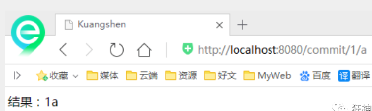
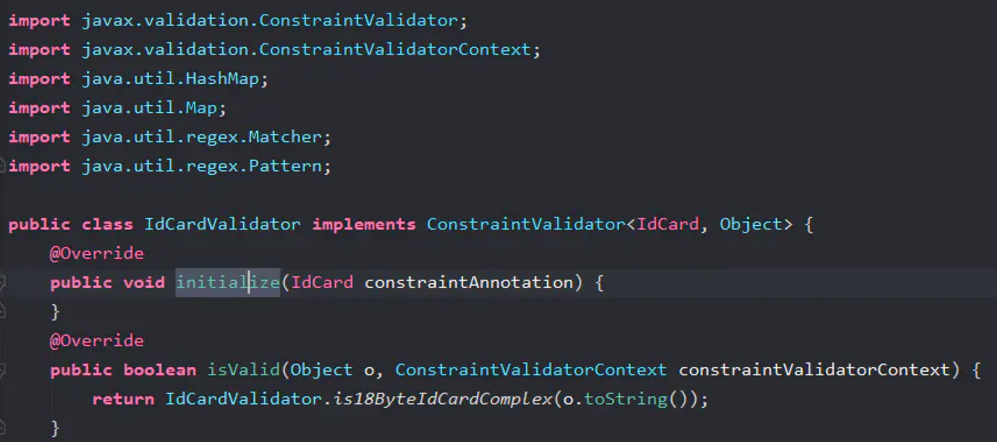

# 一、什么是SpringMVC

## 1. 回顾MVC

### 1.1. 背景

我们不得不提之前 Model1 和 Model2 这两个没有 Spring MVC 的时代。

- Model1 时代 : 很多学 Java 后端比较晚的朋友可能并没有接触过  Model1 模式下的 JavaWeb 应用开发。在 Model1 模式下，整个 Web 应用几乎全部用 JSP 页面组成，只用少量的 JavaBean 来处理数据库连接、访问等操作。这个模式下 JSP 既是控制层又是表现层。显而易见，这种模式存在很多问题。比如将控制逻辑和表现逻辑混杂在一起，导致代码重用率极低；前端和后端相互依赖，难以进行测试并且开发效率极低；
  - 
- Model2 时代 ：学过 Servlet 并做过相关 Demo 的朋友应该了解“Java Bean(Model)+ JSP（View）+Servlet（Controller）  ”这种开发模式,这就是早期的 JavaWeb MVC 开发模式。Model:系统涉及的数据，也就是 dao 和 bean。View：展示模型中的数据，只是用来展示。Controller：处理用户请求都发送给 ，返回数据给 JSP 并展示给用户。
  - 

Model2 模式下还存在很多问题，Model2的抽象和封装程度还远远不够，使用Model2进行开发时不可避免地会重复造轮子，这就大大降低了程序的可维护性和复用性。于是很多JavaWeb开发相关的 MVC 框架应运而生比如Struts2，但是 Struts2 比较笨重。随着 Spring 轻量级开发框架的流行，Spring 生态圈出现了 Spring MVC 框架， Spring MVC 是当前最优秀的 MVC 框架。相比于 Struts2 ， Spring MVC 使用更加简单和方便，开发效率更高，并且 Spring MVC 运行速度更快。

MVC 是一种设计模式,Spring MVC 是一款很优秀的 MVC 框架。Spring MVC 可以帮助我们进行更简洁的Web层的开发，并且它天生与 Spring 框架集成。Spring MVC 下我们一般把后端项目分为 Service层（处理业务）、Dao层（数据库操作）、Entity层（实体类）、Controller层(控制层，返回数据给前台页面)。

Spring MVC 的简单原理图如下：


### 1.2. 什么是MVC

MVC是模型(Model)、视图(View)、控制器(Controller)的简写，是一种软件设计规范。

- 是将业务逻辑、数据、显示分离的方法来组织代码。
- MVC主要作用是降低了视图与业务逻辑间的双向偶合。
- MVC不是一种设计模式，MVC是一种架构模式。当然不同的MVC存在差异。

Model（模型）：数据模型，提供要展示的数据，因此包含数据和行为，可以认为是领域模型或JavaBean组件（包含数据和行为），不过现在一般都分离开来：Value Object（数据Dao） 和 服务层（行为Service）。也就是模型提供了模型数据查询和模型数据的状态更新等功能，包括数据和业务。

View（视图）：负责进行模型的展示，一般就是我们见到的用户界面，客户想看到的东西。

Controller（控制器）：接收用户请求，委托给模型进行处理（状态改变），处理完毕后把返回的模型数据返回给视图，由视图负责展示。也就是说控制器做了个调度员的工作。

最典型的MVC就是JSP + servlet + javabean的模式。


## 2. 什么是SpringMVC

### 2.1. 概述

Spring MVC是Spring Framework的一部分，是基于Java实现MVC的轻量级Web框架。

查看官方文档：https://docs.spring.io/spring/docs/5.2.0.RELEASE/spring-framework-reference/web.html#spring-web

我们为什么要学习SpringMVC呢?

 Spring MVC的特点：

1. 轻量级，简单易学
2. 高效 , 基于请求响应的MVC框架
3. 与Spring兼容性好，无缝结合
4. 约定优于配置
5. 功能强大：RESTful、数据验证、格式化、本地化、主题等
6. 简洁灵活

Spring的web框架围绕DispatcherServlet [ 调度Servlet ] 设计。

DispatcherServlet的作用是将请求分发到不同的处理器。从Spring 2.5开始，使用Java 5或者以上版本的用户可以采用基于注解形式进行开发，十分简洁；

正因为SpringMVC好 , 简单 , 便捷 , 易学 , 天生和Spring无缝集成(使用SpringIoC和Aop) , 使用约定优于配置 . 能够进行简单的junit测试 . 支持Restful风格 .异常处理 , 本地化 , 国际化 , 数据验证 , 类型转换 , 拦截器 等等......所以我们要学习 .

最重要的一点还是用的人多 , 使用的公司多 . 

### 2.2. 中心控制器

Spring的web框架围绕DispatcherServlet设计。DispatcherServlet的作用是将请求分发到不同的处理器。从Spring 2.5开始，使用Java 5或者以上版本的用户可以采用基于注解的controller声明方式。

Spring MVC框架像许多其他MVC框架一样, 以请求为驱动 , 围绕一个中心Servlet分派请求及提供其他功能，DispatcherServlet是一个实际的Servlet (它继承自HttpServlet 基类)。


SpringMVC的原理如下图所示：

​	当发起请求时被前置的控制器拦截到请求，根据请求参数生成代理请求，找到请求对应的实际控制器，控制器处理请求，创建数据模型，访问数据库，将模型响应给中心控制器，控制器使用模型与视图渲染视图结果，将结果返回给中心控制器，再将结果返回给请求者。


### 2.3. SpringMVC 工作原理

原理如下图所示：


上图的一个笔误的小问题：Spring MVC 的入口函数也就是前端控制器 `DispatcherServlet` 的作用是接收请求，响应结果。

流程说明（重要）：

1. 客户端（浏览器）发送请求，直接请求到 `DispatcherServlet`。
2. `DispatcherServlet` 根据请求信息调用 `HandlerMapping`，解析请求对应的 `Handler`。
3. 解析到对应的 `Handler`（也就是我们平常说的 `Controller` 控制器）后，开始由 `HandlerAdapter` 适配器处理。
4. `HandlerAdapter` 会根据 `Handler `来调用真正的处理器来处理请求，并处理相应的业务逻辑。
5. 处理器处理完业务后，会返回一个 `ModelAndView` 对象，`Model` 是返回的数据对象，`View` 是个逻辑上的 `View`。
6. `ViewResolver` 会根据逻辑 `View` 查找实际的 `View`。
7. `DispaterServlet` 把返回的 `Model` 传给 `View`（视图渲染）。
8. 把 `View` 返回给请求者（浏览器）

### 2.4. spring MVC中的适配器模式

配器模式(Adapter Pattern) 将一个接口转换成客户希望的另一个接口，适配器模式使接口不兼容的那些类可以一起工作，其别名为包装器(Wrapper)。

在Spring MVC中，`DispatcherServlet` 根据请求信息调用 `HandlerMapping`，解析请求对应的 `Handler`。解析到对应的 `Handler`（也就是我们平常说的 `Controller` 控制器）后，开始由`HandlerAdapter` 适配器处理。`HandlerAdapter` 作为期望接口，具体的适配器实现类用于对目标类进行适配，`Controller` 作为需要适配的类。

为什么要在 Spring MVC 中使用适配器模式？ Spring MVC 中的 Controller 种类众多，不同类型的 `Controller` 通过<u>不同的方法</u>来对请求进行处理。如果不利用适配器模式的话，`DispatcherServlet` 直接获取对应类型的 `Controller`，需要的自行来判断，像下面这段代码一样：


```java
if(mappedHandler.getHandler() instanceof MultiActionController){  
   ((MultiActionController)mappedHandler.getHandler()).xxx  
}else if(mappedHandler.getHandler() instanceof XXX){  
    ...  
}else if(...){  
   ...  
}
```

假如我们再增加一个 Controller 类型就要在上面代码中再加入一行 判断语句，这种形式就使得程序难以维护，也违反了设计模式中的开闭原则 – 对扩展开放，对修改关闭


# 二、第一个SpringMVC程序

现在我们来看看如何快速使用SpringMVC编写我们的程序吧！

## 1. 配置版

1、新建一个Moudle， springmvc-02-hello， 添加web的支持！

2、确定导入了SpringMVC的依赖！

3、配置web.xml， 注册DispatcherServlet

```xml
<?xml version="1.0" encoding="UTF-8"?>
<web-app xmlns="http://xmlns.jcp.org/xml/ns/javaee"
        xmlns:xsi="http://www.w3.org/2001/XMLSchema-instance"
        xsi:schemaLocation="http://xmlns.jcp.org/xml/ns/javaee http://xmlns.jcp.org/xml/ns/javaee/web-app_4_0.xsd"
        version="4.0">

   <!--1.注册DispatcherServlet-->
   <servlet>
       <servlet-name>springmvc</servlet-name>
       <servlet-class>org.springframework.web.servlet.DispatcherServlet</servlet-class>
       <!--关联一个springmvc的配置文件:【servlet-name】-servlet.xml-->
       <init-param>
           <param-name>contextConfigLocation</param-name>
           <param-value>classpath:springmvc-servlet.xml</param-value>
       </init-param>
       <!--启动级别-1-->
       <load-on-startup>1</load-on-startup>
   </servlet>

   <!--/ 匹配所有的请求；（不包括.jsp）-->
   <!--/* 匹配所有的请求；（包括.jsp）-->
   <servlet-mapping>
       <servlet-name>springmvc</servlet-name>
       <url-pattern>/</url-pattern>
   </servlet-mapping>

</web-app>
```

4、编写SpringMVC 的配置文件！名称：springmvc-servlet.xml: [servletname]-servlet.xml

说明，这里的名称要求是按照官方来的

```xml
<?xml version="1.0" encoding="UTF-8"?>
<beans xmlns="http://www.springframework.org/schema/beans"
      xmlns:xsi="http://www.w3.org/2001/XMLSchema-instance"
      xsi:schemaLocation="http://www.springframework.org/schema/beans
       http://www.springframework.org/schema/beans/spring-beans.xsd">

</beans>
```

- 添加 处理映射器


```xml
<bean class="org.springframework.web.servlet.handler.BeanNameUrlHandlerMapping"/>
```

- 6、添加 处理器适配器

```xml
<bean class="org.springframework.web.servlet.mvc.SimpleControllerHandlerAdapter"/>
```

- 添加 视图解析器


```xml
<!--视图解析器:DispatcherServlet给他的ModelAndView-->
<bean class="org.springframework.web.servlet.view.InternalResourceViewResolver" id="InternalResourceViewResolver">
   <!--前缀-->
   <property name="prefix" value="/WEB-INF/jsp/"/>
   <!--后缀-->
   <property name="suffix" value=".jsp"/>
</bean>
```

5、编写我们要操作业务Controller ，要么实现Controller接口，要么增加注解；需要返回一个ModelAndView，装数据，封视图；

```java
package com.kuang.controller;

import org.springframework.web.servlet.ModelAndView;
import org.springframework.web.servlet.mvc.Controller;

import javax.servlet.http.HttpServletRequest;
import javax.servlet.http.HttpServletResponse;

//注意：这里我们先导入Controller接口
public class HelloController implements Controller {

   public ModelAndView handleRequest(HttpServletRequest request, HttpServletResponse response) throws Exception {
       //ModelAndView 模型和视图
       ModelAndView mv = new ModelAndView();

       //封装对象，放在ModelAndView中。Model
       mv.addObject("msg","HelloSpringMVC!");
       //封装要跳转的视图，放在ModelAndView中
       mv.setViewName("hello"); //: /WEB-INF/jsp/hello.jsp
       return mv;
  }
   
}
```

6、将自己的类交给SpringIOC容器，注册bean

```xml
<!--Handler-->
<bean id="/hello" class="com.kuang.controller.HelloController"/>
```

7、写要跳转的jsp页面，显示ModelandView存放的数据，以及我们的正常页面；

```jsp
<%@ page contentType="text/html;charset=UTF-8" language="java" %>
<html>
<head>
   <title>Kuangshen</title>
</head>
<body>
${msg}
</body>
</html>
```

8、配置Tomcat 启动测试！


可能遇到的问题：访问出现404，排查步骤：

1. 查看控制台输出，看一下是不是缺少了什么jar包。
2. 如果jar包存在，显示无法输出，就在IDEA的项目发布中，添加lib依赖！
3. 重启Tomcat 即可解决！

小结：看这个估计大部分同学都能理解其中的原理了，但是我们实际开发才不会这么写，不然就疯了，还学这个玩意干嘛！我们来看个注解版实现，这才是SpringMVC的精髓，到底有多么简单，看这个图就知道了。

## 2. 注解版

1、新建一个Moudle，springmvc-03-hello-annotation 。添加web支持！

2、由于Maven可能存在资源过滤的问题，我们将配置完善

```xml
<build>
   <resources>
       <resource>
           <directory>src/main/java</directory>
           <includes>
               <include>**/*.properties</include>
               <include>**/*.xml</include>
           </includes>
           <filtering>false</filtering>
       </resource>
       <resource>
           <directory>src/main/resources</directory>
           <includes>
               <include>**/*.properties</include>
               <include>**/*.xml</include>
           </includes>
           <filtering>false</filtering>
       </resource>
   </resources>
</build>
```

3、在pom.xml文件引入相关的依赖：主要有Spring框架核心库、Spring MVC、servlet , JSTL等。我们在父依赖中已经引入了！

4、配置web.xml

```xml
<?xml version="1.0" encoding="UTF-8"?>
<web-app xmlns="http://xmlns.jcp.org/xml/ns/javaee"
        xmlns:xsi="http://www.w3.org/2001/XMLSchema-instance"
        xsi:schemaLocation="http://xmlns.jcp.org/xml/ns/javaee http://xmlns.jcp.org/xml/ns/javaee/web-app_4_0.xsd"
        version="4.0">

   <!--1.注册servlet-->
   <servlet>
       <servlet-name>SpringMVC</servlet-name>
       <servlet-class>org.springframework.web.servlet.DispatcherServlet</servlet-class>
       <!--通过初始化参数指定SpringMVC配置文件的位置，进行关联-->
       <init-param>
           <param-name>contextConfigLocation</param-name>
           <param-value>classpath:springmvc-servlet.xml</param-value>
       </init-param>
       <!-- 启动顺序，数字越小，启动越早 -->
       <load-on-startup>1</load-on-startup>
   </servlet>

   <!--所有请求都会被springmvc拦截 -->
   <servlet-mapping>
       <servlet-name>SpringMVC</servlet-name>
       <url-pattern>/</url-pattern>
   </servlet-mapping>

</web-app>
```

注意点：

- 注意web.xml版本问题，要最新版！
- 注册DispatcherServlet
- 关联SpringMVC的配置文件
- 启动级别为1
- 映射路径为 / 【不要用/*，会404】
  - / 和 /\* 的区别：
    - `< url-pattern > / </ url-pattern >` 不会匹配到.jsp， 只针对我们编写的请求；即：.jsp 不会进入spring的 DispatcherServlet类 。
    - `< url-pattern > /* </ url-pattern >` 会匹配 *.jsp，会出现返回 jsp视图 时再次进入spring的DispatcherServlet 类，导致找不到对应的controller所以报404错。

5、添加Spring MVC配置文件

- 在resource目录下添加springmvc-servlet.xml配置文件，配置的形式与Spring容器配置基本类似，为了支持基于注解的IOC，设置了自动扫描包的功能，具体配置信息如下：

```xml
<?xml version="1.0" encoding="UTF-8"?>
<beans xmlns="http://www.springframework.org/schema/beans"
      xmlns:xsi="http://www.w3.org/2001/XMLSchema-instance"
      xmlns:context="http://www.springframework.org/schema/context"
      xmlns:mvc="http://www.springframework.org/schema/mvc"
      xsi:schemaLocation="http://www.springframework.org/schema/beans
       http://www.springframework.org/schema/beans/spring-beans.xsd
       http://www.springframework.org/schema/context
       https://www.springframework.org/schema/context/spring-context.xsd
       http://www.springframework.org/schema/mvc
       https://www.springframework.org/schema/mvc/spring-mvc.xsd">

   <!-- 自动扫描包，让指定包下的注解生效,由IOC容器统一管理 -->
   <context:component-scan base-package="com.kuang.controller"/>
   <!-- 让Spring MVC不处理静态资源 -->
   <mvc:default-servlet-handler />
   <!--
   支持mvc注解驱动
       在spring中一般采用@RequestMapping注解来完成映射关系
       要想使@RequestMapping注解生效
       必须向上下文中注册DefaultAnnotationHandlerMapping
       和一个AnnotationMethodHandlerAdapter实例
       这两个实例分别在类级别和方法级别处理。
       而annotation-driven配置帮助我们自动完成上述两个实例的注入。
    -->
   <mvc:annotation-driven />

   <!-- 视图解析器 -->
   <bean class="org.springframework.web.servlet.view.InternalResourceViewResolver"
         id="internalResourceViewResolver">
       <!-- 前缀 -->
       <property name="prefix" value="/WEB-INF/jsp/" />
       <!-- 后缀 -->
       <property name="suffix" value=".jsp" />
   </bean>

</beans>
```

- 让IOC的注解生效
- 静态资源过滤 ：HTML . JS . CSS . 图片 ， 视频 .....
- MVC的注解驱动
- 配置视图解析器
  - 在视图解析器中我们把所有的视图都存放在/WEB-INF/目录下，这样可以保证视图安全，因为这个目录下的文件，客户端不能直接访问。


6、创建Controller

编写一个Java控制类：com.kuang.controller.HelloController , 注意编码规范

```java
package com.kuang.controller;

import org.springframework.stereotype.Controller;
import org.springframework.ui.Model;
import org.springframework.web.bind.annotation.RequestMapping;

@Controller
@RequestMapping("/HelloController")
public class HelloController {

   //真实访问地址 : 项目名/HelloController/hello
   @RequestMapping("/hello")
   public String sayHello(Model model){
       //向模型中添加属性msg与值，可以在JSP页面中取出并渲染
       model.addAttribute("msg","hello,SpringMVC");
       //web-inf/jsp/hello.jsp
       return "hello";
  }
}
```

- 
  @Controller是为了让Spring IOC容器初始化时自动扫描到；
- @RequestMapping是为了映射请求路径，这里因为类与方法上都有映射所以访问时应该是/HelloController/hello；

- 方法中声明Model类型的参数是为了把Action中的数据带到视图中；

- 方法返回的结果是视图的名称hello，加上配置文件中的前后缀变成WEB-INF/jsp/hello.jsp。


7、创建视图层

在WEB-INF/jsp目录中创建hello.jsp ， 视图可以直接取出并展示从Controller带回的信息；

可以通过EL表示取出Model中存放的值，或者对象；

```jsp
<%@ page contentType="text/html;charset=UTF-8" language="java" %>
<html>

<head>
   <title>SpringMVC</title>
</head>

<body>
${msg}
</body>
</html>
```

8、配置Tomcat运行

配置Tomcat ，开启服务器 ， 访问 对应的请求路径！


9、小结

实现步骤其实非常的简单

- 新建一个web项目

- 导入相关jar包

- 编写web.xml , 注册DispatcherServlet

- 编写springmvc配置文件

- 接下来就是去创建对应的控制类 , controller

- 最后完善前端视图和controller之间的对应

- 测试运行调试.

10、使用springMVC必须配置的三大件：

- 处理器映射器、处理器适配器、视图解析器


- 通常，我们只需要手动配置视图解析器，而处理器映射器和处理器适配器只需要开启注解驱动即可，从而省去了大段的xml配置


# 三、RestFul和控制器

## 1. 控制器Controller

什么是控制器Controller

- 控制器复杂提供访问应用程序的行为，通常通过接口定义或注解定义两种方法实现。
- 控制器负责解析用户的请求并将其转换为一个模型。
- 在Spring MVC中一个控制器类可以包含多个方法
- 在Spring MVC中，对于Controller的配置方式有很多种

### 1.1. 实现Controller接口

Controller是一个接口，在org.springframework.web.servlet.mvc包下，接口中只有一个方法；

```java
//实现该接口的类获得控制器功能
public interface Controller {
   //处理请求且返回一个模型与视图对象
   ModelAndView handleRequest(HttpServletRequest var1, HttpServletResponse var2) throws Exception;
}
```

测试

1. 新建一个Moudle，springmvc-04-controller 。将刚才的03 拷贝一份, 我们进行操作！

2. - 删掉HelloController
   - mvc的配置文件只留下 视图解析器！

3. 编写一个Controller类，ControllerTest1

   ```java
   //定义控制器
   //注意点：不要导错包，实现Controller接口，重写方法；
   public class ControllerTest1 implements Controller {
   
      public ModelAndView handleRequest(HttpServletRequest httpServletRequest, HttpServletResponse httpServletResponse) throws Exception {
          //返回一个模型视图对象
          ModelAndView mv = new ModelAndView();
          mv.addObject("msg","Test1Controller");
          mv.setViewName("test");
          return mv;
     }
   }
   ```

4. 编写完毕后，去Spring配置文件中注册请求的bean；name对应请求路径，class对应处理请求的类

   ```xml
   <bean name="/t1" class="com.kuang.controller.ControllerTest1"/>
   ```

5. 编写前端test.jsp，注意在WEB-INF/jsp目录下编写，对应我们的视图解析器

   ```xml
   <%@ page contentType="text/html;charset=UTF-8" language="java" %>
   <html>
   <head>
      <title>Kuangshen</title>
   </head>
   <body>
   ${msg}
   </body>
   </html>
   ```

6. 配置Tomcat运行测试，我这里没有项目发布名配置的就是一个 / ，所以请求不用加项目名，OK！

   

说明：

- 实现接口Controller定义控制器是较老的办法
- 缺点是：一个控制器中只有一个方法，如果要多个方法则需要定义多个Controller；定义的方式比较麻烦；

### 1.2. 使用注解 @Controller

@Controller注解类型用于声明Spring类的实例是一个控制器（在讲IOC时还提到了另外3个注解）；

- Spring可以使用扫描机制来找到应用程序中所有基于注解的控制器类，为了保证Spring能找到你的控制器，需要在配置文件中声明组件扫描。

  ```xml
  <!-- 自动扫描指定的包，下面所有注解类交给IOC容器管理 -->
  <context:component-scan base-package="com.kuang.controller"/>
  ```

- 增加一个ControllerTest2类，使用注解实现；

  ```java
  //@Controller注解的类会自动添加到Spring上下文中
  @Controller
  public class ControllerTest2{
  
     //映射访问路径
     @RequestMapping("/t2")
     public String index(Model model){
         //Spring MVC会自动实例化一个Model对象用于向视图中传值
         model.addAttribute("msg", "ControllerTest2");
         //返回视图位置
         return "test";
    }
  
  }
  ```

- 运行tomcat测试

  

  

可以发现，我们的两个请求都可以指向一个视图，但是页面结果的结果是不一样的，从这里可以看出视图是被复用的，而控制器与视图之间是弱偶合关系。

注解方式是平时使用的最多的方式！

## 2. RequestMapping

@RequestMapping

- @RequestMapping注解用于映射url到控制器类或一个特定的处理程序方法。可用于类或方法上。用于类上，表示类中的所有响应请求的方法都是以该地址作为父路径。

- 只注解在方法上面

  ```java
  //访问路径：http://localhost:8080/项目名/h1
  @Controller
  public class TestController {
     @RequestMapping("/h1")
     public String test(){
         return "test";
    }
  }
```
  
- 同时注解类与方法

  - 需要先指定类的路径再指定方法的路径；
  
  ```java
  //访问路径：http://localhost:8080 / 项目名/ admin /h1
  @Controller
  @RequestMapping("/admin")
  public class TestController {
     @RequestMapping("/h1")
     public String test(){
         return "test";
  }
  }
  ```
  

## 3. RestFul 风格

1、概念

Restful就是一个资源定位及资源操作的风格。不是标准也不是协议，只是一种风格。基于这个风格设计的软件可以更简洁，更有层次，更易于实现缓存等机制。

2、功能

资源：互联网所有的事物都可以被抽象为资源

资源操作：使用POST、DELETE、PUT、GET，使用不同方法对资源进行操作。

分别对应：添加、 删除、修改、查询。

- 传统方式操作资源  ：通过不同的参数来实现不同的效果！方法单一，post 和 get
  - http://127.0.0.1/item/queryItem.action?id=1 查询,GET
  - http://127.0.0.1/item/saveItem.action 新增,POST
  - http://127.0.0.1/item/updateItem.action 更新,POST
  - http://127.0.0.1/item/deleteItem.action?id=1 删除,GET或POST

- 使用RESTful操作资源 ：可以通过不同的请求方式来实现不同的效果！如下：请求地址一样，但是功能可以不同！
  - http://127.0.0.1/item/1 查询,GET
  - http://127.0.0.1/item 新增,POST
  - http://127.0.0.1/item 更新,PUT
  - http://127.0.0.1/item/1 删除,DELETE

3、学习测试

1. 在新建一个类 RestFulController

   ```java
   @Controller
   public class RestFulController {
   }
   ```

2. 在Spring MVC中可以使用  @PathVariable 注解，让方法参数的值对应绑定到一个URI模板变量上。

   ```java
   @Controller
   public class RestFulController {
   
      //映射访问路径
      @RequestMapping("/commit/{p1}/{p2}")
      public String index(@PathVariable int p1, @PathVariable int p2, Model model){
          
          int result = p1+p2;
          //Spring MVC会自动实例化一个Model对象用于向视图中传值
          model.addAttribute("msg", "结果："+result);
          //返回视图位置
          return "test";
          
     }
      
   }
   ```

3. 我们来测试请求查看下

   

4. 思考：使用路径变量的好处？

   1. 使路径变得更加简洁；
   2. 获得参数更加方便，框架会自动进行类型转换。
   3. 通过路径变量的类型可以约束访问参数，如果类型不一样，则访问不到对应的请求方法，如这里访问是的路径是/commit/1/a，则路径与方法不匹配，而不会是参数转换失败。


我们来修改下对应的参数类型，再次测试

```java
//映射访问路径
@RequestMapping("/commit/{p1}/{p2}")
public String index(@PathVariable int p1, @PathVariable String p2, Model model){

   String result = p1+p2;
   //Spring MVC会自动实例化一个Model对象用于向视图中传值
   model.addAttribute("msg", "结果："+result);
   //返回视图位置
   return "test";

}
```



5. 使用method属性指定请求类型

用于约束请求的类型，可以收窄请求范围。指定请求谓词的类型如GET, POST, HEAD, OPTIONS, PUT, PATCH, DELETE, TRACE等

我们来测试一下：

- 增加一个方法

  ```java
  //映射访问路径,必须是POST请求
  @RequestMapping(value = "/hello",method = {RequestMethod.POST})
  public String index2(Model model){
     model.addAttribute("msg", "hello!");
     return "test";
  }
  ```

- 我们使用浏览器地址栏进行访问默认是Get请求，会报错405：

  

- 如果将POST修改为GET则正常了；

  ```java
  //映射访问路径,必须是Get请求
  @RequestMapping(value = "/hello",method = {RequestMethod.GET})
  public String index2(Model model){
     model.addAttribute("msg", "hello!");
     return "test";
  }
  ```

  

4、小结：

Spring MVC 的 @RequestMapping 注解能够处理 HTTP 请求的方法, 比如 GET, PUT, POST, DELETE 以及 PATCH。

所有的地址栏请求默认都会是 HTTP GET 类型的。

方法级别的注解变体有如下几个：组合注解

```java
@GetMapping
@PostMapping
@PutMapping
@DeleteMapping
@PatchMapping
```

@GetMapping 是一个组合注解，平时使用的会比较多！它所扮演的是 @RequestMapping(method =RequestMethod.GET) 的一个快捷方式。

## 4. 处理常见的 HTTP 请求类型

5 种常见的请求类型:

- `GET` ：请求从服务器获取特定资源。举个例子：`GET /users`（获取所有学生）
- `POST` ：在服务器上创建一个新的资源。举个例子：`POST /users`（创建学生）
- `PUT` ：更新服务器上的资源（客户端提供更新后的整个资源）。举个例子：`PUT /users/12`（更新编号为 12 的学生）
- `DELETE` ：从服务器删除特定的资源。举个例子：`DELETE /users/12`（删除编号为 12 的学生）
- `PATCH` ：更新服务器上的资源（客户端提供更改的属性，可以看做作是部分更新），使用的比较少，这里就不举例子了。

1、GET请求

`@GetMapping("users")` 等价于`@RequestMapping(value="/users",method=RequestMethod.GET)`

```java
@GetMapping("/users")
public ResponseEntity<List<User>> getAllUsers() {
 return userRepository.findAll();
}
```

2、POST请求

`@PostMapping("users")` 等价于`@RequestMapping(value="/users",method=RequestMethod.POST)`

关于`@RequestBody`注解的使用，在下面的“前后端传值”这块会讲到。

```java
@PostMapping("/users")
public ResponseEntity<User> createUser(@Valid @RequestBody UserCreateRequest userCreateRequest) {
 return userRespository.save(user);
}
```

3、PUT请求

`@PutMapping("/users/{userId}")` 等价于`@RequestMapping(value="/users/{userId}",method=RequestMethod.PUT)`

```java
@PutMapping("/users/{userId}")
public ResponseEntity<User> updateUser(@PathVariable(value = "userId") Long userId,
  @Valid @RequestBody UserUpdateRequest userUpdateRequest) {
  ......
}
```

4、DELETE请求

`@DeleteMapping("/users/{userId}")`等价于`@RequestMapping(value="/users/{userId}",method=RequestMethod.DELETE)`

```java
@DeleteMapping("/users/{userId}")
public ResponseEntity deleteUser(@PathVariable(value = "userId") Long userId){
  ......
}
```

5、PATCH 请求

一般实际项目中，我们都是 PUT 不够用了之后才用 PATCH 请求去更新数据。

```java
  @PatchMapping("/profile")
public ResponseEntity updateStudent(@RequestBody StudentUpdateRequest studentUpdateRequest) {
    studentRepository.updateDetail(studentUpdateRequest);
    return ResponseEntity.ok().build();
}
```

## 5. @RestController vs @Controller

`Controller` 返回一个页面

单独使用 `@Controller` 不加 `@ResponseBody`的话一般使用在要返回一个视图的情况，这种情况属于比较传统的Spring MVC 的应用，对应于前后端不分离的情况。


`@RestController` 返回JSON 或 XML 形式数据

但`@RestController`只返回对象，对象数据直接以 JSON 或 XML 形式写入 HTTP 响应(Response)中，这种情况属于 RESTful Web服务，这也是目前日常开发所接触的最常用的情况（前后端分离）。


`@Controller +@ResponseBody` 返回JSON 或 XML 形式数据

如果你需要在Spring4之前开发 RESTful Web服务的话，你需要使用`@Controller` 并结合`@ResponseBody`注解，也就是说`@Controller` +`@ResponseBody`= `@RestController`（Spring 4 之后新加的注解）。

> `@ResponseBody` 注解的作用是将 `Controller` 的方法返回的对象通过适当的转换器转换为指定的格式之后，写入到HTTP 响应(Response)对象的 body 中，通常用来返回 JSON 或者 XML 数据，返回 JSON 数据的情况比较多。


# 四、数据处理及跳转

## 1. 结果跳转方式

### 1.1. ModelAndView

设置ModelAndView对象 , 根据view的名称, 和视图解析器跳到指定的页面 .

页面 : {视图解析器前缀} + viewName +{视图解析器后缀}

```xml
<!-- 视图解析器 -->
<bean class="org.springframework.web.servlet.view.InternalResourceViewResolver"
     id="internalResourceViewResolver">
   <!-- 前缀 -->
   <property name="prefix" value="/WEB-INF/jsp/" />
   <!-- 后缀 -->
   <property name="suffix" value=".jsp" />
</bean>
```

对应的controller类

```java
public class ControllerTest1 implements Controller {

   public ModelAndView handleRequest(HttpServletRequest httpServletRequest, HttpServletResponse httpServletResponse) throws Exception {
       //返回一个模型视图对象
       ModelAndView mv = new ModelAndView();
       mv.addObject("msg","ControllerTest1");
       mv.setViewName("test");
       return mv;
  }
}
```

### 1.2. ServletAPI

通过设置ServletAPI , 不需要视图解析器 .

1、通过HttpServletResponse进行输出

2、通过HttpServletResponse实现重定向

3、通过HttpServletResponse实现转发

```java
@Controller
public class ResultGo {

   @RequestMapping("/result/t1")
   public void test1(HttpServletRequest req, HttpServletResponse rsp) throws IOException {
       rsp.getWriter().println("Hello,Spring BY servlet API");
  }

   @RequestMapping("/result/t2")
   public void test2(HttpServletRequest req, HttpServletResponse rsp) throws IOException {
       rsp.sendRedirect("/index.jsp");
  }

   @RequestMapping("/result/t3")
   public void test3(HttpServletRequest req, HttpServletResponse rsp) throws Exception {
       //转发
       req.setAttribute("msg","/result/t3");
       req.getRequestDispatcher("/WEB-INF/jsp/test.jsp").forward(req,rsp);
  }

}
```

### 1.3. SpringMVC

1、通过SpringMVC来实现转发和重定向 - 无需视图解析器；

- 测试前，需要将视图解析器注释掉


```java
@Controller
public class ResultSpringMVC {
   @RequestMapping("/rsm/t1")
   public String test1(){
       //转发
       return "/index.jsp";
  }

   @RequestMapping("/rsm/t2")
   public String test2(){
       //转发二
       return "forward:/index.jsp";
  }

   @RequestMapping("/rsm/t3")
   public String test3(){
       //重定向
       return "redirect:/index.jsp";
  }
}
```

2、通过SpringMVC来实现转发和重定向 - 有视图解析器；

- 重定向, 不需要视图解析器 , 本质就是重新请求一个新地方嘛 , 所以注意路径问题.

- 可以重定向到另外一个请求实现 .


```java
@Controller
public class ResultSpringMVC2 {
   @RequestMapping("/rsm2/t1")
   public String test1(){
       //转发
       return "test";
  }

   @RequestMapping("/rsm2/t2")
   public String test2(){
       //重定向
       return "redirect:/index.jsp";
       //return "redirect:hello.do"; //hello.do为另一个请求/
  }

}
```

## 2. 数据处理

### 2.1. 处理提交数据

1、提交的域名称和处理方法的参数名一致

提交数据 : http://localhost:8080/hello?name=kuangshen

处理方法 :

```java
@RequestMapping("/hello")
public String hello(String name){
   System.out.println(name);
   return "hello";
}
```

后台输出 : kuangshen


2、提交的域名称和处理方法的参数名不一致

提交数据 : http://localhost:8080/hello?username=kuangshen

处理方法 :

```java
//@RequestParam("username") : username提交的域的名称 .
@RequestMapping("/hello")
public String hello(@RequestParam("username") String name){
   System.out.println(name);
   return "hello";
}
```

后台输出 : kuangshen


3、提交的是一个对象

要求提交的表单域和对象的属性名一致, 参数使用对象即可

1、实体类

```java
public class User {
   private int id;
   private String name;
   private int age;
   //构造
   //get/set
   //tostring()
}
```

2、提交数据 : http://localhost:8080/mvc04/user?name=kuangshen&id=1&age=15

3、处理方法 :

```java
@RequestMapping("/user")
public String user(User user){
   System.out.println(user);
   return "hello";
}
```

后台输出 : User { id=1, name='kuangshen', age=15 }

说明：如果使用对象的话，前端传递的参数名和对象名必须一致，否则就是null。

### 2.2. 数据显示到前端

1、第一种 : 通过ModelAndView

我们前面一直都是如此 . 就不过多解释

```java
public class ControllerTest1 implements Controller {

   public ModelAndView handleRequest(HttpServletRequest httpServletRequest, HttpServletResponse httpServletResponse) throws Exception {
       //返回一个模型视图对象
       ModelAndView mv = new ModelAndView();
       mv.addObject("msg","ControllerTest1");
       mv.setViewName("test");
       return mv;
  }
}
```


2、第二种 : 通过ModelMap

ModelMap

```java
@RequestMapping("/hello")
public String hello(@RequestParam("username") String name, ModelMap model){
   //封装要显示到视图中的数据
   //相当于req.setAttribute("name",name);
   model.addAttribute("name",name);
   System.out.println(name);
   return "hello";
}
```


3、第三种 : 通过Model

Model

```java
@RequestMapping("/ct2/hello")
public String hello(@RequestParam("username") String name, Model model){
   //封装要显示到视图中的数据
   //相当于req.setAttribute("name",name);
   model.addAttribute("msg",name);
   System.out.println(name);
   return "test";
}
```


4、对比：

就对于新手而言简单来说使用区别就是：

```
Model 只有寥寥几个方法只适合用于储存数据，简化了新手对于Model对象的操作和理解；

ModelMap 继承了 LinkedMap ，除了实现了自身的一些方法，同样的继承 LinkedMap 的方法和特性；

ModelAndView 可以在储存数据的同时，可以进行设置返回的逻辑视图，进行控制展示层的跳转。
```

当然更多的以后开发考虑的更多的是性能和优化，就不能单单仅限于此的了解。

### 2.3. 乱码问题

测试步骤：

1、我们可以在首页编写一个提交的表单

```html
<form action="/e/t" method="post">
 <input type="text" name="name">
 <input type="submit">
</form>
```

2、后台编写对应的处理类

```java
@Controller
public class Encoding {
   @RequestMapping("/e/t")
   public String test(Model model,String name){
       model.addAttribute("msg",name); //获取表单提交的值
       return "test"; //跳转到test页面显示输入的值
  }
}
```

3、输入中文测试，发现乱码


不得不说，乱码问题是在我们开发中十分常见的问题，也是让我们程序猿比较头大的问题！

以前乱码问题通过过滤器解决 , 而SpringMVC给我们提供了一个过滤器 , 可以在web.xml中配置 .

修改了xml文件需要重启服务器！

```xml
<filter>
   <filter-name>encoding</filter-name>
   <filter-class>org.springframework.web.filter.CharacterEncodingFilter</filter-class>
   <init-param>
       <param-name>encoding</param-name>
       <param-value>utf-8</param-value>
   </init-param>
</filter>
<filter-mapping>
   <filter-name>encoding</filter-name>
   <url-pattern>/*</url-pattern>
</filter-mapping>
```

但是我们发现, 有些极端情况下.这个过滤器对get的支持不好 .

处理方法 :

1、修改tomcat配置文件 ：设置编码！

```xml
<Connector URIEncoding="utf-8" port="8080" protocol="HTTP/1.1"
          connectionTimeout="20000"
          redirectPort="8443" />
```

2、自定义过滤器

```java
package com.kuang.filter;

import javax.servlet.*;
import javax.servlet.http.HttpServletRequest;
import javax.servlet.http.HttpServletRequestWrapper;
import javax.servlet.http.HttpServletResponse;
import java.io.IOException;
import java.io.UnsupportedEncodingException;
import java.util.Map;

/**
* 解决get和post请求 全部乱码的过滤器
*/
public class GenericEncodingFilter implements Filter {

   @Override
   public void destroy() {
  }

   @Override
   public void doFilter(ServletRequest request, ServletResponse response, FilterChain chain) throws IOException, ServletException {
       //处理response的字符编码
       HttpServletResponse myResponse=(HttpServletResponse) response;
       myResponse.setContentType("text/html;charset=UTF-8");

       // 转型为与协议相关对象
       HttpServletRequest httpServletRequest = (HttpServletRequest) request;
       // 对request包装增强
       HttpServletRequest myrequest = new MyRequest(httpServletRequest);
       chain.doFilter(myrequest, response);
  }

   @Override
   public void init(FilterConfig filterConfig) throws ServletException {
  }

}

//自定义request对象，HttpServletRequest的包装类
class MyRequest extends HttpServletRequestWrapper {

   private HttpServletRequest request;
   //是否编码的标记
   private boolean hasEncode;
   //定义一个可以传入HttpServletRequest对象的构造函数，以便对其进行装饰
   public MyRequest(HttpServletRequest request) {
       super(request);// super必须写
       this.request = request;
  }

   // 对需要增强方法 进行覆盖
   @Override
   public Map getParameterMap() {
       // 先获得请求方式
       String method = request.getMethod();
       if (method.equalsIgnoreCase("post")) {
           // post请求
           try {
               // 处理post乱码
               request.setCharacterEncoding("utf-8");
               return request.getParameterMap();
          } catch (UnsupportedEncodingException e) {
               e.printStackTrace();
          }
      } else if (method.equalsIgnoreCase("get")) {
           // get请求
           Map<String, String[]> parameterMap = request.getParameterMap();
           if (!hasEncode) { // 确保get手动编码逻辑只运行一次
               for (String parameterName : parameterMap.keySet()) {
                   String[] values = parameterMap.get(parameterName);
                   if (values != null) {
                       for (int i = 0; i < values.length; i++) {
                           try {
                               // 处理get乱码
                               values[i] = new String(values[i]
                                      .getBytes("ISO-8859-1"), "utf-8");
                          } catch (UnsupportedEncodingException e) {
                               e.printStackTrace();
                          }
                      }
                  }
              }
               hasEncode = true;
          }
           return parameterMap;
      }
       return super.getParameterMap();
  }

   //取一个值
   @Override
   public String getParameter(String name) {
       Map<String, String[]> parameterMap = getParameterMap();
       String[] values = parameterMap.get(name);
       if (values == null) {
           return null;
      }
       return values[0]; // 取回参数的第一个值
  }

   //取所有值
   @Override
   public String[] getParameterValues(String name) {
       Map<String, String[]> parameterMap = getParameterMap();
       String[] values = parameterMap.get(name);
       return values;
  }
}
```

这个也是我在网上找的一些大神写的，一般情况下，SpringMVC默认的乱码处理就已经能够很好的解决了！

然后在web.xml中配置这个过滤器即可！

乱码问题，需要平时多注意，在尽可能能设置编码的地方，都设置为统一编码 UTF-8！

## 3. 前后端传值

### 3.1. @PathVariable 和@RequestParam

`@PathVariable`用于获取路径参数，`@RequestParam`用于获取查询参数。

举个简单的例子：

```java
@GetMapping("/klasses/{klassId}/teachers")
public List<Teacher> getKlassRelatedTeachers(
         @PathVariable("klassId") Long klassId,
         @RequestParam(value = "type", required = false) String type ) {
...
}
```

如果我们请求的 url 是：`/klasses/{123456}/teachers?type=web`

那么我们服务获取到的数据就是：`klassId=123456,type=web`。

### 3.2. @RequestBody

用于读取 Request 请求（可能是 POST,PUT,DELETE,GET 请求）的 body 部分并且Content-Type 为 application/json 格式的数据，接收到数据之后会自动将数据绑定到 Java 对象上去。系统会使用`HttpMessageConverter`或者自定义的`HttpMessageConverter`将请求的 body 中的 json 字符串转换为 java 对象。

注意：java对象必须有getter和setter方法

我用一个简单的例子来给演示一下基本使用！

我们有一个注册的接口：

```java
@PostMapping("/sign-up")
public ResponseEntity signUp(@RequestBody @Valid UserRegisterRequest userRegisterRequest) {
  userService.save(userRegisterRequest);
  return ResponseEntity.ok().build();
}
```

`UserRegisterRequest`对象：

```java
@Data
@AllArgsConstructor
@NoArgsConstructor
public class UserRegisterRequest {
    @NotBlank
    private String userName;
    @NotBlank
    private String password;
    @NotBlank
    private String fullName;
}
```

我们发送 post 请求到这个接口，并且 body 携带 JSON 数据：

```json
{"userName":"coder","fullName":"shuangkou","password":"123456"}
```

这样我们的后端就可以直接把 json 格式的数据映射到我们的 `UserRegisterRequest` 类上。


需要注意的是：一个请求方法只可以有一个`@RequestBody`，但是可以有多个`@RequestParam`和`@PathVariable`。 如果你的方法必须要用两个 `@RequestBody`来接受数据的话，大概率是你的数据库设计或者系统设计出问题了！

## 4. Json交互处理

1、什么是JSON？

- JSON(JavaScript Object Notation, JS 对象标记) 是一种轻量级的数据交换格式，目前使用特别广泛。
- 采用完全独立于编程语言的文本格式来存储和表示数据。
- 简洁和清晰的层次结构使得 JSON 成为理想的数据交换语言。
- 易于人阅读和编写，同时也易于机器解析和生成，并有效地提升网络传输效率。

2、Controller返回JSON数据

Jackson应该是目前比较好的json解析工具了

当然工具不止这一个，比如还有阿里巴巴的 fastjson 等等。

我们这里使用Jackson，使用它需要导入它的jar包；

```xml
<!-- https://mvnrepository.com/artifact/com.fasterxml.jackson.core/jackson-core -->
<dependency>
   <groupId>com.fasterxml.jackson.core</groupId>
   <artifactId>jackson-databind</artifactId>
   <version>2.9.8</version>
</dependency>
```

配置SpringMVC需要的配置

web.xml:

```xml
<?xml version="1.0" encoding="UTF-8"?>
<web-app xmlns="http://xmlns.jcp.org/xml/ns/javaee"
        xmlns:xsi="http://www.w3.org/2001/XMLSchema-instance"
        xsi:schemaLocation="http://xmlns.jcp.org/xml/ns/javaee http://xmlns.jcp.org/xml/ns/javaee/web-app_4_0.xsd"
        version="4.0">

   <!--1.注册servlet-->
   <servlet>
       <servlet-name>SpringMVC</servlet-name>
       <servlet-class>org.springframework.web.servlet.DispatcherServlet</servlet-class>
       <!--通过初始化参数指定SpringMVC配置文件的位置，进行关联-->
       <init-param>
           <param-name>contextConfigLocation</param-name>
           <param-value>classpath:springmvc-servlet.xml</param-value>
       </init-param>
       <!-- 启动顺序，数字越小，启动越早 -->
       <load-on-startup>1</load-on-startup>
   </servlet>

   <!--所有请求都会被springmvc拦截 -->
   <servlet-mapping>
       <servlet-name>SpringMVC</servlet-name>
       <url-pattern>/</url-pattern>
   </servlet-mapping>

   <filter>
       <filter-name>encoding</filter-name>
       <filter-class>org.springframework.web.filter.CharacterEncodingFilter</filter-class>
       <init-param>
           <param-name>encoding</param-name>
           <param-value>utf-8</param-value>
       </init-param>
   </filter>
   <filter-mapping>
       <filter-name>encoding</filter-name>
       <url-pattern>/</url-pattern>
   </filter-mapping>

</web-app>
```

springmvc-servlet.xml:

```xml
<?xml version="1.0" encoding="UTF-8"?>
<beans xmlns="http://www.springframework.org/schema/beans"
      xmlns:xsi="http://www.w3.org/2001/XMLSchema-instance"
      xmlns:context="http://www.springframework.org/schema/context"
      xmlns:mvc="http://www.springframework.org/schema/mvc"
      xsi:schemaLocation="http://www.springframework.org/schema/beans
       http://www.springframework.org/schema/beans/spring-beans.xsd
       http://www.springframework.org/schema/context
       https://www.springframework.org/schema/context/spring-context.xsd
       http://www.springframework.org/schema/mvc
       https://www.springframework.org/schema/mvc/spring-mvc.xsd">

   <!-- 自动扫描指定的包，下面所有注解类交给IOC容器管理 -->
   <context:component-scan base-package="com.kuang.controller"/>

   <!-- 视图解析器 -->
   <bean class="org.springframework.web.servlet.view.InternalResourceViewResolver"
         id="internalResourceViewResolver">
       <!-- 前缀 -->
       <property name="prefix" value="/WEB-INF/jsp/" />
       <!-- 后缀 -->
       <property name="suffix" value=".jsp" />
   </bean>

</beans>
```

我们随便编写一个User的实体类，然后我们去编写我们的测试Controller；

```java
package com.kuang.pojo;

import lombok.AllArgsConstructor;
import lombok.Data;
import lombok.NoArgsConstructor;

//需要导入lombok
@Data
@AllArgsConstructor
@NoArgsConstructor
public class User {

   private String name;
   private int age;
   private String sex;
   
}
```

这里我们需要两个新东西，一个是@ResponseBody，一个是ObjectMapper对象，我们看下具体的用法

编写一个Controller；

```java
@Controller
public class UserController {

   @RequestMapping("/json1")
   @ResponseBody
   public String json1() throws JsonProcessingException {
       //创建一个jackson的对象映射器，用来解析数据
       ObjectMapper mapper = new ObjectMapper();
       //创建一个对象
       User user = new User("秦疆1号", 3, "男");
       //将我们的对象解析成为json格式
       String str = mapper.writeValueAsString(user);
       //由于@ResponseBody注解，这里会将str转成json格式返回；十分方便
       return str;
  }

}
```

配置Tomcat ， 启动测试一下！


发现出现了乱码问题，我们需要设置一下他的编码格式为utf-8，以及它返回的类型；

- 通过@RequestMaping的produces属性来实现，修改下代码


```java
//produces:指定响应体返回类型和编码
@RequestMapping(value = "/json1",produces = "application/json;charset=utf-8")
```

- 再次测试， http://localhost:8080/json1 ， 乱码问题OK！


【注意：使用json记得处理乱码问题】


3、代码优化

乱码统一解决

- 上一种方法比较麻烦，如果项目中有许多请求则每一个都要添加，可以通过Spring配置统一指定，这样就不用每次都去处理了！

- 我们可以在springmvc的配置文件上添加一段消息StringHttpMessageConverter转换配置！


```xml
<mvc:annotation-driven>
   <mvc:message-converters register-defaults="true">
       <bean class="org.springframework.http.converter.StringHttpMessageConverter">
           <constructor-arg value="UTF-8"/>
       </bean>
       <bean class="org.springframework.http.converter.json.MappingJackson2HttpMessageConverter">
           <property name="objectMapper">
               <bean class="org.springframework.http.converter.json.Jackson2ObjectMapperFactoryBean">
                   <property name="failOnEmptyBeans" value="false"/>
               </bean>
           </property>
       </bean>
   </mvc:message-converters>
</mvc:annotation-driven>
```

返回json字符串统一解决

- 在类上直接使用 @RestController ，这样子，里面所有的方法都只会返回 json 字符串了，不用再每一个都添加@ResponseBody ！我们在前后端分离开发中，一般都使用 @RestController ，十分便捷！


```java
@RestController
public class UserController {

   //produces:指定响应体返回类型和编码
   @RequestMapping(value = "/json1")
   public String json1() throws JsonProcessingException {
       //创建一个jackson的对象映射器，用来解析数据
       ObjectMapper mapper = new ObjectMapper();
       //创建一个对象
       User user = new User("秦疆1号", 3, "男");
       //将我们的对象解析成为json格式
       String str = mapper.writeValueAsString(user);
       //由于@ResponseBody注解，这里会将str转成json格式返回；十分方便
       return str;
  }

}
```

启动tomcat测试，结果都正常输出！


4、测试集合输出

增加一个新的方法

```java
@RequestMapping("/json2")
public String json2() throws JsonProcessingException {

   //创建一个jackson的对象映射器，用来解析数据
   ObjectMapper mapper = new ObjectMapper();
   //创建一个对象
   User user1 = new User("秦疆1号", 3, "男");
   User user2 = new User("秦疆2号", 3, "男");
   User user3 = new User("秦疆3号", 3, "男");
   User user4 = new User("秦疆4号", 3, "男");
   List<User> list = new ArrayList<User>();
   list.add(user1);
   list.add(user2);
   list.add(user3);
   list.add(user4);

   //将我们的对象解析成为json格式
   String str = mapper.writeValueAsString(list);
   return str;
}
```


5、输出时间对象

增加一个新的方法

```java
@RequestMapping("/json3")
public String json3() throws JsonProcessingException {

   ObjectMapper mapper = new ObjectMapper();

   //创建时间一个对象，java.util.Date
   Date date = new Date();
   //将我们的对象解析成为json格式
   String str = mapper.writeValueAsString(date);
   return str;
}
```

运行结果 :


- 默认日期格式会变成一个数字，是1970年1月1日到当前日期的毫秒数！
- Jackson 默认是会把时间转成timestamps形式

解决方案：取消timestamp形式， 自定义时间格式

```java
@RequestMapping("/json4")
public String json4() throws JsonProcessingException {

   ObjectMapper mapper = new ObjectMapper();

   //不使用时间戳的方式
   mapper.configure(SerializationFeature.WRITE_DATES_AS_TIMESTAMPS, false);
   //自定义日期格式对象
   SimpleDateFormat sdf = new SimpleDateFormat("yyyy-MM-dd HH:mm:ss");
   //指定日期格式
   mapper.setDateFormat(sdf);

   Date date = new Date();
   String str = mapper.writeValueAsString(date);

   return str;
}
```

运行结果 : 成功的输出了时间！


5、抽取为工具类

如果要经常使用的话，这样是比较麻烦的，我们可以将这些代码封装到一个工具类中；我们去编写下

```java
package com.kuang.utils;

import com.fasterxml.jackson.core.JsonProcessingException;
import com.fasterxml.jackson.databind.ObjectMapper;
import com.fasterxml.jackson.databind.SerializationFeature;

import java.text.SimpleDateFormat;

public class JsonUtils {
   
   public static String getJson(Object object) {
       return getJson(object,"yyyy-MM-dd HH:mm:ss");
  }

   public static String getJson(Object object,String dateFormat) {
       ObjectMapper mapper = new ObjectMapper();
       //不使用时间差的方式
       mapper.configure(SerializationFeature.WRITE_DATES_AS_TIMESTAMPS, false);
       //自定义日期格式对象
       SimpleDateFormat sdf = new SimpleDateFormat(dateFormat);
       //指定日期格式
       mapper.setDateFormat(sdf);
       try {
           return mapper.writeValueAsString(object);
      } catch (JsonProcessingException e) {
           e.printStackTrace();
      }
       return null;
  }
}
```

我们使用工具类，代码就更加简洁了！

```java
@RequestMapping("/json5")
public String json5() throws JsonProcessingException {
   Date date = new Date();
   String json = JsonUtils.getJson(date);
   return json;
}
```

大功告成！完美！


6、FastJson

fastjson.jar是阿里开发的一款专门用于Java开发的包，可以方便的实现json对象与JavaBean对象的转换，实现JavaBean对象与json字符串的转换，实现json对象与json字符串的转换。实现json的转换方法很多，最后的实现结果都是一样的。

fastjson 的 pom依赖！

```xml
<dependency>
   <groupId>com.alibaba</groupId>
   <artifactId>fastjson</artifactId>
   <version>1.2.60</version>
</dependency>
```

fastjson 三个主要的类：

JSONObject  代表 json 对象 

- JSONObject实现了Map接口, 猜想 JSONObject底层操作是由Map实现的。
- JSONObject对应json对象，通过各种形式的get()方法可以获取json对象中的数据，也可利用诸如size()，isEmpty()等方法获取"键：值"对的个数和判断是否为空。其本质是通过实现Map接口并调用接口中的方法完成的。

JSONArray  代表 json 对象数组

- 内部是有List接口中的方法来完成操作的。

JSON代表 JSONObject和JSONArray的转化

- JSON类源码分析与使用
- 仔细观察这些方法，主要是实现json对象，json对象数组，javabean对象，json字符串之间的相互转化。


代码测试，我们新建一个FastJsonDemo 类

```java
package com.kuang.controller;

import com.alibaba.fastjson.JSON;
import com.alibaba.fastjson.JSONObject;
import com.kuang.pojo.User;

import java.util.ArrayList;
import java.util.List;

public class FastJsonDemo {
   public static void main(String[] args) {
       //创建一个对象
       User user1 = new User("秦疆1号", 3, "男");
       User user2 = new User("秦疆2号", 3, "男");
       User user3 = new User("秦疆3号", 3, "男");
       User user4 = new User("秦疆4号", 3, "男");
       List<User> list = new ArrayList<User>();
       list.add(user1);
       list.add(user2);
       list.add(user3);
       list.add(user4);

       System.out.println("*******Java对象 转 JSON字符串*******");
       String str1 = JSON.toJSONString(list);
       System.out.println("JSON.toJSONString(list)==>"+str1);
       String str2 = JSON.toJSONString(user1);
       System.out.println("JSON.toJSONString(user1)==>"+str2);

       System.out.println("\n****** JSON字符串 转 Java对象*******");
       User jp_user1=JSON.parseObject(str2,User.class);
       System.out.println("JSON.parseObject(str2,User.class)==>"+jp_user1);

       System.out.println("\n****** Java对象 转 JSON对象 ******");
       JSONObject jsonObject1 = (JSONObject) JSON.toJSON(user2);
       System.out.println("(JSONObject) JSON.toJSON(user2)==>"+jsonObject1.getString("name"));

       System.out.println("\n****** JSON对象 转 Java对象 ******");
       User to_java_user = JSON.toJavaObject(jsonObject1, User.class);
       System.out.println("JSON.toJavaObject(jsonObject1, User.class)==>"+to_java_user);
  }
}
```

这种工具类，我们只需要掌握使用就好了，在使用的时候在根据具体的业务去找对应的实现。和以前的commons-io那种工具包一样，拿来用就好了！


# 五、拦截器+文件上传下载

## 1. 拦截器

1、概述

SpringMVC的处理器拦截器类似于Servlet开发中的过滤器Filter,用于对处理器进行预处理和后处理。开发者可以自己定义一些拦截器来实现特定的功能。

过滤器与拦截器的区别：拦截器是AOP思想的具体应用。

过滤器

- servlet规范中的一部分，任何java web工程都可以使用
- 在url-pattern中配置了/*之后，可以对所有要访问的资源进行拦截

拦截器 

- 拦截器是SpringMVC框架自己的，只有使用了SpringMVC框架的工程才能使用
- 拦截器只会拦截访问的控制器方法， 如果访问的是jsp/html/css/image/js是不会进行拦截的

### 1.1. 自定义拦截器

那如何实现拦截器呢？

想要自定义拦截器，必须实现 HandlerInterceptor 接口。

1、新建一个Moudule ， springmvc-07-Interceptor  ， 添加web支持

2、配置web.xml 和 springmvc-servlet.xml 文件

3、编写一个拦截器

```java
package com.kuang.interceptor;

import org.springframework.web.servlet.HandlerInterceptor;
import org.springframework.web.servlet.ModelAndView;

import javax.servlet.http.HttpServletRequest;
import javax.servlet.http.HttpServletResponse;

public class MyInterceptor implements HandlerInterceptor {

   //在请求处理的方法之前执行
   //如果返回true执行下一个拦截器
   //如果返回false就不执行下一个拦截器
   public boolean preHandle(HttpServletRequest httpServletRequest, HttpServletResponse httpServletResponse, Object o) throws Exception {
       System.out.println("------------处理前------------");
       return true;
  }

   //在请求处理方法执行之后执行
   public void postHandle(HttpServletRequest httpServletRequest, HttpServletResponse httpServletResponse, Object o, ModelAndView modelAndView) throws Exception {
       System.out.println("------------处理后------------");
  }

   //在dispatcherServlet处理后执行,做清理工作.
   public void afterCompletion(HttpServletRequest httpServletRequest, HttpServletResponse httpServletResponse, Object o, Exception e) throws Exception {
       System.out.println("------------清理------------");
  }
}
```

4、在springmvc的配置文件中配置拦截器

```xml
<!--关于拦截器的配置-->
<mvc:interceptors>
   <mvc:interceptor>
       <!--/** 包括路径及其子路径-->
       <!--/admin/* 拦截的是/admin/add等等这种 , /admin/add/user不会被拦截-->
       <!--/admin/** 拦截的是/admin/下的所有-->
       <mvc:mapping path="/**"/>
       <!--bean配置的就是拦截器-->
       <bean class="com.kuang.interceptor.MyInterceptor"/>
   </mvc:interceptor>
</mvc:interceptors>
```

5、编写一个Controller，接收请求

```java
package com.kuang.controller;

import org.springframework.stereotype.Controller;
import org.springframework.web.bind.annotation.RequestMapping;
import org.springframework.web.bind.annotation.ResponseBody;

//测试拦截器的控制器
@Controller
public class InterceptorController {

   @RequestMapping("/interceptor")
   @ResponseBody
   public String testFunction() {
       System.out.println("控制器中的方法执行了");
       return "hello";
  }
}
```

6、前端 index.jsp

```java
<a href="${pageContext.request.contextPath}/interceptor">拦截器测试</a>
```

7、启动tomcat 测试一下！


### 1.2. 验证用户是否登录 (认证用户)

实现思路

1、有一个登陆页面，需要写一个controller访问页面。

2、登陆页面有一提交表单的动作。需要在controller中处理。判断用户名密码是否正确。如果正确，向session中写入用户信息。返回登陆成功。

3、拦截用户请求，判断用户是否登陆。如果用户已经登陆。放行， 如果用户未登陆，跳转到登陆页面

测试：

1、编写一个登陆页面  login.jsp

```jsp
<%@ page contentType="text/html;charset=UTF-8" language="java" %>
<html>
<head>
   <title>Title</title>
</head>

<h1>登录页面</h1>
<hr>

<body>
<form action="${pageContext.request.contextPath}/user/login">
  用户名：<input type="text" name="username"> <br>
  密码：<input type="password" name="pwd"> <br>
   <input type="submit" value="提交">
</form>
</body>
</html>
```

2、编写一个Controller处理请求

```java
package com.kuang.controller;

import org.springframework.stereotype.Controller;
import org.springframework.web.bind.annotation.RequestMapping;

import javax.servlet.http.HttpSession;

@Controller
@RequestMapping("/user")
public class UserController {

   //跳转到登陆页面
   @RequestMapping("/jumplogin")
   public String jumpLogin() throws Exception {
       return "login";
  }

   //跳转到成功页面
   @RequestMapping("/jumpSuccess")
   public String jumpSuccess() throws Exception {
       return "success";
  }

   //登陆提交
   @RequestMapping("/login")
   public String login(HttpSession session, String username, String pwd) throws Exception {
       // 向session记录用户身份信息
       System.out.println("接收前端==="+username);
       session.setAttribute("user", username);
       return "success";
  }

   //退出登陆
   @RequestMapping("logout")
   public String logout(HttpSession session) throws Exception {
       // session 过期
       session.invalidate();
       return "login";
  }
}
```

3、编写一个登陆成功的页面 success.jsp

```jsp
<%@ page contentType="text/html;charset=UTF-8" language="java" %>
<html>
<head>
   <title>Title</title>
</head>
<body>

<h1>登录成功页面</h1>
<hr>

${user}
<a href="${pageContext.request.contextPath}/user/logout">注销</a>
</body>
</html>
```

4、在 index 页面上测试跳转！启动Tomcat 测试，未登录也可以进入主页！

```jsp
<%@ page contentType="text/html;charset=UTF-8" language="java" %>
<html>
 <head>
   <title>$Title$</title>
 </head>
 <body>
 <h1>首页</h1>
 <hr>
<%--登录--%>
 <a href="${pageContext.request.contextPath}/user/jumplogin">登录</a>
 <a href="${pageContext.request.contextPath}/user/jumpSuccess">成功页面</a>
 </body>
</html>
```

5、编写用户登录拦截器

```java
package com.kuang.interceptor;

import org.springframework.web.servlet.HandlerInterceptor;
import org.springframework.web.servlet.ModelAndView;

import javax.servlet.ServletException;
import javax.servlet.http.HttpServletRequest;
import javax.servlet.http.HttpServletResponse;
import javax.servlet.http.HttpSession;
import java.io.IOException;

public class LoginInterceptor implements HandlerInterceptor {

   public boolean preHandle(HttpServletRequest request, HttpServletResponse response, Object handler) throws ServletException, IOException {
       // 如果是登陆页面则放行
       System.out.println("uri: " + request.getRequestURI());
       if (request.getRequestURI().contains("login")) {
           return true;
      }

       HttpSession session = request.getSession();

       // 如果用户已登陆也放行
       if(session.getAttribute("user") != null) {
           return true;
      }

       // 用户没有登陆跳转到登陆页面
       request.getRequestDispatcher("/WEB-INF/jsp/login.jsp").forward(request, response);
       return false;
  }

   public void postHandle(HttpServletRequest httpServletRequest, HttpServletResponse httpServletResponse, Object o, ModelAndView modelAndView) throws Exception {

  }
   
   public void afterCompletion(HttpServletRequest httpServletRequest, HttpServletResponse httpServletResponse, Object o, Exception e) throws Exception {

  }
}
```

6、在Springmvc的配置文件中注册拦截器

```jsp
<!--关于拦截器的配置-->
<mvc:interceptors>
   <mvc:interceptor>
       <mvc:mapping path="/**"/>
       <bean id="loginInterceptor" class="com.kuang.interceptor.LoginInterceptor"/>
   </mvc:interceptor>
</mvc:interceptors>
```

7、再次重启Tomcat测试！

OK，测试登录拦截功能无误.

## 2. 文件上传

1、准备工作

文件上传是项目开发中最常见的功能之一 ,springMVC 可以很好的支持文件上传，但是SpringMVC上下文中默认没有装配MultipartResolver，因此默认情况下其不能处理文件上传工作。如果想使用Spring的文件上传功能，则需要在上下文中配置MultipartResolver。

前端表单要求：为了能上传文件，必须将表单的method设置为POST，并将enctype设置为multipart/form-data。只有在这样的情况下，浏览器才会把用户选择的文件以二进制数据发送给服务器；

对表单中的 enctype 属性做个详细的说明：

- application/x-www=form-urlencoded：默认方式，只处理表单域中的 value 属性值，采用这种编码方式的表单会将表单域中的值处理成 URL 编码方式。
- multipart/form-data：这种编码方式会以二进制流的方式来处理表单数据，这种编码方式会把文件域指定文件的内容也封装到请求参数中，不会对字符编码。
- text/plain：除了把空格转换为 "+" 号外，其他字符都不做编码处理，这种方式适用直接通过表单发送邮件。

```html
<form action="" enctype="multipart/form-data" method="post">
   <input type="file" name="file"/>
   <input type="submit">
</form>
```

一旦设置了enctype为multipart/form-data，浏览器即会采用二进制流的方式来处理表单数据，而对于文件上传的处理则涉及在服务器端解析原始的HTTP响应。在2003年，Apache Software Foundation发布了开源的Commons FileUpload组件，其很快成为Servlet/JSP程序员上传文件的最佳选择。

- Servlet3.0规范已经提供方法来处理文件上传，但这种上传需要在Servlet中完成。而Spring MVC则提供了更简单的封装
  - Spring MVC为文件上传提供了直接的支持，这种支持是用即插即用的MultipartResolver实现的。
  - Spring MVC使用Apache Commons FileUpload技术实现了一个MultipartResolver实现类：`CommonsMultipartResolver`。因此，SpringMVC的文件上传还需要依赖Apache Commons FileUpload的组件。

1、导入文件上传的jar包，commons-fileupload ， Maven会自动帮我们导入他的依赖包 commons-io包；

```xml
<!--文件上传-->
<dependency>
   <groupId>commons-fileupload</groupId>
   <artifactId>commons-fileupload</artifactId>
   <version>1.3.3</version>
</dependency>
<!--servlet-api导入高版本的-->
<dependency>
   <groupId>javax.servlet</groupId>
   <artifactId>javax.servlet-api</artifactId>
   <version>4.0.1</version>
</dependency>
```

2、配置bean：multipartResolver

【注意！！！这个bean的id必须为：multipartResolver ， 否则上传文件会报400的错误！在这里栽过坑,教训！】

```xml
<!--文件上传配置-->
<bean id="multipartResolver"  class="org.springframework.web.multipart.commons.CommonsMultipartResolver">
   <!-- 请求的编码格式，必须和jSP的pageEncoding属性一致，以便正确读取表单的内容，默认为ISO-8859-1 -->
   <property name="defaultEncoding" value="utf-8"/>
   <!-- 上传文件大小上限，单位为字节（10485760=10M） -->
   <property name="maxUploadSize" value="10485760"/>
   <property name="maxInMemorySize" value="40960"/>
</bean>
```

CommonsMultipartFile 的 常用方法：

- String getOriginalFilename()：获取上传文件的原名
- InputStream getInputStream()：获取文件流
- void transferTo(File dest)：将上传文件保存到一个目录文件中

 我们去实际测试一下

3、编写前端页面

```html
<form action="/upload" enctype="multipart/form-data" method="post">
 <input type="file" name="file"/>
 <input type="submit" value="upload">
</form>
```

4、Controller

```java
package com.kuang.controller;

import org.springframework.stereotype.Controller;
import org.springframework.web.bind.annotation.RequestMapping;
import org.springframework.web.bind.annotation.RequestParam;
import org.springframework.web.multipart.commons.CommonsMultipartFile;

import javax.servlet.http.HttpServletRequest;
import java.io.*;

@Controller
public class FileController {
   //@RequestParam("file") 将name=file控件得到的文件封装成CommonsMultipartFile 对象
   //批量上传CommonsMultipartFile则为数组即可
   @RequestMapping("/upload")
   public String fileUpload(@RequestParam("file") CommonsMultipartFile file , HttpServletRequest request) throws IOException {

       //获取文件名 : file.getOriginalFilename();
       String uploadFileName = file.getOriginalFilename();

       //如果文件名为空，直接回到首页！
       if ("".equals(uploadFileName)){
           return "redirect:/index.jsp";
      }
       System.out.println("上传文件名 : "+uploadFileName);

       //上传路径保存设置
       String path = request.getServletContext().getRealPath("/upload");
       //如果路径不存在，创建一个
       File realPath = new File(path);
       if (!realPath.exists()){
           realPath.mkdir();
      }
       System.out.println("上传文件保存地址："+realPath);

       InputStream is = file.getInputStream(); //文件输入流
       OutputStream os = new FileOutputStream(new File(realPath,uploadFileName)); //文件输出流

       //读取写出
       int len=0;
       byte[] buffer = new byte[1024];
       while ((len=is.read(buffer))!=-1){
           os.write(buffer,0,len);
           os.flush();
      }
       os.close();
       is.close();
       return "redirect:/index.jsp";
  }
}
```

5、测试上传文件，OK！

- 编写Controller
  - 采用file.Transto 来保存上传的文件到目标路径

```java
/*
* 采用file.Transto 来保存上传的文件
*/
@RequestMapping("/upload2")
public String  fileUpload2(@RequestParam("file") CommonsMultipartFile file, HttpServletRequest request) throws IOException {

   //上传路径保存设置
   String path = request.getServletContext().getRealPath("/upload");
   File realPath = new File(path);
   if (!realPath.exists()){
       realPath.mkdir();
  }
   //上传文件地址
   System.out.println("上传文件保存地址："+realPath);

   //通过CommonsMultipartFile的方法直接写文件（注意这个时候）
   file.transferTo(new File(realPath +"/"+ file.getOriginalFilename()));

   return "redirect:/index.jsp";
}
```

- 前端表单提交地址修改


- 访问提交测试，OK！


## 3. 文件下载

文件下载步骤：

1、设置 response 响应头

2、读取文件 -- InputStream

3、写出文件 -- OutputStream

4、执行操作

5、关闭流 （先开后关）

代码实现：

```java
@RequestMapping(value="/download")
public String downloads(HttpServletResponse response ,HttpServletRequest request) throws Exception{
   //要下载的图片地址
   String  path = request.getServletContext().getRealPath("/upload");
   String  fileName = "基础语法.jpg";

   //1、设置response 响应头
   response.reset(); //设置页面不缓存,清空buffer
   response.setCharacterEncoding("UTF-8"); //字符编码
   response.setContentType("multipart/form-data"); //二进制传输数据
   //设置响应头
   response.setHeader("Content-Disposition","attachment;fileName="+URLEncoder.encode(fileName, "UTF-8"));

   File file = new File(path,fileName);
   //2、 读取文件--输入流
   InputStream input=new FileInputStream(file);
   //3、 写出文件--输出流
   OutputStream out = response.getOutputStream();

   byte[] buff =new byte[1024];
   int index=0;
   //4、执行 写出操作
   while((index= input.read(buff))!= -1){
       out.write(buff, 0, index);
       out.flush();
  }
   out.close();
   input.close();
   return null;
}
```

前端

```html
<a href="/download">点击下载</a>
```

测试，文件下载OK，大家可以和我们之前学习的JavaWeb原生的方式对比一下，就可以知道这个便捷多了!


# 六、如何优雅的校验参数

## 1. 前言

做web开发有一点很烦人就是要校验参数，基本上每个接口都要对参数进行校验，比如一些格式校验 非空校验都是必不可少的。如果参数比较少的话还是容易 处理的一但参数比较多了的话代码中就会出现大量的IF ELSE就比如下面这样：


这个例子只是校验了一下空参数。如果需要验证邮箱格式和手机号格式校验的话代码会更多，所以介绍一下`validator`通过注解的方式进行校验参数。

## 2. Validator

### 2.1. 什么是 `Validator`

Bean Validation是Java定义的一套基于注解的数据校验规范，目前已经从JSR 303的1.0版本升级到JSR 349的1.1版本，再到JSR 380的2.0版本（2.0完成于2017.08），已经经历了三个版本 。在SpringBoot中已经集成在 `starter-web`中，所以无需在添加其他依赖。


### 2.2. 注解介绍

#### 1. validator内置注解

| 注解                        | 详细信息                                                 |
| --------------------------- | -------------------------------------------------------- |
| @NotEmpty                   | 被注释的字符串或集合元素不能为 null 也不能为空           |
| @NotBlank                   | 被注释的字符串非 null，并且必须包含一个非空白字符        |
| @Null                       | 被注释的元素必须为 null                                  |
| @NotNull                    | 被注释的元素必须不为 null                                |
| @AssertTrue                 | 被注释的元素必须为 true                                  |
| @AssertFalse                | 被注释的元素必须为 false                                 |
| @Min(value)                 | 被注释的元素必须是一个数字，其值必须大于等于指定的最小值 |
| @Max(value)                 | 被注释的元素必须是一个数字，其值必须小于等于指定的最大值 |
| @DecimalMin(value)          | 被注释的元素必须是一个数字，其值必须大于等于指定的最小值 |
| @DecimalMax(value)          | 被注释的元素必须是一个数字，其值必须小于等于指定的最大值 |
| @Size(max, min)             | 被注释的元素的大小必须在指定的范围内                     |
| @Digits (integer, fraction) | 被注释的元素必须是一个数字，其值必须在可接受的范围内     |
| @Past                       | 被注释的元素必须是一个过去的日期                         |
| @Future                     | 被注释的元素必须是一个将来的日期                         |
| @Pattern(value)             | 被注释的元素必须符合指定的正则表达式                     |


注意：

- `@NotNull` 适用于任何类型被注解的元素必须不能与NULL

- `@NotEmpty` 适用于String Map或者数组不能为Null且长度必须大于0

- `@NotBlank` 只能用于String上面 不能为null,调用trim()后，长度必须大于0

#### 2. Hibernate Validator 附加的 constraint

| 注解      | 详细信息                               |
| --------- | -------------------------------------- |
| @Email    | 被注释的元素必须是电子邮箱地址         |
| @Length   | 被注释的字符串的大小必须在指定的范围内 |
| @NotEmpty | 被注释的字符串的必须非空               |
| @Range    | 被注释的元素必须在合适的范围内         |
| @NotBlank | 验证字符串非null，且长度必须大于0      |


### 2.3. 使用

> 注解使用在DTO(Data Transfer Object)对象上，不要使用在DO(Domain Object)对象

1、模拟用户注册封装一个 `UserDTO`

- 当提交数据的时候如果使用以前的做法就是IF ELSE判断参数, 使用validator则是需要增加注解即可。

- 例如非空校验：
  - 

2、然后需要在controller方法需要验证的参数上添加`@Validated`注解,如果不加`@Validated`校验会不起作用

- 

3、然后请求一下请求接口,把Email参数设置为空

参数:

```json
{
    "userName":"luomengsun",
    "mobileNo":"11111111111",
    "sex":1,
    "age":21,
    "email":""
}
```

返回结果：


后台抛出异常：


这样是能校验成功，但是有个问题就是返回参数并不理想，前端也并不容易处理返回参数，所以我们添加一下全局异常处理，然后添加一下全局统一返回参数这样比较规范。


### 2.4. 添加全局异常

创建一个`GlobalExceptionHandler`类，在类上方添加`@RestControllerAdvice`注解然后添加以下代码：


```java
/**
 * 方法参数校验
 */
@ExceptionHandler(MethodArgumentNotValidException.class)
public ReturnVO handleMethodArgumentNotValidException(MethodArgumentNotValidException e) {
    log.error(e.getMessage(), e);
    return new ReturnVO().error(e.getBindingResult().getFieldError().getDefaultMessage());
}
```

此方法主要捕捉 `MethodArgumentNotValidException`异常然后对异常结果进行封装，如果需要在自行添加其他异常处理。

添加完之后我们在看一下运行结果，调用接口返回:


```json
{
    "code": "9999",
    "desc": "邮箱不能为空",
    "data": null
}
```

OK 已经对异常进行处理。

### 2.5. 校验格式

如果想要校验邮箱格式或者手机号的话也非常简单。

#### 1. 校验邮箱


```java
/**
 * 邮箱
 */
@NotBlank(message = "邮箱不能为空")
@NotNull(message = "邮箱不能为空")
@Email(message = "邮箱格式错误")
private String email;
```

#### 2. 使用正则校验手机号

校验手机号使用正则进行校验，然后限制了一下位数

```java
/**
 * 手机号
 */
@NotNull(message = "手机号不能为空")
@NotBlank(message = "手机号不能为空")
@Pattern(regexp ="^[1][3,4,5,6,7,8,9][0-9]{9}$", message = "手机号格式有误")
@Length(min = 11,max=11, message = "手机号只能为{min}位")
private String mobileNo;
```


查看一下运行结果
传入参数：

```json
{
    "userName":"luomengsun",
    "mobileNo":"111111a",
    "sex":1,
    "age":21,
    "email":"1212121"
}
```


返回结果：

```json
{
    "code": "9999",
    "desc": "邮箱格式错误",
    "data": null
}
```

### 2.6. 自定义注解

上面的注解只有这么多，如果有特殊校验的参数我们可以使用 `Validator`自定义注解进行校验

首先创建一个`IdCard`注解类

```java
@Documented
@Target({ElementType.PARAMETER, ElementType.FIELD})
@Retention(RetentionPolicy.RUNTIME)
@Constraint(validatedBy = IdCardValidator.class)
public @interface IdCard {

    String message() default "身份证号码不合法";

    Class<?>[] groups() default {};

    Class<? extends Payload>[] payload() default {};

}
```


在UserDTO中添加`@IdCard`注解即可验证，在运行时触发

- message 提示信息
- groups 分组
- payload 针对于Bean

然后添加 `IdCardValidator` 主要进行验证逻辑



上面调用了`is18ByteIdCardComplex`方法，传入参数就是手机号，验证身份证规则自行百度

然后使用

```java
@NotNull(message = "身份证号不能为空")
@IdCard(message = "身份证不合法")
private String IdCardNumber;
```


### 2.7. 分组

就比如上面我们定义的UserDTO中的参数如果要复用的话怎么办？
在重新定义一个类然后里面的参数要重新添加注解？


Validator提供了分组方法完美了解决DTO复用问题

现在我们注册的接口修改一下规则，只有用户名不能为空其他参数都不进行校验

1、先创建分组的接口


```java
public interface Create  extends Default {
}
```

2、我们只需要在注解加入分组参数即可例如：


```java
/**
 * 用户名
 */
@NotBlank(message = "用户姓名不能为空",groups = Create.class)
@NotNull(message = "用户姓名不能为空",groups = Create.class)
private String userName;

@NotBlank(message = "邮箱不能为空",groups = Update.class)
@NotNull(message = "邮箱不能为空",groups = Update.class)
@Email(message = "邮箱格式错误",groups = Update.class)
private String email;
```

然后修改Controller在`@Validated`中传入`Create.class`


```java
@PostMapping("/user")
public ReturnVO userRegistra(@RequestBody @Validated(Create.class) UserDTO userDTO){
    ReturnVO returnVO = userService.userRegistra(userDTO);
    return returnVO ;
}
```

然后调用传入参数：

```java
{
    "userName":"",
}
```

返回参数：

```java
{
    "code": "9999",
    "desc": "用户姓名不能为空",
    "data": null
}
```

OK 现在只对Create的进行校验，而Updata组的不校验，如果需要复用DTO的话可以使用分组校验


### 2.8. 校验单个参数

在开发的时候一定遇到过单个参数的情况,在参数前面加上注解即可


```java
@PostMapping("/get")
public ReturnVO getUserInfo(@RequestParam("userId") @NotNull(message = "用户ID不能为空") String userId){
    return new ReturnVO().success();
}
```

然后在`Controller`类上面增加`@Validated`注解,注意不是增加在参数前面。

> 一定一定不要忘记在类上加上 Validated 注解了，这个参数可以告诉 Spring 去校验方法参数。
