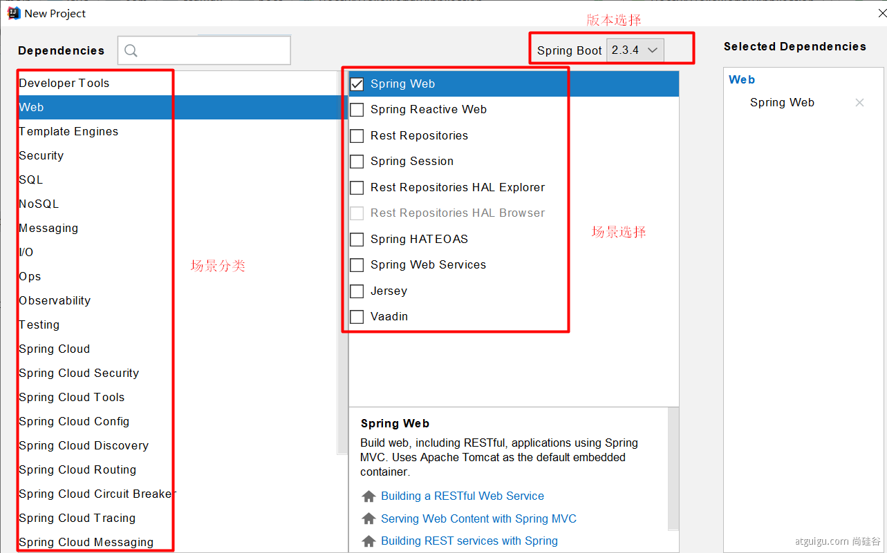
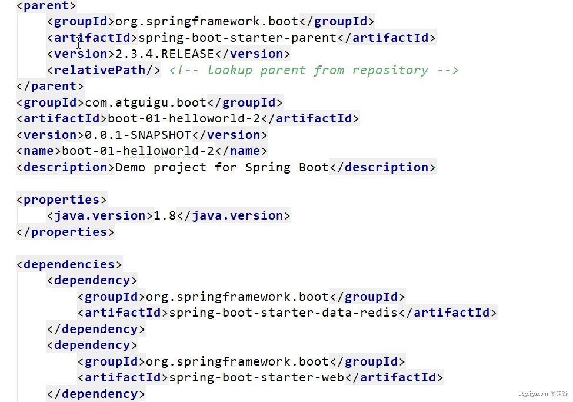
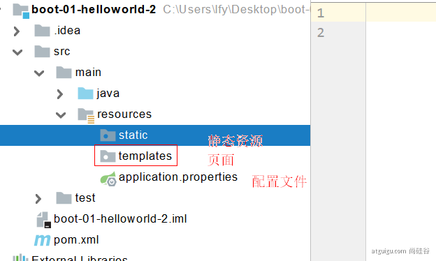
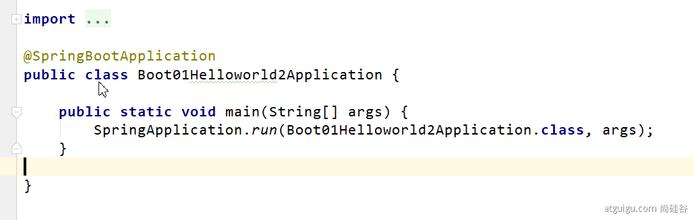

# 一、快速创建Spring Boot 2.x

## 1. Spring与SpringBoot

### 1.1. Spring能做什么


Spring可以做：微服务、响应式开发、云服务、Web开发

### 1.2. Spring5重大升级

1、响应式编程


2、内部源码设计

基于Java8的一些新特性，如：接口默认实现。重新设计源码架构。

### 1.3. 为什么用SpringBoot

> Spring Boot makes it easy to create stand-alone, production-grade Spring based Applications that you can "just run".
>
> 能快速创建出生产级别的Spring应用

1、SpringBoot优点

- Create stand-alone Spring applications

- - 创建独立Spring应用

- Embed Tomcat, Jetty or Undertow directly (no need to deploy WAR files)

- - 内嵌web服务器

- Provide opinionated 'starter' dependencies to simplify your build configuration

- - 自动starter依赖，简化构建配置

- Automatically configure Spring and 3rd party libraries whenever possible

- - 自动配置Spring以及第三方功能

- Provide production-ready features such as metrics, health checks, and externalized configuration

- - 提供生产级别的监控、健康检查及外部化配置

- Absolutely no code generation and no requirement for XML configuration

- - 无代码生成、无需编写XML

> SpringBoot是整合Spring技术栈的一站式框架
>
> SpringBoot是简化Spring技术栈的快速开发脚手架

2、SpringBoot缺点

- 人称版本帝，迭代快，需要时刻关注变化
- 封装太深，内部原理复杂，不容易精通

## 2. 时代背景

### 2.1. 微服务

[James Lewis and Martin Fowler (2014)](https://martinfowler.com/articles/microservices.html)  提出微服务完整概念。https://martinfowler.com/microservices/

> In short, the microservice architectural style is an approach to developing a single application as a suite of small services, each running in its own process and communicating with lightweight mechanisms, often an HTTP resource API. These services are built around business capabilities and independently deployable by fully automated deployment machinery. There is a bare minimum of centralized management of these services, which may be written in different programming languages and use different data storage technologies.-- [James Lewis and Martin Fowler (2014)](https://martinfowler.com/articles/microservices.html)

- 微服务是一种<u>架构风格</u>
- 一个应用拆分为一组小型服务
- 每个服务运行在自己的进程内，也就是可独立部署和升级
- 服务之间使用轻量级HTTP交互
- 服务围绕业务功能拆分
- 可以由全自动部署机制独立部署
- 去中心化，服务自治。服务可以使用不同的语言、不同的存储技术

### 2.2. 分布式


1、分布式的困难

- 远程调用、服务发现、负载均衡、服务容错、配置管理、服务监控、链路追踪、日志管理、任务调度
- ......

2、分布式的解决

- SpringBoot + SpringCloud + AlibabaCloud


### 2.3. 云原生

原生应用如何上云。 Cloud Native

1、上云的困难

- 服务自愈、弹性伸缩、服务隔离、自动化部署、灰度发布、流量治理
- ......

2、上云的解决


## 3. 如何学习SpringBoot

1、官网文档架构

- 

- 


2、查看版本新特性以及版本升级；

- https://github.com/spring-projects/spring-boot/wiki#release-notes

- 

## 4. Spring Boot 2.X介绍和环境依赖

新版SpringBoot2.X介绍

* 官网：https://spring.io/projects/spring-boot
* GitHub地址：https://github.com/spring-projects/spring-boot
* 官方文档：https://spring.io/guides/gs/spring-boot/
* Spring Boot 简介
  * 简化Spring应用开发的一个框架；
  * 整个Spring技术栈的一个大整合；
  * J2EE开发的一站式解决方案；

相关软件环境和作用

* JDK1.8+以上
* Maven3.5+
* 编辑器IDEA(旗舰版)
* PostMan
* 翻译神器 https://translate.google.cn/

Maven全局配置：

```xml
<!-- maven使用阿里云仓库下载依赖 -->
<mirrors>
      <mirror>
        <id>nexus-aliyun</id>
        <mirrorOf>central</mirrorOf>
        <name>Nexus aliyun</name>
        <url>http://maven.aliyun.com/nexus/content/groups/public</url>
      </mirror>
  </mirrors>
 
<!-- 使用jdk1.8进行项目编译 -->
  <profiles>
         <profile>
              <id>jdk-1.8</id>
              <activation>
                <activeByDefault>true</activeByDefault>
                <jdk>1.8</jdk>
              </activation>
              <properties>
                <maven.compiler.source>1.8</maven.compiler.source>
                <maven.compiler.target>1.8</maven.compiler.target>
                <maven.compiler.compilerVersion>1.8</maven.compiler.compilerVersion>
              </properties>
         </profile>
  </profiles>
```


## 5. 项目创建

### 5.1. 使用Maven手工创建SpringBoot2.x应用

参考文档：https://spring.io/guides/gs/spring-boot/

1、创建maven项目

2、修改pom.xml文件 

- `parent、properties、dependencies、build` 复制添加到自己的pom.xml文件
- spring-boot-maven-plugin  springboot的maven插件，用于将项目打成jar包

```xml
<?xml version="1.0" encoding="UTF-8"?>
<project xmlns="http://maven.apache.org/POM/4.0.0" xmlns:xsi="http://www.w3.org/2001/XMLSchema-instance"
	xsi:schemaLocation="http://maven.apache.org/POM/4.0.0 https://maven.apache.org/xsd/maven-4.0.0.xsd">
	<modelVersion>4.0.0</modelVersion>
	<parent>
		<groupId>org.springframework.boot</groupId>
		<artifactId>spring-boot-starter-parent</artifactId>
		<version>2.3.4.RELEASE</version>
		<relativePath/> <!-- lookup parent from repository -->
	</parent>
	<groupId>com.example</groupId>
	<artifactId>spring-boot</artifactId>
	<version>0.0.1-SNAPSHOT</version>
	<name>spring-boot</name>
	<description>Demo project for Spring Boot</description>

	<properties>
		<java.version>1.8</java.version>
	</properties>

	<dependencies>
		<dependency>
			<groupId>org.springframework.boot</groupId>
			<artifactId>spring-boot-starter-web</artifactId>
		</dependency>
	</dependencies>

	<build>
		<plugins>
			<plugin>
				<groupId>org.springframework.boot</groupId>
				<artifactId>spring-boot-maven-plugin</artifactId>
			</plugin>
		</plugins>
	</build>

</project>
```


3、添加properties

```xml
<properties>
    <maven.compiler.source>1.8</maven.compiler.source>
    <maven.compiler.target>1.8</maven.compiler.target>
    <maven.compiler.compilerVersion>1.8</maven.compiler.compilerVersion>
</properties>
```


4、创建启动类，新建包名。不要使用默认defaultPackage。启动类位于新建包的根位置，用于扫描当前包以及子包下的组件

```java
package com.example.springboot;

import java.util.Arrays;

import org.springframework.boot.CommandLineRunner;
import org.springframework.boot.SpringApplication;
import org.springframework.boot.autoconfigure.SpringBootApplication;
import org.springframework.context.ApplicationContext;
import org.springframework.context.annotation.Bean;

@SpringBootApplication
public class Application {

	public static void main(String[] args) {
		SpringApplication.run(Application.class, args);
	}

}
```


5、 创建简单的web应用类，新建包名。不要使用默认defaultPackage。该类所在的包要在启动类所在包或者子包中。

```java
package com.example.springboot;

import org.springframework.web.bind.annotation.RestController;
import org.springframework.web.bind.annotation.RequestMapping;

@RestController
public class HelloController {

	@RequestMapping("/")
	public String index() {
		return "Greetings from Spring Boot!";
	}

}
```


6、执行启动类的main方法，启动web服务。

如果启动报如下错误，则需要修改默认的tomcat 服务器端口 8080 

```text
Description:

Web server failed to start. Port 8080 was already in use.

Action:

Identify and stop the process that's listening on port 8080 or configure this application to listen on another port.
```

`src/main/resource` 目录下新建 `application.properties` 文件,内容如下：

```properties
server.port=9010
```

>如果修改完端口之后，重启启动报错：*找不到或无法加载主类 springboot.Application'* 则执行maven clean 重新启动即可

- 更多配置参考：https://docs.spring.io/spring-boot/docs/2.4.3/reference/html/appendix-application-properties.html#common-application-properties-server

7、简化部署

- 添加依赖：spring-boot-maven-plugin

```xml
<build>
        <plugins>
            <plugin>
                <groupId>org.springframework.boot</groupId>
                <artifactId>spring-boot-maven-plugin</artifactId>
            </plugin>
        </plugins>
    </build>
```

- 把项目打成jar包，直接在目标服务器执行即可
  - java -jar xxx.jar

### 5.2. 在线创建 

[https://start.spring.io/](https://start.spring.io/)


# 二、了解自动配置原理

## 1. SpringBoot特点

### 1.1. 依赖管理

1、父项目做依赖管理

```xml
<!--父项目做依赖管理--> 
<parent>
        <groupId>org.springframework.boot</groupId>
        <artifactId>spring-boot-starter-parent</artifactId>
        <version>2.3.4.RELEASE</version>
</parent>

<!--父项目的父项目,几乎声明了所有开发中常用的依赖的版本号-->
 <parent>
    <groupId>org.springframework.boot</groupId>
    <artifactId>spring-boot-dependencies</artifactId>
    <version>2.3.4.RELEASE</version>
  </parent>
```

2、开发导入starter场景启动器

- 见到很多 spring-boot-starter-* ： * 就某种场景。只要引入starter，这个场景的所有常规需要的依赖我们都自动引入

- SpringBoot所有支持的场景

  - https://docs.spring.io/spring-boot/docs/current/reference/html/using-spring-boot.html#using-boot-starter

- 见到的  *-spring-boot-starter： 第三方为我们提供的简化开发的场景启动器。

- 所有场景启动器最底层的依赖  spring-boot-starter

  - ```xml
    <dependency>
      <groupId>org.springframework.boot</groupId>
      <artifactId>spring-boot-starter</artifactId>
      <version>2.3.4.RELEASE</version>
      <scope>compile</scope>
    </dependency>
    ```

3、无需关注版本号，自动版本仲裁

- 引入依赖默认都可以不写版本
- 引入非版本仲裁的jar，要写版本号。

- 可以修改默认版本号
  - 查看spring-boot-dependencies里面规定当前依赖的版本用的key。
  - 在当前项目里面重写配置

```xml
<properties>
  <mysql.version>5.1.43</mysql.version>
</properties>
```

### 1.2. 自动配置

- 自动配好Tomcat

- - 引入Tomcat依赖。
  - 自动配置好了Tomcat

```xml
<dependency>
      <groupId>org.springframework.boot</groupId>
      <artifactId>spring-boot-starter-tomcat</artifactId>
      <version>2.3.4.RELEASE</version>
      <scope>compile</scope>
</dependency>
```

- 自动配好SpringMVC

- - 引入SpringMVC全套组件
  - 自动配好SpringMVC常用组件（功能）

- 自动配好Web常见功能，如：字符编码问题

- - SpringBoot帮我们配置好了所有web开发的常见场景

- 默认的包结构

- - 主程序所在包及其下面的所有子包里面的组件都会被默认扫描进来
  - 无需以前的包扫描配置
  - 想要改变扫描路径，@SpringBootApplication(scanBasePackages="com.atguigu")

- - - 或者@ComponentScan 指定扫描路径

```java
@SpringBootApplication
等同于
@SpringBootConfiguration
@EnableAutoConfiguration
@ComponentScan("com.atguigu.boot")
```

- 各种配置拥有默认值

- - 默认配置最终都是映射到某个类上，如：MultipartProperties
  - 配置文件的值最终会绑定每个类上，这个类会在容器中创建Bean对象

- 按需加载所有自动配置项

- - 非常多的starter
  - 引入了哪些场景这个场景的自动配置才会开启
  - SpringBoot所有的自动配置功能都在 spring-boot-autoconfigure 包里面

- ......

## 2. 容器功能

### 2.1. 组件添加

#### 1、@Configuration

- 基本使用
- Full模式与Lite模式

- - 示例
  - 最佳实战

- - - 配置 类组件之间无依赖关系用Lite模式加速容器启动过程，减少判断
    - 配置类组件之间有依赖关系，方法会被调用得到之前单实例组件，用Full模式


```
#############################Configuration使用示例######################################################
/**
 * 1、配置类里面使用@Bean标注在方法上给容器注册组件，默认也是单实例的
 * 2、配置类本身也是组件
 * 3、proxyBeanMethods：代理bean的方法
 *      Full(proxyBeanMethods = true)、【保证每个@Bean方法被调用多少次返回的组件都是单实例的】
 *      Lite(proxyBeanMethods = false)【每个@Bean方法被调用多少次返回的组件都是新创建的】
 *      组件依赖必须使用Full模式默认。其他默认是否Lite模式
 *
 *
 *
 */
@Configuration(proxyBeanMethods = false) //告诉SpringBoot这是一个配置类 == 配置文件
public class MyConfig {

    /**
     * Full:外部无论对配置类中的这个组件注册方法调用多少次获取的都是之前注册容器中的单实例对象
     * @return
     */
    @Bean //给容器中添加组件。以方法名作为组件的id。返回类型就是组件类型。返回的值，就是组件在容器中的实例
    public User user01(){
        User zhangsan = new User("zhangsan", 18);
        //user组件依赖了Pet组件
        zhangsan.setPet(tomcatPet());
        return zhangsan;
    }

    @Bean("tom")
    public Pet tomcatPet(){
        return new Pet("tomcat");
    }
}


################################@Configuration测试代码如下########################################
@SpringBootConfiguration
@EnableAutoConfiguration
@ComponentScan("com.atguigu.boot")
public class MainApplication {

    public static void main(String[] args) {
        //1、返回我们IOC容器
        ConfigurableApplicationContext run = SpringApplication.run(MainApplication.class, args);

        //2、查看容器里面的组件
        String[] names = run.getBeanDefinitionNames();
        for (String name : names) {
            System.out.println(name);
        }

        //3、从容器中获取组件

        Pet tom01 = run.getBean("tom", Pet.class);

        Pet tom02 = run.getBean("tom", Pet.class);

        System.out.println("组件："+(tom01 == tom02));


        //4、com.atguigu.boot.config.MyConfig$$EnhancerBySpringCGLIB$$51f1e1ca@1654a892
        MyConfig bean = run.getBean(MyConfig.class);
        System.out.println(bean);

        //如果@Configuration(proxyBeanMethods = true)代理对象调用方法。SpringBoot总会检查这个组件是否在容器中有。
        //保持组件单实例
        User user = bean.user01();
        User user1 = bean.user01();
        System.out.println(user == user1);


        User user01 = run.getBean("user01", User.class);
        Pet tom = run.getBean("tom", Pet.class);

        System.out.println("用户的宠物："+(user01.getPet() == tom));


    }
}
```

#### 2、@Bean、@Component、@Controller、@Service、@Repository


#### 3、@ComponentScan、@Import

```
 * 4、@Import({User.class, DBHelper.class})
 *      给容器中自动创建出这两个类型的组件、默认组件的名字就是全类名
 *
 *
 *
 */

@Import({User.class, DBHelper.class})
@Configuration(proxyBeanMethods = false) //告诉SpringBoot这是一个配置类 == 配置文件
public class MyConfig {
}
```

@Import 高级用法： https://www.bilibili.com/video/BV1gW411W7wy?p=8

#### 4、@Conditional

条件装配：满足Conditional指定的条件，则进行组件注入


```
=====================测试条件装配==========================
@Configuration(proxyBeanMethods = false) //告诉SpringBoot这是一个配置类 == 配置文件
//@ConditionalOnBean(name = "tom")
@ConditionalOnMissingBean(name = "tom")
public class MyConfig {


    /**
     * Full:外部无论对配置类中的这个组件注册方法调用多少次获取的都是之前注册容器中的单实例对象
     * @return
     */

    @Bean //给容器中添加组件。以方法名作为组件的id。返回类型就是组件类型。返回的值，就是组件在容器中的实例
    public User user01(){
        User zhangsan = new User("zhangsan", 18);
        //user组件依赖了Pet组件
        zhangsan.setPet(tomcatPet());
        return zhangsan;
    }

    @Bean("tom22")
    public Pet tomcatPet(){
        return new Pet("tomcat");
    }
}

public static void main(String[] args) {
        //1、返回我们IOC容器
        ConfigurableApplicationContext run = SpringApplication.run(MainApplication.class, args);

        //2、查看容器里面的组件
        String[] names = run.getBeanDefinitionNames();
        for (String name : names) {
            System.out.println(name);
        }

        boolean tom = run.containsBean("tom");
        System.out.println("容器中Tom组件："+tom);

        boolean user01 = run.containsBean("user01");
        System.out.println("容器中user01组件："+user01);

        boolean tom22 = run.containsBean("tom22");
        System.out.println("容器中tom22组件："+tom22);


    }
```

### 2.2、原生配置文件引入

#### 1、@ImportResource

```
======================beans.xml=========================
<?xml version="1.0" encoding="UTF-8"?>
<beans xmlns="http://www.springframework.org/schema/beans"
       xmlns:xsi="http://www.w3.org/2001/XMLSchema-instance"
       xmlns:context="http://www.springframework.org/schema/context"
       xsi:schemaLocation="http://www.springframework.org/schema/beans http://www.springframework.org/schema/beans/spring-beans.xsd http://www.springframework.org/schema/context https://www.springframework.org/schema/context/spring-context.xsd">

    <bean id="haha" class="com.atguigu.boot.bean.User">
        <property name="name" value="zhangsan"></property>
        <property name="age" value="18"></property>
    </bean>

    <bean id="hehe" class="com.atguigu.boot.bean.Pet">
        <property name="name" value="tomcat"></property>
    </bean>
</beans>
@ImportResource("classpath:beans.xml")
public class MyConfig {}

======================测试=================
        boolean haha = run.containsBean("haha");
        boolean hehe = run.containsBean("hehe");
        System.out.println("haha："+haha);//true
        System.out.println("hehe："+hehe);//true
```


### 2.3、配置绑定 

如何使用Java读取到properties文件中的内容，并且把它封装到JavaBean中，以供随时使用；

```
public class getProperties {
     public static void main(String[] args) throws FileNotFoundException, IOException {
         Properties pps = new Properties();
         pps.load(new FileInputStream("a.properties"));
         Enumeration enum1 = pps.propertyNames();//得到配置文件的名字
         while(enum1.hasMoreElements()) {
             String strKey = (String) enum1.nextElement();
             String strValue = pps.getProperty(strKey);
             System.out.println(strKey + "=" + strValue);
             //封装到JavaBean。
         }
     }
 }
```

#### 1、@ConfigurationProperties

```
/**
 * 只有在容器中的组件，才会拥有SpringBoot提供的强大功能
 */
@Component
@ConfigurationProperties(prefix = "mycar")
public class Car {

    private String brand;
    private Integer price;

    public String getBrand() {
        return brand;
    }

    public void setBrand(String brand) {
        this.brand = brand;
    }

    public Integer getPrice() {
        return price;
    }

    public void setPrice(Integer price) {
        this.price = price;
    }

    @Override
    public String toString() {
        return "Car{" +
                "brand='" + brand + '\'' +
                ", price=" + price +
                '}';
    }
}
```

#### 2、@EnableConfigurationProperties + @ConfigurationProperties


#### 3、@Component + @ConfigurationProperties

```
@EnableConfigurationProperties(Car.class)
//1、开启Car配置绑定功能
//2、把这个Car这个组件自动注册到容器中
public class MyConfig {
}
```

## 3、自动配置原理入门

### 3.1、引导加载自动配置类

```
@SpringBootConfiguration
@EnableAutoConfiguration
@ComponentScan(excludeFilters = { @Filter(type = FilterType.CUSTOM, classes = TypeExcludeFilter.class),
        @Filter(type = FilterType.CUSTOM, classes = AutoConfigurationExcludeFilter.class) })
public @interface SpringBootApplication{}


======================
    
```

#### 1、@SpringBootConfiguration

@Configuration。代表当前是一个配置类


#### 2、@ComponentScan

指定扫描哪些，Spring注解；


#### 3、@EnableAutoConfiguration

```
@AutoConfigurationPackage
@Import(AutoConfigurationImportSelector.class)
public @interface EnableAutoConfiguration {}
```

#### 1、@AutoConfigurationPackage

自动配置包？指定了默认的包规则

```
@Import(AutoConfigurationPackages.Registrar.class)  //给容器中导入一个组件
public @interface AutoConfigurationPackage {}

//利用Registrar给容器中导入一系列组件
//将指定的一个包下的所有组件导入进来？MainApplication 所在包下。
```

#### 2、@Import(AutoConfigurationImportSelector.class)

```
1、利用getAutoConfigurationEntry(annotationMetadata);给容器中批量导入一些组件
2、调用List<String> configurations = getCandidateConfigurations(annotationMetadata, attributes)获取到所有需要导入到容器中的配置类
3、利用工厂加载 Map<String, List<String>> loadSpringFactories(@Nullable ClassLoader classLoader)；得到所有的组件
4、从META-INF/spring.factories位置来加载一个文件。
    默认扫描我们当前系统里面所有META-INF/spring.factories位置的文件
    spring-boot-autoconfigure-2.3.4.RELEASE.jar包里面也有META-INF/spring.factories
    
```

## 

```
文件里面写死了spring-boot一启动就要给容器中加载的所有配置类
spring-boot-autoconfigure-2.3.4.RELEASE.jar/META-INF/spring.factories
# Auto Configure
org.springframework.boot.autoconfigure.EnableAutoConfiguration=\
org.springframework.boot.autoconfigure.admin.SpringApplicationAdminJmxAutoConfiguration,\
org.springframework.boot.autoconfigure.aop.AopAutoConfiguration,\
org.springframework.boot.autoconfigure.amqp.RabbitAutoConfiguration,\
org.springframework.boot.autoconfigure.batch.BatchAutoConfiguration,\
org.springframework.boot.autoconfigure.cache.CacheAutoConfiguration,\
org.springframework.boot.autoconfigure.cassandra.CassandraAutoConfiguration,\
org.springframework.boot.autoconfigure.context.ConfigurationPropertiesAutoConfiguration,\
org.springframework.boot.autoconfigure.context.LifecycleAutoConfiguration,\
org.springframework.boot.autoconfigure.context.MessageSourceAutoConfiguration,\
org.springframework.boot.autoconfigure.context.PropertyPlaceholderAutoConfiguration,\
org.springframework.boot.autoconfigure.couchbase.CouchbaseAutoConfiguration,\
org.springframework.boot.autoconfigure.dao.PersistenceExceptionTranslationAutoConfiguration,\
org.springframework.boot.autoconfigure.data.cassandra.CassandraDataAutoConfiguration,\
org.springframework.boot.autoconfigure.data.cassandra.CassandraReactiveDataAutoConfiguration,\
org.springframework.boot.autoconfigure.data.cassandra.CassandraReactiveRepositoriesAutoConfiguration,\
org.springframework.boot.autoconfigure.data.cassandra.CassandraRepositoriesAutoConfiguration,\
org.springframework.boot.autoconfigure.data.couchbase.CouchbaseDataAutoConfiguration,\
org.springframework.boot.autoconfigure.data.couchbase.CouchbaseReactiveDataAutoConfiguration,\
org.springframework.boot.autoconfigure.data.couchbase.CouchbaseReactiveRepositoriesAutoConfiguration,\
org.springframework.boot.autoconfigure.data.couchbase.CouchbaseRepositoriesAutoConfiguration,\
org.springframework.boot.autoconfigure.data.elasticsearch.ElasticsearchDataAutoConfiguration,\
org.springframework.boot.autoconfigure.data.elasticsearch.ElasticsearchRepositoriesAutoConfiguration,\
org.springframework.boot.autoconfigure.data.elasticsearch.ReactiveElasticsearchRepositoriesAutoConfiguration,\
org.springframework.boot.autoconfigure.data.elasticsearch.ReactiveElasticsearchRestClientAutoConfiguration,\
org.springframework.boot.autoconfigure.data.jdbc.JdbcRepositoriesAutoConfiguration,\
org.springframework.boot.autoconfigure.data.jpa.JpaRepositoriesAutoConfiguration,\
org.springframework.boot.autoconfigure.data.ldap.LdapRepositoriesAutoConfiguration,\
org.springframework.boot.autoconfigure.data.mongo.MongoDataAutoConfiguration,\
org.springframework.boot.autoconfigure.data.mongo.MongoReactiveDataAutoConfiguration,\
org.springframework.boot.autoconfigure.data.mongo.MongoReactiveRepositoriesAutoConfiguration,\
org.springframework.boot.autoconfigure.data.mongo.MongoRepositoriesAutoConfiguration,\
org.springframework.boot.autoconfigure.data.neo4j.Neo4jDataAutoConfiguration,\
org.springframework.boot.autoconfigure.data.neo4j.Neo4jRepositoriesAutoConfiguration,\
org.springframework.boot.autoconfigure.data.solr.SolrRepositoriesAutoConfiguration,\
org.springframework.boot.autoconfigure.data.r2dbc.R2dbcDataAutoConfiguration,\
org.springframework.boot.autoconfigure.data.r2dbc.R2dbcRepositoriesAutoConfiguration,\
org.springframework.boot.autoconfigure.data.r2dbc.R2dbcTransactionManagerAutoConfiguration,\
org.springframework.boot.autoconfigure.data.redis.RedisAutoConfiguration,\
org.springframework.boot.autoconfigure.data.redis.RedisReactiveAutoConfiguration,\
org.springframework.boot.autoconfigure.data.redis.RedisRepositoriesAutoConfiguration,\
org.springframework.boot.autoconfigure.data.rest.RepositoryRestMvcAutoConfiguration,\
org.springframework.boot.autoconfigure.data.web.SpringDataWebAutoConfiguration,\
org.springframework.boot.autoconfigure.elasticsearch.ElasticsearchRestClientAutoConfiguration,\
org.springframework.boot.autoconfigure.flyway.FlywayAutoConfiguration,\
org.springframework.boot.autoconfigure.freemarker.FreeMarkerAutoConfiguration,\
org.springframework.boot.autoconfigure.groovy.template.GroovyTemplateAutoConfiguration,\
org.springframework.boot.autoconfigure.gson.GsonAutoConfiguration,\
org.springframework.boot.autoconfigure.h2.H2ConsoleAutoConfiguration,\
org.springframework.boot.autoconfigure.hateoas.HypermediaAutoConfiguration,\
org.springframework.boot.autoconfigure.hazelcast.HazelcastAutoConfiguration,\
org.springframework.boot.autoconfigure.hazelcast.HazelcastJpaDependencyAutoConfiguration,\
org.springframework.boot.autoconfigure.http.HttpMessageConvertersAutoConfiguration,\
org.springframework.boot.autoconfigure.http.codec.CodecsAutoConfiguration,\
org.springframework.boot.autoconfigure.influx.InfluxDbAutoConfiguration,\
org.springframework.boot.autoconfigure.info.ProjectInfoAutoConfiguration,\
org.springframework.boot.autoconfigure.integration.IntegrationAutoConfiguration,\
org.springframework.boot.autoconfigure.jackson.JacksonAutoConfiguration,\
org.springframework.boot.autoconfigure.jdbc.DataSourceAutoConfiguration,\
org.springframework.boot.autoconfigure.jdbc.JdbcTemplateAutoConfiguration,\
org.springframework.boot.autoconfigure.jdbc.JndiDataSourceAutoConfiguration,\
org.springframework.boot.autoconfigure.jdbc.XADataSourceAutoConfiguration,\
org.springframework.boot.autoconfigure.jdbc.DataSourceTransactionManagerAutoConfiguration,\
org.springframework.boot.autoconfigure.jms.JmsAutoConfiguration,\
org.springframework.boot.autoconfigure.jmx.JmxAutoConfiguration,\
org.springframework.boot.autoconfigure.jms.JndiConnectionFactoryAutoConfiguration,\
org.springframework.boot.autoconfigure.jms.activemq.ActiveMQAutoConfiguration,\
org.springframework.boot.autoconfigure.jms.artemis.ArtemisAutoConfiguration,\
org.springframework.boot.autoconfigure.jersey.JerseyAutoConfiguration,\
org.springframework.boot.autoconfigure.jooq.JooqAutoConfiguration,\
org.springframework.boot.autoconfigure.jsonb.JsonbAutoConfiguration,\
org.springframework.boot.autoconfigure.kafka.KafkaAutoConfiguration,\
org.springframework.boot.autoconfigure.availability.ApplicationAvailabilityAutoConfiguration,\
org.springframework.boot.autoconfigure.ldap.embedded.EmbeddedLdapAutoConfiguration,\
org.springframework.boot.autoconfigure.ldap.LdapAutoConfiguration,\
org.springframework.boot.autoconfigure.liquibase.LiquibaseAutoConfiguration,\
org.springframework.boot.autoconfigure.mail.MailSenderAutoConfiguration,\
org.springframework.boot.autoconfigure.mail.MailSenderValidatorAutoConfiguration,\
org.springframework.boot.autoconfigure.mongo.embedded.EmbeddedMongoAutoConfiguration,\
org.springframework.boot.autoconfigure.mongo.MongoAutoConfiguration,\
org.springframework.boot.autoconfigure.mongo.MongoReactiveAutoConfiguration,\
org.springframework.boot.autoconfigure.mustache.MustacheAutoConfiguration,\
org.springframework.boot.autoconfigure.orm.jpa.HibernateJpaAutoConfiguration,\
org.springframework.boot.autoconfigure.quartz.QuartzAutoConfiguration,\
org.springframework.boot.autoconfigure.r2dbc.R2dbcAutoConfiguration,\
org.springframework.boot.autoconfigure.rsocket.RSocketMessagingAutoConfiguration,\
org.springframework.boot.autoconfigure.rsocket.RSocketRequesterAutoConfiguration,\
org.springframework.boot.autoconfigure.rsocket.RSocketServerAutoConfiguration,\
org.springframework.boot.autoconfigure.rsocket.RSocketStrategiesAutoConfiguration,\
org.springframework.boot.autoconfigure.security.servlet.SecurityAutoConfiguration,\
org.springframework.boot.autoconfigure.security.servlet.UserDetailsServiceAutoConfiguration,\
org.springframework.boot.autoconfigure.security.servlet.SecurityFilterAutoConfiguration,\
org.springframework.boot.autoconfigure.security.reactive.ReactiveSecurityAutoConfiguration,\
org.springframework.boot.autoconfigure.security.reactive.ReactiveUserDetailsServiceAutoConfiguration,\
org.springframework.boot.autoconfigure.security.rsocket.RSocketSecurityAutoConfiguration,\
org.springframework.boot.autoconfigure.security.saml2.Saml2RelyingPartyAutoConfiguration,\
org.springframework.boot.autoconfigure.sendgrid.SendGridAutoConfiguration,\
org.springframework.boot.autoconfigure.session.SessionAutoConfiguration,\
org.springframework.boot.autoconfigure.security.oauth2.client.servlet.OAuth2ClientAutoConfiguration,\
org.springframework.boot.autoconfigure.security.oauth2.client.reactive.ReactiveOAuth2ClientAutoConfiguration,\
org.springframework.boot.autoconfigure.security.oauth2.resource.servlet.OAuth2ResourceServerAutoConfiguration,\
org.springframework.boot.autoconfigure.security.oauth2.resource.reactive.ReactiveOAuth2ResourceServerAutoConfiguration,\
org.springframework.boot.autoconfigure.solr.SolrAutoConfiguration,\
org.springframework.boot.autoconfigure.task.TaskExecutionAutoConfiguration,\
org.springframework.boot.autoconfigure.task.TaskSchedulingAutoConfiguration,\
org.springframework.boot.autoconfigure.thymeleaf.ThymeleafAutoConfiguration,\
org.springframework.boot.autoconfigure.transaction.TransactionAutoConfiguration,\
org.springframework.boot.autoconfigure.transaction.jta.JtaAutoConfiguration,\
org.springframework.boot.autoconfigure.validation.ValidationAutoConfiguration,\
org.springframework.boot.autoconfigure.web.client.RestTemplateAutoConfiguration,\
org.springframework.boot.autoconfigure.web.embedded.EmbeddedWebServerFactoryCustomizerAutoConfiguration,\
org.springframework.boot.autoconfigure.web.reactive.HttpHandlerAutoConfiguration,\
org.springframework.boot.autoconfigure.web.reactive.ReactiveWebServerFactoryAutoConfiguration,\
org.springframework.boot.autoconfigure.web.reactive.WebFluxAutoConfiguration,\
org.springframework.boot.autoconfigure.web.reactive.error.ErrorWebFluxAutoConfiguration,\
org.springframework.boot.autoconfigure.web.reactive.function.client.ClientHttpConnectorAutoConfiguration,\
org.springframework.boot.autoconfigure.web.reactive.function.client.WebClientAutoConfiguration,\
org.springframework.boot.autoconfigure.web.servlet.DispatcherServletAutoConfiguration,\
org.springframework.boot.autoconfigure.web.servlet.ServletWebServerFactoryAutoConfiguration,\
org.springframework.boot.autoconfigure.web.servlet.error.ErrorMvcAutoConfiguration,\
org.springframework.boot.autoconfigure.web.servlet.HttpEncodingAutoConfiguration,\
org.springframework.boot.autoconfigure.web.servlet.MultipartAutoConfiguration,\
org.springframework.boot.autoconfigure.web.servlet.WebMvcAutoConfiguration,\
org.springframework.boot.autoconfigure.websocket.reactive.WebSocketReactiveAutoConfiguration,\
org.springframework.boot.autoconfigure.websocket.servlet.WebSocketServletAutoConfiguration,\
org.springframework.boot.autoconfigure.websocket.servlet.WebSocketMessagingAutoConfiguration,\
org.springframework.boot.autoconfigure.webservices.WebServicesAutoConfiguration,\
org.springframework.boot.autoconfigure.webservices.client.WebServiceTemplateAutoConfiguration
```

## 3.2、按需开启自动配置项

```
虽然我们127个场景的所有自动配置启动的时候默认全部加载。xxxxAutoConfiguration
按照条件装配规则（@Conditional），最终会按需配置。
```


## 3.3、修改默认配置


```
        @Bean
        @ConditionalOnBean(MultipartResolver.class)  //容器中有这个类型组件
        @ConditionalOnMissingBean(name = DispatcherServlet.MULTIPART_RESOLVER_BEAN_NAME) //容器中没有这个名字 multipartResolver 的组件
        public MultipartResolver multipartResolver(MultipartResolver resolver) {
            //给@Bean标注的方法传入了对象参数，这个参数的值就会从容器中找。
            //SpringMVC multipartResolver。防止有些用户配置的文件上传解析器不符合规范
            // Detect if the user has created a MultipartResolver but named it incorrectly
            return resolver;
        }
给容器中加入了文件上传解析器；
```

##  

SpringBoot默认会在底层配好所有的组件。但是如果用户自己配置了以用户的优先

```
@Bean
    @ConditionalOnMissingBean
    public CharacterEncodingFilter characterEncodingFilter() {
    }
```

##  

总结：

- SpringBoot先加载所有的自动配置类  xxxxxAutoConfiguration
- 每个自动配置类按照条件进行生效，默认都会绑定配置文件指定的值。xxxxProperties里面拿。xxxProperties和配置文件进行了绑定
- 生效的配置类就会给容器中装配很多组件
- 只要容器中有这些组件，相当于这些功能就有了
- 定制化配置

- - 用户直接自己@Bean替换底层的组件
  - 用户去看这个组件是获取的配置文件什么值就去修改。

**xxxxxAutoConfiguration ---> 组件  --->** **xxxxProperties里面拿值  ----> application.properties**


## 3.4、最佳实践

- 引入场景依赖

- - https://docs.spring.io/spring-boot/docs/current/reference/html/using-spring-boot.html#using-boot-starter

- 查看自动配置了哪些（选做）

- - 自己分析，引入场景对应的自动配置一般都生效了
  - 配置文件中debug=true开启自动配置报告。Negative（不生效）\Positive（生效）

- 是否需要修改

- - 参照文档修改配置项

- - - https://docs.spring.io/spring-boot/docs/current/reference/html/appendix-application-properties.html#common-application-properties
    - 自己分析。xxxxProperties绑定了配置文件的哪些。

- - 自定义加入或者替换组件

- - - @Bean、@Component。。。

- - 自定义器  **XXXXXCustomizer**；
  - ......


# 4、开发小技巧

## 4.1、Lombok

简化JavaBean开发

```
        <dependency>
            <groupId>org.projectlombok</groupId>
            <artifactId>lombok</artifactId>
        </dependency>


idea中搜索安装lombok插件
===============================简化JavaBean开发===================================
@NoArgsConstructor
//@AllArgsConstructor
@Data
@ToString
@EqualsAndHashCode
public class User {

    private String name;
    private Integer age;

    private Pet pet;

    public User(String name,Integer age){
        this.name = name;
        this.age = age;
    }


}


================================简化日志开发===================================
@Slf4j
@RestController
public class HelloController {
    @RequestMapping("/hello")
    public String handle01(@RequestParam("name") String name){
        
        log.info("请求进来了....");
        
        return "Hello, Spring Boot 2!"+"你好："+name;
    }
}
```

## 4.2、dev-tools

```
        <dependency>
            <groupId>org.springframework.boot</groupId>
            <artifactId>spring-boot-devtools</artifactId>
            <optional>true</optional>
        </dependency>
```


项目或者页面修改以后：Ctrl+F9；


## 4.3、Spring Initailizr（项目初始化向导）


### 0、选择我们需要的开发场景




### 1、自动依赖引入




### 2、自动创建项目结构




### 3、自动编写好主配置类




# 二、配置文件以及自动注入

## 1. 配置文件形式

常见的配置文件形式有 ： xml、properties、json、yaml。

Spring Boot 2.x 使用的配置文件 `xx.yml`, `xx.properties`。SpringBoot使用一个全局的配置文件，配置文件名是固定的；

- application.properties


- application.yml

1、yaml 格式

- YAML（Yet Another Markup Language） 
- 写 YAML 要比写 XML 快得多(无需关注标签或引号) 使用空格 Space 缩进表示分层，不同层次之间的缩进可以使用不同的空格数目 
- 注意：key 后面的冒号，后面一定要跟一个空格, 树状结构 


application.yml示例

```yml
server:
  port: 8080  //设置启动端口号为8080
house:
  family:
    name: Doe
    parents:
      - John
      - Jane
    children:
      - Paul
      - Mark
      - Simone
  address:
    number: 34
    street: Main Street
    city: Nowheretown
    zipcode: 12345
```

2、properties 格式

application.properties示例 

```properties
server.port=8082

#session失效时间，30m表示30分钟
server.servlet.session.timeout=30m

# Maximum number of connections that the server accepts and processes at any given time.
server.tomcat.max-connections=10000 

# Maximum size of the HTTP post content.
server.tomcat.max-http-post-size=2MB 
server.tomcat.max-http-form-post-size=2MB


# Maximum amount of worker threads
server.tomcat.max-threads=200 
```

3、官方文档配置:

- 默认示例文件仅作为指导。 不要将整个内容复制并粘贴到您的应用程序中，只挑选您需要的属性。
- 配置属性参考：https://docs.spring.io/spring-boot/docs/2.1.0.BUILD-SNAPSHOT/reference/htmlsingle/#common-application-properties
- 如果需要修改，直接复制对应的配置文件，加到application.properties里面

## 2. YAML语法

1、基本语法

k:(空格)v：表示一对键值对（空格必须有）；

以空格的缩进来控制层级关系；只要是左对齐的一列数据，都是同一个层级的

```yaml
server:
    port: 8081
    path: /hello
```

属性和值也是大小写敏感；

2、值的写法

- 字面量：普通的值（数字，字符串，布尔）
  - k: v：字面直接来写；
  - 字符串默认不用加上单引号或者双引号表示String类型；
  - ""：双引号；不会转义字符串里面的特殊字符；特殊字符会作为本身想表示的意思 
    - name:   "zhangsan \n lisi"：输出；zhangsan 换行  lisi
  - ''：单引号；会转义特殊字符，特殊字符最终只是一个普通的字符串数据
    - name:   'zhangsan \n lisi'：输出；zhangsan \n  lisi

- 对象、Map（属性和值）（键值对）：
  - k: v：在下一行来写对象的属性和值的关系；注意缩进
  - 对象还是k: v的方式

```yaml
friends:
 lastName: zhangsan
 age: 20
## 行内写法
friends: {lastName: zhangsan,age: 18}
```

- 数组（List、Set）：
  - 用`- ` 值表示数组中的一个元素

```yaml
pets:
 - cat
 - dog
 - pig
 ## 行内写法
 pets: [cat,dog,pig]
```

## 3. 配置文件值注入

### 3.1. 使用 @Value

1、Controller上面配置 `@PropertySource({"classpath:resource.properties"})`

* 该配置可以省略，默认按照官方文档中的顺序(包括 `application.properties` )读取对应的属性。
* `@PropertySource` 注解显示的指定了读取配置的来源

2、使用 `@Value` 来注释类的属性来接收配置

```java
@Value("${test.name}") 
private String name;
```

3、@Value 注入map、List

- 实体类

```java
@Value("#{'${list}'.split(',')}")
private List<String> list;
 
@Value("#{${maps}}")  
private Map<String,String> maps;
```

- 配置文件
  - yaml 文件
  - properties文件
    - value 为字符串必须使用单引号或者双引号引起来，表示字面量。

```yml
maps:
 key1: value1 
 key2: value2
```

```properties
list: topic1,topic2,topic3
maps: {key1: 'value1', key2: 'value2'}
```

3、在Spring中有#的使用也有$的使用，那么这两个分别是做什么的呢？

- ${key名称}：

  - 用户获取外部文件中指定key的值
  - 可以出现在xml配置文件中，也可以出现在注解@Value中
  - 获取properties中环境变量

- #{表达式}：

  - SpEL表达式的格式，详情点击[Spring的EL表达式](http://blog.csdn.net/u012834750/article/details/79388294)

  - 可以出现在xml配置文件中，也可以出现在注解@Value中

    - 在使用的时候也允许#{'${key}'}这样使用

    - ```java
      @Value("#{'${jdbc.url}'}")
      private String jdbcUrl;
      ```

  - 可以任意表达式，支持运算符等

### 3.2. 使用 @ConfigurationProperties 实体类配置文件

#### 1. 创建配置实体类并读取配置

1、创建配置实体类(属性要有getter、setter方法)添加以下注解

* 添加 `@Configuration` 或者 `@Component` 类注解；
  * 用于组件扫描，可以将配置对象注入到其他组件并使用
  * 如果没有加 `@Component` 注解。在我们要使用配置类的类上使用 `@EnableConfigurationProperties` 注册我们的配置bean.
    * 比如 `@EnableConfigurationProperties(ProfileProperties.class)` ProfileProperties.class 会在容器中创建bean对象
* 使用 `@PropertySource` 类注解显示指定读取的配置文件位置；
  * 该配置可以省略，默认则按照官方文档中的配置文件顺序(包括 `application.properties` ) 读取对应的属性。
* 使用 `@ConfigurationProperties` 类注解，设置相关属性
  * 进行配置和属性的绑定，默认属性名以及配置名一致的进行绑定；
  * 使用`prefix`注解的属性来指定配置的前缀(必需属性)
  * 实体类属性不能再使用 `@Value` 注解进行注释

```java
@Configuration
@ConfigurationProperties(prefix="test")
@PropertySource(value="classpath:resource.properties")
public class ServerSettings {

}
```

2、必须 通过注入IOC对象Resource 进来 ， 才能在类中使用获取的配置文件值。

```java
@Autowired 
private ServerSettings serverSettings;
```

3、对`@ConfigurationProperties` 实体类json序列化会报错。

```
com.fasterxml.jackson.databind.exc.InvalidDefinitionException: No serializer found for class org.springframework.context.expression.StandardBeanExpressionResolver and no properties discovered to create BeanSerializer (to avoid exception, disable SerializationFeature.FAIL_ON_EMPTY_BEANS) (through reference chain: java.util.HashMap["wxConfig"]->com.example.springboot.config.WXConfig$$EnhancerBySpringCGLIB$$db7e4a45["$$beanFactory"]->org.springframework.beans.factory.support.DefaultListableBeanFactory["beanExpressionResolver"])
```

通过注入实体类配置bean并调用get方法获取配置中的属性

##### 1. 示例：读取yaml配置

配置文件

```yaml
person:
    lastName: hello
    age: 18
    boss: false
    birth: 2017/12/12
    maps: {k1: v1,k2: 12}
    lists:
      - lisi
      - zhaoliu
    dog:
      name: 小狗
      age: 12
```

javaBean：

```java
/**
 * 将配置文件中配置的每一个属性的值，映射到这个组件中
 * @ConfigurationProperties：告诉SpringBoot将本类中的所有属性和配置文件中相关的配置进行绑定；
 *      prefix = "person"：配置文件中哪个下面的所有属性进行一一映射
 *
 * 只有这个组件是容器中的组件，才能容器提供的@ConfigurationProperties功能；
 *
 */
@Component
@ConfigurationProperties(prefix = "person")
public class Person {

    private String lastName;
    private Integer age;
    private Boolean boss;
    private Date birth;

    private Map<String,Object> maps;
    private List<Object> lists;
    private Dog dog;

```

我们可以导入配置文件处理器，以后编写配置就有提示了

```xml
<!--导入配置文件处理器，配置文件进行绑定就会有提示-->
<dependency>
    <groupId>org.springframework.boot</groupId>
    <artifactId>spring-boot-configuration-processor</artifactId>
    <optional>true</optional>
</dependency>
```

##### 2. 示例：读取.properties配置

map和list类型参数

```properties
#map 第一种方式
data.person.name=zhangsan
data.person.sex=man
data.person.age=11
data.person.url=xxxxxxxx

#map 第二种方式
data.person[name]=zhangsan
data.person[sex]=man
data.person[age]=11
data.person[url]=xxxxxxxx

# map 二级嵌套 属性名为tag 
data.tag.user.user_reg


#list 第一种方式
data.list[0]=apple0
data.list[1]=apple1
data.list[2]=apple2
#list 第二种方式
data.list=apple0,apple1,apple2

```

```java
@Configuration
@ConfigurationProperties(prefix = "data")
//如果只有一个主配置类文件，@PropertySource可以不写
@PropertySource("classpath:application.properties")
public class PersonConfig {
    /**
     * data.person.name
     * 这里map名需要和application.properties中的参数一致
     */
    private Map<String, String> person = new HashMap<>();
    /**
     * data.list
     * 这里list名需要和application.properties中的参数一致
     */
    private List<String> list = new ArrayList<>();
    
    /**
     * 二级嵌套 data.tag.user.user_reg=user_reg_tag
     * 映射到属性 tag上  user->(user_reg->user_reg_tag)
     /
    private Map<String,Map<String,String>> tag;
 
    /**
     * 编写get，set方法方便使用
     */
    public Map<String, String> getPerson() {
        return person;
    }
 
    public void setPerson(Map<String, String> person) {
        this.person = person;
    }
 
    public List<String> getList() {
        return list;
    }
 
    public void setList(List<String> list) {
        this.list = list;
    }
}
```

##### 3. properties配置文件在idea中默认utf-8可能会乱码

调整


#### 2. 读取并校验


```yml
my-profile:
  name: Guide哥
  email: koushuangbwcx@
```

使用javax.validation.* 相关的api进行配置校验:

```java
@ConfigurationProperties("my-profile")
@Validated
public class ProfileProperties {
   @NotEmpty
   private String name;

   @Email
   @NotEmpty
   private String email;
 
   //配置文件中没有读取到的话就用默认值
   private Boolean handsome = Boolean.TRUE;

}
```

ProfileProperties 类如果没有加 `@Component` 注解。我们在我们要使用`ProfileProperties` 的地方使用`@EnableConfigurationProperties`注册我们的配置bean：

```java
@SpringBootApplication
@EnableConfigurationProperties(ProfileProperties.class)
public class ReadConfigPropertiesApplication implements InitializingBean {
    private final ProfileProperties profileProperties;

    public ReadConfigPropertiesApplication(ProfileProperties profileProperties) {
        this.profileProperties = profileProperties;
    }

    public static void main(String[] args) {
        SpringApplication.run(ReadConfigPropertiesApplication.class, args);
    }

    @Override
    public void afterPropertiesSet() {
        System.out.println(profileProperties.toString());
    }
}
```


#### 3. @PropertySource读取指定properties文件

```java
@Component
@PropertySource("classpath:website.properties")
class WebSite {
    @Value("${url}")
    private String url;
    //getter and setter
    ...
}
```


使用：

```java
@Autowired
private WebSite webSite;

System.out.println(webSite.getUrl());//https://javaguide.cn/
```

#### 4. @Value获取值和@ConfigurationProperties获取值比较

|                      | @ConfigurationProperties | @Value     |
| -------------------- | ------------------------ | ---------- |
| 功能                 | 批量注入配置文件中的属性 | 一个个指定 |
| 松散绑定（松散语法） | 支持                     | 不支持     |
| SpEL                 | 不支持                   | 支持       |
| JSR303数据校验       | 支持                     | 不支持     |
| 复杂类型封装         | 支持                     | 不支持     |

配置文件yml还是properties他们都能获取到值；

- 如果说，我们只是在某个业务逻辑中需要获取一下配置文件中的某项值，使用@Value；

- 如果说，我们专门编写了一个javaBean来和配置文件进行映射，我们就直接使用@ConfigurationProperties；


### 3.3. 配置过期，根据源码查看新的配置

使用IDEA编辑配置文件，如果有配置的属性过期，则如下：


使用 `CTRL` 并点击属性，查看 `ServerProperties.java` 源码。找到该属性的setter方法以及对应的getter方法

```java
@Deprecated
@DeprecatedConfigurationProperty(replacement = "server.tomcat.threads.max")
public int getMaxThreads() {
	return getThreads().getMax();
}

@Deprecated
public void setMaxThreads(int maxThreads) {
	getThreads().setMax(maxThreads);
}
```

查看源码，可以看到属性已经被 ` "server.tomcat.threads.max"` 替换。于是修改配置为

```properties
# Maximum amount of worker threads
server.tomcat.max-threads=200
server.tomcat.threads.max = 200 
```

### 3.4. @PropertySource、@ImportResource、@Bean

1、@PropertySource：加载指定的配置文件；

```java
/**
 * 将配置文件中配置的每一个属性的值，映射到这个组件中
 * @ConfigurationProperties：告诉SpringBoot将本类中的所有属性和配置文件中相关的配置进行绑定；
 *      prefix = "person"：配置文件中哪个下面的所有属性进行一一映射
 *
 * 只有这个组件是容器中的组件，才能容器提供的@ConfigurationProperties功能；
 *  @ConfigurationProperties(prefix = "person")默认从全局配置文件中获取值；
 *
 */
@PropertySource(value = {"classpath:person.properties"})
@Component
@ConfigurationProperties(prefix = "person")
//@Validated
public class Person {

    /**
     * <bean class="Person">
     *      <property name="lastName" value="字面量/${key}从环境变量、配置文件中获取值/#{SpEL}"></property>
     * <bean/>
     */

   //lastName必须是邮箱格式
   // @Email
    //@Value("${person.last-name}")
    private String lastName;
    //@Value("#{11*2}")
    private Integer age;
    //@Value("true")
    private Boolean boss;

```


2、@ImportResource：导入Spring的配置文件，让配置文件里面的内容生效；

- Spring Boot里面没有Spring的配置文件，我们自己编写的配置文件，也不能自动识别；

- 想让Spring的配置文件生效，加载进来；@ImportResource标注在一个配置类上


```java
@ImportResource(locations = {"classpath:beans.xml"})
导入Spring的配置文件让其生效
```

```xml
<?xml version="1.0" encoding="UTF-8"?>
<beans xmlns="http://www.springframework.org/schema/beans"
       xmlns:xsi="http://www.w3.org/2001/XMLSchema-instance"
       xsi:schemaLocation="http://www.springframework.org/schema/beans http://www.springframework.org/schema/beans/spring-beans.xsd">


    <bean id="helloService" class="com.atguigu.springboot.service.HelloService"></bean>
</beans>
```


3、@Bean

SpringBoot推荐给容器中添加组件的方式；不再编写Spring的配置文件，推荐使用全注解的方式。

- 配置类@Configuration 相当于 Spring配置文件 <beans>


- 使用@Bean给容器中添加组件，相当于配置文件中的某一个<bean>


### 3.5. 工具类直接读取配置文件内容

我们经常会写util等类，里面的方法都是静态static的，这种情况下我们就没法像普通方法一样获取到配置，此时我们应该怎么获取呢？

1、配置文件添加配置


```properties
#==============================JWT相关配置========================================
jwt.expire=5
jwt.secret=12345678
jwt.tokenPrefix=gglearn
jwt.subject=gglearn
```


2、编写配置类


```java
@Component
@ConfigurationProperties(prefix = "jwt")
public class JWTConfigProperties {
    /**
     * 过期时间，默认一周  单位为 分
     */
    private long expire = 60 * 24 * 7;
    /**
     * 加密秘钥
     */
    private String secret;
    /**
     * 令牌前缀
     */
    private String tokenPrefix;
    /**
     * subject
     */
    private String subject;

    //getter and setter
    ...
}
```

3、编写工具类

- 工具类需要使用 `@Component` 注解由容器管理bean对象

- 注入配置类 `JWTConfigProperties`对象

- 使用 `@PostConstruct` 在bean生命周期初始化过程赋值给静态变量。


```java
@Component
public class JWTUtils {

    /**
     * 过期时间单位  分钟为单位
     */
    private static final int EXPIRE_UNIT = 60000;

    /**
     * 过期时间
     */
    private static  long EXPIRE ;
    /**
     * 加密秘钥,
     */
    private static  String SECRET;
    /**
     * 令牌前缀
     */
    private static  String TOKEN_PREFIX ;
    /**
     * subject
     */
    private static  String SUBJECT;

    @Autowired
    private JWTConfigProperties jwtConfigProperties;

    @PostConstruct
    public void init(){
        EXPIRE = jwtConfigProperties.getExpire() * EXPIRE_UNIT;
        SECRET = jwtConfigProperties.getSecret();
        TOKEN_PREFIX = jwtConfigProperties.getTokenPrefix();
        SUBJECT = jwtConfigProperties.getSubject();
    }

    /**
     * 根据用户信息，生成令牌
     * @param user
     * @return
     */
    public static String geneJsonWebToken(User user){
        String token = Jwts.builder().setSubject(SUBJECT)
                .claim("head_img",user.getHeadImg())
                .claim("id",user.getId())
                .claim("name",user.getName())
                .setIssuedAt(new Date())
                .setExpiration(new Date(System.currentTimeMillis() + EXPIRE))
                .signWith(SignatureAlgorithm.HS256,SECRET).compact();
        token = TOKEN_PREFIX + token;
        return token;
    }


    /**
     * 校验token的方法
     * @param token
     * @return
     */
    public static Claims checkJWT(String token){
        try{
            final  Claims claims = Jwts.parser().setSigningKey(SECRET)
                    .parseClaimsJws(token.replace(TOKEN_PREFIX,"")).getBody();
            return claims;

        }catch (Exception e){
            return null;
        }
    }

}
```

## 4. 配置文件占位符

1、占位符访问随机数

```java
${random.value}、${random.int}、${random.long}
${random.int(10)}、${random.int[1024,65536]}
```

2、占位符获取之前配置的值

- 如果配置的值可能为空，可以是用:指定默认值

```properties
person.last-name=张三${random.uuid}
person.age=${random.int}
person.birth=2017/12/15
person.boss=false
person.maps.k1=v1
person.maps.k2=14
person.lists=a,b,c
person.dog.name=${person.hello:hello}_dog
person.dog.age=15
```

## 5. Profile

### 5.1. 多Profile文件

我们在主配置文件编写的时候，文件名可以命名为 application-{profile}.properties/yml

默认使用application.properties的配置；

### 5.2. yml支持多文档块方式

多文档块使用`---`进行隔开

```yml
server:
  port: 8081
spring:
  profiles:
    active: prod

---
server:
  port: 8083
spring:
  profiles: dev


---

server:
  port: 8084
spring:
  profiles: prod  #指定属于哪个环境
```

### 5.3. 激活指定profile

1、在配置文件中指定 spring.profiles.active=dev 来激活特定profile

- 默认配置文件中进行指定

2、命令行：

- java -jar spring-boot-02-config-0.0.1-SNAPSHOT.jar --spring.profiles.active=dev；
- 可以直接在测试的时候，配置传入命令行参数

3、虚拟机参数；

- -Dspring.profiles.active=dev

## 6. 配置文件加载

### 6.1. 默认配置文件加载位置

启动会扫描以下位置的application.properties或者application.yml文件作为Spring boot的默认配置文件

- file:./config/
- file:./
- classpath:/config/
- classpath:/


优先级由高到底，高优先级的配置会覆盖低优先级的配置；SpringBoot会从这四个位置全部加载主配置文件；互补配置；

我们还可以通过spring.config.location来改变默认的配置文件位置

- 项目打包好以后，我们可以使用命令行参数的形式，启动项目的时候来指定配置文件的新位置；指定配置文件和默认加载的这些配置文件共同起作用形成互补配置；
- java -jar spring-boot-02-config-02-0.0.1-SNAPSHOT.jar --spring.config.location=G:/application.properties

### 6.2. 外部配置加载顺序

SpringBoot也可以从以下位置加载配置； 优先级从高到低；高优先级的配置覆盖低优先级的配置，所有的配置会形成互补配置

1.命令行参数

- 所有的配置都可以在命令行上进行指定
- java -jar spring-boot-02-config-02-0.0.1-SNAPSHOT.jar --server.port=8087  --server.context-path=/abc
- 多个配置用空格分开； --配置项=值

2.来自java:comp/env的JNDI属性

3.Java系统属性（System.getProperties()）

4.操作系统环境变量

5.RandomValuePropertySource配置的random.*属性值


由jar包外向jar包内进行寻找；优先加载带profile：

6.jar包外部的application-{profile}.properties或application.yml(带spring.profile)配置文件

7.jar包内部的application-{profile}.properties或application.yml(带spring.profile)配置文件


再来加载不带profile：

8.jar包外部的application.properties或application.yml(不带spring.profile)配置文件

9.jar包内部的application.properties或application.yml(不带spring.profile)配置文件

10.@Configuration注解类上的@PropertySource

11.通过SpringApplication.setDefaultProperties指定的默认属性

所有支持的配置加载来源；

[参考官方文档](https://docs.spring.io/spring-boot/docs/1.5.9.RELEASE/reference/htmlsingle/#boot-features-external-config)


## 7. 自动配置原理

配置文件到底能写什么？怎么写？参考：[配置文件能配置的属性参照](https://docs.spring.io/spring-boot/docs/1.5.9.RELEASE/reference/htmlsingle/#common-application-properties)

### 1. 自动配置原理

1）SpringBoot启动的时候加载主配置类，开启了自动配置功能 `@EnableAutoConfiguration`

```java
@Import(AutoConfigurationImportSelector.class)
public @interface EnableAutoConfiguration {
```

2）@EnableAutoConfiguration 作用：

 - 利用AutoConfigurationImportSelector给容器中导入一些组件

- 可以查看selectImports(AnnotationMetadata annotationMetadata) 方法的内容；

  - ```java
    @Override
    public String[] selectImports(AnnotationMetadata annotationMetadata) {
       if (!isEnabled(annotationMetadata)) {
          return NO_IMPORTS;
       }
       AutoConfigurationEntry autoConfigurationEntry = getAutoConfigurationEntry(annotationMetadata);
       return StringUtils.toStringArray(autoConfigurationEntry.getConfigurations());
    }
    ```

- 查看 getAutoConfigurationEntry

  - List<String> configurations = getCandidateConfigurations(annotationMetadata,attributes);获取候选的配置
  
  - ```java
    protected List<String> getCandidateConfigurations(AnnotationMetadata metadata, AnnotationAttributes attributes) {
       List<String> configurations = SpringFactoriesLoader.loadFactoryNames(getSpringFactoriesLoaderFactoryClass(),
             getBeanClassLoader());
       Assert.notEmpty(configurations, "No auto configuration classes found in META-INF/spring.factories. If you "
             + "are using a custom packaging, make sure that file is correct.");
       return configurations;
    }
    /**
     * Return the class used by {@link SpringFactoriesLoader} to load configuration
     * candidates.
     * @return the factory class
     */
    protected Class<?> getSpringFactoriesLoaderFactoryClass() {
        return EnableAutoConfiguration.class;
    }
    ```
  
  - SpringFactoriesLoader.loadFactoryNames()
  
    - 扫描所有jar包类路径下  META-INF/spring.factories 把扫描到的这些文件的内容包装成properties对象
    
    - 从properties中获取到`EnableAutoConfiguration.class`类（类名）对应的值，然后把他们添加在容器中
    
    - 
      将 spring-boot-autoconfigure-2.4.3.jar 类路径下 META-INF/spring.factories 里面配置的所有EnableAutoConfiguration的值加入到了容器中；
    
      - ```properties
        # Auto Configure
        org.springframework.boot.autoconfigure.EnableAutoConfiguration=\
        org.springframework.boot.autoconfigure.admin.SpringApplicationAdminJmxAutoConfiguration,\
        ....
        ```
    
      - 每一个这样的 `xxxAutoConfiguration` 类都是容器中的一个组件，都加入到容器中；用他们来做自动配置；

- 每一个自动配置类进行自动配置功能；

### 2.自动配置生效

每一个XxxxAutoConfiguration自动配置类都是在某些条件之下才会生效的，这些条件的限制在Spring Boot中以注解的形式体现，常见的条件注解有如下几项：

| @Conditional扩展注解            | 作用（判断是否满足当前指定条件）                             |
| ------------------------------- | ------------------------------------------------------------ |
| @ConditionalOnJava              | 系统的java版本是否符合要求                                   |
| @ConditionalOnBean              | 容器中存在指定Bean；                                         |
| @ConditionalOnMissingBean       | 容器中不存在指定Bean；                                       |
| @ConditionalOnExpression        | 满足SpEL表达式指定                                           |
| @ConditionalOnClass             | 系统中有指定的类                                             |
| @ConditionalOnMissingClass      | 系统中没有指定的类                                           |
| @ConditionalOnSingleCandidate   | 容器中只有一个指定的Bean，或者这个Bean是首选Bean             |
| @ConditionalOnProperty          | 系统中指定的属性是否有指定的值。比如@ConditionalOnProperties(prefix=”xxx.xxx”, value=”enable”, matchIfMissing=true)，代表当xxx.xxx为enable时条件的布尔值为true，如果没有设置的情况下也为true。 |
| @ConditionalOnResource          | 类路径下是否存在指定资源文件                                 |
| @ConditionalOnWebApplication    | 当前是web环境                                                |
| @ConditionalOnNotWebApplication | 当前不是web环境                                              |
| @ConditionalOnJndi              | JNDI存在指定项                                               |

1、自动配置类必须在一定的条件下才能生效；

- 我们怎么知道哪些自动配置类生效；

- 我们可以通过启用  debug=true属性；来让控制台打印自动配置报告，这样我们就可以很方便的知道哪些自动配置类生效；


```java
=========================
AUTO-CONFIGURATION REPORT
=========================


Positive matches:（自动配置类启用的）
-----------------

   DispatcherServletAutoConfiguration matched:
      - @ConditionalOnClass found required class 'org.springframework.web.servlet.DispatcherServlet'; @ConditionalOnMissingClass did not find unwanted class (OnClassCondition)
      - @ConditionalOnWebApplication (required) found StandardServletEnvironment (OnWebApplicationCondition)
        
    
Negative matches:（没有启动，没有匹配成功的自动配置类）
-----------------

   ActiveMQAutoConfiguration:
      Did not match:
         - @ConditionalOnClass did not find required classes 'javax.jms.ConnectionFactory', 'org.apache.activemq.ActiveMQConnectionFactory' (OnClassCondition)

   AopAutoConfiguration:
      Did not match:
         - @ConditionalOnClass did not find required classes 'org.aspectj.lang.annotation.Aspect', 'org.aspectj.lang.reflect.Advice' (OnClassCondition)
        
```


2、以HttpEncodingAutoConfiguration（Http编码自动配置）为例解释自动配置原理；

```java
//表示这是一个配置类，以前编写的配置文件一样，也可以给容器中添加组件
@Configuration   
//启动指定类的ConfigurationProperties功能；将配置文件中对应的值和HttpEncodingProperties绑定起来；并把HttpEncodingProperties加入到ioc容器中
@EnableConfigurationProperties(HttpEncodingProperties.class)  
//Spring底层@Conditional注解（Spring注解版），根据不同的条件，如果满足指定的条件，整个配置类里面的配置就会生效；这里判断当前应用是否是web应用，如果是，当前配置类生效
@ConditionalOnWebApplication 
//判断当前项目有没有这个类CharacterEncodingFilter；SpringMVC中进行乱码解决的过滤器；
@ConditionalOnClass(CharacterEncodingFilter.class) 

@ConditionalOnProperty(prefix = "spring.http.encoding", value = "enabled", matchIfMissing = true)  //判断配置文件中是否存在某个配置  spring.http.encoding.enabled；如果不存在，判断也是成立的
//即使我们配置文件中不配置pring.http.encoding.enabled=true，也是默认生效的；
public class HttpEncodingAutoConfiguration {
  
  	//他已经和SpringBoot的配置文件映射了
  	private final HttpEncodingProperties properties;
  
   //只有一个有参构造器的情况下，参数的值就会从容器中拿
  	public HttpEncodingAutoConfiguration(HttpEncodingProperties properties) {
		this.properties = properties;
	}
  
    @Bean   //给容器中添加一个组件，这个组件的某些值需要从properties中获取
	@ConditionalOnMissingBean(CharacterEncodingFilter.class) //判断容器没有这个组件？
	public CharacterEncodingFilter characterEncodingFilter() {
		CharacterEncodingFilter filter = new OrderedCharacterEncodingFilter();
		filter.setEncoding(this.properties.getCharset().name());
		filter.setForceRequestEncoding(this.properties.shouldForce(Type.REQUEST));
		filter.setForceResponseEncoding(this.properties.shouldForce(Type.RESPONSE));
		return filter;
	}
```

根据当前不同的条件判断，决定这个配置类是否生效？一但这个配置类生效；这个配置类就会给容器中添加各种组件；这些组件的属性是从对应的properties类(HttpEncodingProperties)中获取的，这些类里面的每一个属性又是和配置文件绑定的；


3、所有在配置文件中能配置的属性都是在xxxxProperties类中封装；配置文件能配置什么就可以参照某个功能对应的这个属性类

```java
@ConfigurationProperties(prefix = "spring.http.encoding")  //从配置文件中获取指定的值和bean的属性进行绑定
public class HttpEncodingProperties {

   public static final Charset DEFAULT_CHARSET = Charset.forName("UTF-8");
```

### 3. 总结

精髓：

- SpringBoot启动会加载大量的自动配置类

- 我们看我们需要的功能有没有SpringBoot默认写好的自动配置类；

- 我们再来看这个自动配置类中到底配置了哪些组件；（只要我们要用的组件有，我们就不需要再来配置了）

- 给容器中自动配置类添加组件的时候，会从properties类中获取某些属性。我们就可以在配置文件中指定这些属性的值；


诸多的XxxxAutoConfiguration自动配置类，就是Spring容器的JavaConfig形式，作用就是为Spring容器导入bean，而所有导入的bean所需要的属性都通过xxxxProperties的bean来获得。

- xxxxAutoConfigurartion：自动配置类；通过@Bean给容器添加相应的组件


- xxxxProperties:封装配置文件中相关属性；通过`@EnableConfigurationProperties`导入并注册bean对象到容器中


# 三、Web开发

## 1. Http+Json协议接口开发实战

### 1.1. 开发第一个JSON接口

1、什么是SpringBoot，有什么用

* 一个web开发框架
* Servlet、SpringMVC
* 简化配置

2、SpringBoot开发项目常见的交互使用形式

* 后端接口直接返回页面，现在比较少了
    * 常见的传统IT公司比较多，配合模板引擎，由后端页面渲染返回

* 返回JSON数据，主流场景
    * 互联网公司用的比较多，比如微服务接口，前后端分离项目，手机app等，基本都是通过JSON交互

3、如何使用SpringBoot2.X开发JSON接口

```java
@RestController
@RequestMapping("/api/v1/video")
public class VideoController {

    @RequestMapping("list")
    public Object list(){
        Map<String,String> map = new HashMap<>(2);
        map.put("1","面试专题");
        map.put("2","SpringCloud微服务课程");
        return  map;
    }
}
```

* `@RestController` 、`@RequestMapping` 注解 
* return 一个POJO对象（不能返回字符串，有些版本的springboot返回字符串会报错）

>浏览器可以json格式插件,对返回json数据进行美化。如果没安装json格式插件，则返回不会被美化。


### 1.2. PostMan接口工具使用

PostMan工具（前后端分离测试）

* 作用：模拟浏览器请求，拼装参数和格式化json响应结果
* 安装地址：https://www.getpostman.com/

使用: 每个功能涉及到的接口新建Collection，将请求重命名报存到Collection中。请求重命名时可以指定序号，清楚标明接口请求顺序


### 1.3. SpringBoot2.X 开发常用注解

#### 1. Spring MVC 常用注解

| 注解            | 使用                                                         |
| --------------- | ------------------------------------------------------------ |
| @Controller     | 用于标记这个类是一个控制器，返回页面的时候使用；<br />如果要返回JSON,则需要在方法上使用 `@ResponseBody`才可以 |
| @RestController | 用于标记这个类是一个控制器，返回JSON数据的时候使用，如果使用这个注解，则接口返回数据会被序列化为JSON。<br />所以：`@RestController` = `@Controller` + `@ResponseBody` |
| @RequestMapping | 路由映射，用于类上做一级路径；用于某个方法上做子路径<br />method属性指定一个或多个Http请求方法 |
| @PathVariable   | 注释方法参数，将路由映射匹配到的参数传递到方法参数           |
| @GetMapping     | 注释方法，http请求 get 提交方式  相当于 `@RequestMapping(method = RequestMethod.GET)` |
| @PostMapping    | 注释方法，http请求 post 提交方式  相当于 `@RequestMapping(method = RequestMethod.POST)` |
| @PutMapping     | 注释方法，http请求 put 提交方式  相当于 `@RequestMapping(method = RequestMethod.PUT)` |
| @DeleteMapping  | 注释方法，http请求 delete 提交方式  相当于 `@RequestMapping(method = RequestMethod.DELETE)` |
| @RequestParam   | 注释方法参数，将请求参数映射到方法参数。`defaultValue` 属性可以设置请求参数的默认值 |
| @RequestBody    | 注释方法参数，请求体序列化到方法的实体类对象参数。 注意 1. 需要指定http头为 `content-type`为 `application/json`  2. 使用post方式 body传输数据 |
| @RequestHeader  | 请求头                                                       |


>更多注解参考Spring MVC 官方文档

#### 2. Spring MVC 常用注解使用demo

```java
@RestController
public class HelloController {

    /**
     * @RequestMapping 获取路由映射的参数，并通过 @PathVariable 传递给方法参数
     */
    @RequestMapping(path = "/{id}", method = RequestMethod.GET)
    public String getUser(@PathVariable String id ) {
        return id;
    }

    /**
     * @PathVariable 路由映射参数。如果和方法参数名不一致，需要指定参数名
     * @return
     */
    /*@RequestMapping(path = "/{depid}/{userid}", method = {RequestMethod.GET,RequestMethod.POST})
    public String getUser(@PathVariable("depid") String departmentId,@PathVariable("userid") String userId){
        return departmentId + "-" + userId;
    }*/

    @GetMapping("/")
    public String index() {
        return "Greetings from Spring Boot!";
    }

    /**
     * @RequestParam  可以设置默认值，比如分页
     * @param from
     * @param size
     * @return
     */
    @GetMapping(value="/v1/page_user2")
    public Object pageUserV2(@RequestParam(defaultValue="0",name="page") int  from, int size ){
        HashMap<String,Integer> params = new HashMap<>(2);
        params.put("from", from);
        params.put("size", size);
        return params;
    }

    /**
     * @RequestBody 请求体映射到实体类
     * 		功能描述：bean对象传参
     * 		注意：1、注意需要指定http头为 content-type为application/json
     * 			 2、使用post body传输数据
     * @param user
     * @return
     */
    @RequestMapping("/v1/save_user")
    public Object saveUser(@RequestBody User user){
        HashMap<String,User> params = new HashMap<>(2);
        params.put("user", user);
        return params;
    }

    /**
     *  @RequestHeader 获取请求头信息，比如鉴权
     */
    @GetMapping("/v1/get_header")
    public Object getHeader(@RequestHeader("access_token") String accessToken, String id){
        HashMap<String,String> params = new HashMap<>(2);
        params.put("access_token", accessToken);
        params.put("id", id);
        return params;
    }

    /**
     *  HttpServletRequest request自动注入获取参数
     */
    @GetMapping("/v1/test_request")
    public Object testRequest(HttpServletRequest request){
        HashMap<String,String> params = new HashMap<>(2);
        String id = request.getParameter("id");
        params.put("id", id);
        return params;
    }

}
```
#### 3. Spring Boot 以及 Spring 注解

@SpringBootApplication 作用: 用于标记是SringBoot应用，里面包含多个Spring子注解,即

@SpringBootApplication = @Configuration+@EnableAutoConfiguration+@ComponentScan

* @Configuration: 主要标注在某个类上，表明配置类，用于spring扫描注入,一般结合 `@Bean` 使用

* @EnableAutoConfiguration : 启用Spring的自动加载配置,自动载入应用程序所需的所有Bean

* @ComponentScan ：告诉spring扫描包的范围，默认扫描启动类所在包以及下面的全部子包，可以指定其他包

```java
@ComponentScan({"net.xdclass.package1","net.xdclass.package2"})
```
>Spring子注解 可以参考Spring官方文档


### 1.4. Json 序列化与反序列化


json 常用框架: 阿里 fastjson, 谷歌gson、Jackson 等。Spring Boot默认使用 Jackson

JavaBean序列化为Json

* 性能：Jackson > FastJson > Gson > Json-lib 同个结构

* Jackson、FastJson、Gson类库各有优点，各有自己的专长

>空间换时间，时间换空间

jackson处理相关自动

* 指定字段不返回：`@JsonIgnore`
* 指定日期格式：`@JsonFormat(pattern="yyyy-MM-dd hh:mm:ss",locale="zh",timezone="GMT+8")`
* 空字段不返回：`@JsonInclude(Include.NON_NULL)`
* 指定别名：`@JsonProperty`


序列化和反序列化API操作

```java
 //序列化操作
ObjectMapper objectMapper = new ObjectMapper();
String jsonStr = objectMapper.writeValueAsString(list);
System.out.println(jsonStr);
//反序列化操作
List<Video> temp = objectMapper.readValue(jsonStr,List.class);
```

## 2. 开发规范与静态资源

### 2.1. 项目目录结构和静态资源访问

#### 1. 项目目录结构

* `src/main/java`：存放代码

* `src/main/resources`
    * `static` : 存放静态文件，比如 css、js、image, （访问方式 http://localhost:8080/js/main.js）
    * `templates` :存放静态页面 jsp,html,tpl
    * `config` :存放配置文件,application.properties
    * `resources` :

*  引入依赖 `Thymeleaf`
    *  注意：如果不引入这个依赖包，html文件应该放在默认加载文件夹里面，比如resources、static、public这个几个文件夹，才可以访问。引入该依赖包，html才可放入到 templates 目录下

```xml
<dependency>
<groupId>org.springframework.boot</groupId>
<artifactId>spring-boot-starter-thymeleaf</artifactId>
</dependency>
```


#### 2. 静态资源加载顺序

1、所有 /webjars/** ，都去 classpath:/META-INF/resources/webjars/ 找资源；

* webjars：以jar包的方式引入静态资源； http://www.webjars.org/

* 

* localhost:8080/webjars/jquery/3.3.1/jquery.js

  * ```xml
    <!--引入jquery-webjar 在访问的时候只需要写webjars下面资源的名称即可 -->
    <dependency>
        <groupId>org.webjars</groupId>
        <artifactId>jquery</artifactId>
        <version>3.3.1</version>
    </dependency>
    ```

2、同个文件的加载顺序,静态资源文件 Spring Boot 默认会挨个从 `META/resources > resources > static > public`  里面找是否存在相应的资源，如果有则直接返回，不会继续往下找。

* 默认配置 

```properties
spring.resources.static-locations = classpath:/META-INF/resources/,classpath:/resources/,classpath:/static/,classpath:/public/
```
点击属性 `spring.resources.static-location` 查看源码

```java
@ConfigurationProperties(prefix = "spring.resources", ignoreUnknownFields = false)
public class ResourceProperties {

	private static final String[] CLASSPATH_RESOURCE_LOCATIONS = { "classpath:/META-INF/resources/",
			"classpath:/resources/", "classpath:/static/", "classpath:/public/" };

	/**
	 * Locations of static resources. Defaults to classpath:[/META-INF/resources/,
	 * /resources/, /static/, /public/].
	 */
	private String[] staticLocations = CLASSPATH_RESOURCE_LOCATIONS;
```

#### 3. 静态资源文件存储

基本互联网企业 静态资源文件（HTML、CSS、图片等）存储在CDN

* CDN ： 内容分发网络
* 文件服务器： 阿里云OSS


### 2.2. 启动类位置常见形式

三种形式

* 当启动类和controller在同一类中时，在该类上添加注解@Controller即可；

* 当启动类和controller分开时，启动类要放在根目录下，启动类上只需要注解 `@SpringBootApplication`；

* 当启动类和controller分开时，如果启动类在非根目录下，需要在启动类中增加注解 `@ComponentScan`，并配置需要扫描的包名，如`(basePackages = )`

```java
@ComponentScan(basePackages ={"net.xdclass.controller","net.xdclass.service"})
```

工作中用哪种比较多？

* 强烈推荐第二种方式，不然漏配置扫描包，项目庞大，出现问题则难排查

### 2.3. SpringBoot2.X启动方式和部署

1、IDEA开发中启动

* 本地开发中常用

2、外置Tomcat中启动

* 接近淘汰
* tomcat版本兼容问题复杂
* 微服务容器化部署复杂

3、Jar方式打包启动

* 官方推荐，工作中最常用
* 步骤：pom文件新增maven插件

```xml
<build>
    <plugins>
        <plugin>
            <groupId>org.springframework.boot</groupId>
            <artifactId>spring-boot-maven-plugin</artifactId>
        </plugin>
    </plugins>
</build>
```

如果没有加，则执行jar包 ，报错如下
```
java -jar spring-boot-demo-0.0.1-SNAPSHOT.jar
no main manifest attribute, in spring-boot-demo-0.0.1-SNAPSHOT.jar
```


4、必备打包、启动命令

* 构建：`mvn install`
* 构建跳过测试类  `mvn install -Dmaven.test.skip=true `

- target目录下有对应的jar包就是打包后项目
  - 进到对应的target目录启动` java -jar xxxxx.jar`  即可
  - 想后台运行，就用守护进程 `nohup java -jar xxx.jar &`

5、 打包后的springboot里面的目录结构

* 获取对应的jar包，解压
* 解压后项目结构

```
example.jar
 |
 +-META-INF
 |  +-MANIFEST.MF
 +-org
 |  +-springframework
 |     +-boot
 |        +-loader
 |           +-<spring boot loader classes>
 +-BOOT-INF
    +-classes
    |  +-mycompany
    |     +-project
    |        +-YourClasses.class
    +-lib
       +-dependency1.jar
       +-dependency2.jar
```

## 3. SpringBoot2.X热部署Dev-tool

### 3.1. 什么是热部署

- 什么是热部署
  - 应用正在运行的时候升级功能, 不需要重新启动应用
  - 对于Java应用程序来说, 热部署就是在运行时更新Java类文件
- 好处：不需要重新手工启动应用，提高本地开发效率
- 常见实现热部署的方式
  - Jrebel
  - Spring Loaded
  - spring-boot-devtools

### 3.2. SpringBoot2.X结合dev-tool 实现IDEA项目热部署

1、pom文件添加依赖包
```xml
<dependency>  
	 <groupId>org.springframework.boot</groupId>  
	 <artifactId>spring-boot-devtools</artifactId>  
	 <optional>true</optional>  
</dependency>
 ...
 <build>
    <plugins>
        <plugin>
            <groupId>org.springframework.boot</groupId>
            <artifactId>spring-boot-maven-plugin</artifactId>
            <configuration>
                <fork>true</fork><!--必须添加这个配置-->
            </configuration>
        </plugin>
    </plugins>
</build>
```

>在Maven中将依赖项标记为可选（如上所示）可防止将devtools过渡地应用到使用项目的其他模块。

只要类路径上的文件发生更改，使用 `spring-boot-devtools` 的应用程序就会自动重新启动。在IDE中工作时，这可能是一个有用的功能，因为它为代码更改提供了非常快速的反馈循环。默认情况下，将监视类路径上的任何条目的更改。请注意，某些资源（例如静态资产和视图模板）不需要重新启动应用程序。

好处：不需要重新手工启动应用，提高本地开发效率

>Spring Boot提供的重启技术通过使用两个类加载器来工作。不变的类（例如，来自第三方jar的类）将被加载到基类加载器（`base classloader`）中.您正在积极开发的类将加载到重新启动类加载器（`restart classloader`）中。重新启动应用程序时，将丢弃重新启动类加载器，并创建一个新的类加载器。这种方法意味着应用程序的重启通常比“冷启动”要快得多，因为基本类加载器已经可用并已填充。


>注意点：生产环境不要开启这个功能，如果用java -jar启动，springBoot是不会进行热部署的


#### 1. 排除资源

某些资源在更改时不一定需要触发重新启动。例如，Thymeleaf 模板可以就地编辑。默认情况下，改变 `/META-INF/maven`，`/META-INF/resources`，`/resources`，`/static`，`/public`，或 `/templates` 下的资源不触发重新启动，但确会触发现场重装。如果要自定义这些排除项，则可以使用 `spring.devtools.restart.exclude` 属性。例如，仅排除 `/static`，`/public`您将设置以下属性

```
spring.devtools.restart.exclude=static/**,public/**
```
如果要保留这些默认值并添加其他排除项，请改用 `spring.devtools.restart.additional-exclude` 属性。

#### 2. IDEA配置

* idea里面要设置，window和mac一样


* 使用快捷键打开，选择Registry

```
注意默认快捷键：
	window快捷键 Shift+Ctrl+Alt+/
	mac快捷键 Shift+Command+Alt+/
	
如果自行修改了默认快捷键，则百度搜索相关博文，或者还原快捷键设置
```


选择compiler.automake.allow.when.app.running ，重启idea就行！！！


#### 3. 使用触发文件

如果使用IDE持续的编译更改文件，则可能更喜欢仅在特定时间触发重新启动。为此，您可以使用“触发文件”，这是一个特殊文件，当您要实际触发重新启动检查时必须对其进行修改

>对文件的任何更新都将触发检查，但是只有在Devtools检测到有事情要做(类更改了)的情况下，重启才真正发生

要使用触发文件，请将`spring.devtools.restart.trigger-file`属性设置为触发文件的名称（不包括任何路径）。触发文件必须出现在类路径上的某个位置。


例如，如果您的项目具有以下结构：
```
src
+- main
   +- resources
      +- .reloadtrigger
```

那么您的trigger-file属性将是：
```java
spring.devtools.restart.trigger-file=.reloadtrigger
```
现在，仅在src/main/resources/.reloadtrigger更新时才会重新启动。

>您可能希望将其spring.devtools.restart.trigger-file设置为[全局设置](https://docs.spring.io/spring-boot/docs/2.3.2.RELEASE/reference/html/using-spring-boot.html#using-boot-devtools-globalsettings)，以便所有项目以相同的方式运行。

某些IDE具有使您不必手动更新触发器文件的功能。 Spring Tools for Eclipse和IntelliJ IDEA (Ultimate Edition)都具有这种支持。使用Spring Tools，您可以从控制台视图中使用“reload”按钮（只要您的trigger-file名为.reloadtrigger）。对于IntelliJ，您可以按照其[文档中的说明](https://www.jetbrains.com/help/idea/spring-boot.html#configure-application-update-policies-with-devtools)进行操作。


## 4. 整合模板引擎 thymeleaf 和 Fk

### 4.1 SpringBoot Starter讲解

starter主要简化依赖用的，工具集(jar包的集合，依赖集合)。

* spring-boot-starter-web ->里面包含多种依赖
* 查看 pom文件 spring-boot-starter-parent -> spring-boot-dependencies 里面综合的很多依赖包


几个常用的starter

* spring-boot-starter-activemq       消息队列相关的依赖
* spring-boot-starter-aop                    
* spring-boot-starter-data-redis
* spring-boot-starter-freemarker
* spring-boot-starter-thymeleaf
* spring-boot-starter-webflux

官网地址：https://docs.spring.io/spring-boot/docs/2.1.0.BUILD-SNAPSHOT/reference/htmlsingle/#using-boot-starter


### 4.2. SpringBoot2.x常见模板引擎

>前后端分离项目不需要模板引擎


1、JSP（后端渲染，消耗性能）:用户量小、前后端没有进行分离。依赖容器

* Java Server Pages 动态网页技术,由应用服务器中的JSP引擎来编译和执行，再将生成的整个页面返回给客户端
* 可以写java代码
* 支持表达式语言（el、jstl）
* 内建函数
* JSP->Servlet(占用JVM内存) permSize
* springboot不推荐 https://docs.spring.io/spring-boot/docs/2.1.0.BUILD-SNAPSHOT/reference/htmlsingle/#boot-features-jsp-limitations

2、Freemarker

* FreeMarker Template Language（FTL）  文件一般保存为 xxx.ftl
* 严格依赖MVC模式，不依赖Servlet容器（不占用JVM内存）
* 内建函数

3、Thymeleaf (主推)

* 轻量级的模板引擎（复杂逻辑业务的不推荐，解析DOM或者XML会占用多的内存）
* 可以直接在浏览器中打开且正确显示模板页面
* 直接是html结尾，直接编辑
* 社会工程学伪装
* 语法更简单，功能更强大；

### 4.3. 整合模板引擎freemarker实战

1、Freemarker相关maven依赖

```xml
<!-- 引入freemarker模板引擎的依赖 -->
<dependency>
    <groupId>org.springframework.boot</groupId>
    <artifactId>spring-boot-starter-freemarker</artifactId>
</dependency>
```

2、Freemarker 基础配置

```properties
# 是否开启Freemarker缓存,本地为false，生产建议为true
spring.freemarker.cache=false
spring.freemarker.charset=UTF-8
spring.freemarker.allow-request-override=false
spring.freemarker.check-template-location=true

#类型
spring.freemarker.content-type=text/html
spring.freemarker.expose-request-attributes=true
spring.freemarker.expose-session-attributes=true

#文件后缀
spring.freemarker.suffix=.ftl

#文件路径
spring.freemarker.template-loader-path=classpath:/templates/
```

>点击上面属性，可以看到Freemarker配置类里面的默认配置

3、建立文件夹存放模板文件，模板文件以 `.ftl` 结尾。

src/main/resources/templates/fm/user/  目录下建立一个 `index.ftl`

4、编写测试代码访问模板文件

* 模板文件 `index.ftl` : 使用 `${}` 获取model中的属性值

```html
<html>
    <body>
        <h1>${setting.appId}</h1>
    </body>
</html>
```

* 控制器 `@Controller` 返回 `String` 字符串. `String` 字符串为文件路径(相对于配置文件中指定的路径 `classpath:/templates/`) 以及对应的文件(不需再指定后缀，配置文件已经指定了 `.ftl` 后缀)。
* 将页面需要显示的数据以键值对形式放到 `ModelMap` 或 `ModelAndView` 对象中，`ModelMap` 对象可以通过方法参数直接注入。

```java
@Autowired
private WXConfig wxConfig;

@GetMapping("test")
public String index(ModelMap modelMap){
	modelMap.put("setting",wxConfig);
	//不用加路径前缀和文件名后缀，因为配置文件已经指定了
	return "user/fm/index";
}
```

### 4.4. 整合模板引擎thymeleaf 


1、thymeleaf相关maven依赖

```xml
<dependency>
    <groupId>org.springframework.boot</groupId>
    <artifactId>spring-boot-starter-thymeleaf</artifactId>
</dependency>
```

2、thymeleaf 基础配置

```properties
#开发时关闭缓存,不然没法看到实时页面
spring.thymeleaf.cache=false
spring.thymeleaf.mode=HTML5
#前缀
spring.thymeleaf.prefix=classpath:/templates/
#编码
spring.thymeleaf.encoding=UTF-8
#类型
spring.thymeleaf.content-type=text/html
#名称的后缀
spring.thymeleaf.suffix=.html
```

点击上面属性，可以看到 thymeleaf 配置类里面的默认配置

```java
@ConfigurationProperties(prefix = "spring.thymeleaf")
public class ThymeleafProperties {

	private static final Charset DEFAULT_ENCODING = Charset.forName("UTF-8");

	private static final MimeType DEFAULT_CONTENT_TYPE = MimeType.valueOf("text/html");

	public static final String DEFAULT_PREFIX = "classpath:/templates/";

	public static final String DEFAULT_SUFFIX = ".html";
  	//
```

只要我们把HTML页面放在classpath:/templates/，thymeleaf就能自动渲染；

3、建立文件夹存放模板文件，模板文件以 `html` 结尾。

`src/main/resources/templates/tl/` 目录下建立一个 `index.html`

4、编写测试代码访问模板文件

- 导入thymeleaf的名称空间

```html
<html lang="en" xmlns:th="http://www.thymeleaf.org">
```

* 使用thymeleaf语法
  * 模板文件 index.html : thymeleaf  模板引擎有自己的语法
  * 使用 `${}` 获取model中的属性值, 只能写在 `th` 标签内部

```html
<html xmlns:th="http://www/thymeleaf.org">
    <body>
        <p th:text="${setting.appId}"></p>
    </body>
</html>
```

- 编写后台接口返回模板页面
  - 控制器 `@Controller` 返回 `String` 字符串. `String` 字符串为文件路径(相对于配置文件中指定的路径 `classpath:/templates/`) 以及对应的文件(不需再指定后缀，配置文件已经指定了 `.html` 后缀)。
  - 将页面需要显示的数据以键值对形式放到 `ModelMap` 或 `ModelAndView` 对象中，`ModelMap` 对象可以通过方法参数直接注入。

```java
@Autowired
private WXConfig wxConfig;

@GetMapping("/index/th")
public String index(ModelMap modelMap){
	modelMap.put("setting",wxConfig);
	//不用加路径前缀和文件名后缀，因为配置文件已经指定了
	return "tl/index";
}
```

## 5. SpringMVC的自动配置

https://docs.spring.io/spring-boot/docs/2.4.3/reference/htmlsingle/#boot-features-spring-mvc-auto-configuration

### 5.1. Spring MVC auto-configuration

Spring Boot为Spring MVC提供了自动配置，可与大多数应用程序完美配合。

以下是SpringBoot对SpringMVC的默认配置: WebMvcAutoConfiguration

- 包含 ContentNegotiatingViewResolver and BeanNameViewResolver beans.
  - 自动配置了ViewResolver（视图解析器：根据方法的返回值得到视图对象（View），视图对象决定如何渲染（转发？重定向？））
  - ContentNegotiatingViewResolver：组合所有的视图解析器的；
  - 如何定制：我们可以自己给容器中添加一个视图解析器；自动的将其组合进来；

- 支持提供静态资源，包括对WebJars的支持

- 静态 `index.html` 支持

- 自动注册了 `Converter`,  `Formatter` beans.

  - Converter： 转换器；  public String hello(User user)：类型转换使用Converter
  - Formatter： 格式化器；  2017.12.17===Date；
    - 自己添加的格式化器转换器，我们只需要放在容器中即可

```java
@Bean
@ConditionalOnProperty(prefix = "spring.mvc", name = "date-format")//在文件中配置日期格式化的规则
public Formatter<Date> dateFormatter() {
	return new DateFormatter(this.mvcProperties.getDateFormat());//日期格式化组件
}
```

- 支持`HttpMessageConverters` 

  - HttpMessageConverter：SpringMVC用来转换Http请求和响应的；User---Json；
  - HttpMessageConverters： 是从容器中确定；获取所有的HttpMessageConverter；
    - 自己给容器中添加HttpMessageConverter，只需要将自己的组件注册容器中（@Bean,@Component）

- 自动注册 `MessageCodesResolver` 定义错误代码生成规则

- 自动使用 `ConfigurableWebBindingInitializer` bean

  - 我们可以配置一个ConfigurableWebBindingInitializer来替换默认的；（添加到容器）

  ```
  初始化WebDataBinder；
  请求数据=====JavaBean；
  ```

`org.springframework.boot.autoconfigure.web`：web的所有自动场景；

If you want to keep those Spring Boot MVC customizations and make more [MVC customizations](https://docs.spring.io/spring/docs/5.3.4/reference/html/web.html#mvc) (interceptors, formatters, view controllers, and other features), you can add your own `@Configuration` class of type `WebMvcConfigurer` but without `@EnableWebMvc`.

If you want to provide custom instances of `RequestMappingHandlerMapping`, `RequestMappingHandlerAdapter`, or `ExceptionHandlerExceptionResolver`, and still keep the Spring Boot MVC customizations, you can declare a bean of type `WebMvcRegistrations` and use it to provide custom instances of those components.

If you want to take complete control of Spring MVC, you can add your own `@Configuration` annotated with `@EnableWebMvc`, or alternatively add your own `@Configuration`-annotated `DelegatingWebMvcConfiguration` as described in the Javadoc of `@EnableWebMvc`.

### 5.2. 扩展SpringMVC

编写一个配置类（@Configuration注解进行注释），继承WebMvcConfigurerAdapter；不能标注@EnableWebMvc;

既保留了所有的自动配置，也能用我们扩展的配置；

```java
//使用WebMvcConfigurerAdapter可以来扩展SpringMVC的功能
@Configuration
public class MyMvcConfig extends WebMvcConfigurerAdapter {

    @Override
    public void addViewControllers(ViewControllerRegistry registry) {
       // super.addViewControllers(registry);
        //浏览器发送 /atguigu 请求来到 success
        registry.addViewController("/atguigu").setViewName("success");
    }
}
```

原理：

- WebMvcAutoConfiguration 是SpringMVC的自动配置类

  - 在做其他自动配置时会导入；@Import(EnableWebMvcConfiguration.class)

  - ```java
    public class WebMvcAutoConfiguration {
    
       // Defined as a nested config to ensure WebMvcConfigurer is not read when not
       // on the classpath
       @SuppressWarnings("deprecation")
       @Configuration(proxyBeanMethods = false)
       @Import(EnableWebMvcConfiguration.class)
       @EnableConfigurationProperties({ WebMvcProperties.class,
             org.springframework.boot.autoconfigure.web.ResourceProperties.class, WebProperties.class })
       @Order(0)
       public static class WebMvcAutoConfigurationAdapter implements WebMvcConfigurer {
    ```

  - EnableWebMvcConfiguration 继承 DelegatingWebMvcConfiguration 

- 查看 DelegatingWebMvcConfiguration 

  - ```java
    @Configuration(proxyBeanMethods = false)
    public class DelegatingWebMvcConfiguration extends WebMvcConfigurationSupport {
    
       private final WebMvcConfigurerComposite configurers = new WebMvcConfigurerComposite();
    
       //从容器中获取所有的WebMvcConfigurer  
       @Autowired(required = false)
       public void setConfigurers(List<WebMvcConfigurer> configurers) {
          if (!CollectionUtils.isEmpty(configurers)) {
             this.configurers.addWebMvcConfigurers(configurers);
          }
       }
    ```

  - 容器中所有的WebMvcConfigurer都会一起起作用；

  - 我们的配置类也会被调用；

效果：SpringMVC的自动配置和我们的扩展配置都会起作用；

### 5.3. 全面接管SpringMVC；

SpringBoot对SpringMVC的自动配置不需要了，所有都是我们自己配置；所有的SpringMVC的自动配置都失效了

我们需要在配置类中添加@EnableWebMvc即可；

```java
//使用WebMvcConfigurerAdapter可以来扩展SpringMVC的功能
@EnableWebMvc
@Configuration
public class MyMvcConfig extends WebMvcConfigurerAdapter {

    @Override
    public void addViewControllers(ViewControllerRegistry registry) {
       // super.addViewControllers(registry);
        //浏览器发送 /atguigu 请求来到 success
        registry.addViewController("/atguigu").setViewName("success");
    }
}
```

原理：为什么@EnableWebMvc自动配置就失效了；

- @EnableWebMvc的核心
  - @EnableWebMvc将WebMvcConfigurationSupport组件导入进来；
  - 导入的WebMvcConfigurationSupport只是SpringMVC最基本的功能；

```java
@Import(DelegatingWebMvcConfiguration.class)
public @interface EnableWebMvc {
```

```java
@Configuration
public class DelegatingWebMvcConfiguration extends WebMvcConfigurationSupport {
```

- WebMvcAutoConfiguration
  - @ConditionalOnMissingBean(WebMvcConfigurationSupport.class) 容器中没有这个组件的时候，这个自动配置类才生效

```java
@Configuration
@ConditionalOnWebApplication
@ConditionalOnClass({ Servlet.class, DispatcherServlet.class,
		WebMvcConfigurerAdapter.class })
//容器中没有这个组件的时候，这个自动配置类才生效
@ConditionalOnMissingBean(WebMvcConfigurationSupport.class)
@AutoConfigureOrder(Ordered.HIGHEST_PRECEDENCE + 10)
@AutoConfigureAfter({ DispatcherServletAutoConfiguration.class,
		ValidationAutoConfiguration.class })
public class WebMvcAutoConfiguration {
```

## 6. 如何修改SpringBoot的默认配置

模式：

- SpringBoot在自动配置很多组件的时候，先看容器中有没有用户自己配置的（@Bean、@Component）如果有就用用户配置的，如果没有，才自动配置；如果有些组件可以有多个（比如ViewResolver）将用户配置的和自己默认的组合起来；


- 在SpringBoot中会有非常多的`XxxConfigurer`帮助我们进行扩展配置
- SpringBoot中会有很多的`XxxCustomizer`帮助我们进行定制配置


## 7. 过滤器与拦截器

### 7.1. 过滤器


1、什么是过滤器

filter简单理解：人--->检票员（filter）---> 景点

2、Spring Boot 2.x 里面的过滤器

* ApplicationContextHeaderFilter
* OrderedCharacterEncodingFilter
* OrderedFormContentFilter
* OrderedRequestContextFilter

查看spring boot 有哪些过滤器-》查看Spring Boot 依赖包 -》web->servelt->filter包下


>Spring、Spring MVC 也有相应的过滤器，查看方法与上面一致。

3、那么多过滤器，哪个优先级高呢？

```java
public interface Ordered {

	/**
	 * Useful constant for the highest precedence value.
	 * @see java.lang.Integer#MIN_VALUE
	 */
	int HIGHEST_PRECEDENCE = Integer.MIN_VALUE;

	/**
	 * Useful constant for the lowest precedence value.
	 * @see java.lang.Integer#MAX_VALUE
	 */
	int LOWEST_PRECEDENCE = Integer.MAX_VALUE;


	/**
	 * Get the order value of this object.
	 * <p>Higher values are interpreted as lower priority. As a consequence,
	 * the object with the lowest value has the highest priority (somewhat
	 * analogous to Servlet {@code load-on-startup} values).
	 * <p>Same order values will result in arbitrary sort positions for the
	 * affected objects.
	 * @return the order value
	 * @see #HIGHEST_PRECEDENCE
	 * @see #LOWEST_PRECEDENCE
	 */
	int getOrder();

}
```

* `Ordered.HIGHEST_PRECEDENCE` 
* `Ordered.LOWEST_PRECEDENCE`

低位值意味着更高的优先级 `Higher values are interpreted as lower priority`

自定义Filter，避免和默认的Filter优先级一样，不然会冲突

4、注册Filter配置两种方式

* bean FilterRegistrationBean
* Servlet3.0 webFileter


### 7.2. Servlet3.0注解自定义Filter

使用Servlet3.0的注解进行配置步骤

1. 启动类里面增加 `@ServletComponentScan`，进行扫描

2. 新建一个Filter类，`implements Filter`，并实现对应的接口

3. `@WebFilter` 标记Filter类为一个filter，被spring进行扫描
   1. `urlPatterns`：指定要过滤的url的匹配规则，支持正则表达式

4. 控制 `chain.doFilter` 的方法的调用，来实现是否通过放行，如果不放行，不建议直接 `return;` 而要做相应的处理
   1. web应用 `resp.sendRedirect("/index.html")`  或者 返回json字符串


场景：权限控制、用户登录状态控制，交给过滤器处理，也可以交给拦截器处理等

*用户登录过滤器*

```java
@WebFilter(urlPatterns = "/api/*", filterName = "loginFilter")
public class LoginFilter implements Filter {

    //将对象json序列化为字符串
    private static final ObjectMapper objectMapper = new ObjectMapper();

    @Override
    public void init(FilterConfig filterConfig) throws ServletException {
        System.out.println("init filter ========");
    }

    @Override
    public void doFilter(ServletRequest request, ServletResponse response, FilterChain chain) throws IOException, ServletException {
        System.out.println("doFilter filter =========");
        HttpServletRequest req = (HttpServletRequest) request;
        HttpServletResponse resp = (HttpServletResponse) response;
        String token = req.getHeader("token");

        if(!StringUtils.isEmpty(token)){
            //判断token 是否合法 TODO
            //如果合法，则执行
            chain.doFilter(request,response);
        }else{
            //不要直接执行 return; 返回json字符串
            JsonData jsonData = JsonData.buildError("未登录",-3);
            //序列化对象为json字符串
            String jsonStr = objectMapper.writeValueAsString(jsonData);
            renderJson(resp,jsonStr);
        }
    }
    /**
     * 如果不放行，则返回相应的字符串。
     * 使用 try-with-resource去关闭输出流
     * @param response
     * @param json
     */
    private void renderJson(HttpServletResponse response,String json){
        response.setCharacterEncoding("UTF-8");
        response.setContentType("application/json");
        try(PrintWriter writer = response.getWriter()){
            writer.print(json);
        }catch (Exception e){
            e.printStackTrace();
        }
    }

    @Override
    public void destroy() {
        System.out.println("destroy filter  =========");
    }
}
```

### 7.3. Servlet3.0注解自定义原生Servlet

>javaweb的使用doPost和doGet方法使用Servlet3.0替代更轻量级

1. 编写 `Servlet` 类，继承 `HttpServlet`，并重写 `doGet`、`doPost` 方法
2. 使用  `@WebServlet` 注解注释 `Servlet`  类
   1. `name` 指定 servlet 部署名称
   2. `urlPatterns` 指定 servlet 映射路径，以斜杠开头，斜杠不能省略

> servlet 映射路径，以斜杠开头，斜杠不能省略

```java
@WebServlet(name = "userServlet", urlPatterns = "/api/v1/test/customs" )
```

```java
@WebServlet(name = "userServlet", urlPatterns = "/api/v1/test/customs" )
class UserServlet extends HttpServlet {

    @Override
    protected void doGet(HttpServletRequest req, HttpServletResponse resp) throws ServletException, IOException {
        PrintWriter writer = resp.getWriter();
        writer.write("this is my custom servlet");
        writer.flush();
        writer.close();
    }
    @Override
    protected void doPost(HttpServletRequest req, HttpServletResponse resp) throws ServletException, IOException {
        this.doGet(req,resp);
    }
}
```


### 7.4. Servlet3.0注解自定义原生Listener

1、监听器：应用启动监听器，会话监听器，请求监听器

2、Servlet 原生常用的监听器以及作用

* ServletContextListener 应用启动监听
* HttpSessionLisener 会话监听,分布式情况已经很少使用。
* ServletRequestListener 请求监听

3、自定义监听器

* 编写自定义监听器类，实现某一常用的监听器接口
* 使用 `@WebListener` 注解注释监听器类,并重写相应的方法
  * idea 快捷键 `alt + insert` 指定重写的方法 

```java
@WebListener
public class ConstomRequestListener implements ServletRequestListener {
    @Override
    public void requestDestroyed(ServletRequestEvent sre) {
        System.out.println("======requestDestroyed========");
    }

    @Override
    public void requestInitialized(ServletRequestEvent sre) {
        System.out.println("======requestInitialized========");

    }
}
```


### 7.5. 新版本配置拦截器

拦截器： 和过滤器用途基本类似

SpringBoot2.X 新版本

#### 1. 编写配置类

1. 拦截器配置类使用 `@Configuration` 注解进行注释
2. 实现 `WebMvcConfigurer` 接口，重写 `addInterceptors` 方法
   *  idea 快捷键 `alt + insert` 指定重写的 `addInterceptors`  方法 
3. 创建自定义拦截器对象并使用 `registry` 注册。可以注册多个拦截器对象。按照注册顺序进行拦截，先注册，先被拦截
   * addInterceptor 添加拦截器对象  addPathPatterns 添加拦截器对象对应的拦截url规则
   * 拦截器对象可以直接使用 `new` 操作符创建，也可以使用 `@Bean` 注解注释到对应的方法上，该方法使用 `new` 操作符创建对象。
4. 最后执行 `WebMvcConfigurer.super.addInterceptors(registry);`

>按照注册顺序进行拦截，先注册，先被拦截

```java
@Configuration
public class CustomWebMvcConfigurer implements WebMvcConfigurer {

    @Override
    public void addInterceptors(InterceptorRegistry registry) {
        // registry.addInterceptor 注册拦截器
        // 1.调用loginInterceptor()获取单例对象  2. addPathPatterns 配置拦截器拦截url路径规则，支持正则表达式
        registry.addInterceptor(loginInterceptor()).addPathPatterns("/api/v1/pri/**");
        registry.addInterceptor(new TwoInterceptor()).addPathPatterns("/api/v1/pri/**");
        // 添加
        WebMvcConfigurer.super.addInterceptors(registry);
    }

    /**
     *  容器创建  LoginInterceptor 单例对象  方法名指定了bean的实例名。
     * @return
     */
    @Bean
    public LoginInterceptor loginInterceptor(){
        return new LoginInterceptor();
    }
}

```

#### 2. 自定义拦截器类

* 实现 `HandlerInterceptor` 接口并重写相应的三个方法
* `preHandle`：调用Controller某个方法之前。
* `postHandle`：Controller之后调用，视图渲染之前，如果控制器Controller出现了异常，则不会执行此方法
* `afterCompletion`：不管有没有异常，这个 `afterCompletion` 都会被调用，用于资源清理

```java
public class LoginInterceptor implements HandlerInterceptor {
    @Override
    public boolean preHandle(HttpServletRequest request, HttpServletResponse response, Object handler) throws Exception {
        System.out.println("LoginInterceptor preHandle ==========");
        return HandlerInterceptor.super.preHandle(request,response,handler);
    }

    @Override
    public void postHandle(HttpServletRequest request, HttpServletResponse response, Object handler, ModelAndView modelAndView) throws Exception {
        System.out.println("LoginInterceptor postHandle ==========");
        HandlerInterceptor.super.postHandle(request,response,handler,modelAndView);
    }

    @Override
    public void afterCompletion(HttpServletRequest request, HttpServletResponse response, Object handler, Exception ex) throws Exception {
        System.out.println("LoginInterceptor afterCompletion ==========");
        HandlerInterceptor.super.afterCompletion(request,response,handler,ex);
    }
}
```

#### 3. 多个拦截器执行顺序

 环状：


```
LoginInterceptor preHandle ==========
TwoInterceptor preHandle ==========
TwoInterceptor afterCompletion ==========
LoginInterceptor afterCompletion ==========
```

#### 4. 拦截器不生效常见问题

拦截器不生效常见问题: 

- 是否有加 `@Configuration`
- 拦截路径是否有问题 `**`  和 `*` 。 `*`   表示某一目录， `**`  表示全部。
- 拦截器最后路径一定要 `/**`  如果是某一目录的话则是 `/*/`


#### 5. 改造登录拦截器，对用户登录状态进行拦截

在拦截器的 `preHandle` 方法中判断是否拦截: 

```java
//将对象json序列化为字符串
private static final ObjectMapper objectMapper = new ObjectMapper();

@Override
public boolean preHandle(HttpServletRequest request, HttpServletResponse response, Object handler) throws Exception {
	System.out.println("LoginInterceptor preHandle ==========");

	String token = request.getHeader("token");

	if(!StringUtils.isEmpty(token)){
		//判断token 是否合法 TODO
		//如果合法，返回true 放行 不进行拦截
		return true;
	}else{
		// 不要直接执行 return false 进行拦截
		// 拦截之前，先返回给客户端数据;
		JsonData jsonData = JsonData.buildError("未登录",-1);
		//序列化对象为json字符串
		String jsonStr = objectMapper.writeValueAsString(jsonData);
		renderJson(response,jsonStr);
		// 再执行  return false 拦截
		return false;
	}
}

/**
 * 如果不放行，则返回相应的字符串。
 * 使用 try-with-resource去关闭输出流
 * @param response
 * @param json
 */
private void renderJson(HttpServletResponse response,String json){
	response.setCharacterEncoding("UTF-8");
	response.setContentType("application/json");
	try(PrintWriter writer = response.getWriter()){
		writer.print(json);
	}catch (Exception e){
		e.printStackTrace();
	}
}
```

preHandle的处理流程

* 根据业务逻辑判断是否合法，如果合法则` return true` 放行 不进行拦截，执行Controller某个方法
* 如果不合法，则先 使用 `response` 将数据返回给客户端，之后该方法需要返回  ` return false` 不会再执行Controller某个方法


#### 6. 拦截器 `Interceptor` 和 `Filter` 过滤器的区别

`Filter` 与 `Interceptor`

* Filter 是基于函数回调 `doFilter()`，而 Interceptor 则是基于AOP思想
* Filter 在只在Servlet前后起作用，而 Interceptor 够深入到方法前后、异常抛出前后等
* Filter 依赖于Servlet容器即web应用中，而 Interceptor 不依赖于Servlet容器所以可以运行在多种环境。
* 在接口调用的生命周期里，Interceptor可以被多次调用，而Filter有些方法只能在容器初始化时调用一次。
* Filter 和 Interceptor 的执行顺序 ：过滤前->拦截前->action执行->拦截后->过滤后

>拦截器功能更强大些，Filter能做的事情它都能做


#### 7. 补充知识点

1、如何配置不拦截某些路径？

```java
registry.addInterceptor(new LoginIntercepter()).addPathPatterns("/api/v1/pri/**")
//配置不拦截某些路径，比如静态资源
.excludePathPatterns("/**/*.html","/**/*.js"); 
```


## 8. Spring Boot 2.x 全局异常处理

### 8.1. SpringBoot默认错误处理机制

模拟代码：默认异常测试  int i = 1/0

```java
@RestController
public class HelloController {

    @RequestMapping("/")
    public String index() {
        int i = 1/0;
        return "Greetings from Spring Boot!";
    }

}
```

默认效果：

- 浏览器，返回一个默认的错误页面
  
- 
  
- 如果是其他客户端比如postman，默认响应一个json数据

  - ```json
    {
        "timestamp": "2020-10-11T11:12:14.088+0000",
        "status": 500,
        "error": "Internal Server Error",
        "message": "/ by zero",
        "trace": "java.lang.ArithmeticException: / by zero\r\n\tat com.example.springboot.HelloController.index(HelloController.java:22)\r\n\tat sun.reflect.NativeMethodAccessorImpl.invoke0(Native Method)\r\n\tat sun.reflect.NativeMethodAccessorImpl.invoke(NativeMethodAccessorImpl.java:62)\r\n\tat sun.reflect.DelegatingMethodAccessorImpl.invoke(DelegatingMethodAccessorImpl.java:43)\r\n\tat java.lang.reflect.Method.invoke(Method.java:4 ..."
    }
    ```

原理：

- 可以参照ErrorMvcAutoConfiguration；错误处理的自动配置；


- 给容器中添加了以下组件:
  - DefaultErrorAttributes：帮我们在页面共享错误信息；

    - ```java
      @Bean
      @ConditionalOnMissingBean(value = ErrorAttributes.class, search = SearchStrategy.CURRENT)
      public DefaultErrorAttributes errorAttributes() {
         return new DefaultErrorAttributes();
      }
      ```

    - ```java
      @Override
      public Map<String, Object> getErrorAttributes(RequestAttributes requestAttributes,
                                                        boolean includeStackTrace) {
          Map<String, Object> errorAttributes = new LinkedHashMap<String, Object>();
          errorAttributes.put("timestamp", new Date());
          addStatus(errorAttributes, requestAttributes);
          addErrorDetails(errorAttributes, requestAttributes, includeStackTrace);
          addPath(errorAttributes, requestAttributes);
          return errorAttributes;
      }
      ```

  - BasicErrorController：处理默认/error请求

    - ```java
      @Controller
      @RequestMapping("${server.error.path:${error.path:/error}}")
      public class BasicErrorController extends AbstractErrorController {
          
          @RequestMapping(produces = "text/html")//产生html类型的数据；浏览器发送的请求来到这个方法处理
      	public ModelAndView errorHtml(HttpServletRequest request,
      			HttpServletResponse response) {
      		HttpStatus status = getStatus(request);
      		Map<String, Object> model = Collections.unmodifiableMap(getErrorAttributes(
      				request, isIncludeStackTrace(request, MediaType.TEXT_HTML)));
      		response.setStatus(status.value());
              
              //去哪个页面作为错误页面；包含页面地址和页面内容
      		ModelAndView modelAndView = resolveErrorView(request, response, status, model);
      		return (modelAndView == null ? new ModelAndView("error", model) : modelAndView);
      	}
      
      	@RequestMapping
      	@ResponseBody    //产生json数据，其他客户端来到这个方法处理；
      	public ResponseEntity<Map<String, Object>> error(HttpServletRequest request) {
      		Map<String, Object> body = getErrorAttributes(request,
      				isIncludeStackTrace(request, MediaType.ALL));
      		HttpStatus status = getStatus(request);
      		return new ResponseEntity<Map<String, Object>>(body, status);
      	}
      ```

  - ErrorPageCustomizer：

    - 
      ```java
      @Value("${error.path:/error}")
      private String path = "/error";  系统出现错误以后来到error请求进行处理；（web.xml注册的错误页面规则）
      ```

  - DefaultErrorViewResolver：

    - 
      ```java
      @Override
      public ModelAndView resolveErrorView(HttpServletRequest request, HttpStatus status,
                                           Map<String, Object> model) {
          ModelAndView modelAndView = resolve(String.valueOf(status), model);
          if (modelAndView == null && SERIES_VIEWS.containsKey(status.series())) {
              modelAndView = resolve(SERIES_VIEWS.get(status.series()), model);
          }
          return modelAndView;
      }
      
      private ModelAndView resolve(String viewName, Map<String, Object> model) {
          //默认SpringBoot可以去找到一个页面？  error/404
          String errorViewName = "error/" + viewName;
      
          //模板引擎可以解析这个页面地址就用模板引擎解析
          TemplateAvailabilityProvider provider = this.templateAvailabilityProviders
              .getProvider(errorViewName, this.applicationContext);
          if (provider != null) {
              //模板引擎可用的情况下返回到errorViewName指定的视图地址
              return new ModelAndView(errorViewName, model);
          }
          //模板引擎不可用，就在静态资源文件夹下找errorViewName对应的页面   error/404.html
          return resolveResource(errorViewName, model);
      }
      ```

步骤：

- 一但系统出现4xx或者5xx之类的错误；ErrorPageCustomizer就会生效（定制错误的响应规则）；就会来到/error请求；就会被BasicErrorController处理；


- 响应页面；去哪个页面是由DefaultErrorViewResolver解析得到的；


```java
protected ModelAndView resolveErrorView(HttpServletRequest request,
      HttpServletResponse response, HttpStatus status, Map<String, Object> model) {
    //所有的ErrorViewResolver得到ModelAndView
   for (ErrorViewResolver resolver : this.errorViewResolvers) {
      ModelAndView modelAndView = resolver.resolveErrorView(request, status, model);
      if (modelAndView != null) {
         return modelAndView;
      }
   }
   return null;
}
```

### 8.2. 定制错误响应

#### 	1. 如何定制错误的页面

1、有模板引擎的情况下；error/状态码; 

- 将错误页面命名为错误状态码.html 放在模板引擎文件夹里面的error文件夹下，发生此状态码的错误就会来到对应的页面；

- 我们可以使用4xx和5xx作为错误页面的文件名来匹配这种类型的所有错误，精确优先（优先寻找精确的状态码.html）；


- 页面能获取的信息；
  - timestamp：时间戳

  - status：状态码

  - error：错误提示

  - exception：异常对象

  - message：异常消息

  - errors：JSR303数据校验的错误都在这里

2、没有模板引擎（模板引擎找不到这个错误页面），静态资源文件夹下找 error/状态码；

- 查找error文件夹下的状态码.html
- 我们可以使用4xx和5xx作为错误页面的文件名来匹配这种类型的所有错误，精确优先（优先寻找精确的状态码.html）；

3、以上都没有错误页面，就是默认来到SpringBoot默认的错误提示页面；

#### 	2. 如何定制错误的json数据

1、自定义异常处理&返回定制json数据；

```java
@ControllerAdvice
public class MyExceptionHandler {

    @ResponseBody
    @ExceptionHandler(UserNotExistException.class)
    public Map<String,Object> handleException(Exception e){
        Map<String,Object> map = new HashMap<>();
        map.put("code","user.notexist");
        map.put("message",e.getMessage());
        return map;
    }
}
//没有自适应效果...
```


2）、转发到/error进行自适应响应效果处理

- 接收 HttpServletRequest request
- 返回 String

```java
@ExceptionHandler(UserNotExistException.class)
public String handleException(Exception e, HttpServletRequest request){
    Map<String,Object> map = new HashMap<>();
    //传入我们自己的错误状态码  4xx 5xx，否则就不会进入定制错误页面的解析流程
    /**
         * Integer statusCode = (Integer) request
         .getAttribute("javax.servlet.error.status_code");
         */
    request.setAttribute("javax.servlet.error.status_code",500);
    map.put("code","user.notexist");
    map.put("message",e.getMessage());
    //转发到/error
    return "forward:/error";
}
```

3）、将我们的定制数据携带出去；

- 出现错误以后，会来到/error请求，会被BasicErrorController处理，响应出去可以获取的数据是由getErrorAttributes得到的（是AbstractErrorController（ErrorController）规定的方法）；
  - 完全来编写一个ErrorController的实现类【或者是编写AbstractErrorController的子类】，放在容器中；
  - 页面上能用的数据，或者是json返回能用的数据都是通过errorAttributes.getErrorAttributes得到；

- 容器中DefaultErrorAttributes.getErrorAttributes()；默认进行数据处理的；
  - 自定义ErrorAttributes

    - ```java
      //给容器中加入我们自己定义的ErrorAttributes
      @Component
      public class MyErrorAttributes extends DefaultErrorAttributes {
      
          @Override
          public Map<String, Object> getErrorAttributes(RequestAttributes requestAttributes, boolean includeStackTrace) {
              Map<String, Object> map = super.getErrorAttributes(requestAttributes, includeStackTrace);
              map.put("company","atguigu");
              return map;
          }
      }
      ```

4)、最终的效果：响应是自适应的，可以通过定制ErrorAttributes改变需要返回的内容，


### 8.3. 全局异常处理

1、为什么要配置异常处理？

* 不配全局服务端报错场景 1/0、空指针等, 返回错误信息对客户端不友好
* 浏览器，返回一个默认的错误页面
  * 


2、配置好处

* 统一的错误页面或者错误码
* 对用户更友好

3、Springboot2.X怎么在项目中配置全局异常

类添加注解：

* `@ControllerAdvice`，如果需要返回json数据，则方法需要加 `@ResponseBody`
* `@RestControllerAdvice`, 默认返回json数据，方法不需要加 `@ResponseBody`

我们只需要在类上加上`@ControllerAdvice`或者`@RestControllerAdvice`注解这个类就成为了全局异常处理类，当然你也可以通过 `assignableTypes` 指定特定的 `Controller` 类，让异常处理类只处理特定类抛出的异常。实际上现在使用的比较少了。

```java
@ControllerAdvice(assignableTypes = {ExceptionController.class})
@ResponseBody
public class GlobalExceptionHandler {
```


异常处理方法添加注解 `@ExceptionHandler`

*  `@ExceptionHandler(value=Exception.class)`  捕获全局异常,处理所有不可知的异常
*  方法第一个参数为对应要处理的异常类型参数 `public Object handleException(Exception e)`
*  方法参数可以使用`HttpServletRequest request` 参数直接将request对象注入
*  如果有具体的异常则处理具体的异常。


```java
@RestControllerAdvice
public class CustomExtHandler {

    @ResponseBody
    @ExceptionHandler(value=Exception.class)
    public Object handleException(Exception e,HttpServletRequest request){
        Map<String, Object> map = new HashMap<>();
        map.put("code", 100);
        map.put("msg", e.getMessage());
        map.put("url", request.getRequestURL());
        return map;
    }
}
```

返回客户端错误信息：

```json
{
    "msg": "/ by zero",
    "code": 100
}
```


### 8.4. 自定义全局异常返回页面

1、返回自定义异常界面，需要引入thymeleaf 依赖(非必须，如果是简单的html界面则不用)

```xml
<dependency>
   <groupId>org.springframework.boot</groupId>
   <artifactId>spring-boot-starter-thymeleaf</artifactId>
</dependency>
```

>引入模板依赖，可以读取相关的错误信息


2、resource目录下新建 `templates`,并新建 `error.html` ,使用 thymeleaf 模板语法

```html
<html xmlns:th="http://www/thymeleaf.org">
    <body>
        这是错误页面！！！
        <p th:text="${msg}"></p>
    </body>
</html>
```

3、`@ControllerAdvice`  类新增异常处理方法，方法使用 `@ExceptionHandler` 注解进行注释来捕获相应的异常，并返回 `ModelAndView` 对象，之后Spring MVC 会将 `ModelAndView` 对象解析成相关的页面。

```java 
@ExceptionHandler(value=ArithmeticException.class)
public ModelAndView handleException(ArithmeticException e,HttpServletRequest request){
	//进行页面跳转
	ModelAndView modelAndView = new ModelAndView();
	modelAndView.setViewName("error.html");
	modelAndView.addObject("msg", e.getMessage());
	return modelAndView;
}
```


### 8.5. 异常处理规则

1、 如果有具体的异常则处理具体的异常。

- value属性指定具体的异常

```java
@ExceptionHandler(value=Exception.class)
```

2、处理异常，可以返回页面或者json数据。一般建议返回json数据，然后由前端去加载相应的错误页面。

*  `@RestControllerAdvice` 直接注释到类则默认返回json数据 或者使用 `@ResponseBody` 注释方法


3、如果返回视图，则可以返回 `ModelAndView` 对象。

* 此时异常处理方法的返回类型可以为 `Object` 或具体的`ModelAndView` 对象。 之后Spring MVC会解析成相关的页面。


## 9. 配置嵌入式Servlet容器

SpringBoot默认使用Tomcat作为嵌入式的Servlet容器；


问题？

### 9.1. 定制和修改Servlet容器的相关配置

1、修改和server有关的配置（ServerProperties）

```java
@ConfigurationProperties(prefix = "server", ignoreUnknownFields = true)
public class ServerProperties {
```

配置：

```properties
server.port=8081
server.context-path=/crud

server.tomcat.uri-encoding=UTF-8

//通用的Servlet容器设置
server.xxx
//Tomcat的设置
server.tomcat.xxx
```

2、编写一个 EmbeddedServletContainerCustomizer：嵌入式的Servlet容器的定制器；来修改Servlet容器的配置

```java
@Bean  //一定要将这个定制器加入到容器中
public EmbeddedServletContainerCustomizer embeddedServletContainerCustomizer(){
    return new EmbeddedServletContainerCustomizer() {
        //定制嵌入式的Servlet容器相关的规则
        @Override
        public void customize(ConfigurableEmbeddedServletContainer container) {
            container.setPort(8083);
        }
    };
}
```

### 9.2. 注册Servlet三大组件【Servlet、Filter、Listener】

由于SpringBoot默认是以jar包的方式启动嵌入式的Servlet容器来启动SpringBoot的web应用，没有web.xml文件。

注册三大组件用以下方式

1、ServletRegistrationBean

```java
//注册三大组件
@Bean
public ServletRegistrationBean myServlet(){
    ServletRegistrationBean registrationBean = new ServletRegistrationBean(new MyServlet(),"/myServlet");
    return registrationBean;
}

```

2、FilterRegistrationBean

```java
@Bean
public FilterRegistrationBean myFilter(){
    FilterRegistrationBean registrationBean = new FilterRegistrationBean();
    registrationBean.setFilter(new MyFilter());
    registrationBean.setUrlPatterns(Arrays.asList("/hello","/myServlet"));
    return registrationBean;
}
```

3、ServletListenerRegistrationBean

```java
@Bean
public ServletListenerRegistrationBean myListener(){
    ServletListenerRegistrationBean<MyListener> registrationBean = new ServletListenerRegistrationBean<>(new MyListener());
    return registrationBean;
}
```

SpringBoot帮我们自动SpringMVC的时候，自动的注册SpringMVC的前端控制器；DispatcherServlet；

DispatcherServletAutoConfiguration中：

```java
@Bean(name = DEFAULT_DISPATCHER_SERVLET_REGISTRATION_BEAN_NAME)
@ConditionalOnBean(value = DispatcherServlet.class, name = DEFAULT_DISPATCHER_SERVLET_BEAN_NAME)
public ServletRegistrationBean dispatcherServletRegistration(
      DispatcherServlet dispatcherServlet) {
   ServletRegistrationBean registration = new ServletRegistrationBean(
         dispatcherServlet, this.serverProperties.getServletMapping());
    //默认拦截： /  所有请求；包静态资源，但是不拦截jsp请求；   /*会拦截jsp
    //可以通过server.servletPath来修改SpringMVC前端控制器默认拦截的请求路径
    
   registration.setName(DEFAULT_DISPATCHER_SERVLET_BEAN_NAME);
   registration.setLoadOnStartup(
         this.webMvcProperties.getServlet().getLoadOnStartup());
   if (this.multipartConfig != null) {
      registration.setMultipartConfig(this.multipartConfig);
   }
   return registration;
}

```

SpringBoot能不能支持其他的Servlet容器；

### 9.3. 替换为其他嵌入式Servlet容器


默认支持：Tomcat（默认使用）

```xml
<dependency>
   <groupId>org.springframework.boot</groupId>
   <artifactId>spring-boot-starter-web</artifactId>
   引入web模块默认就是使用嵌入式的Tomcat作为Servlet容器；
</dependency>
```

Jetty

```xml
<!-- 引入web模块 -->
<dependency>
   <groupId>org.springframework.boot</groupId>
   <artifactId>spring-boot-starter-web</artifactId>
   <exclusions>
      <exclusion>
         <artifactId>spring-boot-starter-tomcat</artifactId>
         <groupId>org.springframework.boot</groupId>
      </exclusion>
   </exclusions>
</dependency>

<!--引入其他的Servlet容器-->
<dependency>
   <artifactId>spring-boot-starter-jetty</artifactId>
   <groupId>org.springframework.boot</groupId>
</dependency>
```

Undertow

```xml
<!-- 引入web模块 -->
<dependency>
   <groupId>org.springframework.boot</groupId>
   <artifactId>spring-boot-starter-web</artifactId>
   <exclusions>
      <exclusion>
         <artifactId>spring-boot-starter-tomcat</artifactId>
         <groupId>org.springframework.boot</groupId>
      </exclusion>
   </exclusions>
</dependency>

<!--引入其他的Servlet容器-->
<dependency>
   <artifactId>spring-boot-starter-undertow</artifactId>
   <groupId>org.springframework.boot</groupId>
</dependency>
```

### 9.4. 嵌入式Servlet容器自动配置原理

ServletWebServerFactoryAutoConfiguration：嵌入式的Servlet容器自动配置

```java
@Configuration(proxyBeanMethods = false) //表示这个一个配置类
@AutoConfigureOrder(Ordered.HIGHEST_PRECEDENCE)
@ConditionalOnClass(ServletRequest.class)   //只有包含ServletRequest这个类的时候此配置类才会生效
@ConditionalOnWebApplication(type = Type.SERVLET)  //当前是web环境
@EnableConfigurationProperties(ServerProperties.class)  //启动指定类的ConfigurationProperties功能；将配置文件中对应的值和ServerProperties绑定起来；并把ServerProperties加入到ioc容器中
@Import({ ServletWebServerFactoryAutoConfiguration.BeanPostProcessorsRegistrar.class,
		ServletWebServerFactoryConfiguration.EmbeddedTomcat.class,
		ServletWebServerFactoryConfiguration.EmbeddedJetty.class,
		ServletWebServerFactoryConfiguration.EmbeddedUndertow.class })  //导入这四个Bean到容器中，下面详细讲解
public class ServletWebServerFactoryAutoConfiguration {
```

- 首先略过BeanPostProcessorsRegistrar,来看EmbeddeTomcat.class: ServletWebServerFactoryConfiguration.EmbeddedTomcat.class

```java
@Configuration(proxyBeanMethods = false)
class ServletWebServerFactoryConfiguration {

	@Configuration(proxyBeanMethods = false)
	@ConditionalOnClass({ Servlet.class, Tomcat.class, UpgradeProtocol.class })  //只有包含Tomcat类时才会生效，不同的Servlet容器引入jar包不同，Jetty与UnderTow的配置也是通过这个区分
	@ConditionalOnMissingBean(value = ServletWebServerFactory.class, search = SearchStrategy.CURRENT) //当系统中没有ServletWebServerFactory时，才会使用下面创建的、//ServletWebServerFactory，通过这其实可以看出，我们可以自定义ServletWebServerFactory来实现自己的配置
	static class EmbeddedTomcat {

		@Bean
		TomcatServletWebServerFactory tomcatServletWebServerFactory(
				ObjectProvider<TomcatConnectorCustomizer> connectorCustomizers,
				ObjectProvider<TomcatContextCustomizer> contextCustomizers,
				ObjectProvider<TomcatProtocolHandlerCustomizer<?>> protocolHandlerCustomizers) {
			TomcatServletWebServerFactory factory = new TomcatServletWebServerFactory();
			factory.getTomcatConnectorCustomizers()
					.addAll(connectorCustomizers.orderedStream().collect(Collectors.toList()));
			factory.getTomcatContextCustomizers()
					.addAll(contextCustomizers.orderedStream().collect(Collectors.toList()));
			factory.getTomcatProtocolHandlerCustomizers()
					.addAll(protocolHandlerCustomizers.orderedStream().collect(Collectors.toList()));
			return factory;
		}

	}
```

其实只干了一件事，就是将TomcatServletWebServerFactory注册到容器当中，点开TomcatServletWebServerFactory看一下。

里面关键是这个方法

```java
@Override
public WebServer getWebServer(ServletContextInitializer... initializers) {
	if (this.disableMBeanRegistry) {
		Registry.disableRegistry();
	}
	Tomcat tomcat = new Tomcat();
	File baseDir = (this.baseDirectory != null) ? this.baseDirectory : createTempDir("tomcat");
	tomcat.setBaseDir(baseDir.getAbsolutePath());
	Connector connector = new Connector(this.protocol);
	connector.setThrowOnFailure(true);
	tomcat.getService().addConnector(connector);
	customizeConnector(connector);
	tomcat.setConnector(connector);
	tomcat.getHost().setAutoDeploy(false);
	configureEngine(tomcat.getEngine());
	for (Connector additionalConnector : this.additionalTomcatConnectors) {
		tomcat.getService().addConnector(additionalConnector);
	}
	prepareContext(tomcat.getHost(), initializers);
	return getTomcatWebServer(tomcat);
}
```

其实用用java生成了一个tomcat，然后继续点击getTomcatWebServer，TomcatServletWebServerFactory 会新创建类一个TomcatWebServer

```java
protected TomcatWebServer getTomcatWebServer(Tomcat tomcat) {
   return new TomcatWebServer(tomcat, getPort() >= 0, getShutdown());
}
```

在不修改端口号的情况下TomcatServletWebServerFactory 默认配置端口为8080

```java
public int getPort() {
   return this.port;
}

@Override
public void setPort(int port) {
   this.port = port;
}
```

```java
public TomcatWebServer(Tomcat tomcat, boolean autoStart, Shutdown shutdown) {
   Assert.notNull(tomcat, "Tomcat Server must not be null");
   this.tomcat = tomcat;
   this.autoStart = autoStart;
   this.gracefulShutdown = (shutdown == Shutdown.GRACEFUL) ? new GracefulShutdown(tomcat) : null;
   initialize();
}

private void initialize() throws WebServerException {
   logger.info("Tomcat initialized with port(s): " + getPortsDescription(false));
   synchronized (this.monitor) {
      try {
         addInstanceIdToEngineName();

         Context context = findContext();
         context.addLifecycleListener((event) -> {
            if (context.equals(event.getSource()) && Lifecycle.START_EVENT.equals(event.getType())) {
               // Remove service connectors so that protocol binding doesn't
               // happen when the service is started.
               removeServiceConnectors();
            }
         });

         // Start the server to trigger initialization listeners
         this.tomcat.start();

         // We can re-throw failure exception directly in the main thread
         rethrowDeferredStartupExceptions();

         try {
            ContextBindings.bindClassLoader(context, context.getNamingToken(), getClass().getClassLoader());
         }
         catch (NamingException ex) {
            // Naming is not enabled. Continue
         }

         // Unlike Jetty, all Tomcat threads are daemon threads. We create a
         // blocking non-daemon to stop immediate shutdown
         startDaemonAwaitThread();
      }
      catch (Exception ex) {
         stopSilently();
         destroySilently();
         throw new WebServerException("Unable to start embedded Tomcat", ex);
      }
   }
}
```

同理EmbeddedJetty与EmbeddedUndertow也是如此。


4）、我们对嵌入式容器的配置修改是怎么生效？

- 通过application.yml里面配置。如何生效？

  - ServerProperties、ServletWebServerFactoryCustomizer、TomcatServletWebServerFactoryCustomizer

  - 引入ServerProperties

  - 配置内容与ServerProperties bean绑定以后如何生效的呢？下面就用到了自动配置类里面的代码

    - 注册ServletWebServerFactoryCustomizer与TomcatServletWebServerFactoryCustomizer两个对象到Spring容器中时传入。

    - ```java
      @Bean
      public ServletWebServerFactoryCustomizer servletWebServerFactoryCustomizer(ServerProperties serverProperties,
            ObjectProvider<WebListenerRegistrar> webListenerRegistrars) {
         return new ServletWebServerFactoryCustomizer(serverProperties,
               webListenerRegistrars.orderedStream().collect(Collectors.toList()));
      }
      
      @Bean
      @ConditionalOnClass(name = "org.apache.catalina.startup.Tomcat")
      public TomcatServletWebServerFactoryCustomizer tomcatServletWebServerFactoryCustomizer(
            ServerProperties serverProperties) {
         return new TomcatServletWebServerFactoryCustomizer(serverProperties);
      }
      ```

    - ServletWebServerFactoryCustomizer

      - ```java
        @Override
        public void customize(ConfigurableServletWebServerFactory factory) {
           PropertyMapper map = PropertyMapper.get().alwaysApplyingWhenNonNull();
           map.from(this.serverProperties::getPort).to(factory::setPort);
           map.from(this.serverProperties::getAddress).to(factory::setAddress);
           map.from(this.serverProperties.getServlet()::getContextPath).to(factory::setContextPath);
           map.from(this.serverProperties.getServlet()::getApplicationDisplayName).to(factory::setDisplayName);
           map.from(this.serverProperties.getServlet()::isRegisterDefaultServlet).to(factory::setRegisterDefaultServlet);
           map.from(this.serverProperties.getServlet()::getSession).to(factory::setSession);
           map.from(this.serverProperties::getSsl).to(factory::setSsl);
           map.from(this.serverProperties.getServlet()::getJsp).to(factory::setJsp);
           map.from(this.serverProperties::getCompression).to(factory::setCompression);
           map.from(this.serverProperties::getHttp2).to(factory::setHttp2);
           map.from(this.serverProperties::getServerHeader).to(factory::setServerHeader);
           map.from(this.serverProperties.getServlet()::getContextParameters).to(factory::setInitParameters);
           map.from(this.serverProperties.getShutdown()).to(factory::setShutdown);
           for (WebListenerRegistrar registrar : this.webListenerRegistrars) {
              registrar.register(factory);
           }
        }
        ```

    - TomcatServletWebServerFactoryCustomizer

      - ```java
        @Override
        public void customize(TomcatServletWebServerFactory factory) {
           ServerProperties.Tomcat tomcatProperties = this.serverProperties.getTomcat();
           if (!ObjectUtils.isEmpty(tomcatProperties.getAdditionalTldSkipPatterns())) {
              factory.getTldSkipPatterns().addAll(tomcatProperties.getAdditionalTldSkipPatterns());
           }
           if (tomcatProperties.getRedirectContextRoot() != null) {
              customizeRedirectContextRoot(factory, tomcatProperties.getRedirectContextRoot());
           }
           customizeUseRelativeRedirects(factory, tomcatProperties.isUseRelativeRedirects());
           factory.setDisableMBeanRegistry(!tomcatProperties.getMbeanregistry().isEnabled());
        }
        
        private void customizeRedirectContextRoot(ConfigurableTomcatWebServerFactory factory, boolean redirectContextRoot) {
           factory.addContextCustomizers((context) -> context.setMapperContextRootRedirectEnabled(redirectContextRoot));
        }
        
        private void customizeUseRelativeRedirects(ConfigurableTomcatWebServerFactory factory,
              boolean useRelativeRedirects) {
           factory.addContextCustomizers((context) -> context.setUseRelativeRedirects(useRelativeRedirects));
        }
        ```

  - 打开两个类可以看到在customize方法里面会被应用，去配置对应的容器工厂类。联系上面，工厂类是用来注册容器实例的，那么这个customize这个配置一定会在此之前被调用，什么时候呢？这时候来看开头忽略的Import

    - ```java
      /**
       * Registers a {@link WebServerFactoryCustomizerBeanPostProcessor}. Registered via
       * {@link ImportBeanDefinitionRegistrar} for early registration.
       */
      public static class BeanPostProcessorsRegistrar implements ImportBeanDefinitionRegistrar, BeanFactoryAware {
      
         private ConfigurableListableBeanFactory beanFactory;
      
         @Override
         public void setBeanFactory(BeanFactory beanFactory) throws BeansException {
            if (beanFactory instanceof ConfigurableListableBeanFactory) {
               this.beanFactory = (ConfigurableListableBeanFactory) beanFactory;
            }
         }
      
         @Override
         public void registerBeanDefinitions(AnnotationMetadata importingClassMetadata,
               BeanDefinitionRegistry registry) {
            if (this.beanFactory == null) {
               return;
            }
             //这一行是关键点进去查看源码
            registerSyntheticBeanIfMissing(registry, "webServerFactoryCustomizerBeanPostProcessor",
                  WebServerFactoryCustomizerBeanPostProcessor.class,
                  WebServerFactoryCustomizerBeanPostProcessor::new);
            registerSyntheticBeanIfMissing(registry, "errorPageRegistrarBeanPostProcessor",
                  ErrorPageRegistrarBeanPostProcessor.class, ErrorPageRegistrarBeanPostProcessor::new);
         }
      
         private <T> void registerSyntheticBeanIfMissing(BeanDefinitionRegistry registry, String name,
               Class<T> beanClass, Supplier<T> instanceSupplier) {
            if (ObjectUtils.isEmpty(this.beanFactory.getBeanNamesForType(beanClass, true, false))) {
               RootBeanDefinition beanDefinition = new RootBeanDefinition(beanClass, instanceSupplier);
               beanDefinition.setSynthetic(true);
               registry.registerBeanDefinition(name, beanDefinition);
            }
         }
      
      }
      ```

    - ```java
      public class WebServerFactoryCustomizerBeanPostProcessor implements BeanPostProcessor, BeanFactoryAware {
          private ListableBeanFactory beanFactory;
          private List<WebServerFactoryCustomizer<?>> customizers;
      
          public WebServerFactoryCustomizerBeanPostProcessor() {
          }
      
          public void setBeanFactory(BeanFactory beanFactory) {
              Assert.isInstanceOf(ListableBeanFactory.class, beanFactory, "WebServerCustomizerBeanPostProcessor can only be used with a ListableBeanFactory");
              this.beanFactory = (ListableBeanFactory)beanFactory;
          }
      
          public Object postProcessBeforeInitialization(Object bean, String beanName) throws BeansException {
              if (bean instanceof WebServerFactory) {
                  this.postProcessBeforeInitialization((WebServerFactory)bean);
              }
      
              return bean;
          }
      
          public Object postProcessAfterInitialization(Object bean, String beanName) throws BeansException {
              return bean;
          }
         //在Servlet初始化之前执行
          private void postProcessBeforeInitialization(WebServerFactory webServerFactory) {
              //取出所有Customizers
      		LambdaSafe.callbacks(WebServerFactoryCustomizer.class, getCustomizers(), webServerFactory)
      				.withLogger(WebServerFactoryCustomizerBeanPostProcessor.class)
                        //对Spring容器中的WebServerFactory执行customize方法。
      				.invoke((customizer) -> customizer.customize(webServerFactory));
      	}
          private Collection<WebServerFactoryCustomizer<?>> getCustomizers() {
              if (this.customizers == null) {
                  this.customizers = new ArrayList(this.getWebServerFactoryCustomizerBeans());
                  this.customizers.sort(AnnotationAwareOrderComparator.INSTANCE);
                  this.customizers = Collections.unmodifiableList(this.customizers);
              }
      
              return this.customizers;
          }
      
          private Collection<WebServerFactoryCustomizer<?>> getWebServerFactoryCustomizerBeans() {
              //取出Spring容器中Customizer的类型是继承自WebServerFactoryCustomizer
              return this.beanFactory.getBeansOfType(WebServerFactoryCustomizer.class, false, false).values(); 
          }
      }
      ```

  -  通过 customizer.customize(webServerFactory); 我们在application里面配置的内容就应用到了其中。

- 自定义的WebServerFactory

  - ```java
    @Configuration
    public class WebConfigurer {
    
        @Bean
        public ConfigurableServletWebServerFactory configurableServletWebServerFactory(){
            TomcatServletWebServerFactory factory = new TomcatServletWebServerFactory();
            factory.setPort(8585);
            return factory;
        }
    }
    ```

  - 将我们自定义的ConfigurableServletWebServerFactory注入到了Spring容器中

    - ```java
      @ConditionalOnMissingBean(
      value = {ServletWebServerFactory.class},
      ```

    - 这样自定义的Factory就不会生效了，而自定义的Factory注入到Spring容器中以后会被 customizer.customize(webServerFactory); 应用，这么看执行过程，如果同时配置了Factory Bean与yml，应该Factory Bean里面配置的会被yml里面的同等配置替代，所以yml配置优先。

### 9.5. 嵌入式Servlet容器启动原理

什么时候创建嵌入式的Servlet容器工厂？什么时候获取嵌入式的Servlet容器并启动Tomcat；

获取嵌入式的Servlet容器工厂：

1）、SpringBoot应用启动运行run方法

2）、refreshContext(context);SpringBoot刷新IOC容器【创建IOC容器对象，并初始化容器，创建容器中的每一个组件】；如果是web应用创建AnnotationConfigEmbeddedWebApplicationContext，否则：AnnotationConfigApplicationContext

3）、refresh(context); 刷新刚才创建好的ioc容器；

- AbstractApplicationContext

```java
@Override
public void refresh() throws BeansException, IllegalStateException {
    synchronized (this.startupShutdownMonitor) {
        StartupStep contextRefresh = this.applicationStartup.start("spring.context.refresh");

        // Prepare this context for refreshing.
        prepareRefresh();

        // Tell the subclass to refresh the internal bean factory.
        ConfigurableListableBeanFactory beanFactory = obtainFreshBeanFactory();

        // Prepare the bean factory for use in this context.
        prepareBeanFactory(beanFactory);

        try {
            // Allows post-processing of the bean factory in context subclasses.
            postProcessBeanFactory(beanFactory);

            StartupStep beanPostProcess = this.applicationStartup.start("spring.context.beans.post-process");
            // Invoke factory processors registered as beans in the context.
            invokeBeanFactoryPostProcessors(beanFactory);

            // Register bean processors that intercept bean creation.
            registerBeanPostProcessors(beanFactory);
            beanPostProcess.end();

            // Initialize message source for this context.
            initMessageSource();

            // Initialize event multicaster for this context.
            initApplicationEventMulticaster();

            // Initialize other special beans in specific context subclasses.
            onRefresh();

            // Check for listener beans and register them.
            registerListeners();

            // Instantiate all remaining (non-lazy-init) singletons.
            finishBeanFactoryInitialization(beanFactory);

            // Last step: publish corresponding event.
            finishRefresh();
        }

        catch (BeansException ex) {
            if (logger.isWarnEnabled()) {
                logger.warn("Exception encountered during context initialization - " +
                            "cancelling refresh attempt: " + ex);
            }

            // Destroy already created singletons to avoid dangling resources.
            destroyBeans();

            // Reset 'active' flag.
            cancelRefresh(ex);

            // Propagate exception to caller.
            throw ex;
        }

        finally {
            // Reset common introspection caches in Spring's core, since we
            // might not ever need metadata for singleton beans anymore...
            resetCommonCaches();
            contextRefresh.end();
        }
    }
}
```

4）、onRefresh(); web的ioc容器重写了onRefresh方法

- ```java
  @Override
  protected void onRefresh() {
  	super.onRefresh();
  	try {
  		createWebServer();
  	}
  	catch (Throwable ex) {
  		throw new ApplicationContextException("Unable to start web server", ex);
  	}
  }
  ```

- webioc容器会创建嵌入式的Servlet容器工厂； ServletWebServerFactory

```java
private void createWebServer() {
   WebServer webServer = this.webServer;
   ServletContext servletContext = getServletContext();
   if (webServer == null && servletContext == null) {  //获取servlet工厂
      StartupStep createWebServer = this.getApplicationStartup().start("spring.boot.webserver.create");
      ServletWebServerFactory factory = getWebServerFactory();  //通过Servlet工厂获取servlet容器，启动容器
      createWebServer.tag("factory", factory.getClass().toString());
      //获取嵌入式容器
      this.webServer = factory.getWebServer(getSelfInitializer());
      createWebServer.end();
      getBeanFactory().registerSingleton("webServerGracefulShutdown",
            new WebServerGracefulShutdownLifecycle(this.webServer));
      getBeanFactory().registerSingleton("webServerStartStop",
            new WebServerStartStopLifecycle(this, this.webServer));
   }
   else if (servletContext != null) {
      try {
         getSelfInitializer().onStartup(servletContext);
      }
      catch (ServletException ex) {
         throw new ApplicationContextException("Cannot initialize servlet context", ex);
      }
   }
   initPropertySources();
}
```

通过Servlet容器工厂创建并启动容器：


```java
@Override
public WebServer getWebServer(ServletContextInitializer... initializers) {
   if (this.disableMBeanRegistry) {
      Registry.disableRegistry();
   }
   Tomcat tomcat = new Tomcat();
   File baseDir = (this.baseDirectory != null) ? this.baseDirectory : createTempDir("tomcat");
   tomcat.setBaseDir(baseDir.getAbsolutePath());
   Connector connector = new Connector(this.protocol);
   connector.setThrowOnFailure(true);
   tomcat.getService().addConnector(connector);
   customizeConnector(connector);
   tomcat.setConnector(connector);
   tomcat.getHost().setAutoDeploy(false);
   configureEngine(tomcat.getEngine());
   for (Connector additionalConnector : this.additionalTomcatConnectors) {
      tomcat.getService().addConnector(additionalConnector);
   }
   prepareContext(tomcat.getHost(), initializers);
   return getTomcatWebServer(tomcat);
}
protected TomcatWebServer getTomcatWebServer(Tomcat tomcat) {
    return new TomcatWebServer(tomcat, getPort() >= 0, getShutdown());
}
```

```java
public TomcatWebServer(Tomcat tomcat, boolean autoStart, Shutdown shutdown) {
   Assert.notNull(tomcat, "Tomcat Server must not be null");
   this.tomcat = tomcat;
   this.autoStart = autoStart;
   this.gracefulShutdown = (shutdown == Shutdown.GRACEFUL) ? new GracefulShutdown(tomcat) : null;
   initialize();
}

private void initialize() throws WebServerException {
   logger.info("Tomcat initialized with port(s): " + getPortsDescription(false));
   synchronized (this.monitor) {
      try {
         addInstanceIdToEngineName();

         Context context = findContext();
         context.addLifecycleListener((event) -> {
            if (context.equals(event.getSource()) && Lifecycle.START_EVENT.equals(event.getType())) {
               // Remove service connectors so that protocol binding doesn't
               // happen when the service is started.
               removeServiceConnectors();
            }
         });

         // Start the server to trigger initialization listeners
         this.tomcat.start();

         // We can re-throw failure exception directly in the main thread
         rethrowDeferredStartupExceptions();

         try {
            ContextBindings.bindClassLoader(context, context.getNamingToken(), getClass().getClassLoader());
         }
         catch (NamingException ex) {
            // Naming is not enabled. Continue
         }

         // Unlike Jetty, all Tomcat threads are daemon threads. We create a
         // blocking non-daemon to stop immediate shutdown
         startDaemonAwaitThread();
      }
      catch (Exception ex) {
         stopSilently();
         destroySilently();
         throw new WebServerException("Unable to tart embedded Tomcat", ex);
      }
   }
}
```


# 四、日志

## 1. 日志框架

1、小张；开发一个大型系统；如何打印日志

- System.out.println("")；将关键数据打印在控制台；去掉？写在一个文件？

- 使用日志框架来记录系统的一些运行时信息；
  - 高大上的几个功能？异步模式？自动归档？xxxx？
  - 将以前框架卸下来？换上新的框架，需要重新修改之前相关的API；

- JDBC---数据库驱动；
  - 写了一个统一的接口层；日志门面（日志的一个抽象层）；logging-abstract.jar；
  - 给项目中导入具体的日志实现就行了；我们之前的日志框架都是实现的抽象层；
  - 面向抽象编程


2、市面上的日志框架；

JUL、JCL、Jboss-logging、logback、log4j、log4j2、slf4j....

| 日志门面  （日志的抽象层）                                   | 日志实现                                         |
| ------------------------------------------------------------ | ------------------------------------------------ |
| ~~JCL（Jakarta  Commons Logging）~~    SLF4j（Simple  Logging Facade for Java）    ~~jboss-logging~~ | Log4j  JUL（java.util.logging）  Log4j2  Logback |

左边选一个门面（抽象层）、右边来选一个实现；

日志门面：  SLF4J；

日志实现：  Logback；


3、SpringBoot

- 底层是Spring框架，Spring框架默认是用JCL；

- SpringBoot 选用 SLF4j 和 logback


## 2. SLF4j使用

### 2.1. 如何在系统中使用SLF4j   https://www.slf4j.org

*以后开发的时候，日志记录方法的调用，不应该来直接调用日志的实现类，而是调用日志抽象层里面的方法；*

给系统里面导入slf4j的jar和logback的实现jar

```java
import org.slf4j.Logger;
import org.slf4j.LoggerFactory;

public class HelloWorld {
  public static void main(String[] args) {
    Logger logger = LoggerFactory.getLogger(HelloWorld.class);
    logger.info("Hello World");
  }
}
```

图示；


每一个日志的实现框架都有自己的配置文件。使用slf4j以后，配置文件还是做成日志实现框架自己本身的配置文件；

### 2.2. 遗留问题

a（slf4j+logback）: Spring（commons-logging）、Hibernate（jboss-logging）、MyBatis、xxxx

统一日志记录，即使是别的框架和我一起统一使用slf4j进行输出？


如何让系统中所有的日志都统一到slf4j；

- 将系统中其他日志框架先排除出去；

- 用中间包来替换原有的日志框架；

- 我们导入slf4j其他的实现


## 3. SpringBoot日志关系

```xml
<dependency>
    <groupId>org.springframework.boot</groupId>
    <artifactId>spring-boot-starter</artifactId>
</dependency>
```

SpringBoot使用它来做日志功能；

```xml
<dependency>
    <groupId>org.springframework.boot</groupId>
    <artifactId>spring-boot-starter-logging</artifactId>
</dependency>
```

底层依赖关系


总结：

- SpringBoot底层也是使用slf4j+logback的方式进行日志记录

- SpringBoot也把其他的日志都替换成了slf4j；

- 中间替换包？


```java
@SuppressWarnings("rawtypes")
public abstract class LogFactory {

    static String UNSUPPORTED_OPERATION_IN_JCL_OVER_SLF4J = "http://www.slf4j.org/codes.html#unsupported_operation_in_jcl_over_slf4j";

    static LogFactory logFactory = new SLF4JLogFactory();
```


- 如果我们要引入其他框架？一定要把这个框架的默认日志依赖移除掉？
  - Spring框架用的是commons-logging；

```xml
		<dependency>
			<groupId>org.springframework</groupId>
			<artifactId>spring-core</artifactId>
			<exclusions>
				<exclusion>
					<groupId>commons-logging</groupId>
					<artifactId>commons-logging</artifactId>
				</exclusion>
			</exclusions>
		</dependency>
```

SpringBoot能自动适配所有的日志，而且底层使用slf4j+logback的方式记录日志，引入其他框架的时候，只需要把这个框架依赖的日志框架排除掉即可；

## 4. 日志使用

### 4.1. 默认配置

SpringBoot默认帮我们配置好了日志；

```java
//记录器
Logger logger = LoggerFactory.getLogger(getClass());
@Test
public void contextLoads() {
    //System.out.println();

    //日志的级别；
    //由低到高   trace<debug<info<warn<error
    //可以调整输出的日志级别；日志就只会在这个级别以以后的高级别生效
    logger.trace("这是trace日志...");
    logger.debug("这是debug日志...");
    //SpringBoot默认给我们使用的是info级别的，没有指定级别的就用SpringBoot默认规定的级别；root级别
    logger.info("这是info日志...");
    logger.warn("这是warn日志...");
    logger.error("这是error日志...");

}
```


    日志输出格式：
    %d表示日期时间，
    %thread表示线程名，
    %-5level：级别从左显示5个字符宽度
    %logger{50} 表示logger名字最长50个字符，否则按照句点分割。 
    %msg：日志消息，
    %n是换行符
    -->
    %d{yyyy-MM-dd HH:mm:ss.SSS} [%thread] %-5level %logger{50} - %msg%n

SpringBoot修改日志的默认配置

```properties
logging.level.com.atguigu=trace


#logging.path=
# 不指定路径在当前项目下生成springboot.log日志
# 可以指定完整的路径；
#logging.file=G:/springboot.log

# 在当前磁盘的根路径下创建spring文件夹和里面的log文件夹；使用 spring.log 作为默认文件
logging.path=/spring/log

#  在控制台输出的日志的格式
logging.pattern.console=%d{yyyy-MM-dd} [%thread] %-5level %logger{50} - %msg%n
# 指定文件中日志输出的格式
logging.pattern.file=%d{yyyy-MM-dd} === [%thread] === %-5level === %logger{50} ==== %msg%n
```

| logging.file | logging.path | Example  | Description                        |
| ------------ | ------------ | -------- | ---------------------------------- |
| (none)       | (none)       |          | 只在控制台输出                     |
| 指定文件名   | (none)       | my.log   | 输出日志到my.log文件               |
| (none)       | 指定目录     | /var/log | 输出到指定目录的 spring.log 文件中 |

### 4.2. 指定配置

给类路径下放上每个日志框架自己的配置文件即可；SpringBoot就不使用他默认配置的了

| Logging System          | Customization                                                |
| ----------------------- | ------------------------------------------------------------ |
| Logback                 | `logback-spring.xml`, `logback-spring.groovy`, `logback.xml` or `logback.groovy` |
| Log4j2                  | `log4j2-spring.xml` or `log4j2.xml`                          |
| JDK (Java Util Logging) | `logging.properties`                                         |

logback.xml：直接就被日志框架识别了；

logback-spring.xml：日志框架不直接加载日志的配置项，由SpringBoot解析日志配置，可以使用SpringBoot的高级Profile功能

```xml
<springProfile name="staging">
    <!-- configuration to be enabled when the "staging" profile is active -->
  	可以指定某段配置只在某个环境下生效
</springProfile>

```

如：

```xml
<appender name="stdout" class="ch.qos.logback.core.ConsoleAppender">
        <!--
        日志输出格式：
			%d表示日期时间，
			%thread表示线程名，
			%-5level：级别从左显示5个字符宽度
			%logger{50} 表示logger名字最长50个字符，否则按照句点分割。 
			%msg：日志消息，
			%n是换行符
        -->
        <layout class="ch.qos.logback.classic.PatternLayout">
            <springProfile name="dev">
                <pattern>%d{yyyy-MM-dd HH:mm:ss.SSS} ----> [%thread] ---> %-5level %logger{50} - %msg%n</pattern>
            </springProfile>
            <springProfile name="!dev">
                <pattern>%d{yyyy-MM-dd HH:mm:ss.SSS} ==== [%thread] ==== %-5level %logger{50} - %msg%n</pattern>
            </springProfile>
        </layout>
    </appender>
```

如果使用logback.xml作为日志配置文件，还要使用profile功能，会有以下错误 `no applicable action for [springProfile]`

## 5. 切换日志框架

可以按照slf4j的日志适配图，进行相关的切换；

- slf4j+log4j的方式；


```xml
<dependency>
  <groupId>org.springframework.boot</groupId>
  <artifactId>spring-boot-starter-web</artifactId>
  <exclusions>
    <exclusion>
      <artifactId>logback-classic</artifactId>
      <groupId>ch.qos.logback</groupId>
    </exclusion>
    <exclusion>
      <artifactId>log4j-over-slf4j</artifactId>
      <groupId>org.slf4j</groupId>
    </exclusion>
  </exclusions>
</dependency>

<dependency>
  <groupId>org.slf4j</groupId>
  <artifactId>slf4j-log4j12</artifactId>
</dependency>

```


- 切换为log4j2


```xml
   <dependency>
            <groupId>org.springframework.boot</groupId>
            <artifactId>spring-boot-starter-web</artifactId>
            <exclusions>
                <exclusion>
                    <artifactId>spring-boot-starter-logging</artifactId>
                    <groupId>org.springframework.boot</groupId>
                </exclusion>
            </exclusions>
        </dependency>

<dependency>
  <groupId>org.springframework.boot</groupId>
  <artifactId>spring-boot-starter-log4j2</artifactId>
</dependency>
```


# 五、SpringBoot与数据访问

## 1. SQL

### 1.1. JDBC

#### 1. 导入JDBC场景

```xml
<dependency>
    <groupId>org.springframework.boot</groupId>
    <artifactId>spring-boot-starter-jdbc</artifactId>
</dependency>
<dependency>
    <groupId>mysql</groupId>
    <artifactId>mysql-connector-java</artifactId>
    <scope>runtime</scope>
</dependency>
```

查看依赖包：


数据库驱动？

- 为什么导入JDBC场景，官方不导入驱动？官方不知道我们接下要操作什么数据库。
  - JDBC是抽象，定义API，而具体的驱动为实现。
- 数据库版本和驱动版本对应

```xml
默认版本：<mysql.version>8.0.22</mysql.version>

<dependency>
    <groupId>mysql</groupId>
    <artifactId>mysql-connector-java</artifactId>
    <!--<version>5.1.49</version>-->
</dependency>
想要修改版本
1、直接依赖引入具体版本（maven的就近依赖原则）
2、属性中重新声明版本（maven的属性的就近优先原则）
<properties>
    <java.version>1.8</java.version>
    <mysql.version>5.1.49</mysql.version>
</properties>
```

#### 2. 分析自动配置

1、自动配置的类

- DataSourceAutoConfiguration ： 数据源的自动配置

- - 修改数据源相关的配置：DataSourceProperties 

    - spring.datasource

    - ```java
      @ConfigurationProperties(prefix = "spring.datasource")
      public class DataSourceProperties implements BeanClassLoaderAware, InitializingBean {
      ```

- - 数据库连接池的配置

    - 如果Spring容器中没有DataSource的Bean实例才进行自动配置

    - 底层配置好的默认连接池是：HikariDataSource

      - ```java
        @ConditionalOnMissingBean({ DataSource.class, XADataSource.class })
        @Import({ DataSourceConfiguration.Hikari.class, DataSourceConfiguration.Tomcat.class,
              DataSourceConfiguration.Dbcp2.class, DataSourceConfiguration.Generic.class,
              DataSourceJmxConfiguration.class })
        protected static class PooledDataSourceConfiguration {
        
        }
        ```

      - ```java
        @Configuration(proxyBeanMethods = false)
        @ConditionalOnClass(HikariDataSource.class)
        @ConditionalOnMissingBean(DataSource.class)
        @ConditionalOnProperty(name = "spring.datasource.type", havingValue = "com.zaxxer.hikari.HikariDataSource",
              matchIfMissing = true)
        static class Hikari {
        
           @Bean
           @ConfigurationProperties(prefix = "spring.datasource.hikari")
           HikariDataSource dataSource(DataSourceProperties properties) {
              HikariDataSource dataSource = createDataSource(properties, HikariDataSource.class);
              if (StringUtils.hasText(properties.getName())) {
                 dataSource.setPoolName(properties.getName());
              }
              return dataSource;
           }
        
        }
        ```

- DataSourceTransactionManagerAutoConfiguration：事务管理器的自动配置

  - ```java
    @Configuration(proxyBeanMethods = false)
    @ConditionalOnClass({ JdbcTemplate.class, PlatformTransactionManager.class })
    @AutoConfigureOrder(Ordered.LOWEST_PRECEDENCE)
    @EnableConfigurationProperties(DataSourceProperties.class)
    public class DataSourceTransactionManagerAutoConfiguration {
    
       @Configuration(proxyBeanMethods = false)
       @ConditionalOnSingleCandidate(DataSource.class)
       static class DataSourceTransactionManagerConfiguration {
    
          @Bean
          @ConditionalOnMissingBean(PlatformTransactionManager.class)
          DataSourceTransactionManager transactionManager(DataSource dataSource,
                ObjectProvider<TransactionManagerCustomizers> transactionManagerCustomizers) {
             DataSourceTransactionManager transactionManager = new DataSourceTransactionManager(dataSource);
             transactionManagerCustomizers.ifAvailable((customizers) -> customizers.customize(transactionManager));
             return transactionManager;
          }
    
       }
    
    }
    ```

- JdbcTemplateAutoConfiguration： JdbcTemplate的自动配置，可以来对数据库进行crud

  - ```java
    @Configuration(proxyBeanMethods = false)
    @ConditionalOnClass({ DataSource.class, JdbcTemplate.class })
    @ConditionalOnSingleCandidate(DataSource.class)
    @AutoConfigureAfter(DataSourceAutoConfiguration.class)
    @EnableConfigurationProperties(JdbcProperties.class)
    @Import({ JdbcTemplateConfiguration.class, NamedParameterJdbcTemplateConfiguration.class })
    public class JdbcTemplateAutoConfiguration {
    
    }
    ```

- - 可以配置项 @ConfigurationProperties(prefix = "spring.jdbc") 来修改JdbcTemplate

- - @Bean+ @Primary JdbcTemplate；容器中有这个Bean对象，可以直接使用

    - ```java
      @Configuration(proxyBeanMethods = false)
      @ConditionalOnMissingBean(JdbcOperations.class)
      class JdbcTemplateConfiguration {
      
         @Bean
         @Primary
         JdbcTemplate jdbcTemplate(DataSource dataSource, JdbcProperties properties) {
            JdbcTemplate jdbcTemplate = new JdbcTemplate(dataSource);
            JdbcProperties.Template template = properties.getTemplate();
            jdbcTemplate.setFetchSize(template.getFetchSize());
            jdbcTemplate.setMaxRows(template.getMaxRows());
            if (template.getQueryTimeout() != null) {
               jdbcTemplate.setQueryTimeout((int) template.getQueryTimeout().getSeconds());
            }
            return jdbcTemplate;
         }
      
      }
      ```

- JndiDataSourceAutoConfiguration： jndi的自动配置
- XADataSourceAutoConfiguration： 分布式事务相关的

2、修改配置项

```yml
spring:
  datasource:
    url: jdbc:mysql://localhost:3306/db_account
    username: root
    password: 123456
    driver-class-name: com.mysql.jdbc.Driver
```


3、测试

```java
@Slf4j
@SpringBootTest
class Boot05WebAdminApplicationTests {

    @Autowired
    JdbcTemplate jdbcTemplate;

    @Test
    void contextLoads() {

//      jdbcTemplate.queryForObject("select * from account_tbl")
//      jdbcTemplate.queryForList("select * from account_tbl",)
        Long aLong = jdbcTemplate.queryForObject("select count(*) from account_tbl", Long.class);
        log.info("记录总数：{}",aLong);
    }

}
```


### 1.2. 使用Druid数据源

1、druid官方github地址

- https://github.com/alibaba/druid

2、整合第三方技术的两种方式

- 自定义
- 找starter

#### 1. 自定义方式

##### 1. XML配置

1、创建数据源

```xml
<dependency>
    <groupId>com.alibaba</groupId>
    <artifactId>druid</artifactId>
    <version>1.1.17</version>
</dependency>

<bean id="dataSource" class="com.alibaba.druid.pool.DruidDataSource"
    destroy-method="close">
    <property name="url" value="${jdbc.url}" />
    <property name="username" value="${jdbc.username}" />
    <property name="password" value="${jdbc.password}" />
    <property name="maxActive" value="20" />
    <property name="initialSize" value="1" />
    <property name="maxWait" value="60000" />
    <property name="minIdle" value="1" />
    <property name="timeBetweenEvictionRunsMillis" value="60000" />
    <property name="minEvictableIdleTimeMillis" value="300000" />
    <property name="testWhileIdle" value="true" />
    <property name="testOnBorrow" value="false" />
    <property name="testOnReturn" value="false" />
    <property name="poolPreparedStatements" value="true" />
    <property name="maxOpenPreparedStatements" value="20" />
</bean>
```

2、StatViewServlet。StatViewServlet的用途包括：

- 提供监控信息展示的html页面
- 提供监控信息的JSON API

```xml
    <servlet>
        <servlet-name>DruidStatView</servlet-name>
        <servlet-class>com.alibaba.druid.support.http.StatViewServlet</servlet-class>
    </servlet>
    <servlet-mapping>
        <servlet-name>DruidStatView</servlet-name>
        <url-pattern>/druid/*</url-pattern>
    </servlet-mapping>
```

3、StatFilter

- 用于统计监控信息；如SQL监控、URI监控

```xml
需要给数据源中配置如下属性；可以允许多个filter，多个用，分割；如：

<property name="filters" value="stat,slf4j" />
```

系统中所有filter：

| 别名          | Filter类名                                              |
| ------------- | ------------------------------------------------------- |
| default       | com.alibaba.druid.filter.stat.StatFilter                |
| stat          | com.alibaba.druid.filter.stat.StatFilter                |
| mergeStat     | com.alibaba.druid.filter.stat.MergeStatFilter           |
| encoding      | com.alibaba.druid.filter.encoding.EncodingConvertFilter |
| log4j         | com.alibaba.druid.filter.logging.Log4jFilter            |
| log4j2        | com.alibaba.druid.filter.logging.Log4j2Filter           |
| slf4j         | com.alibaba.druid.filter.logging.Slf4jLogFilter         |
| commonlogging | com.alibaba.druid.filter.logging.CommonsLogFilter       |

4、慢SQL记录配置

```xml
<bean id="stat-filter" class="com.alibaba.druid.filter.stat.StatFilter">
    <property name="slowSqlMillis" value="10000" />
    <property name="logSlowSql" value="true" />
</bean>

使用 slowSqlMillis 定义慢SQL的时长
```

##### 2. Java配置

导入druid数据源

```java
@Configuration
public class DruidConfig {

    @ConfigurationProperties(prefix = "spring.datasource")
    @Bean
    public DataSource druid(){
       return  new DruidDataSource();
    }

    //配置Druid的监控
    //1、配置一个管理后台的Servlet
    @Bean
    public ServletRegistrationBean statViewServlet(){
        ServletRegistrationBean bean = new ServletRegistrationBean(new StatViewServlet(), "/druid/*");
        Map<String,String> initParams = new HashMap<>();

        initParams.put("loginUsername","admin");
        initParams.put("loginPassword","123456");
        initParams.put("allow","");//默认就是允许所有访问
        initParams.put("deny","192.168.15.21");

        bean.setInitParameters(initParams);
        return bean;
    }

    //2、配置一个web监控的filter
    @Bean
    public FilterRegistrationBean webStatFilter(){
        FilterRegistrationBean bean = new FilterRegistrationBean();
        bean.setFilter(new WebStatFilter());

        Map<String,String> initParams = new HashMap<>();
        initParams.put("exclusions","*.js,*.css,/druid/*");

        bean.setInitParameters(initParams);

        bean.setUrlPatterns(Arrays.asList("/*"));

        return  bean;
    }
}

```

#### 2. 使用官方starter方式

1、引入druid-starter

```xml
<dependency>
    <groupId>com.alibaba</groupId>
    <artifactId>druid-spring-boot-starter</artifactId>
    <version>1.1.17</version>
</dependency>
```


2、分析自动配置

- 扩展配置项 spring.datasource.druid
- DruidSpringAopConfiguration.class,  监控SpringBean的；配置项：spring.datasource.druid.aop-patterns
- DruidStatViewServletConfiguration.class, 监控页的配置：spring.datasource.druid.stat-view-servlet；默认开启
- DruidWebStatFilterConfiguration.class, web监控配置；spring.datasource.druid.web-stat-filter；默认开启
- DruidFilterConfiguration.class}) 所有Druid自己filter的配置

```java
private static final String FILTER_STAT_PREFIX = "spring.datasource.druid.filter.stat";
private static final String FILTER_CONFIG_PREFIX = "spring.datasource.druid.filter.config";
private static final String FILTER_ENCODING_PREFIX = "spring.datasource.druid.filter.encoding";
private static final String FILTER_SLF4J_PREFIX = "spring.datasource.druid.filter.slf4j";
private static final String FILTER_LOG4J_PREFIX = "spring.datasource.druid.filter.log4j";
private static final String FILTER_LOG4J2_PREFIX = "spring.datasource.druid.filter.log4j2";
private static final String FILTER_COMMONS_LOG_PREFIX = "spring.datasource.druid.filter.commons-log";
private static final String FILTER_WALL_PREFIX = "spring.datasource.druid.filter.wall";
```


3、配置示例

- SpringBoot配置示例 https://github.com/alibaba/druid/tree/master/druid-spring-boot-starter

- 配置项列表  [https://github.com/alibaba/druid/wiki/DruidDataSource%E9%85%8D%E7%BD%AE%E5%B1%9E%E6%80%A7%E5%88%97%E8%A1%A8](https://github.com/alibaba/druid/wiki/DruidDataSource配置属性列表)

  

```yml
spring:
  datasource:
    url: jdbc:mysql://localhost:3306/db_account
    username: root
    password: 123456
    driver-class-name: com.mysql.jdbc.Driver
    druid:
      aop-patterns: com.atguigu.admin.*  #监控SpringBean
      filters: stat,wall     # 底层开启功能，stat（sql监控），wall（防火墙）
      stat-view-servlet:   # 配置监控页功能
        enabled: true
        login-username: admin
        login-password: admin
        resetEnable: false
      web-stat-filter:  # 监控web
        enabled: true
        urlPattern: /*
        exclusions: '*.js,*.gif,*.jpg,*.png,*.css,*.ico,/druid/*'
      filter:
        stat:    # 对上面filters里面的stat的详细配置
          slow-sql-millis: 1000
          logSlowSql: true
          enabled: true
        wall:
          enabled: true
          config:
            drop-table-allow: false
```

### 1.3. 整合MyBatis

https://github.com/mybatis

starter:

- SpringBoot官方的Starter：spring-boot-starter-*
- 第三方的： *-spring-boot-starter

```xml
<dependency>
    <groupId>org.mybatis.spring.boot</groupId>
    <artifactId>mybatis-spring-boot-starter</artifactId>
    <version>1.3.1</version>
</dependency>
```


#### 1. Mybatis自动配置

Mybatis自动配置： MybatisAutoConfiguration

- SqlSessionFactory: 自动配置好了
- SqlSession：自动配置了 SqlSessionTemplate 组合了SqlSession
- @Import(AutoConfiguredMapperScannerRegistrar.class）；
  - Mapper： 只要我们写的操作MyBatis的接口标注了 @Mapper 就会被自动扫描进来

```java
@org.springframework.context.annotation.Configuration
@ConditionalOnClass({ SqlSessionFactory.class, SqlSessionFactoryBean.class })
@ConditionalOnSingleCandidate(DataSource.class)
@EnableConfigurationProperties(MybatisProperties.class)
@AutoConfigureAfter({ DataSourceAutoConfiguration.class, MybatisLanguageDriverAutoConfiguration.class })
public class MybatisAutoConfiguration implements InitializingBean {

@ConfigurationProperties(prefix = MybatisProperties.MYBATIS_PREFIX)
public class MybatisProperties {

  public static final String MYBATIS_PREFIX = "mybatis";

  private static final ResourcePatternResolver resourceResolver = new PathMatchingResourcePatternResolver();

  /**
   * Location of MyBatis xml config file.
   */
  private String configLocation;
  ...
  @NestedConfigurationProperty
  private Configuration configuration;
```


Mybatis自定义配置: 

- 可以修改配置文件中 `mybatis.` 开始的所有
  - ```yml
    # 配置mybatis规则
    mybatis:
      config-location: classpath:mybatis/mybatis-config.xml  #全局配置文件位置
      mapper-locations: classpath:mybatis/mapper/*.xml  #sql映射文件位置
    ```

- 配置 private Configuration configuration; `mybatis.configuration`下面的所有，就是相当于改mybatis全局配置文件中的值
  - 可以不写`config-location`全局的配置文件，所有全局配置文件的配置都放在configuration配置项中即可

  - ```yml
    # 配置mybatis规则
    mybatis:
      # config-location: classpath:mybatis/mybatis-config.xml
      mapper-locations: classpath:mybatis/mapper/*.xml
      configuration:
        map-underscore-to-camel-case: true
    ```

- 更多使用参照: http://www.mybatis.org/spring-boot-starter/mybatis-spring-boot-autoconfigure/

#### 2. SpringBoot2.x整合Mybatis3.x

简介：SpringBoot2.x整合Mybatis3.x注解配置实战

1、加入依赖

- `mybatis-spring-boot-starter`
- `mysql-connector-java`


```xml
<!-- mybatis-spring-boot-starter -->
<dependency>
	<groupId>org.mybatis.spring.boot</groupId>
	<artifactId>mybatis-spring-boot-starter</artifactId>
	<version>2.1.0</version>
</dependency>

<!-- MySQL的JDBC驱动包 -->
<dependency>
	<groupId>mysql</groupId>
	<artifactId>mysql-connector-java</artifactId>
	<version>8.0.15</version>
	<!-- <scope>runtime</scope> -->
</dependency>
```

`<scope>runtime</scope>` 需要注释到，否则使用Mybatis注解的时候会报错。


2、application.properties配置文件配置数据源

```properties
## 数据库配置
spring.datasource.driver-class-name =com.mysql.cj.jdbc.Driver
spring.datasource.url=jdbc:mysql://127.0.0.1:3306/online_xdclass?useUnicode=true&characterEncoding=utf-8&useSSL=false&serverTimezone=Asia/Shanghai
spring.datasource.username=root
spring.datasource.password=xdclass.net

## 使用阿里巴巴druid数据源，默认使用自带的
#spring.datasource.type =com.alibaba.druid.pool.DruidDataSource

## 开启控制台打印sql
mybatis.configuration.log-impl=org.apache.ibatis.logging.stdout.StdOutImpl

# mybatis 下划线转驼峰配置,两者都可以
#mybatis.configuration.mapUnderscoreToCamelCase=true
mybatis.configuration.map-underscore-to-camel-case=true

#配置扫描 mapper文件路径
mybatis.mapper-locations=classpath:mapper/*.xml

#配置xml的结果别名
mybatis.type-aliases-package=net.xdclass.online_xdclass.domain
```

- 时区配置：如果你设置 `serverTimezone=UTC`，连接不报错，但是我们在用java代码插入到数据库时间的时候却出现了问题。
  比如在java代码里面插入的时间为：2018-06-24 17:29:56  但是在数据库里面显示的时间却为：2018-06-24 09:29:56
  有了8个小时的时差。`UTC`代表的是全球标准时间 ，但是我们使用的时间是北京时区也就是东八区，领先UTC八个小时。 
  //北京时间东八区 serverTimezone=GMT%2B8 //或者使用上海时间 serverTimezone=Asia/Shanghai


- 数据源类型 `spring.datasource.type`配置。如果不使用默认的数据源 （com.zaxxer.hikari.HikariDataSource）通过该配置可以切换数据源,如果添加了其他数据源的依赖则自动替换，可以不用再声明

- 别名typeAliasesPackage：它一般对应我们的实体类所在的包，会自动取对应包中不包括包名的简单类名作为结果别名。多个package之间可以用逗号或者分号等来进行分隔（value的值一定要是包的全名，不能使用通配符）

3、添加Mybatis的配置类，使用 `@MapperScan`注解配置需要扫描的`@Mapper`注解接口所在的包(直接配置最上层即可)。

- `@MapperScan`注解扫描多个包:`@MapperScan({"com.kfit.demo","com.kfit.user"})`

- 扫描包或者子包: `@MapperScan({"com.kfit.*.mapper","org.kfit.*.mapper"})`

```java
@Configuration
@MapperScan("net.class.demo.**.mapper")
public class MyBatisConfig {

}
```

4、加载配置，注入到sqlSessionFactory等都是springBoot帮我们完成.

5、编写代码

- 编写mapper接口，使用注解编写sql

```java
@Mapper
public interface UserMapper {
    @Insert("insert into user(name,age) values (#{name},#{age})")
    public int save(User user);
}
```

输出结果：

```
JDBC Connection [HikariProxyConnection@1058589541 wrapping com.mysql.cj.jdbc.ConnectionImpl@2434ddd4] will not be managed by Spring
==>  Preparing: insert into user(name,age) values (?,?) 
==> Parameters: Lam JJ(String), 111(Integer)
<==    Updates: 1
```

数据库查看：表类型为 `InnoDB` ,执行完成之后自动提交。Spring在不使用事务时,每次调用dao层的方法会立刻进行事务提交.

6、最佳实战：

- 引入mybatis-starter
- 配置application.yaml中，可以指定mapper-location位置
- 编写Mapper接口并标注@Mapper注解
- 简单方法直接注解方式
- 复杂方法编写mapper.xml进行绑定映射
- *@MapperScan("com.atguigu.admin.mapper") 简化，其他的接口就可以不用标注@Mapper注解*


#### 3. SpringBoot整合mybatis事务处理


在一个业务中进行多表操作，要么同时成功，要么同时失败，通过 `@Transactional` 控制事务

1、开启事务

- 启动类或者配置类加注解 `@EnableTransactionManagement`

- service层开启事务：业务类或者业务方法上加 `@Transactional`这个注解。默认为 `@Transactional(propagation=Propagation.REQUIRED)`开启事务

事务:

- 默认的事务传播行为 `PROPAGATION_REQUIRED`。
- 默认的数据库隔离级为相应数据库的隔离级别 `Read Committed`。


2、编写代码模拟事务

如果某个service层的方法抛出异常，则整个事务进行回滚。

```java
@Service
public class UserServiceImpl implements UserService {

    @Autowired
    private UserMapper userMapper;

    @Transactional
    @Override
    public void saveTwoUser() {
        User user = new User("aaa",22);
        userMapper.save(user);
        //模拟抛出异常，事务进行回滚
        int i = 1/0;
        User user2 = new User("vvv",22);
        userMapper.save(user2);
    }
}
```

### 1.4. 整合 MyBatis-Plus 完成CRUD

1、什么是MyBatis-Plus

- [MyBatis-Plus](https://github.com/baomidou/mybatis-plus)（简称 MP）是一个 [MyBatis](http://www.mybatis.org/mybatis-3/) 的增强工具，在 MyBatis 的基础上只做增强不做改变，为简化开发、提高效率而生。
- [mybatis plus 官网](https://baomidou.com/)
- 建议安装 **MybatisX** 插件 


2、整合MyBatis-Plus 

```
<dependency>
    <groupId>com.baomidou</groupId>
    <artifactId>mybatis-plus-boot-starter</artifactId>
    <version>3.4.1</version>
</dependency>
```


3、自动配置

- MybatisPlusAutoConfiguration 配置类，MybatisPlusProperties 配置项绑定。mybatis-plus：xxx 就是对mybatis-plus的定制
- SqlSessionFactory 自动配置好。底层是容器中默认的数据源
- mapperLocations 自动配置好的。有默认值。classpath\*:/mapper/\**/\*.xml；任意包的类路径下的所有mapper文件夹下任意路径下的所有xml都是sql映射文件。  建议以后sql映射文件，放在 mapper下
- 容器中也自动配置好了 SqlSessionTemplate
- @Mapper 标注的接口也会被自动扫描；建议直接 @MapperScan("com.atguigu.admin.mapper") 批量扫描就行


4、优点：

-  只需要我们的Mapper继承 BaseMapper 就可以拥有crud能力


5、CRUD功能

```java
    @GetMapping("/user/delete/{id}")
    public String deleteUser(@PathVariable("id") Long id,
                             @RequestParam(value = "pn",defaultValue = "1")Integer pn,
                             RedirectAttributes ra){

        userService.removeById(id);

        ra.addAttribute("pn",pn);
        return "redirect:/dynamic_table";
    }


    @GetMapping("/dynamic_table")
    public String dynamic_table(@RequestParam(value="pn",defaultValue = "1") Integer pn,Model model){
        //表格内容的遍历
//        response.sendError
//     List<User> users = Arrays.asList(new User("zhangsan", "123456"),
//                new User("lisi", "123444"),
//                new User("haha", "aaaaa"),
//                new User("hehe ", "aaddd"));
//        model.addAttribute("users",users);
//
//        if(users.size()>3){
//            throw new UserTooManyException();
//        }
        //从数据库中查出user表中的用户进行展示

        //构造分页参数
        Page<User> page = new Page<>(pn, 2);
        //调用page进行分页
        Page<User> userPage = userService.page(page, null);


//        userPage.getRecords()
//        userPage.getCurrent()
//        userPage.getPages()


        model.addAttribute("users",userPage);

        return "table/dynamic_table";
    }
```


```java
@Service
public class UserServiceImpl extends ServiceImpl<UserMapper,User> implements UserService {


}

public interface UserService extends IService<User> {

}
```

## 2. NoSQL

### 2.1. Redis

Redis 是一个开源（BSD许可）的，内存中的数据结构存储系统，它可以用作数据库、缓存和消息中间件。 它支持多种类型的数据结构。

#### 1. Redis自动配置

1、添加依赖

```xml
<dependency>
    <groupId>org.springframework.boot</groupId>
    <artifactId>spring-boot-starter-data-redis</artifactId>
</dependency>
```


2、自动配置：

- RedisAutoConfiguration 自动配置类。RedisProperties 属性类 --> spring.redis.xxx是对redis的配置
- 连接工厂是准备好的。LettuceConnectionConfiguration、JedisConnectionConfiguration
- 自动注入了RedisTemplate<Object, Object> ： xxxTemplate；
- 自动注入了StringRedisTemplate；k：v都是String
- 底层只要我们使用 StringRedisTemplate、RedisTemplate就可以操作redis

#### 2. RedisTemplate与Lettuce、jedis

- 默认继承Lettuce

```java
    @Test
    void testRedis(){
        ValueOperations<String, String> operations = redisTemplate.opsForValue();

        operations.set("hello","world");

        String hello = operations.get("hello");
        System.out.println(hello);
    }
```

- 切换至jedis
  - 配置jedis

```xml
<dependency>
    <groupId>org.springframework.boot</groupId>
    <artifactId>spring-boot-starter-data-redis</artifactId>
</dependency>

<!-导入jedis-->
<dependency>
    <groupId>redis.clients</groupId>
    <artifactId>jedis</artifactId>
</dependency>
```


```yml
spring:
  redis:
      host: r-bp1nc7reqesxisgxpipd.redis.rds.aliyuncs.com
      port: 6379
      password: lfy:Lfy123456
      client-type: jedis
      jedis:
        pool:
          max-active: 10
```


# 六、单元测试

## 1. 公司里面软件开发测试流程

软件开发流程：需求分析->设计->开发->测试->上线

测试里面的种类：

| 测试名称 | 说明                                                         |
| -------- | ------------------------------------------------------------ |
| 单元测试 | 完成最小的软件设计单元的验证工作，目标是确保模块被正确的编码 |
| 黑盒测试 | 不考虑内部结构，主要测试功能十分满足需求                     |
| 白盒测试 | 针对代码级别，测试开发工程师一般具备白盒测试能力，针对程序内部的逻辑结构进行代码级别的测试 |
| 回归测试 | 对原先提出的缺陷进行二次验证，开发人员修复后进行二次的验证   |
| 集成测试 | 测试模块和模块之间的整合，且测试主要的业务功能               |
| 系统测试 | 针对整个产品系统进行的测试，验证系统是否满足产品业务需求     |

## 2. JUnit5

### 2.1. JUnit5 的变化

Spring Boot 2.2.0 版本开始引入 JUnit 5 作为单元测试默认库

作为最新版本的JUnit框架，JUnit5与之前版本的Junit框架有很大的不同。由三个不同子项目的几个不同模块组成。

> JUnit 5 = JUnit Platform + JUnit Jupiter + JUnit Vintage

- JUnit Platform: Junit Platform是在JVM上启动测试框架的基础，不仅支持Junit自制的测试引擎，其他测试引擎也都可以接入。
- JUnit Jupiter: JUnit Jupiter提供了JUnit5的新的编程模型，是JUnit5新特性的核心。内部 包含了一个测试引擎，用于在Junit Platform上运行。
- JUnit Vintage: 由于JUint已经发展多年，为了照顾老的项目，JUnit Vintage提供了兼容JUnit4.x,Junit3.x的测试引擎。


注意：

SpringBoot 2.4 以上版本移除了默认对 Vintage 的依赖。如果需要兼容junit4需要自行引入（不能使用junit4的功能 @Test）

JUnit 5’s Vintage Engine Removed from `spring-boot-starter-test,如果需要继续兼容junit4需要自行引入vintage`

```xml
<dependency>
    <groupId>org.junit.vintage</groupId>
    <artifactId>junit-vintage-engine</artifactId>
    <scope>test</scope>
    <exclusions>
        <exclusion>
            <groupId>org.hamcrest</groupId>
            <artifactId>hamcrest-core</artifactId>
        </exclusion>
    </exclusions>
</dependency>
```


```xml
<dependency>
  <groupId>org.springframework.boot</groupId>
  <artifactId>spring-boot-starter-test</artifactId>
  <scope>test</scope>
</dependency>
```

现在版本：

```java
@SpringBootTest
class Boot05WebAdminApplicationTests {

    @Test
    void contextLoads() {

    }
}
```

以前：

- @SpringBootTest + @RunWith(SpringTest.class)

SpringBoot整合Junit以后。

- 编写测试方法：@Test标注（注意需要使用junit5版本的注解）
- Junit类具有Spring的功能，@Autowired、比如 @Transactional 标注测试方法，测试完成后自动回滚


### 2.2. JUnit5常用注解

JUnit5的注解与JUnit4的注解有所变化

https://junit.org/junit5/docs/current/user-guide/#writing-tests-annotations

- @Test :表示方法是测试方法。但是与JUnit4的@Test不同，他的职责非常单一不能声明任何属性，拓展的测试将会由Jupiter提供额外测试
- @ParameterizedTest :表示方法是参数化测试，下方会有详细介绍
- @RepeatedTest :表示方法可重复执行，下方会有详细介绍
- @DisplayName :为测试类或者测试方法设置展示名称
- @BeforeEach :表示在每个单元测试之前执行
- @AfterEach :表示在每个单元测试之后执行
- @BeforeAll :表示在所有单元测试之前执行
- @AfterAll :表示在所有单元测试之后执行
- @Tag :表示单元测试类别，类似于JUnit4中的@Categories
- @Disabled :表示测试类或测试方法不执行，类似于JUnit4中的@Ignore
- @Timeout :表示测试方法运行如果超过了指定时间将会返回错误
- @ExtendWith :为测试类或测试方法提供扩展类引用

```java
import org.junit.jupiter.api.Test; //注意这里使用的是jupiter的Test注解！！


public class TestDemo {

  @Test
  @DisplayName("第一次测试")
  public void firstTest() {
      System.out.println("hello world");
  }
```


### 2.3. 断言（assertions）

断言（assertions）是测试方法中的核心部分，用来对测试需要满足的条件进行验证。**这些断言方法都是 org.junit.jupiter.api.Assertions 的静态方法**。JUnit 5 内置的断言可以分成如下几个类别：

检查业务逻辑返回的数据是否合理。

所有的测试运行结束以后，会有一个详细的测试报告；

#### 1. 简单断言

用来对单个值进行简单的验证。如：

| 方法            | 说明                                 |
| --------------- | ------------------------------------ |
| assertEquals    | 判断两个对象或两个原始类型是否相等   |
| assertNotEquals | 判断两个对象或两个原始类型是否不相等 |
| assertSame      | 判断两个对象引用是否指向同一个对象   |
| assertNotSame   | 判断两个对象引用是否指向不同的对象   |
| assertTrue      | 判断给定的布尔值是否为 true          |
| assertFalse     | 判断给定的布尔值是否为 false         |
| assertNull      | 判断给定的对象引用是否为 null        |
| assertNotNull   | 判断给定的对象引用是否不为 null      |

```java
@Test
@DisplayName("simple assertion")
public void simple() {
     assertEquals(3, 1 + 2, "simple math");
     assertNotEquals(3, 1 + 1);

     assertNotSame(new Object(), new Object());
     Object obj = new Object();
     assertSame(obj, obj);

     assertFalse(1 > 2);
     assertTrue(1 < 2);

     assertNull(null);
     assertNotNull(new Object());
}
```


#### 2. 数组断言

通过 assertArrayEquals 方法来判断两个对象或原始类型的数组是否相等

```java
@Test
@DisplayName("array assertion")
public void array() {
 assertArrayEquals(new int[]{1, 2}, new int[] {1, 2});
}
```


#### 3. 组合断言

assertAll 方法接受多个 org.junit.jupiter.api.Executable 函数式接口的实例作为要验证的断言，可以通过 lambda 表达式很容易的提供这些断言


```java
@Test
@DisplayName("assert all")
public void all() {
 assertAll("Math",
    () -> assertEquals(2, 1 + 1),
    () -> assertTrue(1 > 0)
 );
}
```


#### 4. 异常断言

在JUnit4时期，想要测试方法的异常情况时，需要用@Rule注解的ExpectedException变量还是比较麻烦的。而JUnit5提供了一种新的断言方式Assertions.assertThrows() ,配合函数式编程就可以进行使用。

```java
@Test
@DisplayName("异常测试")
public void exceptionTest() {
    ArithmeticException exception = Assertions.assertThrows(
           //扔出断言异常
            ArithmeticException.class, () -> System.out.println(1 % 0));

}
```


#### 5、超时断言

Junit5还提供了Assertions.assertTimeout() 为测试方法设置了超时时间

```java
@Test
@DisplayName("超时测试")
public void timeoutTest() {
    //如果测试方法时间超过1s将会异常
    Assertions.assertTimeout(Duration.ofMillis(1000), () -> Thread.sleep(500));
}
```


#### 6. 快速失败

通过 fail 方法直接使得测试失败

```java
@Test
@DisplayName("fail")
public void shouldFail() {
 fail("This should fail");
}
```


### 2.4. 前置条件（assumptions）

JUnit 5 中的前置条件（assumptions【假设】）类似于断言，不同之处在于不满足的断言会使得测试方法失败，而不满足的前置条件只会使得测试方法的执行终止。前置条件可以看成是测试方法执行的前提，当该前提不满足时，就没有继续执行的必要。

```java
@DisplayName("前置条件")
public class AssumptionsTest {
 private final String environment = "DEV";
 
 @Test
 @DisplayName("simple")
 public void simpleAssume() {
    assumeTrue(Objects.equals(this.environment, "DEV"));
    assumeFalse(() -> Objects.equals(this.environment, "PROD"));
 }
 
 @Test
 @DisplayName("assume then do")
 public void assumeThenDo() {
    assumingThat(
       Objects.equals(this.environment, "DEV"),
       () -> System.out.println("In DEV")
    );
 }
}
```

assumeTrue 和 assumFalse 确保给定的条件为 true 或 false，不满足条件会使得测试执行终止。assumingThat 的参数是表示条件的布尔值和对应的 Executable 接口的实现对象。只有条件满足时，Executable 对象才会被执行；当条件不满足时，测试执行并不会终止。


### 2.5. 嵌套测试

JUnit 5 可以通过 Java 中的内部类和@Nested 注解实现嵌套测试，从而可以更好的把相关的测试方法组织在一起。在内部类中可以使用@BeforeEach 和@AfterEach 注解，而且嵌套的层次没有限制。


```java
@DisplayName("A stack")
class TestingAStackDemo {

    Stack<Object> stack;

    @Test
    @DisplayName("is instantiated with new Stack()")
    void isInstantiatedWithNew() {
        new Stack<>();
    }

    @Nested
    @DisplayName("when new")
    class WhenNew {

        @BeforeEach
        void createNewStack() {
            stack = new Stack<>();
        }

        @Test
        @DisplayName("is empty")
        void isEmpty() {
            assertTrue(stack.isEmpty());
        }

        @Test
        @DisplayName("throws EmptyStackException when popped")
        void throwsExceptionWhenPopped() {
            assertThrows(EmptyStackException.class, stack::pop);
        }

        @Test
        @DisplayName("throws EmptyStackException when peeked")
        void throwsExceptionWhenPeeked() {
            assertThrows(EmptyStackException.class, stack::peek);
        }

        @Nested
        @DisplayName("after pushing an element")
        class AfterPushing {

            String anElement = "an element";

            @BeforeEach
            void pushAnElement() {
                stack.push(anElement);
            }

            @Test
            @DisplayName("it is no longer empty")
            void isNotEmpty() {
                assertFalse(stack.isEmpty());
            }

            @Test
            @DisplayName("returns the element when popped and is empty")
            void returnElementWhenPopped() {
                assertEquals(anElement, stack.pop());
                assertTrue(stack.isEmpty());
            }

            @Test
            @DisplayName("returns the element when peeked but remains not empty")
            void returnElementWhenPeeked() {
                assertEquals(anElement, stack.peek());
                assertFalse(stack.isEmpty());
            }
        }
    }
}
```


### 2.6. 参数化测试

参数化测试是JUnit5很重要的一个新特性，它使得用不同的参数多次运行测试成为了可能，也为我们的单元测试带来许多便利。


利用@ValueSource等注解，指定入参，我们将可以使用不同的参数进行多次单元测试，而不需要每新增一个参数就新增一个单元测试，省去了很多冗余代码。

**
**

@ValueSource: 为参数化测试指定入参来源，支持八大基础类以及String类型,Class类型

@NullSource: 表示为参数化测试提供一个null的入参

@EnumSource: 表示为参数化测试提供一个枚举入参

@CsvFileSource：表示读取指定CSV文件内容作为参数化测试入参

@MethodSource：表示读取指定方法的返回值作为参数化测试入参(注意方法返回需要是一个流)


> 当然如果参数化测试仅仅只能做到指定普通的入参还达不到让我觉得惊艳的地步。让我真正感到他的强大之处的地方在于他可以支持外部的各类入参。如:CSV,YML,JSON 文件甚至方法的返回值也可以作为入参。只需要去实现ArgumentsProvider接口，任何外部文件都可以作为它的入参。

```
@ParameterizedTest
@ValueSource(strings = {"one", "two", "three"})
@DisplayName("参数化测试1")
public void parameterizedTest1(String string) {
    System.out.println(string);
    Assertions.assertTrue(StringUtils.isNotBlank(string));
}


@ParameterizedTest
@MethodSource("method")    //指定方法名
@DisplayName("方法来源参数")
public void testWithExplicitLocalMethodSource(String name) {
    System.out.println(name);
    Assertions.assertNotNull(name);
}

static Stream<String> method() {
    return Stream.of("apple", "banana");
}
```


### 2.7. 迁移指南

在进行迁移的时候需要注意如下的变化：

- 注解在 org.junit.jupiter.api 包中，断言在 org.junit.jupiter.api.Assertions 类中，前置条件在 org.junit.jupiter.api.Assumptions 类中。
- 把@Before 和@After 替换成@BeforeEach 和@AfterEach。
- 把@BeforeClass 和@AfterClass 替换成@BeforeAll 和@AfterAll。
- 把@Ignore 替换成@Disabled。
- 把@Category 替换成@Tag。
- 把@RunWith、@Rule 和@ClassRule 替换成@ExtendWith。


## 3. SpringBoot2.x 单元测试

* 引入相关依赖

```xml
<!--springboot程序测试依赖，如果是自动创建项目默认添加-->
<dependency>
    <groupId>org.springframework.boot</groupId>
    <artifactId>spring-boot-starter-test</artifactId>
    <scope>test</scope>
</dependency>
<dependency>
    <groupId>junit</groupId>
    <artifactId>junit</artifactId>
    <version>4.12</version>
    <scope>test</scope>
</dependency>
```

* 配置相关注解。具体参考Spring boot官方文档第三部分(26.测试)

```java

@RunWith(SpringRunner.class)  //底层用junit  SpringJUnit4ClassRunner
@SpringBootTest(classes={XdclassApplication.class})//指定主类入口，测试的时候进行启动整个springboot工程
public class SpringBootTests {
}
```

* 使用JUnit单元测试的注解

* 使用JUnit 断言API

判断程序结果是否符合预期 使用JUnit的 `TestCase`。`TestCase` 继承了 `Assert` 的断言方法


## 4. 单元测试调用Controller、Service层接口

1、Controller层测试

```java
@Autowired
private UserController userController;

@Test
public void loginTest(){
	User user = new User();
	user.setUsername("jack");
	user.setPwd("1234");
	JsonData jsonData  = userController.login(user);
	System.out.println(jsonData.toString());
    //断言，返回的响应码与预期的是否一致
	TestCase.assertEquals(0,jsonData.getCode());
}
```

2、Service层单元测试

```java
@Autowired
private VideoService videoService;

@Test
public void testVideoList(){
	List<Video> videoList = videoService.listVideo();
	TestCase.assertTrue(videoList.size()>0);
}
```

## 5. MockMvc

如何测试Controller对外提供的接口

* 增加类注解 `@AutoConfigureMockMvc`

```java
@RunWith(SpringRunner.class)
@AutoConfigureMockMvc
@SpringBootTest(classes={XdclassApplication.class})
```

* 注入一个MockMvc类

```java
@Autowired
private MockMvc mockMvc;
```

* 相关API ：

| 方法      | 说明                                                 |
| --------- | ---------------------------------------------------- |
| perform   | 执行一个 `RequestBuilder` 请求                       |
| andExpect | 添加 `ResultMatcher->MockMvcResultMatchers` 验证规则 |
| andReturn | 最后返回相应的 `MvcResult->Response`                 |


```java
@Autowired
private MockMvc mockMvc;

@Test
public void testVideoListApi()throws Exception{

   MvcResult mvcResult =  mockMvc.perform(MockMvcRequestBuilders.get("/api/v1/pub/video/list"))
			.andExpect(MockMvcResultMatchers.status().isOk()).andReturn();

   int status = mvcResult.getResponse().getStatus();

   System.out.println(status);

	// 会乱码
	//String result = mvcResult.getResponse().getContentAsString();

	// 使用下面这个，增加 编码 说明，就不会乱码打印
	String result = mvcResult.getResponse().getContentAsString(Charset.forName("utf-8"));

   System.out.println(result);

}
```

* `mvcResult.getResponse()` 获取响应内容，获取响应内容时需要指定编码为UTF-8，默认为ISO8859-1.

>具体参考 Springboot官方文档 （Springboot 功能）


# 七、指标监控

## 1. SpringBoot Actuator

1、简介

未来每一个微服务在云上部署以后，我们都需要对其进行监控、追踪、审计、控制等。SpringBoot就抽取了Actuator场景，使得我们每个微服务快速引用即可获得生产级别的应用监控、审计等功能。

```xml
<dependency>
    <groupId>org.springframework.boot</groupId>
    <artifactId>spring-boot-starter-actuator</artifactId>
</dependency>
```


2、1.x与2.x的不同


3、如何使用

- 引入场景
- 访问 http://localhost:8080/actuator/**
- 暴露所有监控信息为HTTP

```yml
management:
  endpoints:
    enabled-by-default: true #暴露所有端点信息
    web:
      exposure:
        include: '*'  #以web方式暴露
```

- 测试

- ```
  http://localhost:8080/actuator/beans
  
  http://localhost:8080/actuator/configprops
  
  http://localhost:8080/actuator/metrics
  
  http://localhost:8080/actuator/metrics/jvm.gc.pause
  
  [http://localhost:8080/actuator/](http://localhost:8080/actuator/metrics)endpointName/detailPath
  ```


4、可视化

spring-boot-admin

- https://github.com/codecentric/spring-boot-admin

## 2. Actuator Endpoint

1、最常使用的端点

| ID                 | 描述                                                         |
| ------------------ | ------------------------------------------------------------ |
| `auditevents`      | 暴露当前应用程序的审核事件信息。需要一个`AuditEventRepository组件`。 |
| `beans`            | 显示应用程序中所有Spring Bean的完整列表。                    |
| `caches`           | 暴露可用的缓存。                                             |
| `conditions`       | 显示自动配置的所有条件信息，包括匹配或不匹配的原因。         |
| `configprops`      | 显示所有`@ConfigurationProperties`。                         |
| `env`              | 暴露Spring的属性`ConfigurableEnvironment`                    |
| `flyway`           | 显示已应用的所有Flyway数据库迁移。 需要一个或多个`Flyway`组件。 |
| `health`           | 显示应用程序运行状况信息。                                   |
| `httptrace`        | 显示HTTP跟踪信息（默认情况下，最近100个HTTP请求-响应）。需要一个`HttpTraceRepository`组件。 |
| `info`             | 显示应用程序信息。                                           |
| `integrationgraph` | 显示Spring `integrationgraph` 。需要依赖`spring-integration-core`。 |
| `loggers`          | 显示和修改应用程序中日志的配置。                             |
| `liquibase`        | 显示已应用的所有Liquibase数据库迁移。需要一个或多个`Liquibase`组件。 |
| `metrics`          | 显示当前应用程序的“指标”信息。                               |
| `mappings`         | 显示所有`@RequestMapping`路径列表。                          |
| `scheduledtasks`   | 显示应用程序中的计划任务。                                   |
| `sessions`         | 允许从Spring Session支持的会话存储中检索和删除用户会话。需要使用Spring Session的基于Servlet的Web应用程序。 |
| `shutdown`         | 使应用程序正常关闭。默认禁用。                               |
| `startup`          | 显示由`ApplicationStartup`收集的启动步骤数据。需要使用`SpringApplication`进行配置`BufferingApplicationStartup`。 |
| `threaddump`       | 执行线程转储。                                               |

如果您的应用程序是Web应用程序（Spring MVC，Spring WebFlux或Jersey），则可以使用以下附加端点：

| ID           | 描述                                                         |
| ------------ | ------------------------------------------------------------ |
| `heapdump`   | 返回`hprof`堆转储文件。                                      |
| `jolokia`    | 通过HTTP暴露JMX bean（需要引入Jolokia，不适用于WebFlux）。需要引入依赖`jolokia-core`。 |
| `logfile`    | 返回日志文件的内容（如果已设置`logging.file.name`或`logging.file.path`属性）。支持使用HTTP`Range`标头来检索部分日志文件的内容。 |
| `prometheus` | 以Prometheus服务器可以抓取的格式公开指标。需要依赖`micrometer-registry-prometheus`。 |

最常用的Endpoint

- Health：监控状况
- Metrics：运行时指标
- Loggers：日志记录

### 2.1. Health Endpoint

健康检查端点，我们一般用于在云平台，平台会定时的检查应用的健康状况，我们就需要Health Endpoint可以为平台返回当前应用的一系列组件健康状况的集合。

重要的几点：

- health endpoint返回的结果，应该是一系列健康检查后的一个汇总报告
- 很多的健康检查默认已经自动配置好了，比如：数据库、redis等
- 可以很容易的添加自定义的健康检查机制


### 2.2. Metrics Endpoint

提供详细的、层级的、空间指标信息，这些信息可以被pull（主动推送）或者push（被动获取）方式得到；

- 通过Metrics对接多种监控系统
- 简化核心Metrics开发
- 添加自定义Metrics或者扩展已有Metrics


### 2.3. 管理Endpoints

1、开启与禁用Endpoints

- 默认所有的Endpoint除过shutdown都是开启的。
- 需要开启或者禁用某个Endpoint。配置模式为  management.endpoint.<endpointName>.enabled = true

```yml
management:
  endpoint:
    beans:
      enabled: true
```

- 或者禁用所有的Endpoint然后手动开启指定的Endpoint

```yml
management:
  endpoints:
    enabled-by-default: false
  endpoint:
    beans:
      enabled: true
    health:
      enabled: true
```


2、暴露Endpoints

支持的暴露方式

- HTTP：默认只暴露health和info Endpoint
- JMX：默认暴露所有Endpoint
- 除过health和info，剩下的Endpoint都应该进行保护访问。如果引入SpringSecurity，则会默认配置安全访问规则

| ID                 | JMX  | Web  |
| ------------------ | ---- | ---- |
| `auditevents`      | Yes  | No   |
| `beans`            | Yes  | No   |
| `caches`           | Yes  | No   |
| `conditions`       | Yes  | No   |
| `configprops`      | Yes  | No   |
| `env`              | Yes  | No   |
| `flyway`           | Yes  | No   |
| `health`           | Yes  | Yes  |
| `heapdump`         | N/A  | No   |
| `httptrace`        | Yes  | No   |
| `info`             | Yes  | Yes  |
| `integrationgraph` | Yes  | No   |
| `jolokia`          | N/A  | No   |
| `logfile`          | N/A  | No   |
| `loggers`          | Yes  | No   |
| `liquibase`        | Yes  | No   |
| `metrics`          | Yes  | No   |
| `mappings`         | Yes  | No   |
| `prometheus`       | N/A  | No   |
| `scheduledtasks`   | Yes  | No   |
| `sessions`         | Yes  | No   |
| `shutdown`         | Yes  | No   |
| `startup`          | Yes  | No   |
| `threaddump`       | Yes  | No   |

## 3. 定制 Endpoint

### 3.1. 定制Health信息

```java
import org.springframework.boot.actuate.health.Health;
import org.springframework.boot.actuate.health.HealthIndicator;
import org.springframework.stereotype.Component;

@Component
public class MyHealthIndicator implements HealthIndicator {

    @Override
    public Health health() {
        int errorCode = check(); // perform some specific health check
        if (errorCode != 0) {
            return Health.down().withDetail("Error Code", errorCode).build();
        }
        return Health.up().build();
    }

}

构建Health
Health build = Health.down()
                .withDetail("msg", "error service")
                .withDetail("code", "500")
                .withException(new RuntimeException())
                .build();
management:
    health:
      enabled: true
      show-details: always #总是显示详细信息。可显示每个模块的状态信息
```


```java
@Component
public class MyComHealthIndicator extends AbstractHealthIndicator {

    /**
     * 真实的检查方法
     * @param builder
     * @throws Exception
     */
    @Override
    protected void doHealthCheck(Health.Builder builder) throws Exception {
        //mongodb。  获取连接进行测试
        Map<String,Object> map = new HashMap<>();
        // 检查完成
        if(1 == 2){
//            builder.up(); //健康
            builder.status(Status.UP);
            map.put("count",1);
            map.put("ms",100);
        }else {
//            builder.down();
            builder.status(Status.OUT_OF_SERVICE);
            map.put("err","连接超时");
            map.put("ms",3000);
        }


        builder.withDetail("code",100)
                .withDetails(map);

    }
}
```

### 3.2. 定制info信息

常用两种方式

1、编写配置文件

```yml
info:
  appName: boot-admin
  version: 2.0.1
  mavenProjectName: @project.artifactId@  #使用@@可以获取maven的pom文件值
  mavenProjectVersion: @project.version@
```

2、编写InfoContributor

```java
import java.util.Collections;

import org.springframework.boot.actuate.info.Info;
import org.springframework.boot.actuate.info.InfoContributor;
import org.springframework.stereotype.Component;

@Component
public class ExampleInfoContributor implements InfoContributor {

    @Override
    public void contribute(Info.Builder builder) {
        builder.withDetail("example",
                Collections.singletonMap("key", "value"));
    }

}
```

http://localhost:8080/actuator/info 会输出以上方式返回的所有info信息

### 3.3. 定制Metrics信息

1、SpringBoot支持自动适配的Metrics

- JVM metrics, report utilization of:

- - Various memory and buffer pools
  - Statistics related to garbage collection
  - Threads utilization
  - Number of classes loaded/unloaded

- CPU metrics
- File descriptor metrics
- Kafka consumer and producer metrics
- Log4j2 metrics: record the number of events logged to Log4j2 at each level
- Logback metrics: record the number of events logged to Logback at each level
- Uptime metrics: report a gauge for uptime and a fixed gauge representing the application’s absolute start time
- Tomcat metrics (`server.tomcat.mbeanregistry.enabled` must be set to `true` for all Tomcat metrics to be registered)
- [Spring Integration](https://docs.spring.io/spring-integration/docs/5.4.1/reference/html/system-management.html#micrometer-integration) metrics


2、增加定制Metrics

```java
class MyService{
    Counter counter;
    public MyService(MeterRegistry meterRegistry){
         counter = meterRegistry.counter("myservice.method.running.counter");
    }

    public void hello() {
        counter.increment();
    }
}


//也可以使用下面的方式
@Bean
MeterBinder queueSize(Queue queue) {
    return (registry) -> Gauge.builder("queueSize", queue::size).register(registry);
}
```


### 3.4. 定制Endpoint

```java
@Component
@Endpoint(id = "container")
public class DockerEndpoint {


    @ReadOperation
    public Map getDockerInfo(){
        return Collections.singletonMap("info","docker started...");
    }

    @WriteOperation
    private void restartDocker(){
        System.out.println("docker restarted....");
    }

}
```

场景：开发ReadinessEndpoint来管理程序是否就绪，或者LivenessEndpoint来管理程序是否存活；

当然，这个也可以直接使用 https://docs.spring.io/spring-boot/docs/current/reference/html/production-ready-features.html#production-ready-kubernetes-probes


# 八、定时任务和异步任务

## 1. 定时任务

### 1.1. 定时任务schedule

1、什么是定时任务，使用场景

* 某个时间定时处理某个任务
* 发邮件、短信等
* 消息提醒
* 订单通知
* 统计报表系统
...

2、常见定时任务实现方式

* Java自带的 `java.util.Timer` 类配置比较麻烦，时间延后问题，不推荐
* Quartz 框架: 配置更简单,xml或者注解，适合分布式或者大型调度作业
* Spring Boot 框架自带

3、SpringBoot使用注解方式开启定时任务，推荐使用。

* 启动类里面 `@EnableScheduling`开启定时任务，自动扫描定时任务相关注解
* 定时任务业务类 加注解 `@Component` 被容器扫描
* 定时执行的方法加上注解 `@Scheduled(fixedRate=2000)` 定期执行一次

### 1.2. 多种定时任务配置

1、`cron` 定时任务表达式 

* `@Scheduled(cron="*/1 * * * * *") ` 表示每秒执行一次

2、定时任务表达式在线生成器 crontab 工具 [https://tool.lu/crontab/](https://tool.lu/crontab/)


3、`@Scheduled` 属性

* `fixedRate`: 定时多久执行一次（上一次开始执行时间点后xx秒再次执行；）fixedRate 是有一个时刻表的概念，在任务启动时，T1、T2、T3就已经排好了执行的时刻，比如1分、2分、3分，当T1的执行时间大于1分钟时，就会造成T2晚点，当T1执行完时T2立即执行
* `fixedDelay`: 上一次执行结束时间点后xx秒再次执行
* `fixedDelayString`:  字符串形式，可以通过配置文件指定


## 2. 异步任务

### 2.1. 异步任务 EnableAsync

1、异步任务的使用场景：适用于异步的去处理log、发送邮件、短信……等，减少业务流程处理时间，提高吞吐量。

下单接口可以异步处理的流程：

* 查库存 100
* 余额校验 150  异步进行校验，来减少等待时间
* 风控用户100
 ....


2、Spring Boot 整合异步任务

1. 启动类里面使用 `@EnableAsync` 注解开启功能，自动扫描
2. 定义异步任务类并使用 `@Component` 标记组件被容器扫描,异步任务类的异步方法加上 `@Async`。`@Async`加在异步任务类上表示类里面所有的方法都为异步方法。
        
>注意点：要把异步任务封装到具体的业务类里面，不能直接写到 Controller 层。

```java
@Component
@Async
public class AsyncTask {

    public void task1()throws Exception{
        long begin =System.currentTimeMillis();
        Thread.sleep(3000L);
        long end = System.currentTimeMillis();
        System.out.println("任务1耗时="+(end-begin));
    }
    public void task2()throws Exception {
        long begin = System.currentTimeMillis();
        Thread.sleep(3000L);
        long end = System.currentTimeMillis();
        System.out.println("任务2耗时=" + (end - begin));
    }
}
```

```java
@Autowired
private AsyncTask asyncTask;

@GetMapping("/enable")
@ResponseBody
public Object exec() {
	HashMap<String,Long> resp = new HashMap<>(2);
	long begin =System.currentTimeMillis();
	try {
		asyncTask.task1();
		asyncTask.task2();
	}catch (Exception e){
		e.printStackTrace();
	}
	try {
		//模拟主线程执行业务流程
		Thread.sleep(1000);
	} catch (InterruptedException e) {
		e.printStackTrace();
	}
	long end = System.currentTimeMillis();
	System.out.println("exec 执行耗时="+(end-begin));
	resp.put("耗时",end-begin);
	return resp;
}
```

如果不使用异步任务使用，将`@Async`注解注释之后，执行如下：
```
任务1耗时=3000
任务2耗时=3001
exec 执行耗时=7002
```
整个业务的执行时间，为各个任务的执行时间+主线程的执行时间之和。使用异步任务之后，整个业务的执行时间变短。


### 2.2. 异步任务Future

对于执行的异步任务，要获取异步任务执行的结果，需要将异步任务方法的返回值类型设置为 `Future<T>` 类型(使用泛型指定返回具体的数据类型)，具体放啊返回类型为 `AsyncResult<T>`，`AsyncResult` 类实现了`Future` 接口并进行了封装。

1. 使用 `Future<T>` 获取异步任务方法的返回值类型。
2. 使用 `isDone()`  判断异步任务是否执行完成。
3. 使用 `get()` 获取异步任务的执行结果数据 `Future<T>` 里面的 `T`。


```java
@Component
@Async
public class AsyncTask {
	//异步方法 设置返回类型为 Future<String>  返回结果 AsyncResult<String>
	public Future<String> task3() throws Exception{
		long begin = System.currentTimeMillis();
		Thread.sleep(3000L);
		long end = System.currentTimeMillis();
		System.out.println("任务3耗时=" +(end-begin));
		return new AsyncResult<String>("任务2");
	}

	//异步方法 设置返回类型为 Future<User>  返回结果 AsyncResult<User>
	public Future<User> task4() throws Exception{
		long begin = System.currentTimeMillis();
		Thread.sleep(4000L);
		long end = System.currentTimeMillis();
		System.out.println("任务4耗时=" +(end-begin));
		return new AsyncResult<User>(new User("lizc",27));
	}
}
```

```java
@Autowired
private AsyncTask asyncTask;

@GetMapping("/future")
@ResponseBody
public Object execFuture() throws Exception{
	HashMap<String, Long> resp = new HashMap<>(2);
	long begin = System.currentTimeMillis();
	Future<String> task3 = asyncTask.task3();
	Future<User> task4 = asyncTask.task4();
	for(;;){
		if(task3.isDone() && task4.isDone()){
			String task3Res = task3.get();
			System.out.println(task3Res);
			User task4Res = task4.get();
			System.out.println(task4Res);
			break;
		}
	}
	long end = System.currentTimeMillis();
	System.out.println("exec 执行耗时=" + (end - begin));
	resp.put("耗时", end - begin);
	return resp;
}
```

```
任务3耗时=3001
任务4耗时=4000
任务2
User{name='lizc', age=27}
exec 执行耗时=4015
```


# 九、启动配置原理

几个重要的事件回调机制

配置在META-INF/spring.factories

**ApplicationContextInitializer**

**SpringApplicationRunListener**


只需要放在ioc容器中

**ApplicationRunner**

**CommandLineRunner**


启动流程：

## **1、创建SpringApplication对象**

```java
initialize(sources);
private void initialize(Object[] sources) {
    //保存主配置类
    if (sources != null && sources.length > 0) {
        this.sources.addAll(Arrays.asList(sources));
    }
    //判断当前是否一个web应用
    this.webEnvironment = deduceWebEnvironment();
    //从类路径下找到META-INF/spring.factories配置的所有ApplicationContextInitializer；然后保存起来
    setInitializers((Collection) getSpringFactoriesInstances(
        ApplicationContextInitializer.class));
    //从类路径下找到ETA-INF/spring.factories配置的所有ApplicationListener
    setListeners((Collection) getSpringFactoriesInstances(ApplicationListener.class));
    //从多个配置类中找到有main方法的主配置类
    this.mainApplicationClass = deduceMainApplicationClass();
}
```


## 2、运行run方法

```java
public ConfigurableApplicationContext run(String... args) {
   StopWatch stopWatch = new StopWatch();
   stopWatch.start();
   ConfigurableApplicationContext context = null;
   FailureAnalyzers analyzers = null;
   configureHeadlessProperty();
    
   //获取SpringApplicationRunListeners；从类路径下META-INF/spring.factories
   SpringApplicationRunListeners listeners = getRunListeners(args);
    //回调所有的获取SpringApplicationRunListener.starting()方法
   listeners.starting();
   try {
       //封装命令行参数
      ApplicationArguments applicationArguments = new DefaultApplicationArguments(
            args);
      //准备环境
      ConfigurableEnvironment environment = prepareEnvironment(listeners,
            applicationArguments);
       		//创建环境完成后回调SpringApplicationRunListener.environmentPrepared()；表示环境准备完成
       
      Banner printedBanner = printBanner(environment);
       
       //创建ApplicationContext；决定创建web的ioc还是普通的ioc
      context = createApplicationContext();
       
      analyzers = new FailureAnalyzers(context);
       //准备上下文环境;将environment保存到ioc中；而且applyInitializers()；
       //applyInitializers()：回调之前保存的所有的ApplicationContextInitializer的initialize方法
       //回调所有的SpringApplicationRunListener的contextPrepared()；
       //
      prepareContext(context, environment, listeners, applicationArguments,
            printedBanner);
       //prepareContext运行完成以后回调所有的SpringApplicationRunListener的contextLoaded（）；
       
       //s刷新容器；ioc容器初始化（如果是web应用还会创建嵌入式的Tomcat）；Spring注解版
       //扫描，创建，加载所有组件的地方；（配置类，组件，自动配置）
      refreshContext(context);
       //从ioc容器中获取所有的ApplicationRunner和CommandLineRunner进行回调
       //ApplicationRunner先回调，CommandLineRunner再回调
      afterRefresh(context, applicationArguments);
       //所有的SpringApplicationRunListener回调finished方法
      listeners.finished(context, null);
      stopWatch.stop();
      if (this.logStartupInfo) {
         new StartupInfoLogger(this.mainApplicationClass)
               .logStarted(getApplicationLog(), stopWatch);
      }
       //整个SpringBoot应用启动完成以后返回启动的ioc容器；
      return context;
   }
   catch (Throwable ex) {
      handleRunFailure(context, listeners, analyzers, ex);
      throw new IllegalStateException(ex);
   }
}
```

## 3、事件监听机制

配置在META-INF/spring.factories

**ApplicationContextInitializer**

```java
public class HelloApplicationContextInitializer implements ApplicationContextInitializer<ConfigurableApplicationContext> {
    @Override
    public void initialize(ConfigurableApplicationContext applicationContext) {
        System.out.println("ApplicationContextInitializer...initialize..."+applicationContext);
    }
}

```

**SpringApplicationRunListener**

```java
public class HelloSpringApplicationRunListener implements SpringApplicationRunListener {

    //必须有的构造器
    public HelloSpringApplicationRunListener(SpringApplication application, String[] args){

    }

    @Override
    public void starting() {
        System.out.println("SpringApplicationRunListener...starting...");
    }

    @Override
    public void environmentPrepared(ConfigurableEnvironment environment) {
        Object o = environment.getSystemProperties().get("os.name");
        System.out.println("SpringApplicationRunListener...environmentPrepared.."+o);
    }

    @Override
    public void contextPrepared(ConfigurableApplicationContext context) {
        System.out.println("SpringApplicationRunListener...contextPrepared...");
    }

    @Override
    public void contextLoaded(ConfigurableApplicationContext context) {
        System.out.println("SpringApplicationRunListener...contextLoaded...");
    }

    @Override
    public void finished(ConfigurableApplicationContext context, Throwable exception) {
        System.out.println("SpringApplicationRunListener...finished...");
    }
}

```

配置（META-INF/spring.factories）

```properties
org.springframework.context.ApplicationContextInitializer=\
com.atguigu.springboot.listener.HelloApplicationContextInitializer

org.springframework.boot.SpringApplicationRunListener=\
com.atguigu.springboot.listener.HelloSpringApplicationRunListener
```


只需要放在ioc容器中

**ApplicationRunner**

```java
@Component
public class HelloApplicationRunner implements ApplicationRunner {
    @Override
    public void run(ApplicationArguments args) throws Exception {
        System.out.println("ApplicationRunner...run....");
    }
}
```


**CommandLineRunner**

```java
@Component
public class HelloCommandLineRunner implements CommandLineRunner {
    @Override
    public void run(String... args) throws Exception {
        System.out.println("CommandLineRunner...run..."+ Arrays.asList(args));
    }
}
```


# 十、自定义starter

starter：

​	1、这个场景需要使用到的依赖是什么？

​	2、如何编写自动配置

```java
@Configuration  //指定这个类是一个配置类
@ConditionalOnXXX  //在指定条件成立的情况下自动配置类生效
@AutoConfigureAfter  //指定自动配置类的顺序
@Bean  //给容器中添加组件

@ConfigurationPropertie结合相关xxxProperties类来绑定相关的配置
@EnableConfigurationProperties //让xxxProperties生效加入到容器中

自动配置类要能加载
将需要启动就加载的自动配置类，配置在META-INF/spring.factories
org.springframework.boot.autoconfigure.EnableAutoConfiguration=\
org.springframework.boot.autoconfigure.admin.SpringApplicationAdminJmxAutoConfiguration,\
org.springframework.boot.autoconfigure.aop.AopAutoConfiguration,\
```

​	3、模式：

启动器只用来做依赖导入；

专门来写一个自动配置模块；

启动器依赖自动配置；别人只需要引入启动器（starter）

mybatis-spring-boot-starter；自定义启动器名-spring-boot-starter


步骤：

1）、启动器模块

```xml
<?xml version="1.0" encoding="UTF-8"?>
<project xmlns="http://maven.apache.org/POM/4.0.0"
         xmlns:xsi="http://www.w3.org/2001/XMLSchema-instance"
         xsi:schemaLocation="http://maven.apache.org/POM/4.0.0 http://maven.apache.org/xsd/maven-4.0.0.xsd">
    <modelVersion>4.0.0</modelVersion>

    <groupId>com.atguigu.starter</groupId>
    <artifactId>atguigu-spring-boot-starter</artifactId>
    <version>1.0-SNAPSHOT</version>

    <!--启动器-->
    <dependencies>

        <!--引入自动配置模块-->
        <dependency>
            <groupId>com.atguigu.starter</groupId>
            <artifactId>atguigu-spring-boot-starter-autoconfigurer</artifactId>
            <version>0.0.1-SNAPSHOT</version>
        </dependency>
    </dependencies>

</project>
```

2）、自动配置模块

```xml
<?xml version="1.0" encoding="UTF-8"?>
<project xmlns="http://maven.apache.org/POM/4.0.0" xmlns:xsi="http://www.w3.org/2001/XMLSchema-instance"
   xsi:schemaLocation="http://maven.apache.org/POM/4.0.0 http://maven.apache.org/xsd/maven-4.0.0.xsd">
   <modelVersion>4.0.0</modelVersion>

   <groupId>com.atguigu.starter</groupId>
   <artifactId>atguigu-spring-boot-starter-autoconfigurer</artifactId>
   <version>0.0.1-SNAPSHOT</version>
   <packaging>jar</packaging>

   <name>atguigu-spring-boot-starter-autoconfigurer</name>
   <description>Demo project for Spring Boot</description>

   <parent>
      <groupId>org.springframework.boot</groupId>
      <artifactId>spring-boot-starter-parent</artifactId>
      <version>1.5.10.RELEASE</version>
      <relativePath/> <!-- lookup parent from repository -->
   </parent>

   <properties>
      <project.build.sourceEncoding>UTF-8</project.build.sourceEncoding>
      <project.reporting.outputEncoding>UTF-8</project.reporting.outputEncoding>
      <java.version>1.8</java.version>
   </properties>

   <dependencies>

      <!--引入spring-boot-starter；所有starter的基本配置-->
      <dependency>
         <groupId>org.springframework.boot</groupId>
         <artifactId>spring-boot-starter</artifactId>
      </dependency>

   </dependencies>


</project>

```


```java
package com.atguigu.starter;

import org.springframework.boot.context.properties.ConfigurationProperties;

@ConfigurationProperties(prefix = "atguigu.hello")
public class HelloProperties {

    private String prefix;
    private String suffix;

    public String getPrefix() {
        return prefix;
    }

    public void setPrefix(String prefix) {
        this.prefix = prefix;
    }

    public String getSuffix() {
        return suffix;
    }

    public void setSuffix(String suffix) {
        this.suffix = suffix;
    }
}

```

```java
package com.atguigu.starter;

public class HelloService {

    HelloProperties helloProperties;

    public HelloProperties getHelloProperties() {
        return helloProperties;
    }

    public void setHelloProperties(HelloProperties helloProperties) {
        this.helloProperties = helloProperties;
    }

    public String sayHellAtguigu(String name){
        return helloProperties.getPrefix()+"-" +name + helloProperties.getSuffix();
    }
}

```

```java
package com.atguigu.starter;

import org.springframework.beans.factory.annotation.Autowired;
import org.springframework.boot.autoconfigure.condition.ConditionalOnWebApplication;
import org.springframework.boot.context.properties.EnableConfigurationProperties;
import org.springframework.context.annotation.Bean;
import org.springframework.context.annotation.Configuration;

@Configuration
@ConditionalOnWebApplication //web应用才生效
@EnableConfigurationProperties(HelloProperties.class)
public class HelloServiceAutoConfiguration {

    @Autowired
    HelloProperties helloProperties;
    @Bean
    public HelloService helloService(){
        HelloService service = new HelloService();
        service.setHelloProperties(helloProperties);
        return service;
    }
}

```


# 十一、原理

## 1. Spring Boot自动配置是如何实现的？

Spring Boot是Spring旗下众多的子项目之一，其理念是约定优于配置，它通过实现了自动配置（大多数用户平时习惯设置的配置作为默认配置）的功能来为用户快速构建出标准化的应用。Spring Boot的特点可以概述为如下几点：

- 内置了嵌入式的Tomcat、Jetty等Servlet容器，应用可以不用打包成War格式，而是可以直接以Jar格式运行。

- 提供了多个可选择的”starter”以简化Maven的依赖管理（也支持Gradle），让您可以按需加载需要的功能模块。

- 尽可能地进行自动配置，减少了用户需要动手写的各种冗余配置项，Spring Boot提倡无XML配置文件的理念，使用Spring Boot生成的应用完全不会生成任何配置代码与XML配置文件。

- 提供了一整套的对应用状态的监控与管理的功能模块（通过引入spring-boot-starter-actuator），包括应用的线程信息、内存信息、应用是否处于健康状态等，为了满足更多的资源监控需求，Spring Cloud中的很多模块还对其进行了扩展。

有关Spring Boot的使用方法就不做多介绍了，如有兴趣请自行阅读官方文档Spring Boot或其他文章。

如今微服务的概念愈来愈热，转型或尝试微服务的团队也在如日渐增，而对于技术选型，Spring Cloud是一个比较好的选择，它提供了一站式的分布式系统解决方案，包含了许多构建分布式系统与微服务需要用到的组件，例如服务治理、API网关、配置中心、消息总线以及容错管理等模块。可以说，Spring Cloud”全家桶”极其适合刚刚接触微服务的团队。似乎有点跑题了，不过说了这么多，我想要强调的是，Spring Cloud中的每个组件都是基于Spring Boot构建的，而理解了Spring Boot的自动配置的原理，显然也是有好处的。

Spring Boot的自动配置看起来神奇，其实原理非常简单，背后全依赖于`@Conditional`注解来实现的。


### 1.1. 什么是`@Conditional？`

`@Conditional`是由Spring 4提供的一个新特性，用于根据特定条件来控制Bean的创建行为。而在我们开发基于Spring的应用的时候，难免会需要根据条件来注册Bean。

例如，你想要根据不同的运行环境，来让Spring注册对应环境的数据源Bean，对于这种简单的情况，完全可以使用`@Profile`注解实现，就像下面代码所示：

```java
@Configuration
public class AppConfig {
	@Bean
	@Profile("DEV")
	public DataSource devDataSource() {
		...
	}
	
	@Bean
	@Profile("PROD")
	public DataSource prodDataSource() {
		...
	}
}
```

剩下只需要设置对应的Profile属性即可，设置方法有如下三种：

- 通过`context.getEnvironment().setActiveProfiles("PROD")`来设置Profile属性。

- 通过设定jvm的`spring.profiles.active`参数来设置环境（Spring Boot中可以直接在`application.propertie`s配置文件中设置该属性）。

- 通过在`DispatcherServlet`的初始参数中设置。

```xml
<servlet>
	<servlet-name>dispatcher</servlet-name>
	<servlet-class>org.springframework.web.servlet.DispatcherServlet</servlet-class>
	<init-param>
		<param-name>spring.profiles.active</param-name>
		<param-value>PROD</param-value>
	</init-param>
</servlet>
```

但这种方法只局限于简单的情况，而且通过源码我们可以发现`@Profile`自身也使用了`@Conditional`注解。


```java
package org.springframework.context.annotation;
@Target({ElementType.TYPE, ElementType.METHOD})
@Retention(RetentionPolicy.RUNTIME)
@Documented
@Conditional({ProfileCondition.class}) // 组合了Conditional注解
public @interface Profile {
    String[] value();
}
package org.springframework.context.annotation;
class ProfileCondition implements Condition {
    ProfileCondition() {
    }
    // 通过提取出@Profile注解中的value值来与profiles配置信息进行匹配
    public boolean matches(ConditionContext context, AnnotatedTypeMetadata metadata) {
        if(context.getEnvironment() != null) {
            MultiValueMap attrs = metadata.getAllAnnotationAttributes(Profile.class.getName());
            if(attrs != null) {
                Iterator var4 = ((List)attrs.get("value")).iterator();
                Object value;
                do {
                    if(!var4.hasNext()) {
                        return false;
                    }
                    value = var4.next();
                } while(!context.getEnvironment().acceptsProfiles((String[])((String[])value)));
                return true;
            }
        }
        return true;
    }
}
```

在业务复杂的情况下，显然需要使用到`@Conditional`注解来提供更加灵活的条件判断，例如以下几个判断条件：

- 在类路径中是否存在这样的一个类。

- 在Spring容器中是否已经注册了某种类型的Bean（如未注册，我们可以让其自动注册到容器中，上一条同理）。

- 一个文件是否在特定的位置上。

- 一个特定的系统属性是否存在。

- 在Spring的配置文件中是否设置了某个特定的值。

举个栗子，假设我们有两个基于不同数据库实现的DAO，它们全都实现了`UserDao`，其中`JdbcUserDAO`与MySql进行连接，`MongoUserDAO`与MongoDB进行连接。现在，我们有了一个需求，需要根据命令行传入的系统参数来注册对应的UserDao，就像`java -jar app.jar -DdbType=MySQL`会注册`JdbcUserDao`，而`java -jar app.jar -DdbType=MongoDB`则会注册`MongoUserDao`。使用`@Conditional`可以很轻松地实现这个功能，仅仅需要在你自定义的条件类中去实现`Condition`接口，让我们来看下面的代码。（以下案例来自：https://dzone.com/articles/how-springboot-autoconfiguration-magic-works）


```java
public interface UserDAO {
	....
}
public class JdbcUserDAO implements UserDAO {
	....
}
public class MongoUserDAO implements UserDAO {
	....
}
public class MySQLDatabaseTypeCondition implements Condition {
	@Override
	public boolean matches(ConditionContext conditionContext, AnnotatedTypeMetadata metadata) {
 		String enabledDBType = System.getProperty("dbType"); // 获得系统参数 dbType
 		// 如果该值等于MySql，则条件成立
 		return (enabledDBType != null && enabledDBType.equalsIgnoreCase("MySql"));
 	}
}
// 与上述逻辑一致
public class MongoDBDatabaseTypeCondition implements Condition {
	@Override
	public boolean matches(ConditionContext conditionContext, AnnotatedTypeMetadata metadata) {
 		String enabledDBType = System.getProperty("dbType");
 		return (enabledDBType != null && enabledDBType.equalsIgnoreCase("MongoDB"));
 	}
}
// 根据条件来注册不同的Bean
@Configuration
public class AppConfig {
	@Bean
	@Conditional(MySQLDatabaseTypeCondition.class)
	public UserDAO jdbcUserDAO() {
		return new JdbcUserDAO();
	}
	
	@Bean
	@Conditional(MongoDBDatabaseTypeCondition.class)
	public UserDAO mongoUserDAO() {
		return new MongoUserDAO();
	}
}
```


现在，我们又有了一个新需求，我们想要根据当前工程的类路径中是否存在MongoDB的驱动类来确认是否注册MongoUserDAO。为了实现这个需求，可以创建检查MongoDB驱动是否存在的两个条件类。


```java
public class MongoDriverPresentsCondition implements Condition {
	@Override
	public boolean matches(ConditionContext conditionContext, AnnotatedTypeMetadata metadata) {
		try {
			Class.forName("com.mongodb.Server");
			return true;
		} catch (ClassNotFoundException e) {
			return false;
		}
	}
}
public class MongoDriverNotPresentsCondition implements Condition {
	@Override
	public boolean matches(ConditionContext conditionContext, AnnotatedTypeMetadata metadata) {
		try {
			Class.forName("com.mongodb.Server");
			return false;
		} catch (ClassNotFoundException e) {
			return true;
		}
	}
}
```

假如，你想要在`UserDAO`没有被注册的情况下去注册一个`UserDAOBean`，那么我们可以定义一个条件类来检查某个类是否在容器中已被注册。


```java
public class UserDAOBeanNotPresentsCondition implements Condition {
	@Override
	public boolean matches(ConditionContext conditionContext, AnnotatedTypeMetadata metadata) {
		UserDAO userDAO = conditionContext.getBeanFactory().getBean(UserDAO.class);
		return (userDAO == null);
	}
}
```

如果你想根据配置文件中的某项属性来决定是否注册`MongoDAO`，例如`app.dbType`是否等于`MongoDB`，我们可以实现以下的条件类。


```java
public class MongoDbTypePropertyCondition implements Condition {
	@Override
	public boolean matches(ConditionContext conditionContext, AnnotatedTypeMetadata metadata) {
		String dbType = conditionContext.getEnvironment().getProperty("app.dbType");
		return "MONGO".equalsIgnoreCase(dbType);
	}
}
```

我们已经尝试并实现了各种类型的条件判断，接下来，我们可以选择一种更为优雅的方式，就像`@Profile`一样，以注解的方式来完成条件判断。首先，我们需要定义一个注解类。


```java
@Target({ ElementType.TYPE, ElementType.METHOD })
@Retention(RetentionPolicy.RUNTIME)
@Documented
@Conditional(DatabaseTypeCondition.class)
public @interface DatabaseType {
	String value();
}
```

具体的条件判断逻辑在`DatabaseTypeCondition`类中，它会根据系统参数`dbType`来判断注册哪一个Bean。

```java
public class DatabaseTypeCondition implements Condition {
	@Override
	public boolean matches(ConditionContext conditionContext, AnnotatedTypeMetadata metadata) {
		Map<String, Object> attributes = metadata
											.getAnnotationAttributes(DatabaseType.class.getName());
		String type = (String) attributes.get("value");
		// 默认值为MySql
		String enabledDBType = System.getProperty("dbType", "MySql");
		return (enabledDBType != null && type != null && enabledDBType.equalsIgnoreCase(type));
	}
}
```

最后，在配置类应用该注解即可。

```java
@Configuration
@ComponentScan
public class AppConfig {
	@Bean
	@DatabaseType("MySql")
	public UserDAO jdbcUserDAO() {
		return new JdbcUserDAO();
	}
	@Bean
	@DatabaseType("mongoDB")
	public UserDAO mongoUserDAO() {
		return new MongoUserDAO();
	}
}
```

### 1.2. `AutoConfigure` 源码分析


通过了解`@Conditional`注解的机制其实已经能够猜到自动配置是如何实现的了，接下来我们通过源码来看看它是怎么做的。本文中讲解的源码基于Spring Boot 1.5.9版本（最新的正式版本）。

使用过Spring Boot的童鞋应该都很清楚，它会替我们生成一个入口类，其命名规格为`ArtifactNameApplication`，通过这个入口类，我们可以发现一些信息。


```java
@SpringBootApplication
public class DemoApplication {
    public static void main(String[] args) {
        SpringApplication.run(DemoApplication.class, args);
    }
}
```

首先该类被`@SpringBootApplication`注解修饰，我们可以先从它开始分析，查看源码后可以发现它是一个包含许多注解的组合注解。


```java
@Target({ElementType.TYPE})
@Retention(RetentionPolicy.RUNTIME)
@Documented
@Inherited
@SpringBootConfiguration
@EnableAutoConfiguration
@ComponentScan(
    excludeFilters = {@Filter(
    type = FilterType.CUSTOM,
    classes = {TypeExcludeFilter.class}
), @Filter(
    type = FilterType.CUSTOM,
    classes = {AutoConfigurationExcludeFilter.class}
)}
)
public @interface SpringBootApplication {
    @AliasFor(
        annotation = EnableAutoConfiguration.class,
        attribute = "exclude"
    )
    Class<?>[] exclude() default {};
    @AliasFor(
        annotation = EnableAutoConfiguration.class,
        attribute = "excludeName"
    )
    String[] excludeName() default {};
    @AliasFor(
        annotation = ComponentScan.class,
        attribute = "basePackages"
    )
    String[] scanBasePackages() default {};
    @AliasFor(
        annotation = ComponentScan.class,
        attribute = "basePackageClasses"
    )
    Class<?>[] scanBasePackageClasses() default {};
}
```

该注解相当于同时声明了`@Configuration`、`@EnableAutoConfiguration`与`@ComponentScan`三个注解（如果我们想定制自定义的自动配置实现，声明这三个注解就足够了），而`@EnableAutoConfiguration`是我们的关注点，从它的名字可以看出来，它是用来开启自动配置的，源码如下：


```java
@Target({ElementType.TYPE})
@Retention(RetentionPolicy.RUNTIME)
@Documented
@Inherited
@AutoConfigurationPackage
@Import({EnableAutoConfigurationImportSelector.class})
public @interface EnableAutoConfiguration {
    String ENABLED_OVERRIDE_PROPERTY = "spring.boot.enableautoconfiguration";
    Class<?>[] exclude() default {};
    String[] excludeName() default {};
}
```

我们发现`@Import`（Spring 提供的一个注解，可以导入配置类或者Bean到当前类中）导入了`EnableAutoConfigurationImportSelector`类，根据名字来看，它应该就是我们要找到的目标了。不过查看它的源码发现它已经被`Deprecated`了，而官方API中告知我们去查看它的父类`AutoConfigurationImportSelector`。


```java
/** @deprecated */
@Deprecated
public class EnableAutoConfigurationImportSelector extends AutoConfigurationImportSelector {
    public EnableAutoConfigurationImportSelector() {
    }
    protected boolean isEnabled(AnnotationMetadata metadata) {
        return this.getClass().equals(EnableAutoConfigurationImportSelector.class)?((Boolean)this.getEnvironment().getProperty("spring.boot.enableautoconfiguration", Boolean.class, Boolean.valueOf(true))).booleanValue():true;
    }
}
```

由于`AutoConfigurationImportSelector`的源码太长了，这里我只截出关键的地方，显然方法`selectImports`是选择自动配置的主入口，它调用了其他的几个方法来加载元数据等信息，最后返回一个包含许多自动配置类信息的字符串数组。

```java
public String[] selectImports(AnnotationMetadata annotationMetadata) {
    if(!this.isEnabled(annotationMetadata)) {
        return NO_IMPORTS;
    } else {
        try {
            AutoConfigurationMetadata ex = AutoConfigurationMetadataLoader.loadMetadata(this.beanClassLoader);
            AnnotationAttributes attributes = this.getAttributes(annotationMetadata);
            List configurations = this.getCandidateConfigurations(annotationMetadata, attributes);
            configurations = this.removeDuplicates(configurations);
            configurations = this.sort(configurations, ex);
            Set exclusions = this.getExclusions(annotationMetadata, attributes);
            this.checkExcludedClasses(configurations, exclusions);
            configurations.removeAll(exclusions);
            configurations = this.filter(configurations, ex);
            this.fireAutoConfigurationImportEvents(configurations, exclusions);
            return (String[])configurations.toArray(new String[configurations.size()]);
        } catch (IOException var6) {
            throw new IllegalStateException(var6);
        }
    }
}
```

重点在于方法`getCandidateConfigurations()`返回了自动配置类的信息列表，而它通过调用`SpringFactoriesLoader.loadFactoryNames()`来扫描加载含有`META-INF/spring.factories`文件的jar包，该文件记录了具有哪些自动配置类。（建议还是用IDE去看源码吧，这些源码单行实在太长了，估计文章中的观看效果很差）


```java
protected List<String> getCandidateConfigurations(AnnotationMetadata metadata, AnnotationAttributes attributes) {
    List configurations = SpringFactoriesLoader
    									.loadFactoryNames(this.getSpringFactoriesLoaderFactoryClass(), this.getBeanClassLoader());
    Assert.notEmpty(configurations, "No auto configuration classes 
    found in META-INF spring.factories. 
    If you are using a custom packaging, make sure that file is correct.");
    return configurations;
}
	
public static List<String> loadFactoryNames(Class<?> factoryClass, ClassLoader classLoader) {
    String factoryClassName = factoryClass.getName();
    try {
        Enumeration ex = classLoader != null?classLoader.getResources("META-INF/spring.factories"):ClassLoader.getSystemResources("META-INF/spring.factories");
        ArrayList result = new ArrayList();
        while(ex.hasMoreElements()) {
            URL url = (URL)ex.nextElement();
            Properties properties = PropertiesLoaderUtils.loadProperties(new UrlResource(url));
            String factoryClassNames = properties.getProperty(factoryClassName);
            result.addAll(Arrays.asList(StringUtils.commaDelimitedListToStringArray(factoryClassNames)));
        }
        return result;
    } catch (IOException var8) {
        throw new IllegalArgumentException("Unable to load [" + factoryClass.getName() + "] factories from location [" + "META-INF/spring.factories" + "]", var8);
    }
}
```

spring.factories

### 1.3. 自动配置类中的条件注解

接下来，我们在`spring.factories`文件中随便找一个自动配置类，来看看是怎样实现的。我查看了`MongoDataAutoConfiguration`的源码，发现它声明了`@ConditionalOnClass`注解，通过看该注解的源码后可以发现，这是一个组合了`@Conditional`的组合注解，它的条件类是`OnClassCondition`。


```java
@Configuration
@ConditionalOnClass({Mongo.class, MongoTemplate.class})
@EnableConfigurationProperties({MongoProperties.class})
@AutoConfigureAfter({MongoAutoConfiguration.class})
public class MongoDataAutoConfiguration {
	....
}
@Target({ElementType.TYPE, ElementType.METHOD})
@Retention(RetentionPolicy.RUNTIME)
@Documented
@Conditional({OnClassCondition.class})
public @interface ConditionalOnClass {
    Class<?>[] value() default {};
    String[] name() default {};
}
```

然后，我们开始看`OnClassCondition`的源码，发现它并没有直接实现`Condition`接口，只好往上找，发现它的父类`SpringBootCondition`实现了`Condition`接口。


```java
class OnClassCondition extends SpringBootCondition implements AutoConfigurationImportFilter, BeanFactoryAware, BeanClassLoaderAware {
	.....
}
public abstract class SpringBootCondition implements Condition {
    private final Log logger = LogFactory.getLog(this.getClass());
    public SpringBootCondition() {
    }
    public final boolean matches(ConditionContext context, AnnotatedTypeMetadata metadata) {
        String classOrMethodName = getClassOrMethodName(metadata);
        try {
            ConditionOutcome ex = this.getMatchOutcome(context, metadata);
            this.logOutcome(classOrMethodName, ex);
            this.recordEvaluation(context, classOrMethodName, ex);
            return ex.isMatch();
        } catch (NoClassDefFoundError var5) {
            throw new IllegalStateException("Could not evaluate condition on " + classOrMethodName + " due to " + var5.getMessage() + " not found. Make sure your own configuration does not rely on that class. This can also happen if you are @ComponentScanning a springframework package (e.g. if you put a @ComponentScan in the default package by mistake)", var5);
        } catch (RuntimeException var6) {
            throw new IllegalStateException("Error processing condition on " + this.getName(metadata), var6);
        }
    }
    public abstract ConditionOutcome getMatchOutcome(ConditionContext var1, AnnotatedTypeMetadata var2);
}
```

`SpringBootCondition`实现的`matches`方法依赖于一个抽象方法`this.getMatchOutcome(context, metadata)`，我们在它的子类`OnClassCondition`中可以找到这个方法的具体实现。


```java
public ConditionOutcome getMatchOutcome(ConditionContext context, AnnotatedTypeMetadata metadata) {
    ClassLoader classLoader = context.getClassLoader();
    ConditionMessage matchMessage = ConditionMessage.empty();
    // 找出所有ConditionalOnClass注解的属性
    List onClasses = this.getCandidates(metadata, ConditionalOnClass.class);
    List onMissingClasses;
    if(onClasses != null) {
        // 找出不在类路径中的类
        onMissingClasses = this.getMatches(onClasses, OnClassCondition.MatchType.MISSING, classLoader);
        // 如果存在不在类路径中的类，匹配失败
        if(!onMissingClasses.isEmpty()) {
            return ConditionOutcome.noMatch(ConditionMessage.forCondition(ConditionalOnClass.class, new Object[0]).didNotFind("required class", "required classes").items(Style.QUOTE, onMissingClasses));
        }
        matchMessage = matchMessage.andCondition(ConditionalOnClass.class, new Object[0]).found("required class", "required classes").items(Style.QUOTE, this.getMatches(onClasses, OnClassCondition.MatchType.PRESENT, classLoader));
    }
    // 接着找出所有ConditionalOnMissingClass注解的属性
    // 它与ConditionalOnClass注解的含义正好相反，所以以下逻辑也与上面相反
    onMissingClasses = this.getCandidates(metadata, ConditionalOnMissingClass.class);
    if(onMissingClasses != null) {
        List present = this.getMatches(onMissingClasses, OnClassCondition.MatchType.PRESENT, classLoader);
        if(!present.isEmpty()) {
            return ConditionOutcome.noMatch(ConditionMessage.forCondition(ConditionalOnMissingClass.class, new Object[0]).found("unwanted class", "unwanted classes").items(Style.QUOTE, present));
        }
        matchMessage = matchMessage.andCondition(ConditionalOnMissingClass.class, new Object[0]).didNotFind("unwanted class", "unwanted classes").items(Style.QUOTE, this.getMatches(onMissingClasses, OnClassCondition.MatchType.MISSING, classLoader));
    }
    return ConditionOutcome.match(matchMessage);
}
// 获得所有annotationType注解的属性
private List<String> getCandidates(AnnotatedTypeMetadata metadata, Class<?> annotationType) {
    MultiValueMap attributes = metadata.getAllAnnotationAttributes(annotationType.getName(), true);
    ArrayList candidates = new ArrayList();
    if(attributes == null) {
        return Collections.emptyList();
    } else {
        this.addAll(candidates, (List)attributes.get("value"));
        this.addAll(candidates, (List)attributes.get("name"));
        return candidates;
    }
}
private void addAll(List<String> list, List<Object> itemsToAdd) {
    if(itemsToAdd != null) {
        Iterator var3 = itemsToAdd.iterator();
        while(var3.hasNext()) {
            Object item = var3.next();
            Collections.addAll(list, (String[])((String[])item));
        }
    }
}    
// 根据matchType.matches方法来进行匹配
private List<String> getMatches(Collection<String> candidates, OnClassCondition.MatchType matchType, ClassLoader classLoader) {
    ArrayList matches = new ArrayList(candidates.size());
    Iterator var5 = candidates.iterator();
    while(var5.hasNext()) {
        String candidate = (String)var5.next();
        if(matchType.matches(candidate, classLoader)) {
            matches.add(candidate);
        }
    }
    return matches;
}
```

关于match的具体实现在MatchType中，它是一个枚举类，提供了PRESENT和MISSING两种实现，前者返回类路径中是否存在该类，后者相反。


```java
private static enum MatchType {
    PRESENT {
        public boolean matches(String className, ClassLoader classLoader) {
            return OnClassCondition.MatchType.isPresent(className, classLoader);
        }
    },
    MISSING {
        public boolean matches(String className, ClassLoader classLoader) {
            return !OnClassCondition.MatchType.isPresent(className, classLoader);
        }
    };
    private MatchType() {
    }
    // 跟我们之前看过的案例一样，都利用了类加载功能来进行判断
    private static boolean isPresent(String className, ClassLoader classLoader) {
        if(classLoader == null) {
            classLoader = ClassUtils.getDefaultClassLoader();
        }
        try {
            forName(className, classLoader);
            return true;
        } catch (Throwable var3) {
            return false;
        }
    }
    private static Class<?> forName(String className, ClassLoader classLoader) throws ClassNotFoundException {
        return classLoader != null?classLoader.loadClass(className):Class.forName(className);
    }
    public abstract boolean matches(String var1, ClassLoader var2);
}
```

现在终于真相大白，`@ConditionalOnClass`的含义是指定的类必须存在于类路径下，`MongoDataAutoConfiguration`类中声明了类路径下必须含有`Mongo.class`, `MongoTemplate.class`这两个类，否则该自动配置类不会被加载。

在Spring Boot中到处都有类似的注解，像`@ConditionalOnBean`（容器中是否有指定的Bean），`@ConditionalOnWebApplication`（当前工程是否为一个Web工程）等等，它们都只是`@Conditional`注解的扩展。当你揭开神秘的面纱，去探索本质时，发现其实Spring Boot自动配置的原理就是如此简单，在了解这些知识后，你完全可以自己去实现自定义的自动配置类，然后编写出自定义的starter。


### 1.4. Spring Boot 的自动配置是如何实现的?

这个是因为`@SpringBootApplication `注解的原因，在上一个问题中已经提到了这个注解。我们知道 `@SpringBootApplication `看作是 `@Configuration`、`@EnableAutoConfiguration`、`@ComponentScan ` 注解的集合。

- `@EnableAutoConfiguration`：启用 SpringBoot 的自动配置机制
- `@ComponentScan`： 扫描被`@Component` (`@Service`,`@Controller`)注解的bean，注解默认会扫描该类所在的包下所有的类。
- `@Configuration`：允许在上下文中注册额外的bean或导入其他配置类

`@EnableAutoConfiguration`是启动自动配置的关键，源码如下(建议自己打断点调试，走一遍基本的流程)：

```java
import java.lang.annotation.Documented;
import java.lang.annotation.ElementType;
import java.lang.annotation.Inherited;
import java.lang.annotation.Retention;
import java.lang.annotation.RetentionPolicy;
import java.lang.annotation.Target;
import org.springframework.context.annotation.Import;

@Target({ElementType.TYPE})
@Retention(RetentionPolicy.RUNTIME)
@Documented
@Inherited
@AutoConfigurationPackage
@Import({AutoConfigurationImportSelector.class})
public @interface EnableAutoConfiguration {
    String ENABLED_OVERRIDE_PROPERTY = "spring.boot.enableautoconfiguration";

    Class<?>[] exclude() default {};

    String[] excludeName() default {};
}
```

`@EnableAutoConfiguration` 注解通过Spring 提供的 `@Import` 注解导入了`AutoConfigurationImportSelector`类（`@Import` 注解可以导入配置类或者Bean到当前类中）。

` ``AutoConfigurationImportSelector`类中`getCandidateConfigurations`方法会将所有自动配置类的信息以 List 的形式返回。这些配置信息会被 Spring 容器作 bean 来管理。

```java
	protected List<String> getCandidateConfigurations(AnnotationMetadata metadata, AnnotationAttributes attributes) {
		List<String> configurations = SpringFactoriesLoader.loadFactoryNames(getSpringFactoriesLoaderFactoryClass(),
				getBeanClassLoader());
		Assert.notEmpty(configurations, "No auto configuration classes found in META-INF/spring.factories. If you "
				+ "are using a custom packaging, make sure that file is correct.");
		return configurations;
	}
```

自动配置信息有了，那么自动配置还差什么呢？

`@Conditional` 注解。`@ConditionalOnClass`(指定的类必须存在于类路径下),`@ConditionalOnBean`(容器中是否有指定的Bean)等等都是对`@Conditional`注解的扩展。拿 Spring Security 的自动配置举个例子:

`SecurityAutoConfiguration`中导入了`WebSecurityEnablerConfiguration`类，`WebSecurityEnablerConfiguration`源代码如下：

```java
@Configuration
@ConditionalOnBean(WebSecurityConfigurerAdapter.class)
@ConditionalOnMissingBean(name = BeanIds.SPRING_SECURITY_FILTER_CHAIN)
@ConditionalOnWebApplication(type = ConditionalOnWebApplication.Type.SERVLET)
@EnableWebSecurity
public class WebSecurityEnablerConfiguration {

}
```

`WebSecurityEnablerConfiguration`类中使用`@ConditionalOnBean`指定了容器中必须还有`WebSecurityConfigurerAdapter` 类或其实现类。所以，一般情况下 Spring Security 配置类都会去实现 `WebSecurityConfigurerAdapter`，这样自动将配置就完成了。

更多内容可以参考这篇文章：https://sylvanassun.github.io/2018/01/08/2018-01-08-spring_boot_auto_configure/