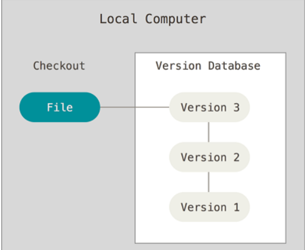
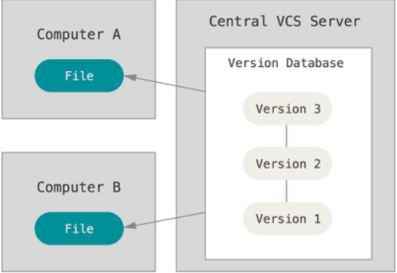
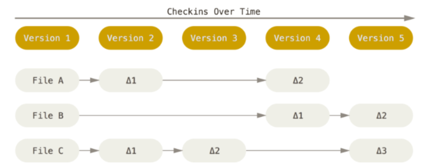
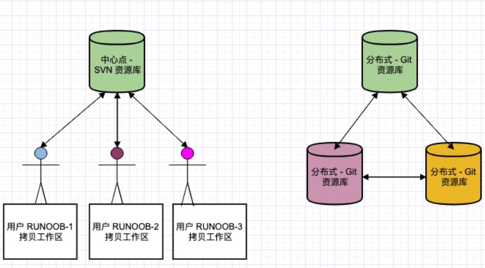
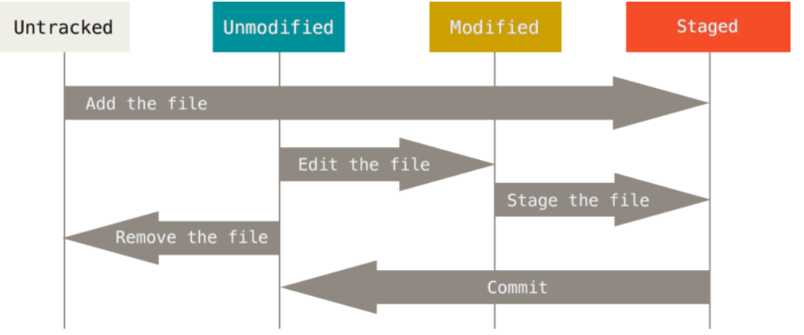
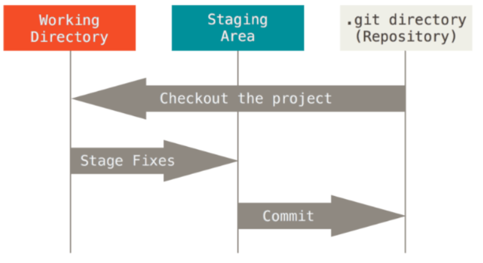
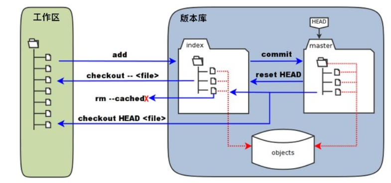
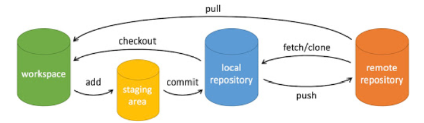

# 一、git简介

## 1. 版本控制

### 1.1. 什么是版本控制

版本控制是一种记录一个或若干文件内容变化，以便将来查阅特定版本修订情况的系统。 除了项目源代码之外，你还可以对任何类型的文件进行版本控制。

### 1.2. 为什么要版本控制

有了它你就可以将某个文件回溯到之前的状态，甚至将整个项目都回退到过去某个时间点的状态，你可以比较文件的变化细节，查出最后是谁修改了哪个地方，从而找出导致怪异问题出现的原因，又是谁在何时报告了某个功能缺陷等等。

### 1.3. 本地版本控制系统

许多人习惯用复制整个项目目录的方式来保存不同的版本，或许还会改名加上备份时间以示区别。 这么做唯一的好处就是简单，但是特别容易犯错。 有时候会混淆所在的工作目录，一不小心会写错文件或者覆盖意想外的文件。

为了解决这个问题，人们很久以前就开发了许多种本地版本控制系统，大多都是采用某种简单的数据库来记录文件的历次更新差异。


### 1.4. 集中化的版本控制系统

接下来人们又遇到一个问题，如何让在不同系统上的开发者协同工作？ 于是，集中化的版本控制系统（Centralized Version Control Systems，简称 CVCS）应运而生。

集中化的版本控制系统都有一个单一的集中管理的服务器，保存所有文件的修订版本，而协同工作的人们都通过客户端连到这台服务器，取出最新的文件或者提交更新。


这么做虽然解决了本地版本控制系统无法让在不同系统上的开发者协同工作的诟病，但也还是存在下面的问题：

* 单点故障： 中央服务器宕机，则其他人无法使用；如果中心数据库磁盘损坏有没有进行备份，你将丢失所有数据。本地版本控制系统也存在类似问题，只要整个项目的历史记录被保存在单一位置，就有丢失所有历史更新记录的风险。
* 必须联网才能工作： 受网络状况、带宽影响。

### 1.5. 分布式版本控制系统

于是分布式版本控制系统（Distributed Version Control System，简称 DVCS）面世了。 Git 就是一个典型的分布式版本控制系统。

这类系统，客户端并不只提取最新版本的文件快照，而是把代码仓库完整地镜像克隆到自己的一个本地版本库。 这么一来，任何一处协同工作用的服务器发生故障，事后都可以用任何一个镜像出来的本地仓库恢复。 因为每一次的克隆操作，实际上都是一次对代码仓库的完整备份。


分布式版本控制系统与集中式版本控制系统有何不同呢？

- 首先，分布式版本控制系统根本没有“中央服务器”，每个人的电脑上都是一个完整的版本库，这样，你工作的时候，就不需要联网了，因为版本库就在你自己的电脑上。当你修改了某个文件后，可以提交代码到本地仓库、查看log、创建项目分支等等。
- 既然每个人电脑上都有一个完整的版本库，那多个人如何协作呢？比方说你在自己电脑上改了文件A，你的同事也在他的电脑上改了文件A，这时，你们俩之间只需把各自的修改推送给对方，就可以互相看到对方的修改了。
- 和集中式版本控制系统相比，分布式版本控制系统的安全性要高很多，因为每个人电脑里都有完整的版本库，某一个人的电脑坏掉了不要紧，随便从其他人那里复制一个就可以了。而集中式版本控制系统的中央服务器要是出了问题，所有人都没法干活了。

在实际使用分布式版本控制系统的时候，其实很少在两人之间的电脑上推送版本库的修改，因为可能你们俩不在一个局域网内，两台电脑互相访问不了，也可能今天你的同事病了，他的电脑压根没有开机。因此，分布式版本控制系统通常也有一台充当“中央服务器”的电脑，但这个服务器的作用仅仅是用来方便“交换”大家的修改，没有它大家也一样干活，只是交换修改不方便而已。


分布式版本控制系统的优势不单是不必联网这么简单，后面我们还会看到 Git 极其强大的分支管理等功能。


## 2. git简介

### 2.1. git是什么？
Git 是一个开源的分布式版本控制软件，用于敏捷高效地处理任何或小或大的项目。Git 是 Linus Torvalds 为了帮助管理 Linux 内核开发而开发的一个开放源码的版本控制软件。Git 与常用的版本控制工具 CVS, Subversion 等不同，它采用了分布式版本库的方式，<u>不必服务器端软件支持</u>。

git的作用：版本控制 团队协作

>什么是版本控制：企业真实案例：开发了a功能，之后项目所要改成b功能，开发完之后又要改c功能，最后又说还是用回a功能。 没有git等版本控制软件之前，如何做版本控制。 有了git之后，如何做版本控制。


### 2.2. Git 与其他版本管理系统的区别

Git 在保存和对待各种信息的时候与其它版本控制系统有很大差异，尽管操作起来的命令形式非常相近，理解这些差异将有助于防止你使用中的困惑。


Git 其他版本管理系统的主要差别：对待数据的方式：

* 大部分版本控制系统（CVS、Subversion、Perforce、Bazaar 等等）都是以文件变更列表的方式存储信息，这类系统将它们保存的信息看作是一组基本文件和每个文件随时间逐步累积的差异。具体原理如下图所示，理解起来其实很简单，每个我们对提交更新一个文件之后，系统记录都会记录这个文件做了哪些更新，以增量符号Δ(Delta)表示。
    * 我们怎样才能得到一个文件的最终版本呢？我们只需要将这些原文件和这些增加进行相加就行了。
    * 这种方式有什么问题呢？ 比如我们的增量特别特别多的话，如果我们要得到最终的文件是不是会耗费时间和性能。


* Git采用的是直接记录快照的方式，而非差异比较。Git 不按照以上方式对待或保存数据。 反之，Git 更像是把数据看作是对小型文件系统的一组快照。 每次你提交更新，或在 Git 中保存项目状态时，它主要<u>对当时的全部文件制作一个快照并保存这个快照的索引</u>。 为了高效，如果文件没有修改，Git 不再重新存储该文件，而是只保留一个链接指向之前存储的文件。 Git 对待数据更像是一个快照流。

  * 


###  2.3. Git 与 SVN 其他区别点

1. Git是分布式的，SVN 不是： 这是 Git 和其它非分布式的版本控制系统，例如 SVN，CVS 等，最核心的区别。
    * 传统的版本控制软件 svn、cvs：每个客户端往中央服务器进行提交.如果中央服务器宕机了，整个团队很难进行协作开发。
2. Git 把内容按元数据方式存储，而 SVN 是按文件： 所有的资源控制系统都是把文件的元信息隐藏在一个类似 .svn、.cvs 等的文件夹里。
3. Git 分支和 SVN 的分支不同： 分支在 SVN 中一点都不特别，其实它就是版本库中的另外一个目录。
4. Git 没有一个全局的版本号，而 SVN 有：目前为止这是跟 SVN 相比 Git 缺少的最大的一个特征。
5. Git 的内容完整性要优于 SVN： Git 的内容存储使用的是 SHA-1 哈希算法。这能确保代码内容的完整性，确保在遇到磁盘故障和网络问题时降低对版本库的破坏。

git相比于他们最大的优势就在于git是分布式的。每个客户端有自己的服务器，进行本地版本控制。然后可以提交到git中央服务器。


企业真实案例： svn服务器欠费，急需发版本。所有人不能通过中央服务器去拿代码，只能找其中一个代码相对全的员工，然后互相拷贝，发布。带来的问题非常严重，如果对比的不够仔细，会导致整个项目发版有问题。

Git允许多个远程仓库存在。即每个开发者有自己的仓库的写权限和其他仓库的读权限

* 使得这样一种工作流成为可能：每个开发者拥有自己仓库的写权限和其他所有人仓库的读权限。 这种情形下通常会有个代表官方项目的权威的仓库。 要为这个项目做贡献，你需要从该项目克隆出一个自己的公开仓库，然后将自己的修改推送上去。 接着你可以请求官方仓库的维护者拉取更新合并到主项目。 维护者可以将你的仓库作为远程仓库添加进来，在本地测试你的变更，将其合并入他们的分支并推送回官方仓库。


初识github

* 全球最大的同性交友网站：https://github.com/


## 3. window与linux双环境安装git

在使用Git前我们需要先安装 Git。Git 目前支持 Linux/Unix、Solaris、Mac和 Windows 平台上运行。

Git 各平台安装包下载地址为：http://git-scm.com/downloads

### 3.1. windows下面安装git
下载git 到git官网 https://git-scm.com/上下载，自行选择合适系统的。如果是win版本的，直接按默认安装即可

安装GitBash 以及Git GUI。完成安装之后，就可以使用命令行的 git 工具（已经自带了 ssh 客户端）了，另外还有一个图形界面的 Git 项目管理工具

验证是否安装成功：

- 鼠标右击 显示git图标
- 选择 Git Bash Here 进入shell控制台，输入 git --version  可查看版本

```bash
lizengcai@DESKTOP-KVDE6VV MINGW64 ~/Desktop
$ git --version
git version 2.30.1.windows.1
```


### 3.2. linux上安装，以centos 6.6为例


Git 的工作需要调用 curl，zlib，openssl，expat，libiconv 等库的代码，所以需要先安装这些依赖工具。各 Linux 系统可以使用其安装包管理工具（apt-get、yum 等）进行安装：


Centos/RedHat 编译git源码安装:


* 到下面的网站下载合适的版本 https://mirrors.edge.kernel.org/pub/software/scm/git/  选择git-2.9.5.tar.gz
* 安装git的依赖项
    * yum install curl-devel expat-devel gettext-devel openssl-devel zlib-devel
    * yum install gcc perl-ExtUtils-MakeMaker
* 移除已经安装的git
    * yum remove git
* 解压 tar -zxvf git-2.25.0.tar.gz  -C /usr/local/  并cd git 解压目录 
* 预编译git
    * ./configure --prefix=/usr/local/git-2.25.0
* 编译并安装git
    *  make && make install
*  将git的脚本软连接到/usr/bin/ 目录下
    *  ln -s /usr/local/git-2.25.0/bin/* /usr/bin/
* git安装完成，查看版本
    * git --version

## 4. git工作流程

本章节我们将为大家介绍 Git 的工作流程。

一般工作流程如下：

1. 克隆 Git 资源作为本地工作目录。
2. 在克隆的资源上添加或修改文件。
3. 如果其他人修改了，你可以更新资源。
4. 在提交到本地仓库之前可以检查自己的修改。
5. 提交修改到本地仓库。
6. 在修改完成后，如果发现错误，可以撤回提交并再次修改并提交。
7. 推送已提交的修改到远程仓库

下图展示了 Git 的工作流程：


# 二、git的基本概念以及入门级命令


## 1. git基本概念

### 1.1. git文件状态



* 未跟踪（Untracked）未跟踪, 此文件在文件夹中, 但并没有加入到git库, 不参与版本控制. 通过`git add` 状态可以变为`Staged`
* 已暂存（staged）：暂存状态(文件在暂存区内)。表示对一个已修改文件的当前版本做了标记，使之包含在下次提交的快照中。
  * 之后如果执行 `git commit`则将修改同步到库中, 这时库中的文件和本地文件又变为一致, 文件为`Unmodify`状态. 
  * 之后如果执行 `git reset HEAD filename` 取消暂存, 文件状态为`Modified`
* 已提交（`Unmodify`）：数据已经安全的保存在本地数据库中。
  *  文件已经入库, 未修改, 即版本库中的文件快照内容与文件夹中完全一致. 
  *  这种类型的文件有两种去处, 如果它被修改, 而变为`Modified`. 如果使用`git rm`移出版本库, 则成为`Untracked`文件
* 已修改（modified）：已修改表示修改了文件(仓库中已有文件进行了修改)，但还没保存到数据库中。
  * 文件已修改, 仅仅是修改, 并没有进行其他的操作. 
  * 这个文件也有两个去处, 通过`git add`可进入暂存`staged`状态, 使用`git checkout` 则丢弃修改过, 返回到`unmodify`状态, 这个`git checkout`即从库中取出文件, 覆盖当前修改

### 1.2. 工作区域的概念

* 工作区：工作的区域。例如新建了一个项目，该项目所在的文件目录为工作区。
* 暂存区: 将变更暂时存起来的地方。英文叫 stage 或 index。一般存放在 .git 目录下的 index 文件（.git/index）中，所以我们把暂存区有时也叫作索引（index），
* 本地仓库: 使用git init指定的地方为本地仓库，本地仓库下有.git文件夹。这个隐藏目录 .git，不算工作区，而是 Git 的版本库。
* 远程仓库: 不在本地，在网络上的其他地方。



1、基本的 Git 工作流程如下：

1. 在工作目录中修改文件。
2. 暂存文件，将文件的快照放入暂存区域。
3. 提交更新，找到暂存区域的文件，将快照永久性存储到 Git 仓库目录。


2、工作区、版本库中的暂存区和版本库之间的关系：



图中左侧为工作区，右侧为版本库。在版本库中标记为 "index" 的区域是暂存区（stage/index），标记为 "master" 的是 master 分支所代表的目录树。

图中我们可以看出此时 "HEAD" 实际是指向 master 分支的一个"游标"。所以图示的命令中出现 HEAD 的地方可以用 master 来替换。

图中的 objects 标识的区域为 Git 的对象库，实际位于 ".git/objects" 目录下，里面包含了创建的各种对象及内容。

1. 当对工作区修改（或新增）的文件执行 `git add` 命令时，暂存区的目录树被更新，同时工作区修改（或新增）的文件内容被写入到对象库中的一个新的对象中，而该对象的ID被记录在暂存区的文件索引中。
2. 当执行提交操作（`git commit`）时，暂存区的目录树写到版本库（对象库）中，master 分支会做相应的更新。即 master 指向的目录树就是提交时暂存区的目录树。
3. 当执行 `git reset HEAD` 命令时，暂存区的目录树会被重写，被 master 分支指向的目录树所替换，但是工作区不受影响。
4. 当执行 `git rm --cached <file>` 命令时，会直接从暂存区删除文件，工作区则不做出改变。
5. 当执行 `git checkout .` 或者 `git checkout -- <file>` 命令时，会<u>用暂存区全部或指定的文件替换工作区的文件。这个操作很危险，会清除工作区中未添加到暂存区的改动</u>。
6. 当执行 `git checkout HEAD .` 或者 `git checkout HEAD <file>` 命令时，<u>会用 HEAD 指向的 master 分支中的全部或者部分文件替换暂存区和以及工作区中的文件</u>。这个命令也是极具危险性的，因为不但会清除工作区中未提交的改动，也会清除暂存区中未提交的改动


## 2. 入门级命令（本地仓库打交道）

1、为什么建议使用命令行的方式操作git？

* 命令行会了，图形界面的操作时完全没问题的，反之，则不然
* 有些地方如linux服务器，没有图形界面，如果碰到问题需要使用git，不会命令行操作啥都干不了

2、git 本地操作  右击打开Git Bash 

- git --help 调出Git的帮助文档  或者直接输入git回车
- git +命令 --help  查看某个具体命令的帮助文档 ，直接浏览器打开以html形式显示

- git --version 查看git的版本 


- git init 在当前目录下生成空的本地仓库，初始化仓库。同时会生成.git目录
  - .git目录包含了资源的所有元数据，其他的项目目录保持不变
  - 注意这里不像 SVN 会在每个子目录生成 .svn 目录，Git 只在仓库的根目录生成 .git 目录

- git add 文件( * 表示所有) 将工作区的文件添加到暂存区
  - git add Test.txt

- git config 进行git配置。
  - 初次commit之前，需要配置用户邮箱及用户名，使用以下命令
  - git config --list 显示当前的 git 配置信息
- 编辑 git 配置文件, 配置用户邮箱及用户名。加上--global 表示全局配置,否则只对当前仓库有效
    * git config --global user.email "you@example.com"
    * git config --global user.name "Your Name"

- git commit 将暂存区里的文件提交到本地仓库
  - -m 添加注释 git commit -m  "this is a test"
  - 使用-m选项说写一段概要说明 日常在使用commit的时候，-m选项所写得内容一定不能随便写。 应该写具体的概要内容： “修改了登陆的bug”--》“新增用户管理中心”


## 3. git的入门级命令（远程仓库）

一般会有一个远程仓库，开发人员去拉取代码，并将变更提交到远程仓库。

1、github上新建一个远程仓库。+ -》new repository  选择Public ，使用Private会收费。

- 远程仓库的地址： https://github.com/lizengcai/springboot-demo.git 项目路径 + .git 

2、相关命令：

- git clone 克隆远程项目到本地
  - git clone https://gitee.com/lizc_io/mall.git

- git remote 用于管理远程仓库，下面有多个命令组合。
  - git remote -v   显示所有远程仓库 origin 为远程地址的别名
  - git remote add <shortname> <url>  # 为本地仓库添加一个远程仓库，命名为name. name可以任意名字
      - git remote add origin https://github.com/lizengcai/springboot-demo.git
  - git remote rm name  # 删除远程仓库
  - git remote rename old_name new_name  # 修改仓库名

- git push 命用于从将本地的分支版本上传到远程并合并。
  - git push <远程主机名> <本地分支名>:<远程分支名>  如果本地分支名与远程分支名相同，则可以省略<远程分支名>
  - git push -u origin master 往名字为origin的仓库的master分支上提交变更。输入用户名以及密码进行提交，用户名在github里面进行查看。
  - 刷新github上面的远程仓库可以看到提交上来的变更。
- git pull origin master --allow-unrelated-histories
    - `git pull`下载远程代码并合并。不建议使用， 等同于fetch之后直接强制merge合并，可能会出现很多问题。建议先fetch之后进行比对然后合并
    - 本地仓库和远程仓库第一次拉取需要指定--allow-unrelated-histories，因为是两个独立的仓库
      - 不指定报错 refusing to merge unrelated histories
      - 或者先拉取本地仓库，然后将代码放入到本地仓库，这样就是一个仓库

- git fetch 用于从远程获取代码库。
  - 成员对远程仓库代码进行了更新，拉取远程仓库的变更到本地仓库的暂存区
  - 该命令执行完后需要执行 git merge 远程分支到你所在的分支。

- git merge [alias]/[branch] 将服务器上的任何更新（假设有人这时候推送到服务器了）合并到你的当前分支
  - git merge origin/master 将某origin远程的变更，合并到本地仓库的master分支

整个流程：




## 4. git的文件状态以及相关命令

1、git文件状态：

* Untracked  ---> 新建文件,在工作区，未添加到仓库
* Staged  ---> 使用add命令将新建或修改的文件加入到暂存区，表示对一个已修改文件的当前版本做了标记，使之包含在下次提交的快照中
* committed（unmodified）   --->  使用commit命令将暂存区的文件提交到本地仓库，此时工作区和仓库中的版本一致，状态为unmodified
* 如果对 committed状态的文件进行修改---> modified
* 如果对committed状态的文件进行remove操作--->Untracked

2、相关命令

- git ls-files  # 查看暂存区中文件信息

- git status  # 用于查看文件的状态 
  - git status Test1.txt
  - git status -s 通常我们使用 -s 参数来获得简短的输出结果

- git rm <file> # 用于git文件的删除操作 
  - git rm <file> 将文件从暂存区和工作区中删除 
      - git rm runoob.txt   从暂存区和工作区中删除 runoob.txt 文件
      - 可以使用git checkout master runoob.txt 从本地仓库进行恢复
  - 如果删除之前修改过并且已经放到暂存区域的话，则必须要用强制删除选项 `-f`
    - `git rm -f runoob.txt`  强行从暂存区和工作区中删除修改后的 runoob.txt 文件
  - git rm --cached <file>  仅删除暂存区里的文件，此时文件如果为新增则为untracked,如果为修改则为unmodified
  - git rm –r * 递归删除

- git checkout 使用时得仔细，否则会直接覆盖已经修改的代码
  - git checkout Test1.txt   直接加文件名，<u>从暂存区将文件恢复到工作区</u>，如果工作区已经有该文件，则会选择覆盖
  - git checkout master Test1.txt  【分支名】+文件名 则表示从分支名为所写的分支中拉取文件 并覆盖工作区和暂存区里面的文件


# 三、git的图形化客户端

## 1. 图形化客户端: sourcetree

下载: https://www.sourcetreeapp.com/

安装: 由于种种不可描述的原因，无法注册账号且无法登陆所以需要绕过登陆

绕过登陆： 去到 C:\Users\当前用户目录\AppData\Local\Atlassian\SourceTree 目录下 新建 accounts.json 文件 将一下内容复制进去

` [ { "type": "SourceTree.Api.Host.Identity.Model.IdentityAccount, SourceTree.Api.Host.Identity", "Authenticate": true, "HostInstance": { "type": "SourceTree.Host.Atlassianaccount.AtlassianAccountInstance, SourceTree.Host.AtlassianAccount", "Host": { "type": "SourceTree.Host.Atlassianaccount.AtlassianAccountHost, SourceTree.Host.AtlassianAccount", "Id": "atlassian account" }, "BaseUrl": "https://id.atlassian.com/" }, "Credentials": { "type": "SourceTree.Model.BasicAuthCredentials, SourceTree.Api.Account", "Username": "", "Email": null }, "IsDefault": false } ]`

使用

* 点击add 添加本地仓库路径，自动进行补全。
* 对未暂存文件进行筛选，可以直接选暂存所有，然后提交
* 在master下可以看到提交的历史。
* 点击推送 可以推送到github上面


# 四、git的分支

## 1. 什么是分支

软件项目中启动一套单独的开发线的方法。分支是用来将特性开发绝缘开来的。在你创建仓库的时候，master 是“默认的”分支。在其他分支上进行开发，完成后再将它们合并到主分支上。

我们通常在开发新功能、修复一个紧急 bug 等等时候会选择创建分支。


## 2. 分支相关的命令

* git branch 分支名  新建分支  git branch dev

  * 创建分支的时候，分支名不用使用特殊符号  *  / 这些

* git branch 不加任何参数，列出所有的分支，分支前面有 * 号的，代表该分支为当前所在分支
* git branch -d 分支名   删除分支，不能删除当前所在的分支
* git branch -m 旧分支名 新分支名   修改分支名称
* git checkout 分支名 切换分支   

  * git checkout master   切换到主分支
  * 如果在分支上面对文件进行修改之后，没有commit就切换到另外一个分支b， 这个时候会报错，因为没有commit的文件在切换分支之后会不覆盖。所以Git 报错提示。
    * git checkout -f 分支名 强制切换到分支，如果当前有未提交的变更，会直接丢弃 
      * -f 参数一定一定要非常非常小心使用，一般情况下不建议使用，除非真的要强制去执行
  * 创建分支并切换过去
    * git checkout -b feature_x

* git push origin  将分支推送到远端仓库（推送成功后其他人可见）：

  *  先切换到对应的分支再进行推送

* git merge 分支名 分支合并, 拿指定的分支名与当前分支进行合并，强制合并，如果有冲突会提示冲突的信息

  * git diff --name-only --diff-filter=U 用于查看产生冲突的文件


# 五、其他命令


## 1. `git log` 命令

1、log 命令的作用

用于查看git的提交历史。 在提交了若干更新，又或者克隆了某个项目之后，你也许想回顾下提交历史。 完成这个任务最简单而又有效的工具是 `git log` 命令。`git log` 会按提交时间列出所有的更新，最近的更新排在最上面。

2、git log显示信息的具体含义

```
commit 4a70ceb24b6849ad830d6af5126c9227b333d2d1    --SHA-1 校验和 commit id 
Author: wiggin wiggin@gmail.com                                --作者跟邮箱概要信息 
Date: Wed May 16 23:51:02 2018 +0800                         --提交时间
```

3、命令使用：

* git log -数字                      --表示查看最近几次的提交
* git log -p -2                     --显示最近两次提交的不同点
* git log --author 名称              --查看具体某个作者的提交
* git log --oneline                --输出历史记录简要的信息
* git log --graph                  --以一个简单的线串联起整个提交历史，查看历史中什么时候出现了分支、合并.更清楚明了地看到何时工作分叉、又何时归并
* git log                          --输出信息的定制
* git log --reverse --oneline        --逆向显示所有日志


## 2. `git diff`  文件对比利器

diff -->difference 的缩写，用于比较差异
使用场景:  1、解决冲突    2、制作补丁

命令使用：

- git diff 不加任何参数。
  - 用于比较当前工作区跟暂存区的差异
- git diff --cached 或者--staged 
  - 比较暂存区和当前分支的差异
- git diff HEAD 
  - 比较当前工作区和当前分支的差异。HEAD指向当前分支的指针。
- git diff 分支名 
  - 查看当前分支跟指定的分支的差异
- git diff 分支名1 分支名2 
  - 查看两个指定分支(已提交的)的差异，分支2 跟分支1的差别
- git diff 文件名 
  - 查看指定文件的差异
- git diff commitid1 commitid2 
  - 用于列出两个历史提交的差异。使用 git log查看提交的id
- git diff --stat 
  - 用于罗列当前分支有本地变更的文件


> +号表示增加   -号表示删除


## 3. 更改提交状态(撤销操作)

1、前提：

- 将不必要的文件add
- 上次提交觉得是错的
- 不想改变暂存区内容，只是想调整提交的信息
- 版本回滚

2、命令

*  git commit --amend

   * 有时候我们提交完了才发现漏掉了几个文件没有添加，或者提交信息写错了。 此时，可以运行带有 --amend 选项的提交命令尝试重新提交：
*  git reset [--soft | --mixed | --hard] [HEAD]  命令用于回退版本，可以指定退回某一次提交的版本
   * HEAD  head指向当前分支
   *  --soft 只是将HEAD引用指向指定的提交，工作区跟暂存区的内容不会改变
   *  --mixed 为默认，可以不用带该参数，用于重置暂存区的文件与上一次的提交(commit)保持一致，工作区文件内容保持不变。
   *  --hard 将HEAD指向指定的提交，暂存区跟工作区都会改变
     * 谨慎使用 –hard 参数，它会删除回退点之前的所有信息

   *  git reset HEAD 文件名  移除不必要的添加到暂存区的文件
     * git reset HEAD file2
     * 不指定文件名，表示移除所有暂存区的文件
   *  git reset HEAD^ 或者 commitid  回退到上一次或指定的提交
     * git reset HEAD^   # 回退所有内容到上一个版本    
       *  HEAD^ 上一个版本   HEAD^^ 上上一个版本   HEAD^^^ 上上上一个版本
     * git reset HEAD^ hello.php  # 回退 hello.php 文件的版本到上一个版本  
     * git log --oneline   # 查看提交次数获取 commitid
*  git checkout  使用时得仔细，否则会直接覆盖已经修改的代码
   *  git checkout Test1.txt   直接加文件名，<u>从暂存区将文件恢复到工作区</u>，如果工作区已经有该文件，则会选择覆盖
   *  git checkout master Test1.txt  【分支名】+文件名 则表示<u>从所写的分支中拉取文件 并覆盖工作区里的文件</u>


# 六、git的标签

## 1. tag命令

如果你达到一个重要的阶段，并希望永远记住那个特别的提交快照，你可以使用 git tag 给它打上标签。

相关命令：

* git tag  不加任何参数 表示显示标签（按字母序） 非按时间
* git tag 标签名  默认是给最近的一次提交打上标签
  * git tag v0.1
  * git tag -a v1.0 
    * -a 选项意为"创建一个带注解的标签"。 不用 -a 选项也可以执行的，但它不会记录这标签是啥时候打的，谁打的，也不会让你添加个标签的注解。
* git tag 标签名 commitId  给指定的提交打上标签
  * 先查看提交的id  git log --oneline
* git show 标签名 显示该标签相关的那次提交的相关信息
* git tag -d 标签名 删除该标签
* git push 远程分支名 标签名 把某个标签（必须是本地已存在的，否则推动失败） 推送到远程分支
* 删除远程标签的步骤
  * 删除本地标签 git tag -d 标签名

  * 在删除远程的 git push origin :refs/tags/标签名


# 七、.gitignore

## 1. 什么是.gitignore文件
git软件要忽略的文件列表，如果要忽略某些文件，在Git工作区的根目录下创建一个特殊的.gitignore文件，然后把要忽略的文件名填进去，Git就会自动忽略这些文件

> .gitignore只能忽略那些原来没有被track（之前没有add过）的文件，如果某些文件已经被纳入了版本管理中，则修改.gitignore是无效的。

## 2. 为什么要使用.gitignore 文件

* 大量与项目无关的文件全推到远程仓库上，同步的时候会非常慢，且跟编辑器相关的一些配置推上去之后，别人更新也会受其影响。所以，我们使用该文件，对不必要的文件进行忽略，使其不被git追踪。
* 一般情况下，.gitignore文件，在项目一开始创建的时候就创建，并推送到远程服务器上。这样大家初次同步项目的时候，就是用到该文件，避免以后，团队成员把与项目无关的文件，传到远程服务器上


## 3. 使用
* 项目刚开始，根目录下创建.gitignore
    * 使用git bash在项目根目录下执行 `touch .gitignore`
    * 初次同步项目的时候，就是用到该文件，避免以后，团队成员把与项目无关的文件，传到远程服务器上

* 对于已经提交到远程或本地仓库的文件，.gitignore配置之后不会生效。我们必须先删除本地暂存区里的文件，之后**在暂存区加上.gitignore 文件并提交以及推送到远程上面**，最后再把变更添加然后提交到远程仓库上
    * git rm --cached 文件名从暂存区删除某个文件
    * git rm -rf --cached 文件夹 表示递归删除暂存区该文件夹的所有东西


```
*.log                     表示忽略项目中所有以.log结尾的文件 
123?.log               表示忽略项目中所有以123加任意字符的文件
/error.log             表示忽略项目中根目录中的error.log 这个文件 
src/main/test/      表示忽略/src/main/test/目录下的所有文件 
*.class 
**/java/                   匹配所有java目录下的所有文件
!/error.log             表示在之前的匹配规则下，被命中的文件，可以使用!对前面的规则进行否定
```

.gitignore spring模板

```
HELP.md
target/
!.mvn/wrapper/maven-wrapper.jar
!**/src/main/**/target/
!**/src/test/**/target/

### STS ###
.apt_generated
.classpath
.factorypath
.project
.settings
.springBeans
.sts4-cache

### IntelliJ IDEA ###
.idea
*.iws
*.iml
*.ipr


### VS Code ###
.vscode/
```