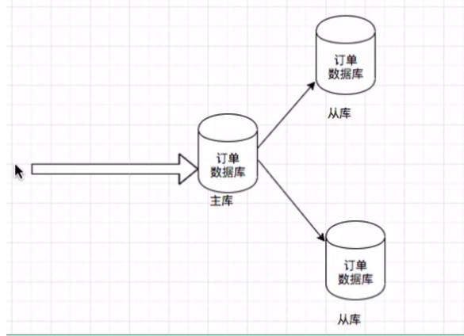
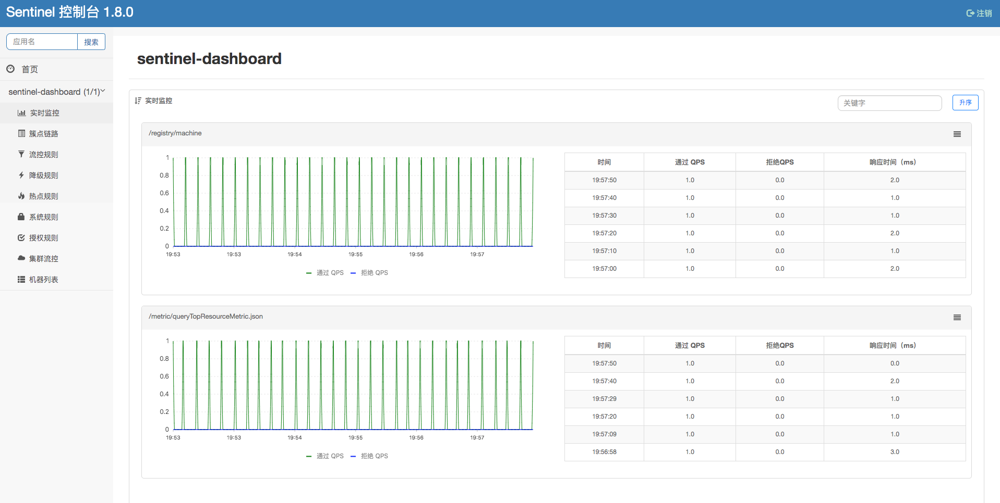

# 一、单机应用到分布式架构演进以及解决方案

## 1. 传统单机->分布式架构演进历史


1、单机架构

- 优点： 
  - 易于测试、便于集成、小型项目友好
- 缺点： 
  - 开发速度慢、启动时间长、依赖庞大
  - 前提是业务量已经上来了，功能模块更多。用户量到达上百万，产品一直在迭代。
    - 项目有很多个模块，涉及到很多个代码，需要依赖几百、几千个jar包，代码可能几十万行.
    - 别人修改东西之后拉去进行重起部署很耗时，开发效率很慢，大部分时间都在等代码的启动部署。
    - 因为项目依赖很多，需要占用比较大的物理内存，如果电脑的内存只有4g，可能连项目都起不来。


单机架构情况下对同一个应用集群部署多个节点，避免单点故障, 使用nginx进行负载均衡。


2、分布式架构

- SOA ：Service Oriented Architecture 面向服务的架构。其中包含多个服务，服务之间通过相互依赖最终提供一系列的功能, 一个服务通常以独立的形式存在与操作系统进程中, 各个服务之间<u>通过调度中心进行网络调用</u>。

- 微服务：将一个大的单体应用进行细粒度的服务化拆分，每个拆分出来的服务各自独立打包部署，各个服务之间通过网络调用。微服务粒度更小。

- SOA与微服务差别
    - SOA将应用拆分成多个服务，各个服务依赖于企业服务总线ESB，各个服务通过服务总线进行调用。
    - 微服务更轻量级，粒度更细，去掉了企业服务总线ESB。服务之间通过RPC或者HTTP直接进行调用


- 优点
    - 易开发、理解和维护
      - 原先单体应用代码整合到一块，每次启动的时候特别庞大，拉取下来之后启动时间很长。
  - 现在每几个人负责一个服务，只需关注自己的服务，每个服务代码量少对应的依赖包也少，启动项目不需占用太多内存，启动时间也很快。
    - 独立的部署和启动
      - 单体应用改了某一功能，需要重启整个项目，影响了线上的业务。
      - 拆分成微服务之后，修改了某一服务，只需重启对应的服务即可，不会影响其他业务。
  
- 缺点
    - 数据库事务
      - 单体应用操作数据库，不同的功能都在操作同一个数据库，事务方便控制
      - 微服务应用：分布式系统-》每个服务单独的数据库 -》存在分布式事务问题
        - 多个数据库之间的数据操作如何保证原子性、数据一致性。
    - 服务之间的管理（服务治理）
      - 服务之间如何发现与调用
    
    - 微服务一般有配套的设施解决上面的缺点


## 2. 微服务架构核心组件

微服务架构常见的核心组件

微服务核心组件图：


微服务常见组件：

1、网关

- 路由转发 + 过滤器
    - 过滤器
        - 比如在调用服务之前在网关里面判断用户是否登录
        - 除此之外还可以做很多的逻辑：比如限流、鉴权
    - 路由转发
        - 如果没有网关，需要记录每一个服务的ip地址、端口、路径。使用网关之后统一进行转发。用户根据路径请求到网关，网关根据用户请求的url进一步转发到对应的服务
            - `/api/v1/video/` 视频服务
            - `/api/v1/order/` 订单服务
            - `/api/v1/user/` 用户服务

2、服务发现注册(服务注册中心)

- 调用和被调用方的信息维护
- 每个服务启动的时候向注册中心上报自己的IP端口以及对外提供的接口服务，调用方进行调用的时候需要从注册中心拿到对应服务的信息保存到本地并进行调用
  - 调用方定时进行拉取服务方的信息更新到本地


3、配置中心
- 管理配置，动态更新application.properties
- 应用启动的时候会从配置中心拉取配置
- 可以做不同环境的配置切分。


4、链路追踪

- 分析调用链路耗时，调用各个服务的耗时进行追踪。（调用商品服务耗时多少、调用用户服务耗时多少）
- 例子：下单-》查询商品服务获取商品价格-》查询用户信息-》保存数据库


5、负载均衡器

- 每个服务集群部署多个节点，避免单点故障。被调用时可以进行负载均衡。分发流量到多个节点，降低压力

6、熔断与降级

- 熔断
  - 保护自己和被调用方
  - 当调用某一服务接口的时候，在某个时间段内调用失败或者超时的次数很多，如果开启了熔断，则在时间段内不会调用服务方，直接返回给客户。过了该时间段之后再次尝试去调用，如果可以则以后正常调用服务。
- 降级
  - 当系统访问量很大时，某些非核心的接口可以进行剃掉，不走非核心的业务逻辑。
  - 比如风控服务，风控服务不是必须的，如果访问量大，这些服务可以不进行调用


## 3. 业界微服务架构常见解决方案

1、ServiceComb

- 华为内部的CSE(Cloud Service Engine)框架开源, 一个微服务的开源解决方案,社区相对于下面几个比较小
- 文档不多，通信领域这块比较强

2、dubbo

- zookeeper + dubbo + springmvc/springboot
- 官方地址：http://dubbo.apache.org/#!/?lang=zh-cn
- 配套
    - 通信方式：rpc(远程方法调用)
    - 注册中心：zookeper/redis/nacos
    - 配置中心：diamond、nacos


3、SpringCloud

- 全家桶+轻松嵌入第三方组件(Netflix 奈飞)
- 一开始的时候，springcloud比较弱，把市面上比较强的开源项目拿过来进行整合，后来随着不断的发展，自己推出了中间件进行取代。
- 官网：https://spring.io/projects/spring-cloud
- 配套
    - 通信方式：http restful
        - 与rpc相比性能可能差一些，但是一般的微服务之间的调用基本都是在内网，性能差别不是很大。但是消息体http协议的偏大一些
    - 注册中心：eruka
        - 现在闭源，所以基本不用，但是很多公司以前的项目还在用。
    - 配置中心：config
    - 断路器：hystrix
        - 熔断限流，现在基本不怎么维护了，不用
    - 网关：zuul/gateway
        - zuul基本不用了，现在使用gateway
    - 分布式追踪系统：sleuth+zipkin


4、Spring Alibaba Cloud

- 全家桶+阿里生态多个组件组合+SpringCloud支持
- 和SpringCloud有很大的交集，本身属于Spring Cloud的一部分，可以很容易的和Spring Cloud的其他中间件进行整合。
- 官网 https://spring.io/projects/spring-cloud-alibaba

- 配套
    - 通信方式：http restful
        - 也可以使用rpc,因为本身是阿里体系的，对dubbo友好支持
    - 注册中心：nacos
    - 配置中心：nacos
        - nacos 同时用于注册中心和配置中心，方便进行管理
    - 断路器：sentinel
        - 阿里开源的熔断限流组件，经过了双十一双十二的考验。
    - 网关：gateway
        - SpringCloud的网关组件
    - 分布式追踪系统：sleuth+zipkin
        - 鹰眼（EagleEye）是阿里巴巴组件，但未开源
        - SpringCloud的链路追踪组件：sleuth+zipkin


# 二、微服务AlibabaCloud介绍和架构环境准备

## 1. AlibabaCloud核心组件介绍


1、官网介绍

- https://spring.io/projects/spring-cloud-alibaba#overview
- 

2、为什么要选择AlibabaCloud , 和SpringCloud的区别

- SpringCloud和AlibabaCloud组件存在很大交集，互相配合
- SpringCloud很多组件是基于第三方整合，目前多个已经不更新了，比如zuul、eureka、hystrix等
- AlibabaCloud 提供一站式微服务解决方法，已经和SpringCloud进行了整合，组件互相支持
  - 有些使用SpringCloud组件有些使用AlibabaCloud组件。


3、AlibabaCloud全家桶介绍

- https://spring.io/projects/spring-cloud-alibaba#overview  
  - 
- 点击gitHub图标查看对应的教程
  - https://github.com/alibaba/spring-cloud-alibaba
- 官方中文文档：https://github.com/alibaba/spring-cloud-alibaba/blob/master/README-zh.md
    - 服务注册发现：Nacos
    - 服务限流降级：Sentinel
    - 分布配置中心：Nacos
    - 服务网关：SpringCloud Gateway
    - 服务之间调用：Feign、Ribbon
    - 链路追踪：Sleuth+Zipkin
    - 分布式事务：Seata
    - 服务之间调用：
      - Dubbo RPC  如果想进一步提升性能可以使用dubbo rpc形式去做。
      - Http  

4、版本说明

> 【注意文档：】官方经常改地址，如果本课程的地址失效后重新搜索下找入口

- Spring5以上
- AlibabaCloud 版本 2.2.x https://spring.io/projects/spring-cloud-alibaba#learn
- SpirngCloud版本 Hoxton
    - 对应boot版本 2.2.x, 2.3.x
    - https://spring.io/projects/spring-cloud


SpirngCloud与SpringBoot版本关系：

| Release Train | Boot Version                     |
| ------------- | -------------------------------- |
| Hoxton        | 2.2.x, 2.3.x (Starting with SR5) |
| Greenwich     | 2.1.x                            |
| Finchley      | 2.0.x                            |
| Edgware       | 1.5.x                            |
| Dalston       | 1.5.x                            |

## 2. 在线教育微服务模块设计和环境准备

1、在线教育模块划分

- 视频服务
- 订单服务
- 用户服务

​	


2、必备基础环境
- JDK8以上版本+Maven3.5(采用默认仓库，使用私服可能有些包下载不下来)+IDEA旗舰版+Mysql5.7以上版本
 - 操作系统：Linux Centos7 64位(虚拟机) 或者Mac苹果系统
    - 虚拟机可以搜索博文
    - Windows有些软件会不兼容，且坑难排查
    - 学习期间务必关闭防火墙

3、课程围绕这个在线教育基础项目进行学习 小而精的方式学习微服务

## 3. 在线教育微服务数据库介绍和数据导入

1、采用3个数据库，<u>每个服务单独一个库</u>

- 视频服务数据库 
    - cloud_video
        - 
    - video表
- 用户服务数据库 
    - cloud_user
        - 
    - user表
- 订单服务数据库
    - cloud_order
        - 
    - video_order表

2、sql语句

```sql
CREATE TABLE `video` (
  `id` int(11) unsigned NOT NULL AUTO_INCREMENT,
  `title` varchar(524) DEFAULT NULL COMMENT '视频标题',
  `summary` varchar(1026) DEFAULT NULL COMMENT '概述',
  `cover_img` varchar(524) DEFAULT NULL COMMENT '封面图',
  `price` int(11) DEFAULT NULL COMMENT '价格,分',
  `create_time` datetime DEFAULT NULL COMMENT '创建时间',
  `point` double(11,2) DEFAULT '8.70' COMMENT '默认8.7，最高10分',
  PRIMARY KEY (`id`)
) ENGINE=InnoDB AUTO_INCREMENT=48 DEFAULT CHARSET=utf8;
```

```sql
INSERT INTO `video` (`id`, `title`, `summary`, `cover_img`, `price`, `create_time`, `point`)
VALUES
  (30, '互联网架构之JAVA虚拟机JVM零基础到高级实战', 'https://xdvideo-file.oss-cn-shenzhen.aliyuncs.com/video/2020/maven/%E8%AF%A6%E6%83%85%E5%9B%BE.png', 'https://xdvideo-file.oss-cn-shenzhen.aliyuncs.com/video/2020/maven/%E5%AE%98%E7%BD%91%E4%B8%BB%E5%9B%BE-mawen.png', 3980, '2021-06-24 22:14:00', 9.10),
  (40, '全新微信小程序零基础到项目实战', 'https://xdvideo-file.oss-cn-shenzhen.aliyuncs.com/video/2020/%E5%BE%AE%E4%BF%A1%E5%B0%8F%E7%A8%8B%E5%BA%8F/%E8%AF%A6%E6%83%85%E5%9B%BE.png', 'https://xdvideo-file.oss-cn-shenzhen.aliyuncs.com/video/2020/%E5%BE%AE%E4%BF%A1%E5%B0%8F%E7%A8%8B%E5%BA%8F/%E5%AE%98%E7%BD%91%E4%B8%BB%E5%9B%BE-%E5%B0%8F%E7%A8%8B%E5%BA%8F.png', 5980, '2021-01-18 22:14:00', 9.10),
  (41, '玩转搜索框架ElasticSearch7.x实战', 'https://xd-video-pc-img.oss-cn-beijing.aliyuncs.com/xdclass_pro/video/2019_backend/elasticsearch7_detail.jpeg', 'https://xd-video-pc-img.oss-cn-beijing.aliyuncs.com/xdclass_pro/video/2019_backend/elasticsearch7.png', 4880, '2021-01-10 22:14:00', 8.70),
  (45, 'Docker实战视频教程入门到高级dockerfile/compose-Harbor', 'https://xdvideo-file.oss-cn-shenzhen.aliyuncs.com/video/2020/Docker/%E8%AF%A6%E6%83%85%E5%9B%BE.jpeg', 'https://xdvideo-file.oss-cn-shenzhen.aliyuncs.com/video/2020/Docker/%E5%AE%98%E7%BD%91%E4%B8%BB%E5%9B%BE-docker.png', 5980, '2021-01-10 22:14:00', 9.30),
  (46, '新版javase零基础到高级教程小白自学编程', 'https://xdvideo-file.oss-cn-shenzhen.aliyuncs.com/video/2020/%E6%96%B0%E7%89%88javase/%E8%AF%A6%E6%83%85%E5%9B%BE.png', 'https://file.xdclass.net/video/2020/%E6%96%B0%E7%89%88javase/%E5%AE%98%E7%BD%91%E4%B8%BB%E5%9B%BE-javase.png', 3980, '2021-01-24 22:14:00', 8.80),
  (47, 'Nodejs教程零基础入门到项目实战前端视频教程', 'https://xdvideo-file.oss-cn-shenzhen.aliyuncs.com/video/2020/node/%E5%AE%98%E7%BD%91%E8%AF%A6%E6%83%85%E5%9B%BE-node.png', 'https://xdvideo-file.oss-cn-shenzhen.aliyuncs.com/video/2020/node/%E5%AE%98%E7%BD%91%E4%B8%BB%E5%9B%BE-node.png', 6980, '2021-01-24 22:14:00', 8.90);
```

```sql
CREATE TABLE `user` (
  `id` int(11) unsigned NOT NULL AUTO_INCREMENT,
  `phone` varchar(32) DEFAULT NULL,
  `pwd` varchar(128) DEFAULT NULL,
  `sex` int(2) DEFAULT NULL,
  `img` varchar(128) DEFAULT NULL,
  `create_time` datetime DEFAULT NULL,
  `role` int(11) DEFAULT NULL COMMENT '1是普通用户，2是管理员',
  `username` varchar(128) DEFAULT NULL,
  `wechat` varchar(128) DEFAULT NULL,
  PRIMARY KEY (`id`)
) ENGINE=InnoDB AUTO_INCREMENT=5 DEFAULT CHARSET=utf8mb4;
```

```sql
INSERT INTO `user` (`id`, `phone`, `pwd`, `sex`, `img`, `create_time`, `role`, `username`, `wechat`)
VALUES
  (1, '123', '666', 1, 'xdclass.net', '2021-09-09 00:00:00', 1, 'jack', 'xdclass6'),
  (2, '2323432', '794666918', 1, 'wwwww', '2020-05-20 04:54:01', 1, '小滴Anna姐姐', 'xdclass-anna'),
  (3, '2323432', 'xdclass-lw', 1, 'wwwww', '2020-05-20 04:54:42', 1, '二当家小D', 'xdclass1'),
  (4, '2323432', '3232323', 1, 'wwwww', '2020-05-20 04:55:07', 1, '老王', 'xdclass-lw');
```

```sql
CREATE TABLE `video_order` (
  `id` int(11) unsigned NOT NULL AUTO_INCREMENT,
  `out_trade_no` varchar(64) DEFAULT NULL COMMENT '订单唯一标识',
  `state` int(11) DEFAULT NULL COMMENT '0表示未支付，1表示已支付',
  `create_time` datetime DEFAULT NULL COMMENT '订单生成时间',
  `total_fee` int(11) DEFAULT NULL COMMENT '支付金额，单位分',
  `video_id` int(11) DEFAULT NULL COMMENT '视频主键',
  `video_title` varchar(256) DEFAULT NULL COMMENT '视频标题',
  `video_img` varchar(256) DEFAULT NULL COMMENT '视频图片',
  `user_id` int(12) DEFAULT NULL COMMENT '用户id',
  PRIMARY KEY (`id`)
) ENGINE=InnoDB AUTO_INCREMENT=42 DEFAULT CHARSET=utf8;
```


## 4. Maven聚合工程创建微服务项目

1、maven聚合工程

- xdclass-cloud  聚合工程，进行依赖管理
    - xdclass-common
      - 公共的实体类与工具类
    - xdclass-video-service
    - xdclass-user-service
    - xdclass-order-service

2、创建聚合工程(同时为父工程)  xdclass-cloud

- 记得删除聚合工程 src 目录
- 一般的父级项目的 packaging 都为 pom , packaging默认类型jar类型
- 依赖管理声明依赖以及版本 （maven仓库里面查看最新版本同时确保版本之间要一致）
    - spring-boot-dependencies依赖包含了springBoot的所有依赖声明比如 spring-boot-starter-web 
        - 2.3.3.RELEASE springboot依赖版本要用 2.2.x 或者 2.3.x
    - spring-cloud-dependencies
        - Hoxton.SR8
    - spring-cloud-alibaba-dependencies 
        - 2.2.1.RELEASE


```xml
<modelVersion>4.0.0</modelVersion>
<groupId>net.xdclass</groupId>
<artifactId>xdclass-cloud</artifactId>
<version>1.0-SNAPSHOT</version>
<modules>
    <module>xdclass-cloud-common</module>
    <module>xdclass-cloud-user</module>
    <module>xdclass-cloud-video</module>
    <module>xdclass-cloud-order</module>
</modules>

<!-- 一般来说父级项目的packaging都为pom，packaging默认类型jar类型-->
<packaging>pom</packaging>

<properties>
    <java.version>1.8</java.version>
</properties>


<dependencyManagement>
    <dependencies>
        <!--https://mvnrepository.com/artifact/org.springframework.boot/spring-boot-dependencies/2.3.3.RELEASE-->
        <dependency>
            <groupId>org.springframework.boot</groupId>
            <artifactId>spring-boot-dependencies</artifactId>
            <version>2.3.3.RELEASE</version>
            <type>pom</type>
            <scope>import</scope>
        </dependency>

        <!--https://mvnrepository.com/artifact/org.springframework.cloud/spring-cloud-dependencies/Hoxton.SR8-->
        <dependency>
            <groupId>org.springframework.cloud</groupId>
            <artifactId>spring-cloud-dependencies</artifactId>
            <version>Hoxton.SR8</version>
            <type>pom</type>
            <scope>import</scope>
        </dependency>

        <!--https://mvnrepository.com/artifact/com.alibaba.cloud/spring-cloud-alibaba-dependencies/2.2.1.RELEASE-->
        <dependency>
            <groupId>com.alibaba.cloud</groupId>
            <artifactId>spring-cloud-alibaba-dependencies</artifactId>
            <version>2.2.1.RELEASE</version>
            <type>pom</type>
            <scope>import</scope>
        </dependency>
    </dependencies>
</dependencyManagement>
<build>
    <plugins>
        <plugin>
            <groupId>org.springframework.boot</groupId>
            <artifactId>spring-boot-maven-plugin</artifactId>
            <configuration>
                <fork>true</fork>
                <addResources>true</addResources>
            </configuration>
        </plugin>
    </plugins>
</build>
```

3、创建子项目 xdclass-common 

- new -》 module  maven工程

4、创建3个子项目。

- new -》 module  maven项目
  - xdclass-video-service
  - xdclass-user-service
  - xdclass-order-service

- 子项目添加web开发所需依赖以及xdclass-common


```xml
<dependencies>
    <dependency>
        <groupId>org.springframework.boot</groupId>
        <artifactId>spring-boot-starter-web</artifactId>
    </dependency>

    <dependency>
        <groupId>net.xdclass</groupId>
        <artifactId>xdclass-common</artifactId>
        <version>1.0-SNAPSHOT</version>
    </dependency>
</dependencies>
```

注意: 从官方仓库下载，有些包maven下载慢，等待下载如果失败，删除本地仓库spring相关的包，重新执行 mvn install，下载慢需要静静等待。


## 5. 微服务Mybatis连接Mysql数据库

1、xdclass-common子项目下创建domain实体类，因为其他的服务都依赖。


```java
package net.xdclass.domain;
public class User {
    private Integer id;
    private String name;
    private String pwd;
    private String headImg;
    private String phone;
    private Date createTime;
    private String wechat;
    //生成setter和getter方法
}

public class Video {
    private Integer id;
    private String title;
    private String summary;
    private String coverImg;
    private Integer  price;
    private Date createTime;
    private Double point;
    //生成setter和getter方法
}

public class VideoOrder {
    private Integer id;
    private String outTradeNo;
    private Integer state;
    private Date createTime;
    private  Integer totalFee;
    private Integer videoId;
    private String videoTitle;
    private String videoImg;
    private Integer userId;
    //生成setter和getter方法
}
```

2、xdclass-video-service、xdclass-user-service、xdclass-order-service 导入Mybatis依赖+数据库配置


- 聚合工程pom.xml修改

  - 添加maven编译版本为1.8。默认为1.5。
  - 依赖管理添加 mybatis-spring-boot-starter

```xml
<properties>
    <java.version>1.8</java.version>
    <maven.compiler.source>1.8</maven.compiler.source>
    <maven.compiler.target>1.8</maven.compiler.target>
</properties>


<dependency>
    <groupId>org.mybatis.spring.boot</groupId>
    <artifactId>mybatis-spring-boot-starter</artifactId>
    <version>2.1.2</version>
    <type>pom</type>
    <scope>import</scope>
</dependency>
```

- 3个模块添加mybatis依赖和数据库驱动依赖


```xml
<dependency>
    <groupId>org.mybatis.spring.boot</groupId>
    <artifactId>mybatis-spring-boot-starter</artifactId>
</dependency>

<dependency>
    <groupId>mysql</groupId>
    <artifactId>mysql-connector-java</artifactId>
</dependency>
```


- 3个模块application.yml配置数据库连接（记得修改每个模块的端口、应用名称、数据库名称）

```yaml
server:
  ## 端口
  port: 9000

spring:
  application:
    ## 服务名称
    name: xdclass-video-service
  datasource:
    driver-class-name: com.mysql.cj.jdbc.Driver
    ## 数据库名称
    url: jdbc:mysql://127.0.0.1:3306/cloud_video?useUnicode=true&characterEncoding=utf-8&useSSL=false
    username: root
    password: xdclass.net

# 控制台输出sql、mybatis数据库字段下划线到实体类驼峰映射（下划线转驼峰）。
mybatis:
  configuration:
    log-impl: org.apache.ibatis.logging.stdout.StdOutImpl
    map-underscore-to-camel-case: true
```

3、连接测试

- 编写启动类  net.xdclass.VideoApplication
  
- ```java
    package net.xdclass;
    
    import org.springframework.boot.SpringApplication;
    import org.springframework.boot.autoconfigure.SpringBootApplication;
    
    @SpringBootApplication
    public class VideoApplication {
    
        public static void main(String[] args) {
            SpringApplication.run(VideoApplication.class,args);
        }
    }
    ```
  
- controller->service->mapper 开发
  - ```java
    @RestController
    @RequestMapping("api/v1/video")
    public class VideoController {
    
        @Autowired
        private VideoService videoService;
    
        @RequestMapping("find_by_id")
        public Object findById(int videoId){
            return  videoService.findById(videoId);
        }
    
    }
    ```
  
  - ```java
    @Service
    public class VideoServiceImpl implements VideoService {
    
        @Autowired
        private VideoMapper videoMapper;
    
        @Override
        public Video findById(int videoId) {
            return videoMapper.findById(videoId);
        }
    }
    ```
  
  - ```java
    @Repository
    public interface VideoMapper {
    
        @Select("select * from video where id = #{videoId}")
        Video findById(@Param("videoId") int videoId);
    }
    ```


- application配置扫描

```java
@MapperScan("net.xdclass.mapper")
@SpringBootApplication
public class VideoApplication {

    public static void main(String[] args) {
        SpringApplication.run(VideoApplication.class,args);
    }
}
```


## 6. 初探微服务之间的调用-下单购买视频

1、服务之间怎么调用：（内网进行调用）

- RPC:
    - 远程过程调用，像调用本地服务(方法)一样调用服务器的服务
    - 支持同步、异步调用
    - 客户端和服务器之间建立TCP连接，可以一次建立一个，也可以多个调用复用一次链接
    - RPC数据包小，不会有更多的头信息等。
    - 传输协议
      - protobuf
      - thrift
  - rpc：编解码，序列化，链接，丢包，协议
  
- Rest(Http):
    - http请求，支持多种协议和功能
    - 开发方便调试，成本低
    - http数据包大，包含头信息
    - java开发：restTemplate 或者 httpClient
- 微服务一般在内网进行部署，服务之间的调用在内网环境，http和rpc的调用速度没什么差别，主要在数据包的大小。在SpringCloud微服务架构中，业务都会被拆分成一个独立的服务，服务与服务的通讯是基于http restful的。

2、用户下单

订单服务->视频服务

- 根据视频服务初始化订单服务启动类、Controller、Service。

  - net.xdclass.OrderApplication

- 启动类注入 RestTemplate

  - ```java
    @Bean
    public RestTemplate getRestTemplate(){
        return new RestTemplate();
    }
    ```

- OrderController 根据id查询视频信息（价格和冗余信息）
  
  - ```java
    @RestController
    @RequestMapping("api/v1/video_order")
    public class OrderController {
    
        @Autowired
        private RestTemplate restTemplate;
    
        @RequestMapping("save")
        public Object save(int videoId){
            Video  video = restTemplate.getForObject("http://localhost:9000/api/v1/video/find_by_id?videoId="+videoId,Video.class);
            VideoOrder videoOrder = new VideoOrder();
            videoOrder.setVideoId(videoId);
            videoOrder.setVideoTitle(video.getTitle());
            videoOrder.setCreateTime(new Date());
            return  videoOrder;
        }
    
    }
    ```

3、分析服务调用存在的问题：

- 服务之间的IP信息写死
- 服务之间无法提供负载均衡
- 多个服务直接关系调用维护复杂


# 三、AlibabaCloud核心组件服务治理Nacos

## 1. 搭建基础环境

### 1.1. 虚拟机搭建

- virtualbox下安装centos7虚拟机安装虚拟机
    - CentOS Project官网 --> Get CentOS Now -->Minimal -->选择对应的网址下载。
    - 使用virtualbox新建虚拟机。新建按钮，输入相应名字centos101,分配内存，创建虚拟硬盘，动态分配。
    - 启动虚拟机安装，选择英文，对提示的地方进行设置。
- 配置虚拟机网络
    - 管理-->主机网络管理-->创建
        - 
        -  记住ipv4掩码 192.168.1.1 为虚拟机分配IP的时候，就在 192.168.1  这个上面分配ip地址
    - 选择虚拟机 设置--》网络
        - 启动网卡1--》NAT
            - 
        - 启动网卡2--》选择hostOnly
            - 
- 启动虚拟机修改ifcfg-enp0s3配置文件
    -  ping www.baidu.com 查看网络是否通
```sh
cd /etc/sysconfig/network-scripts/     
vi ifcfg-enp0s3     
ONBOOT=yes
```
- ifcfg-enp0s8 设置虚拟机的IP为固定IP

```sh
cp ifcfg-enp0s3 ifcfg-enp0s8     
vi ifcfg-enp0s8     去掉多余配置。
TYPE=Ethernet     
BOOTPROTO=static     
IPADDR=192.168.1.101     #指定IP地址
NETMASK=255.255.255.0 
NAME=enp0s8     
DEVICE=enp0s8     
ONBOOT=yes
```
- service network restart 重启网络服务

- FTP连接，使用SFTP协议进行连接

- 防火墙设置   

```sh
1、开放端口
firewall-cmd --zone=public --add-port=80/tcp --permanent   # 开放80端口
firewall-cmd --zone=public --remove-port=80/tcp --permanent  #关闭5672端口
firewall-cmd --reload   # 配置立即生效

2、查看防火墙所有开放的端口
firewall-cmd --zone=public --list-ports

3、关闭防火墙。如果要开放的端口太多，嫌麻烦，可以关闭防火墙，安全性自行评估
systemctl stop firewalld.service

4、查看防火墙状态
firewall-cmd --state
```


### 1.2. Linux服务器安装JDK8


1、安装JDK8环境

- 官方地址：http://www.oracle.com/technetwork/java/javase/downloads/jdk8-downloads-2133151.html

- 本地上传JDK1.8到服务器 /usr/local/software/jdk/
    - 解压：tar -zxvf jdk-8u181-linux-x64.tar.gz
    - 重命名 mv jdk1.8.0_181/ jdk8

- 配置全局环境变量 vim /etc/profile 配置：

```sh
JAVA_HOME=/usr/local/software/jdk/jdk8
CLASSPATH=$JAVA_HOME/lib/
PATH=$PATH:$JAVA_HOME/bin
export PATH JAVA_HOME CLASSPATH
```

- 环境变量立刻生效：source /etc/profile

- 查看安装情况 java -version

## 2. 什么是微服务的注册中心

简介：什么是注册中心和常见的注册中心有哪些

1、什么是注册中心（服务治理）

- 服务注册：服务提供者provider，启动的时候向注册中心上报自己的网络信息
- 服务发现：服务消费者consumer，启动的时候向注册中心上报自己的网络信息，拉取provider的相关网络信息到本地，进行定时维护
- 核心:服务管理,是有个服务注册表，心跳机制动态维护(长连接)，服务实例在启动时注册到服务注册表，并在关闭时注销。
  - 每个节点启动时向注册中心上报自己的元数据信息（IP、端口、提供的接口）同时会从注册中心拉取服务注册表到本地，在本地动态定时维护。
  - 如果某一个节点挂了，注册中心会有个心跳机制动态维护，剔除该节点

2、为什么要用

- 微服务应用和机器越来越多，调用方需要知道接口的网络地址，如果靠配置文件的方式去控制网络地址，对于动态新增机器，维护带来很大问题

3、主流的注册中心：zookeeper、Eureka、consul、etcd、Nacos

- AlibabaCloud搭配最好的是Nacos，且服务的注册发现之外，还支持动态配置服务
    - https://nacos.io/zh-cn/docs/quick-start.html
    - 参考图片(nacos官网)
        - 


## 3. AlibabaCloud注册中心Nacos实战
简介：介绍什么是Nacos和搭建实战

1、注册中心Nacos介绍
- 官网：https://nacos.io/zh-cn/

2、Linux/Mac安装Nacos

- 解压安装包
  - 需要安装JDK  https://www.oracle.com/java/technologies/javase/javase-jdk8-downloads.html
- 进入bin目录
- 启动 sh startup.sh -m standalone
  - 单节点方式启动
- 关闭 sh shutdown.sh
- 访问 localhost:8848/nacos
  - 默认端口 8848
  - 默认账号密码 nacos/nacos


## 4. 项目集成Nacos实现服务之间的调用

基于Nacos实现订单-视频服务之间的调用

参考文档：https://spring-cloud-alibaba-group.github.io/github-pages/hoxton/en-us/index.html#_spring_cloud_alibaba_nacos_discovery

1、视频/订单/用户服务集成Nacos(服务提供方/消费方)

- 添加依赖

```xml
<!--添加nacos客户端-->
<dependency>
     <groupId>com.alibaba.cloud</groupId>
     <artifactId>spring-cloud-starter-alibaba-nacos-discovery</artifactId>
</dependency>
```

- 配置Nacos地址
  - spring.cloud.nacos.discovery.server-addr

```yaml
server:
  port: 9000
spring:
  application:
    name: xdclass-video-service
  cloud:
    nacos:
      discovery:
        server-addr: 127.0.0.1:8848
```

- 启动类增加注解(服务提供方/消费方都需要)

```java
@EnableDiscoveryClient
```


2、服务之间的调用

```java
@Autowired
private DiscoveryClient discoveryClient;

@Autowired
private RestTemplate restTemplate;

@RequestMapping("save")
public VideoOrder save(int videoId){

    VideoOrder videoOrder = new VideoOrder();
    videoOrder.setVideoId(videoId);
    //上送serviceId 服务名 spring.application.name
    List<ServiceInstance> list = discoveryClient.getInstances("xdclass-video-service");
    //获取第一个服务
    ServiceInstance serviceInstance = list.get(0);
    //获取服务信息 IP + 端口， 通过restTemplate进行调用
    Video video = restTemplate.getForObject("http://"+serviceInstance.getHost()+":"+serviceInstance.getPort()+
            "/api/v1/video/find_by_id?videoId="+videoId,Video.class);

    videoOrder.setVideoTitle(video.getTitle());
    videoOrder.setVideoId(video.getId());
    return videoOrder;

}
```

3、启动多个节点

- 修改配置文件端口再次启动
  - 或者直接使用jvm参数 -Dserver.port=9010 指定端口
- 获取多个节点，可以随机获取某一节点的网络信息进行调用，也可以进行负载均衡


# 四、负载均衡Ribbon和OpenFeign

## 1. 常见的负载均衡策略和解决方案

1、什么是负载均衡（Load Balance）

- 分布式系统中一个非常重要的概念，当访问的服务具有多个实例时，需要根据某种“均衡”的策略决定请求发往哪个节点，这就是所谓的负载均衡，
- 原理是将数据流量分摊到多个服务器执行，减轻每台服务器的压力，从而提高了数据的吞吐量

2、软硬件角度负载均衡的种类

- 通过硬件来进行解决，常见的硬件有NetScaler、F5、Radware和Array等商用的负载均衡器，但比较昂贵的
- 通过软件来进行解决，常见的软件有LVS、Nginx等,它们是基于Linux系统并且开源的负载均衡策略


3、从端的角度负载均衡有两种

- 服务端负载均衡
  - 服务端负载均衡，返回一个节点给客户端
  - 
- 客户端负载均衡
  - 客户端负载均衡，服务端返回多个节点，客户端选择出一个
  - 


4、常见的负载均衡策略（需要看组件的支持情况，大多数组件支持自定义二次开发）

- 节点轮询
  - 每个请求按顺序分配到不同的后端服务器
- weight 权重配置
  - weight和访问比率成正比，数字越大，分配得到的流量越高
- 固定分发
  - 根据请求按访问ip的hash结果分配，这样每个用户就可以固定访问一个后端服务器
- 随机选择、最短响应时间等等


## 2. AlibabaCloud集成Ribbon实现负载均衡

### 2.1. Ribbon使用
1、什么是Ribbon 

- Ribbon是一个<u>客户端(调用方)负载均衡</u>工具，通过Spring Cloud封装，可以轻松和AlibabaCloud整合

- Ribbon参考文档：
  - Greenwich.SR6参考文档中有Ribbon的使用说明
      - https://cloud.spring.io/spring-cloud-static/Greenwich.SR5/
      - https://cloud.spring.io/spring-cloud-static/Greenwich.SR5/single/spring-cloud.html#spring-cloud-ribbon

2、准备

```java
//Video实体类增加字段，测试负载均衡,登记服务信息
private String serverInfo;

//VideoController  获取服务网络信息更新到Video字段中
@RequestMapping("find_by_id")
public Object findById(int videoId, HttpServletRequest request){
	Video video =  videoService.findById(videoId);
	//方便大家发现请求是哪台机器
	video.setServerInfo(request.getServerName() + ":" + request.getServerPort());
	return  video;
}
```

<!--方便大家看到负载均衡效果，在video类增加这个字段，记录当前机器ip+端口-->

3、使用

- 配置类生成`RestTemplate`对象，由容器进行管理。该对象需要使用`@LoadBalanced`进行注释来启用负载均衡
    - 在需要调用的地方注入`RestTemplate`对象
    - `restTemplate` 调用时不再指定ip+端口而是指定服务名称进行调用

```java
@Bean
@LoadBalanced
public RestTemplate restTemplate() {
  return new RestTemplate();
}
```


```java
@Autowired
private RestTemplate restTemplate;

@RequestMapping("save")
public Object save(int videoId){
	VideoOrder videoOrder = new VideoOrder();
	videoOrder.setVideoId(videoId);

	//不再指定ip+端口 而是指定服务名称进行调用 xdclass-video-service
	Video video = restTemplate.getForObject("http://xdclass-video-service/api/v1/video/find_by_id?videoId="+videoId,Video.class);
	videoOrder.setVideoTitle(video.getTitle());
	videoOrder.setVideoId(video.getId());
	videoOrder.setServerInfo(video.getServerInfo());
	return videoOrder;
}
```


- 直接注入`LoadBalancerClient`对象
    - `LoadBalancerClient`根据服务名称以及负载均衡策略选择某一服务实例
    - `restTemplate`还是通过服务实例的ip+端口进行调用
```java
@Autowired
private LoadBalancerClient loadBalancer;

//使用LoadBalancerClient 根据负载均衡策略获取某一服务
ServiceInstance instance = loadBalancer.choose("xdclass-video-service");
String url = String.format("http://%s:%s/api/v1/video/find_by_id?videoId="+videoId,instance.getHost(),instance.getPort());
RestTemplate restTemplate = new RestTemplate();
Map<String,Object> productMap = restTemplate.getForObject(url,Map.class);
```

4、启动多个服务，每次启动之前修改port端口号，进行测试。

- 每次serverInfo字段的值都在变，可以看到默认负载均衡策略是轮询策略。

```
http://localhost:9002/api/v1/video_order/save?videoId=30

返回：
{"id":null,"outTradeNo":null,"state":null,"createTime":null,"totalFee":null,"videoId":30,"videoTitle":"互联网架构之JAVA虚拟机JVM零基础到高级实战","videoImg":null,"userId":null,"serverInfo":"192.168.1.1:9000"}

{"id":null,"outTradeNo":null,"state":null,"createTime":null,"totalFee":null,"videoId":30,"videoTitle":"互联网架构之JAVA虚拟机JVM零基础到高级实战","videoImg":null,"userId":null,"serverInfo":"192.168.1.1:9010"}

{"id":null,"outTradeNo":null,"state":null,"createTime":null,"totalFee":null,"videoId":30,"videoTitle":"互联网架构之JAVA虚拟机JVM零基础到高级实战","videoImg":null,"userId":null,"serverInfo":"192.168.1.1:9020"}
```

### 2.2. Ribbon负载均衡源码

源码分析思路: 

- 通过直接找入口，分析`@LoadBalanced`

```java
/**
 * Annotation to mark a RestTemplate or WebClient bean to be configured to use a
 * LoadBalancerClient.
 * @author Spencer Gibb
 */
@Target({ ElementType.FIELD, ElementType.PARAMETER, ElementType.METHOD })
@Retention(RetentionPolicy.RUNTIME)
@Documented
@Inherited
@Qualifier
public @interface LoadBalanced {

}
```

- 查看 LoadBalancerClient

  - ```java
    public interface LoadBalancerClient extends ServiceInstanceChooser {
    
       /**
        * Executes request using a ServiceInstance from the LoadBalancer for the specified
        * service.
        * @param serviceId The service ID to look up the LoadBalancer.
        * @param request Allows implementations to execute pre and post actions, such as
        * incrementing metrics.
        * @param <T> type of the response
        * @throws IOException in case of IO issues.
        * @return The result of the LoadBalancerRequest callback on the selected
        * ServiceInstance.
        */
       <T> T execute(String serviceId, LoadBalancerRequest<T> request) throws IOException;
    ```

- 查找 LoadBalancerClient 的实现类 RibbonLoadBalancerClient （负载均衡实现的核心类）
  - 查找接口的实现类： IDEA 风格 ctrl + alt + B
  - 右键类名-》Diagrams -》 Show Diagram
    - 

从execute方法开始看起：

```java
public <T> T execute(String serviceId, LoadBalancerRequest<T> request, Object hint)
		throws IOException {
	ILoadBalancer loadBalancer = getLoadBalancer(serviceId);
	Server server = getServer(loadBalancer, hint);
	if (server == null) {
		throw new IllegalStateException("No instances available for " + serviceId);
	}
	RibbonServer ribbonServer = new RibbonServer(serviceId, server,
			isSecure(server, serviceId),
			serverIntrospector(serviceId).getMetadata(server));

	return execute(serviceId, ribbonServer, request);
}

@Override
public ServiceInstance choose(String serviceId) {
   return choose(serviceId, null);
}
```

流程：

- 首先需要创建并返回ILoadBalancer 负载均衡对象
  
    - ILoadBalancer是一个接口，DynamicServerListLoadBalancer为默认实现
    - 构造时从注册中心获取服务的列表
    
- ILoadBalancer负载均衡对象通过一定的策略选择其中一个节点

    - 查看 ILoadBalancer 接口的chooseServer. 实现类为BaseLoadBalancer （DynamicServerListLoadBalancer父类）

    - ILoadBalancer负载均衡对象通过一定的策略选择其中一个节点：

        - ```java
            protected IRule rule = DEFAULT_RULE;
            private final static IRule DEFAULT_RULE = new RoundRobinRule();
            ...
            //返回一个Server对象
            public Server chooseServer(Object key) {
            	if (counter == null) {
            		counter = createCounter();
            	}
            	counter.increment();
            	if (rule == null) {
            		return null;
            	} else {
            		try {
                          // rule 即负载均衡策略
            			return rule.choose(key);
            		} catch (Exception e) {
            			logger.warn("LoadBalancer [{}]:  Error choosing server for key {}", name, key, e);
            			return null;
            		}
            	}
            }
            ```

- 返回一个Server给restTemplate调用


ILoadBalancer 负载均衡对象的服务列表初始化：

```java
public class DynamicServerListLoadBalancer<T extends Server> extends BaseLoadBalancer {

    //服务列表 ServerList为接口 NacosServerList实现了该接口
    volatile ServerList<T> serverListImpl;
    
    
    //构造方法最终会调用updateListOfServers() 更新服务列表
    
    @VisibleForTesting
    public void updateListOfServers() {
        List<T> servers = new ArrayList<T>();
        if (serverListImpl != null) {
            servers = serverListImpl.getUpdatedListOfServers();
            LOGGER.debug("List of Servers for {} obtained from Discovery client: {}",
                    getIdentifier(), servers);

            if (filter != null) {
                servers = filter.getFilteredListOfServers(servers);
                LOGGER.debug("Filtered List of Servers for {} obtained from Discovery client: {}",
                        getIdentifier(), servers);
            }
        }
        updateAllServerList(servers);
    }
    ...
     @Override
    public void setServersList(List lsrv) {
        super.setServersList(lsrv);
        List<T> serverList = (List<T>) lsrv;
        Map<String, List<Server>> serversInZones = new HashMap<String, List<Server>>();
        for (Server server : serverList) {
            // make sure ServerStats is created to avoid creating them on hot
            // path
            getLoadBalancerStats().getSingleServerStat(server);
            String zone = server.getZone();
            if (zone != null) {
                zone = zone.toLowerCase();
                List<Server> servers = serversInZones.get(zone);
                if (servers == null) {
                    servers = new ArrayList<Server>();
                    serversInZones.put(zone, servers);
                }
                servers.add(server);
            }
        }
        setServerListForZones(serversInZones);
    }
    ...
}
```


### 2.3. Ribbon负载均衡策略调整

1、源码分析知道ribbon支持多种负载均衡策略

- 接口 IRule 通过 ctlr + alt + b 查看具体的负载均衡策略实现。


2、Ribbon支持的负载均衡策略介绍

| 策略类                       | 命名               | 描述                                                         |
| ---------------------------- | ------------------ | ------------------------------------------------------------ |
| RandomRule                   | 随机策略           | 随机选择server                                               |
| **RoundRobinRule**           | 轮询策略           | 按照顺序轮询选择server（默认）                               |
| RetryRule                    | 重试策略           | 当选择server不成功，短期内尝试选择一个可用的server           |
| AvailabilityFilteringRule    | 可用过滤策略       | 过滤掉一直失败并被标记为circuit tripped的server，过滤掉那些高并发链接的server（active connections超过配置的阈值） |
| **WeightedResponseTimeRule** | 响应时间加权重策略 | 根据server的响应时间分配权重，以响应时间作为权重，响应时间越短的服务器被选中的概率越大，综合了各种因素，比如：网络，磁盘，io等，都直接影响响应时间 |
| ZoneAvoidanceRule            | 区域权重策略       | 综合判断server所在区域的性能，和server的可用性，轮询选择server |


2、负载均衡策略调整实战

注意在调用方增加调用服务的负载均衡策略配置

xdclass-order-service里面配置：

- 第一个key为服务方的服务名称，和nacos里面的服务名称一致

```yaml
# 负载均衡策略配置：使用随机负载均衡策略
xdclass-video-service:
  ribbon:
    NFLoadBalancerRuleClassName: com.netflix.loadbalancer.RandomRule
```


3、策略选择： 
- 如果每个机器配置一样，则建议不修改策略 (推荐) 
- 如果部分机器配置强，则可以改为 WeightedResponseTimeRule


## 3. 微服务新一代负载均衡组件Open-Feign

### 3.1. 什么是Feign

1、原先ribbon代码存在的问题：不规范，风格不统一，维护性比较差。

- 通过封装HTTP请求报文的方式调用。在调用接口这块写死了服务名称以及路径，调用时还需要拼接路径和参数

2、什么是Feign:

- SpringCloud提供的伪http客户端(本质还是用http)，封装了Http调用流程，更适合面向接口化
- Feign 采用的是基于接口的注解，用Java接口注解的方式调用Http请求.不用像Ribbon中通过封装HTTP请求报文的方式调用 
- Feign默认集成了Ribbon，具有负载均衡的能力
- Feign让方法调用更加解耦

3、官方文档

- https://spring.io/projects/spring-cloud-openfeign
- 版本 2.2.5

4、Nacos支持Feign,可以直接集成实现负载均衡的效果

### 3.2. 集成Open-Feign实现远程方法调用

Feign让方法调用更加解耦

1、使用feign步骤：

- 加入依赖。依赖的版本不需要指定，SpringCloud依赖包中已指定。方便统一升级


```xml
<dependency>
    <groupId>org.springframework.cloud</groupId>
    <artifactId>spring-cloud-starter-openfeign</artifactId>
</dependency>
```

- 配置注解

  - 启动类增加 @EnableFeignClients

  - ```java
    @SpringBootApplication
    //开启服务发现
    @EnableDiscoveryClient
    //开启Feign支持
    @EnableFeignClients
    public class OrderApplication {
    ```

- 调用方增加一个接口，接口里面声明要调用服务的服务方法(加上请求映射以及返回类型)

    - 新建service包名
    - 订单服务增加 VideoService 接口，使用 @FeignClient注解进行注释，注解的 name或者value 属性为服务名称,和nacos保持一样(spring.application.name指定).
    - 接口中增加方法：
        - 与服务方接口的方法名可以不一致，但是Url映射要一致。
        - 方法上使用mvc注解指定请求方式以及对应的url映射
            - url映射要与服务方的映射一致（服务方controller的映射 + controller方法的映射）
        - 方法当中接口传递的参数必须要使用 @RequestParam 进行注解，参数名要与服务方请求参数一致

> feign默认会把接口上的参数写到了body里，而GET请求是没有body的，所以如果使用get请求去访问接口而又没有使用`@RequestParam`注解,接口会一直报405错误。所以需要在feign接口的参数上加上`@RequestParam`注解就可以了


- 编写Feign客户端代码
```java
@FeignClient(name="xdclass-video-service")
public interface VideoService {

    @GetMapping(value = "/api/v1/video/find_by_id")
    Video findById(@RequestParam("videoId") int videoId);
}
```

- 使用Feign进行调用
    - 注入接口对象
    - 调用相应的服务方法


```java
    @Autowired
    private VideoService videoService;

    @RequestMapping("find_by_id")
    public Object findById(int videoId){
        VideoOrder videoOrder = new VideoOrder();
        videoOrder.setVideoId(videoId);
        //使用feign进行调用
        Video video = videoService.findById(videoId);
        videoOrder.setVideoTitle(video.getTitle());
        videoOrder.setVideoId(video.getId());
        videoOrder.setServerInfo(video.getServerInfo());
        return videoOrder;
    }
```

### 3.3. post方式对象传输

GET方式查询简单,POST方式提交怎么做

1、服务改造POST方式


- 服务方声明请求方法

```java
@PostMapping("save")
public Object save(@RequestBody Video video){
    System.out.println(video.getTitle());
    return video;
}
```

- 订单服务(调用方)这边,Feign声明接口
```java
@PostMapping(value = "/api/v1/video/save")
Video saveVideo(@RequestBody Video video);
```

- 注意：
    - 路径核对
    - Http方法url映射必须对应，方法名可以不一致
    - Post方式提交，http方式@PostMapping。参数需要使用@RequestBody注释
      - Content-Type 指定 application/json


2、使用Feign注意点：

- 请求路径要与服务方一致。@FeignClient注解的name属性值要与调用的服务名称一致
- 使用@RequestBody传递参数时，应该使用@PostMapping方法
- 方法当中接口传递的参数必须要使用@RequestParam进行注解，参数名要一致。
- 方法的返回值类型根据接口的返回值类型来定


### 3.4. Feign超时配置

feign.Request: 
```java
/**
 * Creates the new Options instance using the following defaults:
 * <ul>
 * <li>Connect Timeout: 10 seconds</li>
 * <li>Read Timeout: 60 seconds</li>
 * <li>Follow all 3xx redirects</li>
 * </ul>
 */
public Options() {
  this(10, TimeUnit.SECONDS, 60, TimeUnit.SECONDS, true);
}
```
默认optons `readtimeout`是60，但是由于feign集成了`hystrix`,`hystrix`默认是1秒超时，以`hystrix`为准。所以如果响应时间超过1s，则调用方报错`read time out`。所以feign自带hystrix熔断。

调用方需要显示指定feign的调用超时时间,一般的微服务超时时间不要超过2秒。

```yaml
#修改调用超时时间（单位 毫秒）
feign:
 client:
   config:
     default:
       connectTimeout: 2000
       readTimeout: 2000
```

### 3.5. Feign核心源码解读

1、FeignClient注解源码

```java
@FeignClient(value = "service-hi",configuration = FeignConfig.class)
```

value或者 name为调用其他服务的名称，FeignConfig.class为FeignClient的配置文件。

- 默认的配置类为FeignClientsConfiguration，这个类在spring-cloud-netflix-core的jar包下

- 其自定义配置文件如下，当然也可以不写配置文件，用默认的即可：
  - ```java
    @Configuration
    public class FeignConfig {
        @Bean
        public Retryer feignRetryer() {
            return new Retryer.Default(100, SECONDS.toMillis(1), 5);
        }
    }
    ```

- ```java
      @Target(ElementType.TYPE)
      @Retention(RetentionPolicy.RUNTIME)
      @Documented
      @Inherited
      public @interface FeignClient {
          @AliasFor("name")
          String value() default "";
          ...
      }
  ```
  - FeignClient注解被@Target(ElementType.TYPE)修饰，表示FeignClient注解的作用目标在接口上；
  - @Retention(RetentionPolicy.RUNTIME)，注解会在class字节码文件中存在，在运行时可以通过反射获取到；        
  - @Documented表示该注解将被包含在javadoc中。

2、Feign的工作原理

Feign的源码实现的过程如下：
- 首先项目通过 @EnableFeignCleints 注解开启FeignCleint
- 定义接口，根据Feign的规则编写接口，并加 @FeignCleint注解
- 程序启动后，会进行包扫描，扫描所有的 @FeignCleint的注解的接口，并将这些信息注入到ioc容器中。
- 当接口的方法被调用时会被拦截，<u>创建jdk的动态代理对象</u>，通过代理来生成 RequestTemplate 对象，该对象就是http请求的模板(ReflectiveFeign类中)。
- RequesTemplate生成Request
- Request交给Client去处理，其中Client可以是HttpUrlConnection、HttpClient也可以是Okhttp
- 最后Client被封装到LoadBalanceClient类，这个类结合Ribbon做到了负载均衡。

LoadBalancerFeignClient  execute方法:

```java
@Override
public Response execute(Request request, Request.Options options) throws IOException {
    try {
        URI asUri = URI.create(request.url());
        String clientName = asUri.getHost();
        URI uriWithoutHost = cleanUrl(request.url(), clientName);
        FeignLoadBalancer.RibbonRequest ribbonRequest = new FeignLoadBalancer.RibbonRequest(
                this.delegate, request, uriWithoutHost);

        IClientConfig requestConfig = getClientConfig(options, clientName);
        return lbClient(clientName)
                .executeWithLoadBalancer(ribbonRequest, requestConfig).toResponse();
    }
    catch (ClientException e) {
        IOException io = findIOException(e);
        if (io != null) {
            throw io;
        }
        throw new RuntimeException(e);
    }
}
```

### 3.6. 服务调用方式ribbon和Feign选择

Ribbon和feign两个的区别和选择

- 选择feign
- 默认集成了ribbon
- 写起来更加思路清晰和方便
- 采用注解方式进行配置，配置熔断等方式方便


# 五、分布式架构CAP理论

### 1. 分布式应用知识CAP理论

CAP定理：指的是在一个分布式系统中，Consistency（一致性）、 Availability（可用性）、Partition tolerance（分区容错性），三者不可同时获得。
只能保证两个，三选二。

- 一致性（C）：所有节点都可以访问到最新的数据
    - 在分布式系统中的所有数据备份，在同一时刻是否同样的值。（所有节点在同一时间的数据完全一致，越多节点，数据同步越耗时）
    - 以数据库为例进行分析：
        - 


- 可用性（A）：每个请求都是可以得到响应的，不管请求业务结果是成功还是失败
    - 负载过大后，集群整体是否还能响应客户端的读写请求。（服务一直可用，而且是正常响应时间) 
    - 
    - 新浪微博，突然访问量上来之后，不能处理过多的客户端请求。 


- 分区容错性（P）：除了全部整体网络故障，其他故障都不能导致整个系统不可用
    - 分区容忍性，就是高可用性，一个节点崩了，并不影响其它的节点（100个节点，挂了几个，不影响服务，越多机器越好） 
    - 
    - 部署多个节点


CAP理论就是说在分布式存储系统中，最多只能实现上面的两点。而由于当前的网络硬件肯定会出现延迟丢包等问题，所以分区容忍性是我们必须需要实现的。所以我们只能在一致性和可用性之间进行权衡


- CA 满足的情况下，P不能满足的原因：
   
   - 如果不要求P（不允许分区），则C（强一致性）和A（可用性）是可以保证的。但放弃P的同时也就意味着放弃了系统的扩展性，也就是分布式节点受限，没办法部署子节点，这是违背分布式系统设计的初衷的

      - 数据同步(C)需要时间，也要正常的时间内响应(A)，那么机器数量就要少，所以P就不满足。	     
      - 数据同步需要耗时，如果机器数量太多，则不能正常的响应。
- CP 满足的情况下，A不能满足的原因：
   
- 如果不要求A（可用），每个请求都需要在服务器之间保持强一致，而P（分区）会导致同步时间无限延长(也就是等待数据同步完才能正常访问服务)，一旦发生网络故障或者消息丢失等情况，就要牺牲用户的体验，等待所有数据全部一致了之后再让用户访问系统
   - 数据同步(C)需要时间, 机器数量也多(P)，但是同步数据需要时间，所以不能在正常时间内响应，所以A就不满足。
- AP 满足的情况下，C不能满足的原因：
   
   - 要高可用并允许分区，则需放弃一致性。一旦分区发生，节点之间可能会失去联系，为了高可用，每个节点只能用本地数据提供服务，而这样会导致全局数据的不一致性。
   - 机器数量也多(P)，正常的时间内响应(A)，那么数据就不能及时同步到其他节点，所以C不满足


### 2. CAP里面下的注册中心选择


常见注册中心：zk、eureka、nacos

那你应该怎么选择：

 - |                 | Nacos                      | Eureka                       | Consul                               | Zookeeper                            |
| --------------- | -------------------------- | ---------------------------- | ------------------------------------ | ------------------------------------ |
| 一致性协议      | CP+AP                      | AP(服务注册发现会有延迟问题) | CP(不保证可用，但是会保证数据一致性) | CP(不保证可用，但是会保证数据一致性) |
| 健康检查        | TCP/HTTP/MYSQL/Client Beat | 心跳                         | TCP/HTTP/gRPC/Cmd                    | Keep Alive                           |
| 雪崩保护        | 有                         | 有                           | 无                                   | 无                                   |
| 访问协议        | HTTP/DNS                   | HTTP                         | HTTP/DNS                             | TCP                                  |
| SpringCloud集成 | 支持                       | 支持                         | 支持                                 | 支持                                 |


注册中心选择：
- Zookeeper：CP设计，保证了一致性，集群搭建的时候，某个节点失效，则会进行选举行的leader，或者半数以上节点不可用，则无法提供服务，因此可用性没法满足。

- Eureka：AP原则，无主从节点，一个节点挂了，自动切换其他节点可以使用，去中心化。

结论：
- 分布式系统中P,肯定要满足，所以只能在CA中二选一
- 没有最好的选择，最好的选择是根据业务场景来进行架构设计
- 如果要求一致性，则选择zookeeper/Nacos，如金融行业 CP
- 如果要求可用性，则Eureka/Nacos，如电商系统 AP
- CP： 适合支付、交易类，要求数据强一致性，宁可业务不可用，也不能出现脏数据
- AP:  互联网业务，比如信息流架构，不要求数据强一致，更想要服务可用


### 3. 一致性和可用性的权衡结果 BASE理论


1、什么是Base理论

<u>CAP 中的一致性和可用性进行一个权衡的结果</u>，核心思想就是：我们无法做到数据的强一致性，但每个应用都可以根据自身的业务特点，采用适当的方式来<u>使系统达到最终一致性</u>, 来自 ebay 的架构师提出

- Basically Available(基本可用)
    - 假设系统出现了不可预知的故障，但还是能用, 可能会有性能或者功能上的影响
    - 功能上的影响：某些功能可用，某些功能不可用。
    - 性能上的影响：请求的响应时间可能会变慢


- Soft state（软状态）
    - 允许系统中的数据存在中间状态，并认为该状态不影响系统的整体可用性，即<u>允许系统在多个不同节点的数据副本存在数据延时</u>
    - 允许不同节点之间的数据同步存在延迟，这时候系统状态为软状态。


- Eventually consistent（最终一致性）
    - <u>系统能够保证在没有其他新的更新操作的情况下，数据最终一定能够达到一致的状态，因此所有客户端对系统的数据访问最终都能够获取到最新的</u>


# 六. 微服务架构容错以及解决方案Sentinel

## 1. 高并发下的微服务架构存在的问题和解决方案

1、高并发下的微服务存在的问题

微服务拆分多个系统，服务之间互相依赖，可能会由于系统负载过高，突发流量或者网络等各种异常情况 导致服务不可用。


<u>核心思想-面向失败编程</u>

- 对外：不要外界影响
    - 部署多机房，异地多活
- 对内：不被请求拖垮
    - 不被上游服务拖垮
      - 订单服务，上游是网关，在网关这一层确保不被突发流量拖垮
    - 不被下游服务拖垮
      - 订单服务调用其他服务（比如视频服务），如果被调用方服务挂了，连接都是超时，确保不要被拖垮。

2、高并发下的微服务容错方案

- 限流
    - 漏斗，不管流量多大，均匀的流入容器，令牌桶算法，漏桶算法
      - 
    - 业务场景：秒杀


- 熔断：
    - 保险丝，熔断服务，为了防止整个系统故障，包含当前和下游服务
      - 熔断只是暂时的，不会一直不去调用，而是过一段时间之后尝试调用，如果可以快速返回则正常调用，否则过一段时间再次进行调用
    - 保护当前自己的服务和被调用方服务
- 订单服务(调用风控服务) -》商品服务-》用户服务
      - 风控服务出现异常-》进行熔断
      - 
    
- 降级：
    - 抛弃一些非核心的接口和数据（去除一些非核心的服务，有选择的去调用服务），返回兜底数据 
    - 旅行箱的例子：只带核心的物品，抛弃非核心的，等有条件的时候再去携带这些物品

- 隔离：
    - 服务和资源互相隔离，比如网络资源，机器资源，线程资源等，不会因为某个服务的资源不足而抢占其他服务的资源
    - 不同的服务部署在不同的机器上，确保资源隔离，服务之间的资源不会受到影响。


- 熔断和降级互相交集
    - 相同点：
        - 从可用性和可靠性触发，为了防止系统崩溃
        - 最终让用户体验到的是某些功能暂时不能用
    - 不同点
        - 服务熔断一般是下游服务故障导致的，而服务降级一般是从整体系统负荷考虑，由调用方控制

3、想进行微服务的容错，业界目前有Sentinel、Hystrix，相对于AlibabaCloud而言，Sentinel是最好的搭配

## 2. Sentinel快速开始

### 2.1. 流量防卫兵-Sentinel介绍


1、什么是分布式系统的流量防卫兵Sentinel

官网：
- 介绍：https://github.com/alibaba/Sentinel/wiki/%E4%BB%8B%E7%BB%8D
- 使用：https://github.com/alibaba/Sentinel/wiki/%E4%B8%BB%E9%A1%B5

Sentinel 版本 2.2.1

- 阿里巴巴开源的分布式系统流控工具
- 以流量为切入点，从流量控制、熔断降级、系统负载保护等多个维度保护服务的稳定性
- 丰富的应用场景：消息削峰填谷、集群流量控制、实时熔断下游不可用应用等
- 完备的实时监控：Sentinel 同时提供实时的监控功能
- 提供开箱即用的与其它开源框架/库的整合模块，例如与 Spring Cloud、Dubbo、gRPC 的整合

2、为什么选择Sentinel

- 社区活跃
- 如果出问题，团队有能力维护  java开发

3、核心概念：

- 资源：是 Sentinel 中的核心概念之一，可以是java程序中任何内容，可以是服务或者方法甚至代码，总结起来就是我们要保护的东西
- 规则：定义怎样的方式保护资源，主要包括流控规则、熔断降级规则等


### 2.2. Sentinel依赖引入和控制台搭建

Sentinel 分为两个部分

- 核心库（Java 客户端）不依赖任何框架/库，能够运行于所有 Java 运行时环境，同时对 Dubbo、Spring Cloud 等框架也有较好的支持。
- 控制台（Dashboard）基于 Spring Boot 开发，打包后可以直接运行，不需要额外的 Tomcat 等应用容器。

微服务引入Sentinel依赖

```xml
<dependency>
    <groupId>com.alibaba.cloud</groupId>
    <artifactId>spring-cloud-starter-alibaba-sentinel</artifactId>
</dependency>
```

Sentinel控制台搭建

- 文档：https://github.com/alibaba/Sentinel/wiki/控制台
- 控制台包含如下功能:
    - 查看机器列表以及健康情况：收集 Sentinel 客户端发送的心跳包，用于判断机器是否在线。
    - 监控 (单机和集群聚合)通过 Sentinel 客户端暴露的监控 API，定期拉取并且聚合应用监控信息，最终可以实现秒级的实时监控。
    - 规则管理和推送：统一管理推送规则。
    - 鉴权：生产环境中鉴权非常重要。这里每个开发者需要根据自己的实际情况进行定制。
- 注意：Sentinel 控制台目前仅支持单机部署


```
//启动 Sentinel 控制台需要 JDK 版本为 1.8 及以上版本，
//-Dserver.port=8080 用于指定 Sentinel 控制台端口为 8080 
//如果端口被占用，只需要该端口，不要将localhost修改为外网ip，否则服务注册不了

//默认用户名和密码都是 sentinel

java -Dserver.port=8080 -Dcsp.sentinel.dashboard.server=localhost:8080 -Dproject.name=sentinel-dashboard -jar sentinel-dashboard-1.8.0.jar
```




### 2.3. AliababCloud微服务配置Sentinel控制台信息

参考文档
- Spring Cloud Alibaba Sentinel 文档：https://github.com/spring-cloud-incubator/spring-cloud-alibaba/wiki/Sentinel
- Sentinel控制台：https://github.com/alibaba/Sentinel/wiki/%E6%8E%A7%E5%88%B6%E5%8F%B0
    - 该文档包含了Sentinel的大多知识


1、多个微服务接入Sentinel配置

```
spring:
  cloud:
    sentinel:
      transport:
        dashboard: 192.168.1.11:8080 
        port: 9999 

#dashboard: 8080 控制台端口
#port: 9999 本地启的端口，随机选个不能被占用的，与dashboard进行数据交互，会在应用对应的机器上启动一个 Http Server，该 Server 会与 Sentinel 控制台做交互, 若被占用,则开始+1一次扫描
```

- 微服务注册上去后，由于Sentinel是懒加载模式，所以需要访问微服务后才会在控制台出现

- 限流配置实操
    - 实时监控
        -  
    - 控制台配置流控规则 
        - 资源名为访问的url不带参数,qps为2
        - 
    - 浏览器刷新
        - 


## 3. Sentinel多种流控规则和熔断降级

### 8.1. Sentinel流量控制功能

1、流量控制（flow control）

- 原理是监控应用流量的 QPS 或并发线程数等指标，当达到指定的阈值时对流量进行控制，以避免被瞬时的流量高峰冲垮，从而保障应用的高可用性。


2、两种规则

- 基于统计并发线程数的流量控制
    - 并发数控制用于保护业务线程池不被慢调用耗尽
    - Sentinel 并发控制不负责创建和管理线程池，而是简单统计当前请求上下文的线程数目（正在执行的调用数目）
    - 如果超出阈值，新的请求会被立即拒绝，效果类似于信号量隔离。

- 基于统计QPS的流量控制
    - 当 QPS 超过某个阈值的时候，则采取措施进行流量控制

流控规则会下发到微服务，微服务如果重启，则流控规则会消失可以持久化配置，需要进行相应的持久化开发（参考sentinel文档）

3、控制面板介绍

- 资源名：默认是请求路径，可自定义
- 针对来源：对哪个微服务进行限流，默认是不区分来源，全部限流，这个是针对 区分上游服务进行限流, 比如 视频服务 被 订单服务、用户服务调用，就可以针对调用的来源进行限流


### 8.2. 基于并发线程数进行限流配置实操

1、开发临时接口，方便测试

```java
@RequestMapping("list")
public Object list(){
    try {
        TimeUnit.SECONDS.sleep(3);
    } catch (InterruptedException e) {
        e.printStackTrace();
    }
    Map<String,String> map  = new HashMap<>();

    map.put("title1","ALibabaCloud微服务专题");
    map.put("title2","小滴课堂面试专题第一季");

    return map;
}
```

2、基于统计并发线程数的流量控制

并发数控制用于保护业务线程池不被==慢调用==耗尽

- Sentinel 并发控制不负责创建和管理线程池，而是简单统计当前请求上下文的线程数目（正在执行的调用数目）

- 如果超出阈值，新的请求会被立即拒绝，效果类似于信号量隔离。并发数控制通常在调用端进行配置

- 选择阈值类型 ”线程数“ ，配置是1
    - 
- 刷新浏览器
    - 


### 8.3. 阈值类型QPS的流控规则效果

1、阈值类型QPS的流量控制效果包括以下几种：

- 直接拒绝
    - 默认的流量控制方式，当QPS超过任意规则的阈值后，新的请求就会被立即拒绝，拒绝方式为抛出`FlowException`。
    - 这种方式适用于对系统处理能力确切已知的情况下，比如通过压测确定了系统的准确水位时


- Warm Up
    - 预热/冷启动方式
    - 当系统长期处于低水位的情况下，当流量突然增加时，直接把系统拉升到高水位可能瞬间把系统压垮。通过"冷启动"，让通过的流量缓慢增加，在一定时间内逐渐增加到阈值上限，给冷系统一个预热的时间，避免冷系统被压垮


- 匀速排队
    - 严格控制请求通过的间隔时间，也即是让请求以均匀的速度通过，对应的是漏桶算法
    - 主要用于处理间隔性突发的流量，如消息队列，想象一下这样的场景，在某一秒有大量的请求到来，而接下来的几秒则处于空闲状态，我们希望系统能够在接下来的空闲期间逐渐处理这些请求，而不是在第一秒直接拒绝多余的请求
    - 匀速排队等待策略是 Leaky Bucket 算法结合虚拟队列等待机制实现的。
    - 匀速排队模式暂时不支持 QPS > 1000 的场景


3、流控文档

- https://github.com/alibaba/Sentinel/wiki/%E6%B5%81%E9%87%8F%E6%8E%A7%E5%88%B6#%E5%9F%BA%E4%BA%8E%E8%B0%83%E7%94%A8%E5%85%B3%E7%B3%BB%E7%9A%84%E9%99%90%E6%B5%81


### 8.4. 高可用利器Sentinel熔断降级规则


> 备注：如果 簇点链路 没数据，刷多几次接口


1、熔断降级（虽然是两个概念，基本都是互相配合）

- 对调用链路中不稳定的资源进行熔断降级也是保障高可用的重要措施之一
- 对不稳定的弱依赖服务调用进行熔断降级，暂时切断不稳定调用，避免局部不稳定因素导致整体的雪崩
- 熔断降级作为保护自身的手段，通常在客户端（调用端）进行配置


2、什么是Sentinel降级规则

- 文档：https://github.com/alibaba/Sentinel/wiki/熔断降级
- 就是配置一定规则，然后满足之后就对服务进行熔断降级


3、Sentinel 熔断策略

- 慢调用比例(响应时间): 选择以慢调用比例作为阈值，需要设置允许的慢调用 RT（即最大的响应时间），请求的响应时间大于该值则统计为慢调用
    - 比例阈值：修改后不生效-目前已经反馈给官方那边的bug
    - 熔断时长：超过时间后会尝试恢复
    - 最小请求数：熔断触发的最小请求数，请求数小于该值时即使异常比率超出阈值也不会熔断


- 异常比例：当单位统计时长内请求数目大于设置的最小请求数目，并且异常的比例大于阈值，则接下来的熔断时长内请求会自动被熔断
    - 比例阈值
    - 熔断时长：超过时间后会尝试恢复
    - 最小请求数：熔断触发的最小请求数，请求数小于该值时，即使异常比率超出阈值也不会熔断
    


- 异常数：当单位统计时长内的异常数目超过阈值之后会自动进行熔断
    - 异常数:
    - 熔断时长：超过时间后会尝试恢复
    - 最小请求数：熔断触发的最小请求数，请求数小于该值时即使异常比率超出阈值也不会熔断


 

### 8.5. Sentinel的熔断状态和恢复讲解

1、服务熔断一般有三种状态（画图）

- 熔断关闭（Closed）
    - 服务没有故障时，熔断器所处的状态，对调用方的调用不做任何限制

- 熔断开启（Open）
    - 后续对该服务接口的调用不再经过网络，直接执行本地的fallback方法

- 半熔断（Half-Open）
    - 所谓半熔断就是尝试恢复服务调用，允许有限的流量调用该服务，并监控调用成功率


2、熔断恢复：

- 经过熔断时长后熔断器会进入探测恢复状态（HALF-OPEN 状态）尝试恢复服务调用，允许有限的流量调用该服务，并监控调用成功率。

- 如果成功率达到预期，则说明服务已恢复，进入熔断关闭状态；如果成功率仍旧很低，则重新进入熔断状态


### 8.6. Sentinel整合AlibabaCloud微服务熔断实操

修改代码

```
int temp = 0;
@RequestMapping("list")
public Object list(){

//        try {
//            TimeUnit.SECONDS.sleep(3);
//        } catch (InterruptedException e) {
//            e.printStackTrace();
//        }

    temp++;
    if(temp%3 == 0){
        throw  new RuntimeException();
    }
    Map<String,String> map  = new HashMap<>();
    map.put("title1","ALibabaCloud微服务专题");
    map.put("title2","小滴课堂面试专题第一季");

    return map;
}
```

熔断测试


## 4. Sentinel自定义异常以及整合Open-Feign

### 9.1. Sentinel自定义异常降级-新旧版本差异

> AlibabaCloud版本升级-自定义降级异常不向下兼容的坑

1、默认降级返回数据问题

- 限流和熔断返回的数据有问题-
- 微服务交互基本都是json格式，如果让自定义异常信息


2、AlibabCloud版本升级，不兼容问题

- v2.1.0到v2.2.0后，Sentinel里面依赖进行了改动，且不向下兼容
- 自定义降级返回数据
    - 【旧版】实现UrlBlockHandler并且重写blocked方法
    - 【新版】实现BlockExceptionHandler并且重写handle方法


```java
@Component
public class XdclassUrlBlockHandler implements UrlBlockHandler {
    @Override
    public void blocked(HttpServletRequest httpServletRequest, HttpServletResponse httpServletResponse, BlockException e) throws IOException {
       //降级业务处理
    }
}
```


```java
public class XdclassUrlBlockHandler implements BlockExceptionHandler {
   
    @Override
    public void handle(HttpServletRequest httpServletRequest, HttpServletResponse httpServletResponse, BlockException e) throws Exception {
    //降级业务处理
    }
}
```

### 9.2. Sentinel自定义降级异常数据开发实战

1、异常种类


```
FlowException  //限流异常
DegradeException  //降级异常
ParamFlowException //参数限流异常
SystemBlockException //系统负载异常
AuthorityException //授权异常
```

2、【新版】实现`BlockExceptionHandler`并且重写`handle`方法


```
@Component
public class XdclassUrlBlockHandler implements BlockExceptionHandler {
    @Override
    public void handle(HttpServletRequest httpServletRequest, HttpServletResponse httpServletResponse, BlockException e) throws IOException {
        Map<String,Object> backMap=new HashMap<>();
        if (e instanceof FlowException){
            backMap.put("code",-1);
            backMap.put("msg","限流-异常啦");
        }else if (e instanceof DegradeException){
            backMap.put("code",-2);
            backMap.put("msg","降级-异常啦");
        }else if (e instanceof ParamFlowException){
            backMap.put("code",-3);
            backMap.put("msg","热点-异常啦");
        }else if (e instanceof SystemBlockException){
            backMap.put("code",-4);
            backMap.put("msg","系统规则-异常啦");
        }else if (e instanceof AuthorityException){
            backMap.put("code",-5);
            backMap.put("msg","认证-异常啦");
        }

        // 设置返回json数据
        httpServletResponse.setStatus(200);
        httpServletResponse.setHeader("content-Type","application/json;charset=UTF-8");
        httpServletResponse.getWriter().write(JSON.toJSONString(backMap));
    }
}
```


### 9.3. 新版Sentinel整合OpenFeign配置实战
简介：使用Feign整合Sentinel配置实战

1、整合步骤

- 加入依赖

```xml
<dependency>
    <groupId>com.alibaba.cloud</groupId>
    <artifactId>spring-cloud-starter-alibaba-sentinel</artifactId>
</dependency>
```

- 开启Feign对Sentinel的支持

```
feign:
  sentinel:
    enabled: true
```

- 创建容错类, 实现对应的服务接口, 记得加注解 `@Service`


```
@Service
public class VideoServiceFallback implements VideoService {
    @Override
    public Video findById(int videoId) {
        Video video = new Video();
        video.setTitle("熔断降级数据");
        return video;
    }

    @Override
    public Video saveVideo(Video video) {
        return null;
    }
}
```


- 配置feign容错类

```
@FeignClient(value = "xdclass-video-service", fallback = VideoServiceFallback.class)
```


- 准备 兜底数据