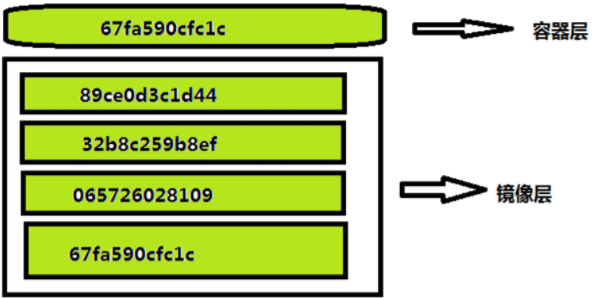

# 一、Docker容器基础入门

## 1、Docker容器的介绍
简介：Docker介绍和使用场景

### 1.1、Docker背景

1、微服务盛行: 一个单体应用拆分为多个微服务进行部署

- 比如电商系统进行微服务开发，会有多个服务，而各个服务肯定是集群部署的。如果一台机器部署一个服务，需要很多台服务器。后来出现了虚拟化技术，一台机器可以创建多个虚拟机来部署多个服务。虚拟化技术是Docker的前生
- 现在有一台物理机器（物理机的配置都很高，比如128核 几百G内存或更高）如果一个机器去部署一个应用，太浪费资源了。可以将这台物理机进行隔离，划分成n个小的系统给每个服务器来使用。这种情况就可以使用Docker,将资源共享出来并进行隔离(比如商品服务4核，订单服务8核)，根据每个服务需要的资源进行分配成对应配置的系统,不需要再去申请资源而走流程。Docker可以理解成为虚拟机，但是比虚拟机更强，是在虚拟化技术上的进一步衍生

2、使用镜像快速动态扩容

- 比如在系统上安装了mysql，在安装mysql之前还得安装相关的它的依赖的包，如果系统需要快速的部署，它需要依赖很多东西，比如redis、mysql等。流量突然过来的时候需要快速去扩容，增加多几个节点，如果不用Docker，在每一台机器上需要安装每一个软件比如mysql、redis等，需要安装相关的依赖包，以及部署程序等，需要联系开发以及运维人员拷贝软件、重新安装部署好服务，才能启动，启动之后验证是否通畅等等，会很麻烦。
- 使用Docker的话，第一次使用的时候，把整个相关的依赖服务打包成一个镜像，下次扩容的时候 只要把镜像启动起来就马上可以使用。镜像里面包含程序所有的依赖、所有的系统、所有的程序。快速拷贝，而不需要一个个的去安装部署

### 1.2、什么是Dokcer
百科:一个开源的应用容器引擎，让开发者可以打包他们的应用以及依赖包到一个可移植的容器中，然后发布到任何流行的 Linux 机器上，也可以实现虚拟化。容器是完全使用沙箱机制，相互之间不会有任何接口（多个容器之间无任何交流，黑盒机制）；

使用go语言编写，在LCX（linux容器）基础上进行的封装

简单来说：
1. 就是可以快速部署启动应用
2. 实现虚拟化，完整资源隔离
3. 一次编写，四处运行（有一定的限制，比如Docker是基于Linux 64bit的，无法在32bit的linux/Windows/unix环境下使用）

### 1.3、为什么要用

1. 提供一次性的环境，假如需要安装Mysql，则需要安装很多依赖库、版本等，如果使用Docker则通过镜像就可以使用命令直接安装启动运行Mysql
2. 应用快速动态扩容，使用docker部署了一个应用，可以制作成镜像，然后通过Dokcer快速启动
3. 组建微服务架构，可以<u>在一个机器上模拟出多个微服务，启动多个应用</u>。一台机器上可以启动多个服务，各个服务所占用的系统资源不会互相进行侵占
4. 更好的资源隔离和共享

 一句话：开箱即用，快速部署，可移植性强，环境隔离

## 2、安装Docker


### 2.1、Linux Centos7环境下安装Docker

简介：Linux Centos7环境下安装Docker

1、安装步骤：

- 安装环境：Centos 7  + 内核版本。docker官方要求内核版本至少3.8以上，建议3.10以上。
  - Linux Standard Base的缩写，lsb_release命令用来显示LSB和特定版本的相关信息

    - 命令： lsb_release -a   建议使用CentOS 7安装docker.

    - ```bash
      [root@localhost ~]# lsb_release -a
      LSB Version:	:core-4.1-amd64:core-4.1-noarch:cxx-4.1-amd64:cxx-4.1-noarch:desktop-4.1-amd64:desktop-4.1-noarch:languages-4.1-amd64:languages-4.1-noarch:printing-4.1-amd64:printing-4.1-noarch
      Distributor ID:	CentOS
      Description:	CentOS Linux release 7.9.2009 (Core)
      Release:	7.9.2009
      Codename:	Core
      ```

  - 执行uname -a 

    - ```bash
      [root@localhost ~]# uname -a 
      Linux localhost.localdomain 3.10.0-1160.el7.x86_64 #1 SMP Mon Oct 19 16:18:59 UTC 2020 x86_64 x86_64 x86_64 GNU/Linux
      ```

- Docker 版本
  - docker EE  企业版本
  - docker CE  社区版本    安装Docker Ce 社区版本

- 关闭防火墙和selinux
  - 关闭防火墙  systemctl stop firewalld.service
- 设置selinux为disable 
    - vi /etc/selinux/config   SELINUX=disabled

- 安装wget命令： yum install -y wget

- 下载阿里云docker社区版
  - 查看docker安装包版本
    - yum list | grep docker  执行需要点时间，会列出yum源可获得的docker版本,没有ce社区版本
  - 需要安装docker社区版 yum源
      - cd /etc/yum.repos.d/
      - wget http://mirrors.aliyun.com/docker-ce/linux/centos/docker-ce.repo
      - 重新查看docker安装包版本
  - 安装Docker Ce 社区版本：yum install -y docker-ce.x86_64

- 设置开机启动
  - systemctl enable docker 

- 更新xfsprogs 
  - yum -y update xfsprogs 

- 启动docker
  - systemctl start docker 

- 查看版本 docker version 

- 查看详细信息 docker info

2、参考：

- 阿里云安装手册：ECS上搭建Docker
  - https://help.aliyun.com/document_detail/51853.html?spm=a2c4g.11186623.6.820.RaToNY
- 常见问题：
    - https://blog.csdn.net/daluguishou/article/details/52080250


## 3、Docker仓库、镜像、容器核心知识讲解
简介：快速掌握Dokcer基础知识

### 3.1、基本概念

#### 1. Docker 镜像  -  Docker images

Docker 镜像

- 容器运行时的只读模板，用于生成容器（操作系统 + 软件运行环境 + 用户程序）

  - 类似于Java当中的Class:

    - ```java
      class User{
               private String userName;
               private int age;
      }
      ```

- 提供了基本的操作系统环境，有了这个镜像，docker才会生成容器并运行

- 一个镜像可以启动多个容器，容器id是不一样的。


#### 2. Docker 容器 - Docker containers

Docker 容器

- 容器包含了某个应用运行所需要的全部环境，通过镜像来生成容器。
- 类似于java当中的对象，通过类创建对象：

```java
User user = new User()
```

#### 3. Docker 仓库 - Docker registeries
Docker 仓库

- 用来保存镜像，有公有和私有仓库，好比Maven的中央仓库和本地私服。
- Docker官方人员或者开源的组织机构推出很多镜像放到仓库里面去，供大家去拉取。

- 镜像中央仓库：https://hub.docker.com/
- （参考）配置国内镜像仓库：https://blog.csdn.net/zzy1078689276/article/details/77371782
          

### 3.2、镜像与容器的关系

1、对比面向对象的方式

- Dokcer 里面的镜像 : Java里面的类 Class
- Docker 里面的容器 : Java里面的对象 Object

通过类创建对象，通过镜像创建容器


2、镜像和容器之间的关系好比ISO镜像和虚拟机操作系统的关系

- ISO镜像包含了操作系统的信息
  - 镜像里面包含了操作系统 + 软件运行环境 + 用户程序
- 利用ISO镜像便可在虚拟机里面创建操作系统
  - 通过镜像可以创建容器
- 虚拟机上的操作系统之间没有任何关系
  - 容器之间没有任何关系


## 4、Docker容器常见命令实战

常用命令（安装部署好Dokcer后，执行的命令是docker开头)

### 4.1、镜像的管理命令


1、搜索镜像

* docker search xxx 从中央仓库去查。
    - xxx为名称，模糊查询  docker search centos
    - 搜索rabbitmq镜像     docker search  rabbitmq
     - 
   
* 搜索镜像并过滤是官方的
    * docker search --filter "is-official=true" rabbitmq
* 搜索镜像并过滤大于等于多少颗星星的
    * docker search --filter stars=10 centos 

2、列出当前系统本地存在的镜像

* docker images
    * REPOSITORY:  仓库地址（镜像名称）
    * TAG:  版本
    * IMAGE_ID： 镜像ID

3、拉取远程镜像到本地

* docker pull xxx   xxx是具体某个镜像(格式 NAME:TAG)
    * NAME：表示镜像的名称, TAG：镜像的版本标签.
        * docker pull centos:7
        * docker pull  rabbitmq:management  拉取rabbitmq镜像
        * 如果不指定版本标签，默认版本标签为latest表示拉取最新版本。 Using default tag: latest

    * 资源从国外下载会非常慢，配置国内镜像源进行下载

    * 使用docker images再去查看本地拉取的镜像

        * ```bash
            [root@localhost ~]# docker pull rabbitmq
            ....
            [root@localhost ~]# docker images
            REPOSITORY   TAG       IMAGE ID       CREATED       SIZE
            rabbitmq     latest    9bf8366c13b5   5 hours ago   156MB
            ```

4、修改本地镜像名字（小写）

* docker tag  REPOSITORY:version   新REPOSITORY:新version
    * docker tag centos:7 mycentos:1 
    * 重新复制一份新的镜像进行修改。修改之后的镜像和原先的镜像的image_id是一样的
    
    * ```bash
      [root@localhost ~]# docker images
      REPOSITORY   TAG       IMAGE ID       CREATED       SIZE
      rabbitmq     latest    9bf8366c13b5   5 hours ago   156MB
      [root@localhost ~]# docker tag rabbitmq:latest my-rabbitmq:1
      [root@localhost ~]# docker images
      REPOSITORY    TAG       IMAGE ID       CREATED       SIZE
      my-rabbitmq   1         9bf8366c13b5   5 hours ago   156MB
      rabbitmq      latest    9bf8366c13b5   5 hours ago   156MB
      ```

5、本地镜像的删除

*  根据镜像名称和版本号进行删除  docker rmi REPOSITORY:version
    *   docker rmi centos:7
*  根据镜像id进行删除 docker rmi [imageId]
    *   如果镜像id有多个仓库在引用，则删除报错：Error response from daemon: conflict: unable to delete 9bf8366c13b5 (must be forced) - image is referenced in multiple repositories
* 如果有容器使用该镜像，不能删除。需要强制移除镜像
    *  如果删除报错：Error response from daemon: conflict: unable to delete 1d0a5c8a8d4e (cannot be forced) - image is being used by running container 1696537baa45。则表示有容器使用该镜像，不能删除
    *  强制移除镜像不管是否有容器使用该镜像 增加 -f 参数。docker rmi -f 1d0a5c8a8d4e


### 4.2、配置阿里云镜像加速 

1、背景

* 很多资源在国外，所以会遇到下载很慢的情况。
* 使用阿里或者网易的镜像源下载镜像。

2、阿里云镜像加速器配置地址

- 登录阿里云进行查。阿里云点击控制台，左上角菜单按钮，点击产品与服务，输入关键词容器，进行搜索，点击容器镜像服务。镜像中心-》镜像加速器
  - 加速器地址对每一个账号是唯一的，每个人的都不一样
  - 
- 查看Centos操作文档进行配置
  - 
  - 配置步骤：
      vi /etc/docker/daemon.json
```json
{
  "registry-mirrors": ["https://vqwf4esl.mirror.aliyuncs.com"]
}
```
- 重启：systemctl daemon-reload && systemctl restart docker

- 重新拉取镜像  docker pull centos:7 。发现速度很快


###  4.3、容器的构建等基本操作

简介：Docker容器的创建，查看，停止，重启等

基于镜像去创建并运行管理容器

1、通过镜像启动centos

- docker run --name xxx(容器名称) -it  镜像id/镜像tag(repository:version)
  - docker run -it 5e35e350aded  打开了一个伪终端，如果没有指定-d，输入exit退出终端，同时容器也关闭
    - -i 表示以交互模式运行容器（让容器的标准输入保持打开）。一般配合-t使用。在交互模式下，用户可以通过所创建的终端来输入命令
    - -d 表示后台运行容器，后台启动之后会返回一个ID, 这个ID就是容器的ID.
    - -t 表示为容器重新分配一个伪输入终端
    - --name：为容器指定名称  可以忽略
    - 
  - docker run -itd centos:7 
    - 返回容器ID 22bb34bd215873a8c1238ad7eb63efd8c7e9133c0c6bb2f6fddebc8c13cc6c35
    - 如果不指定版本号(:7)，等同于执行docker run -itd centos:latest 。首先会从本地找最新的版本，如果本地没有最新的版本，则从远程仓库下载最新版本的镜像然后运行。
  - docker run -d --name "xdclass_mq" -p 5672:5672 -p 15672:15672 rabbitmq:management
      - -p 端口映射   宿主机端口：容器端口
          - 在微服务中，物理机虚拟化出来的容器的每个服务都可以是8080.因为docker实现虚拟化，将完整资源隔离，不会互相干扰，但在一个物理机（宿主）中映射的端口是不能重复的。宿主机里面的端口肯定是一个端口占用一个程序
          - 宿主机(物理机): 容器里面的程序端口
          - rocketmq需要两个端口来运行应用程序和管理后台。所以运行rabbitmq要指定两个端口映射
      - rabbitmq:managemen (格式 REPOSITORY:TAG)：镜像名称 
        - 如果不指定tag，只写rabbitmq。默认使用本地最新版本的镜像，如果本地没有最新版本的镜像则到仓库进行下载

2、查看容器

- 查看本地所有的容器
  - docker ps -a  查看所有的容器，包括停止的和运行的。 

- 查看本地正在运行的容器
  - docker ps  只展示ID的16位长
- 查看容器内部详细信息
  - docker inspect CONTAINER_ID / CONTAINER_NAME

3、停止与启动

- 停止某个容器
  - docker stop CONTAINER_ID / CONTAINER_NAME 
  - 容器虽然状态为停止，但是仍然存在，如果要删除容器则要使用移除命令。

- 启动某个容器
  - docker start CONTAINER_ID / CONTAINER_NAME
- 重启某个容器
  - docker restart 容器名称或者容器ID(CONTAINER ID) 
  - 重新启动不需要再去指定启动的参数，直接运行。
- 移除某个容器
  - docker rm CONTAINER_ID / CONTAINER_NAME   容器名称或者容器ID(CONTAINER ID) 
  - 容器删除之前必须是停止状态。可以强制删除容器  加上-f选项   docker rm -f CONTAINER_ID / CONTAINER_NAME
  - 移除之后再次启动则会报错，容器不存在已被移除
- 停止所有正在运行的容器
  - docker stop $(docker ps -a -q) 执行完返回停止的多个容器id。
  - docker ps -a -q 获取所有容器的id
- 启动所有容器
    - docker start $(docker ps -a -q) 执行完返回启动的多个容器id
    - docker ps -a -q 获取所有容器的id

4、进入容器

 - 进入centos容器
   - docker exec -it 0ad5d7b2c3a4 /bin/bash   相当于里面就是一台linux操作系统,执行exit退出容器
     - -i 表示以交互模式运行容器（让容器的标准输入保持打开）。一般配合-t使用。在交互模式下，用户可以通过所创建的终端来输入命令
    - -t 表示为容器重新分配一个伪输入终端
- 退出容器
    - 终端输入exit

5、参考文档

  https://blog.csdn.net/permike/article/details/51879578

### 4.4、容器的文件复制与挂载
简介：容器与宿主机之间文件复制与挂载 

1、容器的文件复制

- 从宿主机复制到容器
  - docker cp 宿主机本地路径 容器名字/ID:容器路径
    - 宿主本机本地路径建议写成绝对路径
    - :冒号左右不能有空格
  - docker cp  /root/123.txt   mycentos:/home/ 

- 从容器复制到宿主机
  - 在宿主机执行 docker cp 容器名字/ID:容器路径 宿主机本地路径
    - 宿主本机本地路径建议写成绝对路径
    - :冒号左右不能有空格
  - docker cp  mycentos:/home/456.txt   /root


2、宿主机文件夹挂载到容器里

- docker run -itd -v  宿主机路径:容器路径  镜像名称
  - docker run -itd  -v   /root/xdclass/:/home   centos:7
  - <u>创建容器的时候进行挂载。不能挂载现有的容器，只能重新去构建容器，然后挂载进去。</u>

3、应用场景

- 在实际工作中，容器里面运行着程序，容器可以删除，但是数据不能丢失。宿主机将文件夹挂载到容器里，保存数据到宿主机。数据不会跟着容器删除而丢失
- 例如容器里面运行着mysql，一般会在宿主机挂载一个目录给容器进行运行。存放mysql数据。如果数据库宕机了，可以对镜像删除，重新换新的镜像重新创建容器，然后重新挂载上去，数据便不会丢失


# 二、自定义镜像实战

## 1、构建自定义镜像的意义与应用场景

简介：介绍自定义镜像的重要性docker

1、背景

- 一般的基础镜像是无法满足实际生产上的工作需求，在实际的生产中经常要对基础镜像启动的容器进行修改和配置，如果容器被删除了，之前的修改和配置的东西就会跟着进行删除。
- 例如之前安装centos镜像，启动容器，然后在容器里面安装jdk等，如果删除容器则需要重新根据镜像去启动容器，重新进行配置
- 解决办法：将容器打包整理成一个镜像，然后再基于构建的镜像可以重新启动新的容器。
- 可以将自定义构建的镜像上传到镜像仓库，其他的服务器想要镜像直接到仓库拉去即可。

2、意义

- 自定义的镜像，里面的环境都是基于同一个镜像出来的，在生产环境搭建数据库等， 经常会遇到依赖环境的缺失，配置的繁琐，所以如果每次都要走下来这个流程是比较消耗时间的，还面临搭建不成功的风险
- 将自己搭建好的容器打包成一个镜像，上传到仓库。其他服务器直接从仓库拉去，直接启动即可，不再需要进行繁琐的配置和依赖的下载

3、目前镜像的制作有俩种方法：

- 基于Docker Commit 制作镜像
- 基于dockerfile制作镜像，<u>Dockerfile方式为主流的制作镜像方式</u>


## 2、Commit构建自定义镜像
简介：对容器的修改以及保存

1、对容器进行修改

- 启动并进入容器：docker run -it centos:7 /bin/bash
- 在/home 路径下创建xdclass文件夹：mkdir /home/xdclass
- 安装ifconfig命令：yum -y install net-tools 
    - 执行 ifconfig
- 退出并重启容器，查看容器的xdclass文件夹还在不在
    1. 退出  exit
    2. 重启容器  docker restart  22bb34bd2158  
    3. 进入容器  docker exec -it 22bb34bd2158  /bin/bash
    4. 查看文件是否存在   查看容器的xdclass目录  目录还存在
- 退出并删除容器，再重新启动一个容器进入查看有没有xdclass文件
    1. docker rm  -f 22bb34bd2158   强制删除容器
- 根据镜像重新创建并启动容器 
    1. docker run -it centos:7 /bin/bash
    2. 查看没有xdclass文件夹


2、构建镜像

- 先启动并进入容器并执行上面相同的操作（创建文件夹以及安装ifconfig命令）
    - 启动 docker start 4bd47bc45f77
    - docker exec -it  4bd47bc45f77  /bin/bash
    - 创建文件并安装命令  
        - mkdir /home/xdclass  
        - yum -y install net-tools 
- 退出容器，构建镜像
    - docker commit 4bd47bc45f77 mycentos:7
        - docker commit  容器id  新的镜像命名  
        - 直接构建镜像，返回新的镜像id  c1560827a8ae
        - 通过docker images 进行查看
    - docker commit -a "XD" -m  "mkdir /home/xdclass"  4bd47bc45f77  mcentos:7
        - -a：标注作者
        - -m：说明注释
    - 通过镜像创建新的容器：docker run -itd  c1560827a8ae  /bin/bash
        - 返回容器id 16ed976f9247
    - 查看容器详细信息：docker inspect 16ed976f9247
    - 进入容器查看：docker exec -it 16ed976f9247(容器ID) /bin/bash
        - home下有xdclass文件
        - ifconfig 命令有效可执行


## 3、Dockerfile构建镜像
简介：Dockerfile构建镜像实战

1、宿主机编写Dockerfile 文件

- Dockerfile 文件，命名固定为`dockerfile`

- ```dockerfile
  #this is a dockerfile
  FROM centos:7
  MAINTAINER xd 123456@qq.com
  RUN echo "正在构建镜像"
  WORKDIR  /home/xdclass
  COPY 123.txt  /home/xdclass
  RUN yum install -y net-tools
  ```
  - `# `相当于注释
  - From 指明基础镜像  名称:版本号
  - MAINTAINER  指明作者  邮箱
  - RUN  容器里面执行linux命令
  - WORKDIR  指明容器的工作目录，如果工作目录不存在会帮我们创建
  - COPY 复制一个文件到容器目录
      * 从宿主机拷贝到容器，源文件使用相对路径，相对于当前dockerfile所在目录。目标目录使用容器的绝对路径。

2、Dockerfile构建

- Dockerfile构建
  - docker build -t mycentos:v2  .
    - -t 指定镜像名称
    - .  指定docker文件所在的目录，这里为当前目录

- 查看构建的镜像：docker images

- 创建容器，进入验证
  - docker run -it  mycentos:v2 /bin/bash
  - 刚进去容器，会直接到dockerfile指定的工作目录 /home/xdclass 
    - 查看123.txt
    - 并执行ifconfig命令

## 4、镜像分层结构剖析
介绍镜像的分层结构



1、镜像层

- 删除镜像，重新执行dockerfile文件生成镜像，查看镜像构建的输出日志会有step1、step2、...每个步骤都会生成一个ID，这一个ID为镜像ID。每个步骤在构建一个层次，这个层次称之为镜像层。有多少个层，取决于dockerfile。From层返回基础镜像的ID

  - ```
    [root@localhost centos]# docker build -t mycentos:v2  .
    Sending build context to Docker daemon   2.56kB
    Step 1/6 : FROM centos:7
     ---> 8652b9f0cb4c
    Step 2/6 : MAINTAINER xd 123456@qq.com
     ---> Running in 6a01a1ab581e
    Removing intermediate container 6a01a1ab581e
     ---> 29736fa10382
    Step 3/6 : RUN echo "正在构建镜像"
     ---> Running in 8af26d64aef4
    正在构建镜像
    Removing intermediate container 8af26d64aef4
     ---> 8b5090638756
    Step 4/6 : WORKDIR  /home/xdclass
     ---> Running in 59030ddd52ed
    Removing intermediate container 59030ddd52ed
     ---> 43171bc916b1
    Step 5/6 : COPY 123.txt  /home/xdclass
     ---> dd683bfe72df
    Step 6/6 : RUN yum install -y net-tools
     ---> Running in 6c0f83670172
    
    ```

* 构建完成之后，便生成镜像。
* 执行docker history 可以看到镜像的构建历史。
    * docker history 镜像名称/镜像ID
    
    * missing 表示镜像层不在本机上面构建（基础镜像的镜像层构建）
    
      * ```
        [root@localhost centos]# docker history 23c9eede58f9
        IMAGE          CREATED         CREATED BY                                      SIZE      COMMENT
        23c9eede58f9   4 minutes ago   /bin/sh -c yum install -y net-tools             101MB     
        dd683bfe72df   4 minutes ago   /bin/sh -c #(nop) COPY file:8eda00bfac1c94e7…   0B        
        43171bc916b1   4 minutes ago   /bin/sh -c #(nop) WORKDIR /home/xdclass         0B        
        8b5090638756   4 minutes ago   /bin/sh -c echo "正在构建镜像"                        0B        
        29736fa10382   4 minutes ago   /bin/sh -c #(nop)  MAINTAINER xd 123456@qq.c…   0B        
        8652b9f0cb4c   3 months ago    /bin/sh -c #(nop)  CMD ["/bin/bash"]            0B        
        <missing>      3 months ago    /bin/sh -c #(nop)  LABEL org.label-schema.sc…   0B        
        <missing>      3 months ago    /bin/sh -c #(nop) ADD file:b3ebbe8bd304723d4…   204MB  
        ```


2、容器层

- 通过镜像可以生成一个容器，称位容器层。执行docker run命令来生成容器层。

* 镜像层和容器层的关系
    * 镜像层
        * 静态的，镜像层只读
    * 容器层
        * 容器层的基础数据来自于镜像层。对容器的任何改动都是发生容器层。容器的修改不会修改镜像的数据
        * 容器层读取数据从自上而下的去寻找，依次寻找，从镜像中寻找到数据就复制到容器层上，并读入到内存
        * 删除数据，也是自上而下的去寻找，记录删除的操作。
        *  整个过程是对镜像层没有任何改动的，没有任何影响，启动新的容器，容器里面的数据还是原始的数据

3、分层结构的好处

* 共享资源，底层数据都来自于镜像层
* 对容器的任何改动都是发生容器层，不会影响镜像层
* 容器层可写可读，镜像层只能读


## 5、dockerfile基础指令

简介：介绍一些常用的Dockerfile指令

dockerfile文件里面常用的Dockerfile指令

1、FROM

- 基于哪个基础镜像创建新的镜像
- FROM centos:7  名称:版本号

2、MAINTAINER

- 注明作者
- MAINTAINER xd 123456@qq.com  

3、COPY

- 复制宿主机上的文件到镜像某一目录。 `.`表示镜像的当前工作目录
   - COPY 文件  镜像路径
      - 复制的宿主文件只能用相对路径，不能用绝对路径。相对于dockfile所在目录
      - 镜像路径必须是绝对路径
   - COPY 123.txt /home/xdclass

4、ADD

- 复制文件到镜像某一目录。 `.`表示镜像的当前工作目录
   - 如果复制的文件为压缩文件比如文件是.tar.gz。文件还会自动进行解压操作
      - 文件解压完之后会删除压缩包
   - 如果文件需要执行，使用ADD，而不是COPY。COPY过去的文件不会被执行

5、WORKDIR

- 指定镜像的默认工作目录，假如路径不存在会创建路径
- WORKDIR  /home/xdclass

6、ENV

- 设置环境变量
- ENV JAVA_HOME=/usr/local/jdk

7、EXPOSE

- 暴露容器的端口
- EXPOSE 8080

8、RUN

- 在构建镜像的时候执行命令，作用于镜像层面
- 有多条RUN语句都可以被执行

9、ENTRYPOINT

- 在容器启动(执行docker run启动容器)的时候执行命令，作用于容器层
- dockerfile里有多条ENTRYPOINT语句时只允许执行最后一条

10、CMD

- 在容器启动(执行docker run启动容器)的时候执行，作用于容器层
- dockerfile里有多条CMD语句时只允许执行最后一条
- CMD可以做为参数，传参给ENTRYPOINT。前提是ENTRYPOINT的命令格式必须是exec格式的
  - 在容器创建(docker run)或者进入容器(docker exec)的时候参数放到最后
- 容器启动后执行CMD里面指定的的命令或者参数，CMD里面的参数值允许在容器启动的时候被修改
  - CMD ["-ef"]  ENTRYPOINT ["ps"]
  - 执行 ps -ef   ENTRYPOINT + CMD
  - docker run mycentos:v6 aux  指定了参数则覆盖CMD里面原先的参数值
    - 容器启动的时候便执行ps -aux


命令格式

* shell命令格式：RUN yum install -y net-tools
    * RUN 后面直接跟shell命令

* exec命令格式：RUN [ "yum","install" ,"-y" ,"net-tools"]
    * 每一个单词用""包括，并用逗号分开

dockfile文件：


## 6、dockerfile构建java网站镜像

简介：dockerfile构建java环境

1、本地宿主机配置jdk，确保没问题

- vi /etc/profile
  - ```
    export JAVA_HOME=/usr/local/jdk
    export JRE_HOME=$JAVA_HOME/jre
    export CLASSPATH=$JAVA_HOME/lib:$JRE_HOME/lib:$CLASSPATH
    export PATH=$JAVA_HOME/bin:$JRE_HOME/bin:$PATH
    ```

- source /etc/profile
- 检验：java -version

2、本机宿主机安装tomcat

- 解压，移动，重命名
- bin目录下启动catalina.sh run，前台方式启动。
- <u>如果使用docker执行startup.sh后台启动，启动完之后容器退出会自动退出</u>。

3、创建dockerfile

```dockerfile
FROM centos:7
ADD jdk-8u211-linux-x64.tar.gz  /usr/local
RUN mv /usr/local/jdk1.8.0_211 /usr/local/jdk
ENV JAVA_HOME=/usr/local/jdk
ENV JRE_HOME=$JAVA_HOME/jre
ENV CLASSPATH=$JAVA_HOME/lib:$JRE_HOME/lib:$CLASSPATH
ENV PATH=$JAVA_HOME/bin:$JRE_HOME/bin:$PATH
ADD apache-tomcat-8.5.35.tar.gz /usr/local
RUN mv /usr/local/apache-tomcat-8.5.35 /usr/local/tomcat
EXPOSE 8080
ENTRYPOINT ["/usr/local/tomcat/bin/catalina.sh","run"]
```

4、构建镜像

- 进入到对应的目录。目录下要有jdk-8u211-linux-x64.tar.gz  apache-tomcat-8.5.35.tar.gz
- 执行构建语句 docker build -t  mycentos:jdk 

5、启动容器

- docker run -itd -p 80:8080 -v /root/test/ROOT:/usr/local/tomcat/webapps/ROOT  mycentos:jdk  /bin/bash
   - -itd
     * i  表示以交互模式运行容器(支持终端)
     * t 表示 为容器重新分配一个伪输入终端  /bin/bash
     * d 表示后台运行容器，后台启动之后会返回一个ID, 这个ID就是容器的ID.
   - -p  端口映射。宿主端口：容器端口。将容器端口映射到宿主机的端口，容器端口要使用EXPOSE 8080暴露。
   - -v  挂载，宿主机路径:容器路径  将本地宿主机目录挂在到容器相应的目录上

6、宿主机/root/test/ROOT下新建index.html

7、关闭防火墙或者开放端口，网页进行访问验证


## 7、dockerfile构建nginx镜像
简介：Dockerfile构建nginx（编译、安装）

1、dockerfile

```dockerfile
FROM centos:7
ADD nginx-1.16.0.tar.gz /usr/local
COPY nginx_install.sh /usr/local
RUN sh /usr/local/nginx_install.sh
EXPOSE 80
```
2、编写安装nginx的shell脚本 nginx_install.sh

- 将nginx的编译、安装的过程编写为一个shell脚本，不要写在dockerfile里面。包括安装依赖、配置、编译、安装。先在宿主机验证没问题

```
#!/bin/bash
yum install -y gcc gcc-c++ make pcre pcre-devel zlib zlib-devel
cd /usr/local/nginx-1.16.0
./configure --prefix=/usr/local/nginx && make && make install
```

- dockerfile中执行脚本  RUN sh /usr/local/nginx_install.sh  


3、制作Nginx镜像

- docker build -t  mycentos:nginx .

4、启动容器

- Nginx镜像启动注意在容器里默认nginx是以daemon方式启动，退出容器时，nginx程序也会随着停止
    * /usr/local/nginx/sbin/nginx   退出容器时，nginx程序也会随着停止
    * 使用前台方式永久运行：/usr/local/nginx/sbin/nginx -g "daemon off;"
- 启动验证
    * 启动容器的时候指定容器启动之后要运行的命令
        * docker run -itd -p 80:80 mycentos:nginx  /usr/local/nginx/sbin/nginx -g "daemon off;"
        * CMD参数
    * 也可以直接在dockfile文件里面执行容器启动之后要运行的命令
        * ENTRYPOINT  /usr/local/nginx/sbin/nginx -g "daemon off;"
        * docker run -itd -p 80:80 mycentos:nginx


## 8、dockerfile构建redis镜像

1、编写redis编译安装shell脚本  redis_install.sh。在宿主机上面验证成功之后再编写dockerfile文件构建redis镜像
```dockerfile
#!/bin/bash
yum install -y gcc gcc-c++ make openssl openssl-devel
##切换到源码包
cd /home/redis-5.0.5
##编译，安装，指定安装路径
make && make PREFIX=/usr/local/redis  install 
##新建配置文件目录，并拷贝源码包里面的配置文件到该目录
mkdir -p /usr/local/redis/conf/
cp /home/redis-4.0.9/redis.conf /usr/local/redis/conf/
#设置bind  127.0.0.1 改为0.0.0.0，69为行号  -i 修改原文件
sed -i '69s/127.0.0.1/0.0.0.0/' /usr/local/redis/conf/redis.conf
#设置 protected-mode no，88为行号  -i 修改原文件
sed -i '88s/protected-mode yes/protected-mode no/' /usr/local/redis/conf/redis.conf
```
- 需要关闭保护模式
  - /usr/local/redis/conf/redis.conf
    - protected-mode no
    - bind 0.0.0.0
- 将修改的配置步骤写入 redis_install.sh 脚本
  * sed -i '69s/127.0.0.1/0.0.0.0/' /usr/local/redis/conf/redis.conf
  * sed -i '88s/protected-mode yes/protected-mode no/' /usr/local/redis/conf/redis.conf
- redis启动的时候需要以前台的方式进行启动，这块配置不需要修改

2、编写Dockerfile

```bash
FROM centos:7
ADD redis-5.0.5.tar.gz /home
COPY redis_install.sh /home
RUN sh /home/redis_install.sh
ENTRYPOINT /usr/local/redis/bin/redis-server /usr/local/redis/conf/redis.conf
EXPOSE 6379
```

3、构建镜像

- docker build -t mycentos:redis .

4、启动容器

* docker run -itd -p 6380:6379 mycentos:redis 
    * 6380是宿主机端口，6379是容器的端口
* 进入容器：docker exec -it 9b402baeaba7  /bin/bash
    * 查看redis进程  ps -ef|grep redis
        * 默认端口6379 IP为127.0.0.1(监听本机，不允许其他机器进行远程连接)
    * 验证：/usr/local/redis/bin/redis-cli -p 

* 宿主机连接redis： /usr/local/redis/bin/redis-cli -p 6380

    * 查看容器的IP信息
        * docker inspect 容器ID，指定ip进行连接
    * 宿主机可以指定 -h 容器IP  -p 端口为容器端口6379 连接到容器的redis服务。


## 9、dockerfile快速部署mysql数据库并初始化

简介：Dockerfile快速部署mysql数据库并初始化

1、官方网址：https://hub.docker.com/

* 输入mysql进行搜索，点击查出来的mysql进行查看。
* 查看mysql的dockfile文件
    * 
    * mysql5.7.33。linux版本为debain,不是基于centos7。镜像默认没法输入中文，不支持中文字符集
      !
    * 参考：https://hub.docker.com/_/mysql?tab=description

2、拉取mysql的基本镜像

* docker pull  mysql:5.7
    * 使用5.7版本，最新版本为8.x。最新的版本很多企业没有使用，基本都是使用mysql5.7的版本
    * docker images 查看拉取的镜像

3、启动命令
* docker run --name some-mysql -p 3307:3306 -e MYSQL_ROOT_PASSWORD=abc123456 -d mysql:5.7
    * --name 指定容器名称
    * -p  指定端口映射
    * -e  指定环境变量
        * MYSQL_ROOT_PASSWORD=abc123456  指定root密码，必需变量
    * -d 后台启动
* 进入容器命令：docker exec -it 4336ae28fbfa env LANG=C.UTF-8 /bin/bash
    * env LANG=C.UTF-8
        * 指定容器的环境变量，系统的字符编码为UTF-8。否则在shell下输入和查询中文会出现乱码，系统不支持中文字符
        * echo $LANG 
        * 输入中文验证

4、初始化sql语句 init.sql

```sql
-- 建库
create database `db_student`;
SET character_set_client = utf8;
use db_student;
-- 建表
drop table if exists `user`;
CREATE TABLE user (
id tinyint(5) zerofill auto_increment not null comment '学生学号',
name varchar(20) default null comment '学生姓名',
age tinyint default null comment '学生年龄',
class varchar(20) default null comment '学生班级',
sex char(5) not null comment '学生性别',
unique key (id)
)engine=innodb charset=utf8;
-- 插入数据
insert into user values('1','小明','15','初三','男');
insert into user values('2','小红','13','初二','女');
insert into user values('3','小东','14','初一','男');
insert into user values('4','小西','12','初二','男');
```
5、构建自己的mysql镜像

- dockerfile 
  - /docker-entrypoint-initdb.d 目录（参考文档）
    * 将.sh .sql和.sql.gz文件放到该目录下，在启动容器的时候会将数据初始化到数据库

```dockerfile
FROM mysql:5.7 
WORKDIR /docker-entrypoint-initdb.d
ENV LANG=C.UTF-8
ADD init.sql .
```

* 使用ADD命令，才会执行init.sql。使用COPY不会执行。

* 构建
    * docker build -t my-mysql:5.7 .

6、启动容器

* docker run --name some-mysql -p 3307:3306 -e MYSQL_ROOT_PASSWORD=abc123456 -d my-mysql:5.7

* 进入容器进行验证
    * docker exec -it 4336ae28fbfa /bin/bash
    * mysql -uroot -pabc123456
    * 查询数据库和表以及数据


# 三、Docker网络模式与互相通信

## 1、容器的网络模式

简介：介绍Docker网络模式

1、安装docker之后默认的三种网络模式：

* bridge：桥接模式
* host：主机模式
* none：无网络模式

2、宿主机查看当前docker的网络模式：docker network ls

```bash
[root@localhost mysql]# docker network ls
NETWORK ID     NAME      DRIVER    SCOPE
e1dbb494680f   bridge    bridge    local
1a06ef99282d   host      host      local
c4b266bc84cb   none      null      local
```

3、使用网络模式

* 使用--net选项，在第一次创建容器 docker run 的时候指定


### 1.1、bridge桥接模式
简介：介绍Docker桥接网络模式

1、桥接模式

- docker 的默认网络设置，当Docker服务启动时，会在宿主机上创建一个名为docker0的虚拟网桥，并选择一个和宿主机不同的IP地址和子网分配给docker0

- 输入ip addr查看网卡(网桥) 拥有自己的ip地址

  - ```
    4: docker0: <BROADCAST,MULTICAST,UP,LOWER_UP> mtu 1500 qdisc noqueue state UP group default 
        link/ether 02:42:fd:67:14:69 brd ff:ff:ff:ff:ff:ff
        inet 172.17.0.1/16 brd 172.17.255.255 scope global docker0
           valid_lft forever preferred_lft forever
        inet6 fe80::42:fdff:fe67:1469/64 scope link 
           valid_lft forever preferred_lft forever
    ```

2、网桥桥接拓扑图


3、容器与宿主机连接

* 容器启动的时候创建网卡，自己的网卡会自动连上宿主机的docker0网卡，通过NAT转换，连到宿主机的网卡，从而连到Internet
    
    * 每一个容器会有自己的IP地址和端口
    * 宿主机通过docker0网卡和容器互相进行交互
    
* 外面的机器直接访问容器，只能通过宿主机，宿主机进行端口映射，才能访问容器
    * docker启动时设置 -p 端口映射的作用，用于外面机器访问容器。端口映射用于外面机器去访问，如果没有配置。外面机器是不能访问的
    * 没有指定端口映射，宿主机可以访问容器里面的端口，但是外面的机器不能访问容器。

* 不同的容器都有自己的网卡，但是docker0只有一个，docker服务启动的时候创建。
    * 启动容器的时候会创建自己的网卡并自动的桥接到docker0网桥上
        
        * docker run -itd centos:7 /bin/bash
    
    * ip addr 宿主机可以进行查看容器的网卡，这些网卡就是每一个容器的网卡
    
      * ```
        16: vethc02fe58@if15: <BROADCAST,MULTICAST,UP,LOWER_UP> mtu 1500 qdisc noqueue master docker0 state UP group default 
            link/ether ea:6b:cb:92:f0:d7 brd ff:ff:ff:ff:ff:ff link-netnsid 0
            inet6 fe80::e86b:cbff:fe92:f0d7/64 scope link 
               valid_lft forever preferred_lft forever
        18: vethfb81dcd@if17: <BROADCAST,MULTICAST,UP,LOWER_UP> mtu 1500 qdisc noqueue master docker0 state UP group default 
            link/ether 9e:e7:13:01:ed:9f brd ff:ff:ff:ff:ff:ff link-netnsid 1
            inet6 fe80::9ce7:13ff:fe01:ed9f/64 scope link 
               valid_lft forever preferred_lft forever
        ```

4、进入容器，安装工具，验证

* docker exec -it 容器ID /bin/bash
* 容器安装 yum -y install net-tools
    * 查看路由 route -n
    
      * ```
        [root@420272247c15 /]# route -n
        Kernel IP routing table
        Destination     Gateway         Genmask         Flags Metric Ref    Use Iface
        0.0.0.0         172.17.0.1      0.0.0.0         UG    0      0        0 eth0
        172.17.0.0      0.0.0.0         255.255.0.0     U     0      0        0 eth0
        
        ```
    
      * 0.0.0.0匹配到的所有的IP地址都会发往172.17.0.1这个网关
    
    * 查看宿主机的docker0网卡  ip addr
    
      * 宿主机的ip为172.17.0.1.说明容器桥接到了宿主机的docker0网卡。
    
    * 查看容器的ip地址
    
* 宿主机安装 yum install -y bridge-utils
    * 查看机器的桥接情况：brctl show
    
      * ```
    [root@localhost mysql]# brctl show
    bridge name	bridge id		STP enabled	interfaces
        docker0		8000.0242fd671469	no		veth3901743
        							vethb2e24e7
        							vethc02fe58
        							vethfb81dcd
        
        ```
    
      * interfaces这里便是容器的网卡
### 1.2、host模式
简介：介绍Docker主机网络模式

1、host 主机模式

- 该模式下容器不会拥有自己的ip地址，而是使用宿主机的ip地址和端口。
  - 使用host主机模式的容器是直接用宿主机的ip和地址来与外界进行通讯，没有自己的ip
  - 容器内部的服务端口，也是可以使用宿主机上面的端口，不需要进行NAT端口映射。没有自己的端口

- 好处：网络性能比桥接模式会好很多

- 缺点：网络的隔离性不太好。比如启动了nginx一个容器，镜像里面已经指定了端口，所以容器启动便会占用主机的一个端口。如果再用该镜像去启动一个新的容器则端口已被占用，无法再继续启动


2、验证

* 创建容器的时候指定网络模式 --net=host
    * docker run -d --net=host mycentos:nginx  /usr/local/nginx/sbin/nginx -g "daemon off;"
        * --net指定网络模式，如果不进行指定，默认为桥接模式
    * 查看宿主机的网桥
        * ip addr 还是只有三个，包括docker0。没有这个新容器的网卡
     * 查看容器信息 docker inspect 容器ID。ipaddress为空，说明容器没有ip地址
     * 宿主机端口80被占用。netstat -tunlp|grep 80
* 防火墙放开80端口
* firewall-cmd --zone=public --add-port=80/tcp --permanent
* firewall-cmd --reload
* 再次通过该镜像启动nginx容器，则报错，端口被占用


  ### 1.3、none模式

1、none模式

- 关闭模式或者无网络模式，无法连外网 
- 容器没有ip地址（没有网卡），可以理解为断网（<u>容器和宿主机之间也无法进行网络通讯</u> ）

2、创建容器

* docker run -itd --net=none centos:7 /bin/bash

3、查看网络信息

- 宿主机查看是否有网卡  ip addr 没有网卡

* 查看容器是否有ip地址
  * docker inspect  容器id  查看NetworkSettings部分
    * 
    * ipAddress 和 Gateway都为""

4、进入容器

* docker exec -it 容器id /bin/bash

* 执行 ip addr/ifconfig 没有返回信息
* 执行yum install -y net-tools 无法安装，无法连接外网

5、作用

* 可以作为容器进行测试，实际工作中很少用到。


## 2、Docker容器之间基于Link实现单向通信

### 背景
有一台tomcat容器，跑着应用程序，需要到mysql容器里面读取数据，怎么实现这两个容器之间的内部通讯

### 什么是单向通信
有两个容器A和B,单向通信是这两个容器之间在进行网络传输的时候，由A容器向B单向建立网络连接的过程，称之为单向通信。
例如：容器A为tomcat,容器B为mysql,在大多数情况下是tomcat容器应用向mysql发送网络包读取数据的，一般情况下mysql容器是不需要主动的向tomcat发起请求的，这种方式称之为单向通信

### 建立单向通信

* 启动mysql数据库容器
    * docker run --name mydb -e MYSQL_ROOT_PASSWORD=abc123456 -d mysql:5.7
        * 启动数据库的时候，指定数据库容器的名称
        * docker inspect 容器ID 查看容器的IP地址 172.17.0.2

* 启动tomcat应用容器并link到mysql数据库：
    * docker run -itd --name tomcat1 --link mydb  tomcat:tag
        * --link mydb 表示link到mydb容器
            * 注意：mydb 这个容器一定要先启动，存在！
        * docker inspect 容器ID 查看容器的IP地址  172.17.0.3
            * 一般这两个容器的IP是互通的

* 既然两个容器IP是互通的，是否可以直接在tomcat里面指定MySQL的IP地址
    * 可以指定，但是这种方式有局限性。例如： mysql容器起不来了，只能重新去创建新的容器，docker可能会为新的容器的分配一个新的IP，那意味着tomcat容器里面应用配置的数据库IP地址也需要改动，在生产中肯定不止一台应用服务器，如果有多台应用服务器，则都需要进入容器然后改动数据库的IP地址。
    
    * 使用Link进行解决
        * 解决思路：将容器赋予一个唯一的名字，使用名字来进行访问， 不管机器的IP地址是怎么变化，只认容器的名字，通过名字来访问容器。
        * 实现：docker run -itd --name tomcat1 --link mydb  tomcat:tag

### 模拟
1. 启动两台tomcat应用服务器，link到mysql 
docker run -itd --name tomcat1 --link mydb  tomcat:tag
docker run -itd --name tomcat2 --link mydb  tomcat:tag

2. 随便进入一台tomcat容器
    1. docker exec -it def9c /bin/bash
    2. ping 容器名称 发现可以通信，--link 基于Link实现了单向通信
        1. ping mydb
        2. 也就是说无论mysql容器地址怎么改（删除、新建），我只认名字。mysql容器宕掉也没关系，只要起来的时候把容器命名为mydb,不需要改动tomcat的任何配置，还是会自动链接过来

3. 进入mysql容器
    1. docker exec -it xxxx  /bin/bash
    2. 查看容器IP信息
    3. 官方版的mysql 5.7 需要安装工具才有ping命令
        1. apt-get update && apt-get install -y iputils-ping。不能用yum 不是基于centos,使用apt-get命令下载
        2. ping IP 是通的 
        3. ping tomcat1  ping 容器名是不通的，单向通信

### link单向通信原理
--link的原理就是在加上--link启动容器的时候，会对容器的hosts文件进行解析，所以能ping通后面的容器名。而mysql容器启动的时候没有加上--link，也就没有做解析，也就ping不通tomcat


## 3、Docker容器间利用brige网桥实现双向通信
简介：介绍基于Bridge网桥实现双向通信
1、背景
    CSS架构的应用，要进行双向通信，单项通信Link满足不了。可以利用brige网桥实现双向通信

2、查看当前网络
    执行：docker network ls  。 有三种网络模式
    

 3、创建一个新的网桥
docker network create -d bridge my_bridge
* 网桥的名字   my_bridge
* 执行：docker network ls  多了一个网桥
    * 自己新建的
* 启动第一个容器：docker run -itd --name tomcat centos:7
* 启动第二个容器：docker run -itd --name redis centos:7
* 把第一个容器加入网桥：docker network connect my_bridge  tomcat
* 把第二个容器加入网桥：docker network connect my_bridge  redis
* 最后分别进入俩个容器中进行验证，以名字互相进行访问
    *  进入redis容器
        * docker exec -it 容器id /bin/bash
        * ping tomcat容器名称可以通的
    * 进入tomcat容器
        * ping redis容器名称可以通的


## 7、Docker容器的特权模式介绍
简介：介绍特权模式
1、背景
    有时候我们希望在容器里面能够去执行一些比较高级的操作，默认情况下root用户是无法去操作的，我们需要给予容器比root用户更高的权限，我们称之为特权。

2、启动一个普通的容器
docker run -itd --name mycentos centos:7 /bin/bash

3、安装网络工具
yum -y install net-tools
执行 route -n 查看路由表


4、删除网关
route del default gw 172.17.0.1。提示没有权限，root用户执行都没有权限，需要启动容器的特权模式


5、启动拥有特权模式的容器
docker run -itd --privileged=true --name mycentos1 centos:7 /bin/bash
进入容器：docker exec -it ef /bin/bash
删除网关：route del default gw 172.17.0.1
route -n再去查看，已删除成功
备注：特权模式用的比较少，一般不会对容器过多的修改，一般是对镜像进行修改


## 8、Docker核心知识之Volume数据共享
简介：Volume的介绍使用（设置文件的挂载点，进行数据共享）

1、背景

* **日志挂载**

在实际线上的项目中，有时候为了方便，会把容器里面相对应的应用程序的日志映射到宿主机上，在宿主机上查阅日志就比较方便了，不需要进入容器

* **mysqldata文件挂载**

有时候为了数据的安全，也会把mysql的数据放到宿主机上，也就是挂载一个路径，到mysql容器的data路径下，当mysql数据库宕机或者配置出现问题起不来。数据还在宿主机上，可以直接创建新的mysql容器，然后把数据挂载到新的容器上

* **配置文件挂载**

创建集群（Nginx或者tomcat等）也可以通过Volume进行数据的共享，例如配置文件。


2、创建一个dockerfile，设置VOLUME挂载点
dockerfile
```
FROM centos:7
VOLUME ["/usr/local"]
```
注意：

* 在dockerfile里设置volume挂载点之后是无法修改容器当中宿主机的挂载路径的（Mounts-》Source路径）
* 只能在容器里面设置一个新的挂载点，使用-v选项，这样子容器便有两个挂载点。

3、创建镜像
* docker build -t centos:v1 .
* docker images 查看构建的镜像，并启动容器
    * docker run -itd --name centos7  容器ID /bin/bash
* docker inspect 容器ID
    * 查看容器信息Mounts
     
     Destination为容器本地的目的路径 /usr/local。Source为容器挂载到宿主机的地址
     查看宿主机路径下面的内容，为容器的内容
     
     如果挂载到home目录下，宿主机路径下无内容

* 进入容器 
    docker exec -it 容器ID /bin/bash
    * 到/usr/local下查看内容与宿主机挂载点的内容一样。
    * 创建文件123.txt，对应的宿主机也会查看到
    

4、使用volume容器共享 创建nginx集群

使用--volumes-from实现容器与容器之间volume共享

1、本地搭建nginx，并修改index.html文件
*  访问验证

2、搭建nginx集群，共享index.html文件

* 将/usr/local/nginx/html挂载进去
* 创建nginx1
    * docker run -itd -p 8080:80  -v /usr/local/nginx/html:/usr/local/nginx/html --name nginx1  mycentos:nginx  /usr/local/nginx/sbin/nginx -g "daemon off;";
        * -v 设置挂载点 宿主机路径：容器路径
        * 前台启动nginx
* 创建nginx2
    * docker run -itd -p 8081:80 --volumes-from nginx1 --name nginx2 mycentos:nginx /usr/local/nginx/sbin/nginx -g "daemon off;"
        * 容器与容器之间的volume共享，直接使用--volumes-from 指定要与之共享volume的该容器名字
            * 我这个容器与宿主之间的挂载与你的都一样
    * docker inspect 容器ID 查看容器挂载
        * 和创建第一台容器的volume是一样的。Source(宿主) 和 Destination一样
       

* 创建nginx3
    * docker run -itd -p 8082:80 --volumes-from nginx1 --name nginx3 mycentos:nginx  /usr/local/nginx/sbin/nginx -g "daemon off;"

3、对/usr/local/nginx/html/index.html进行修改打开浏览器进行访问测试
* 3个容器的访问都会变化

4、使用docker inspect 容器ID 可以查看详细的挂载信息

* Mounts节点
    * 有多个子节点表示有多个挂载点。
    

​            


# 四、实战系列之利用Compose操作容器

## 实用工具Docker-Compose的介绍与安装
简介：Compose的介绍

### 背景:
在微服务框架的应用系统中，一般是包含若干个微服务的，每一个微服务一般都会部署多个实例，如果每一个微服务都要手动的进行启停，效率会非常低，这时我们便引入了一个可以定义和运行多容器docker的应用程序工具，即docker-compose。它可以帮助我们轻松高效的管理容器。

docker-compose 是python写的，所以在安装之前校验本机是否安装python

python -V 查看版本 2.7.5

Centos7 Linux版本自带python

### docker-compose的安装

1、安装pip工具

* yum install -y epel-release
* yum install -y python-pip
    * 安装pip报错解决
* 安装docker-compose
    * pip install -i https://pypi.tuna.tsinghua.edu.cn/simple docker-compose==1.24.1
        * docker-compose版本为1.24.1，建议保持一致
        * pip 指定国内pip源  百度搜索pip清华源
            * -i https://pypi.tuna.tsinghua.edu.cn/simple
    * 查看docker-compose版本
        * docker-compose version
* 安装pip报错解决：
    
    * 解决：vi /etc/yum.repos.d/epel.repo修改配置文件
        * 注释掉metalink
        * 取消注释baseurl
        * 修改前
        
        * 修改后
        


## Docker-Compose的快速上手
简介：Compose快速上手

1、编写一个最最简单的yml

* 要使用Docker-Compose管理容器，需要写一个Docker-Compose的yml配置文件
* 创建路径存放Docker-Compose的配置文件
    * make -p /usr/local/docker-compose
    * 进入该目录 创建test目录 mkdir test
    * 进入test, 创建docker-compose.yml
        * vi  docker-compose.yml

```
version: '3' 
services: 
  redis: 
    image: mycentos:redis
```

* version表示yml配置文件语法的版本号，目前有三个版本，1、2、3版本1、2、3之间有区别，yml的语法不一样。冒号后面一定要有空
* services 服务
    * 服务名称 
    * 镜像（服务基于哪一个镜像）

2、将yml复制到Docker-Compose的配置文件目录
    cat > /usr/local/docker-compose/test/docker-compose.yml


3、compose操作容器

* 一定要进入yml配置文件所在的目录才能使用docker-Compose命令
    * cd到 /usr/local/docker-compose/
* 后台启动容器：docker-compose up -d
    * -d 表示后台运行
* 查看容器运行情况：docker-compose ps -a
    * -a 所有容器
* 停止并删除容器：docker-compose down
* 停止并删除容器并删除volume：docker-compose down --volumes
    * 加上volumes之后会删除宿主机的数据（数据库）
* 停止启动容器：docker-compose stop；docker-compose start
* 进入容器：docker-compose exec redis bash
    * redis 为yml文件指定的服务名称

4、总结：
    1、操作docker-compose一定要在配置文件docker-compose.yml文件路径下
    2、操作格式一定要注意，该空格要空格

## 实用工具Docker-Compose核实用技能
简介：Compose核心实用技能掌握

docker-compose.yml的三大部分：version，services，networks，最关键是services和networks两个部分

1、docker-compose.yml  名称是固定的
```
version: '3'
services: 
    nginx: 
        image: mycentos:nginx     #镜像如果本地没有，会从网上下载
        #设置网络模式，默认为bridge
        network_mode: "host" 
        #设置挂载点
        volumes: 
        - /home:/usr/local/nginx/html 
        - /var/logs/nginx/logs:/usr/local/nginx/logs 
        #设置容器启动之后执行的命令
        command: /usr/local/nginx/sbin/nginx -g "daemon off;" 

     redis: 
        image: mycentos:redis 
        #容器端口映射
        ports: - "6380:6379"
```

* compose设置网络模式
    * 网络可以使用默认模式为桥接模式
* compose使用端口映射
* compose设置文件共享volumes
    * 直接挂载    /home:/usr/local/nginx/html 
        * 具体路径直接挂载到本地  /home为宿主机路径  /usr/local/nginx/html为容器路径
        * 比较直观
    * 卷标方式进行挂载
        * 简洁
        * 卷标需要查看。
* compose管理多个容器

2、后台启动多个容器

* 后台启动容器：docker-compose up -d
* 查看容器运行情况：docker-compose ps 
     
    * nginx和宿主机公用IP和端口
    * 查看nginx容器信息  docker inspect 容器ID hosts属性为空
* 验证nginx和redis
    * 宿主机set，进入redis容器查看
        * docker-compose exec  redis bash
    * 进入nginx
        * docker-compose exec  nginx bash


## 利用Docker-Compose快速搭建个人博客

1、wordpress官网： https://docs.docker.com/compose/wordpress/
wordpress是免费的个人博客


2、使用docker-compose.yml快速部署wordpress
进入官网，拷贝docker-compose.yml内容
```
version: '3.3'
services:
#服务名称
db:
#镜像 mysql:5.7 官方版本  相当于 docker run -itd  mysql:5.7
image: mysql:5.7
#挂载路径
volumes:
- db_data:/var/lib/mysql #卷标的方式进行挂载，卷标需要查看
restart: always #自动重启，如果容器宕机了，docker守护进程会进行自动重启
environment:
#配置环境变量，相当于在启动容器的时候指定的-e参数
#docker -itd -eMYSQL_ROOT_PASSWORD= somewordpress
MYSQL_ROOT_PASSWORD: somewordpress
MYSQL_DATABASE: wordpress
MYSQL_USER: wordpress
MYSQL_PASSWORD: wordpress

wordpress:
#指定依赖的容器，只有依赖的容器启动之后，才会启动这个容器
depends_on:
- db # 同时具有docker --link的作用，相当于这个容器单向连接到db容器. 将上面的mysql数据库，与这个wordpress应用连起来
image: wordpress:latest
ports:
- "8000:80"
restart: always #容器宕机，进行自动重启
environment: #容器运行时指定的环境变量
WORDPRESS_DB_HOST: db:3306
WORDPRESS_DB_USER: wordpress
WORDPRESS_DB_PASSWORD: wordpress
WORDPRESS_DB_NAME: wordpress
volumes:
db_data: {}

```

* 分析yml配置
    * version yml版本，这里指定为3.3
    * services 指定接下来要启动的容器服务

* 创建文件夹放置wordpress的docker-compose.yml文件
    * /usr/local/docker-compose/下新建wordpress

* 在配置文件路径下启动wordpress：
    * docker-compose up -d
    * 打开浏览器访问：IP:8000 然后进行相应的安装配置
    * 删除容器和默认网络，但会保留WordPress数据库：docker-compose down
    * 删除容器，默认网络和WordPress数据库：docker-compose down --volumes

* 启动容器成功之后，查看卷标
    * docker volume  ls  查看当前有多少卷
     
    *  docker volume inspect  wordpress_db_data 查看卷信息
        6f7e7c34312d4b5d1571af98591dfaa9.png
        *   进入宿主机的/var/lib/docker/volumes/wordpress_db_data/data目录
            *   这个路径便是容器/var/lib/mysql路径对应的挂载目录
         * 进入db容器查看
            * 配置文件目录下执行docker-compose exec db bash
            * 进入/var/lib/mysql 发现和宿主机的目录下内容一样


3、docker-compose中有两种方式可以设置volumes

* 使用具体路径直接挂载到本地，特点就是直观
* 使用卷标的形式，特点就是简洁，但是不知道数据到底在本地的什么位置。
    * 需要通过卷标查看
        * docker volume ls
        * docker volume inspect wordpress_db_data


# 五、Docker企业核心知识之镜像仓库实战

## 公司中Docker镜像仓库使用讲解

简介：讲解一般公司中docker仓库的使用

1、什么是镜像仓库?
    存放着很多镜像的仓库

2、为什么要使用镜像仓库？
    起到备份作用
    方便其他机器下载使用

3、镜像仓库的种类？我们可以大致分为俩大类：

* 公共镜像仓库
    * 官方：https://hub.docker.com/，基于各个软件开发或者有软件提供商开发的
    * 非官方：其他组织或者公司开发的镜像，供大家免费使用。例如公司开发了一个基于centos7的镜像，提供自己外部的镜像仓库，可以公开让大家使用

* 私有镜像
    * 仓库公司自己搭建的，用于存放公司内部的镜像，自己管理，不提供给外部使用，避免了商业项目暴露出去的风险。


A、B、C等这些服务器都可以从私有仓库拉取镜像启动容器，进行集群部署。


## 阿里云镜像仓库的搭建与使用
1、背景
一般情况下，互联网公司都会选择搭建自己的私有镜像仓库，小型企业可能会去阿里云或者网易云上搭建自己的镜像仓库。

2、阿里云镜像仓库申请地址： https://cr.console.aliyun.com/cn-shanghai/instances/repositories

* 登录，进入阿里云的容器镜像服务
* 镜像仓库-》创建镜像仓库
    * 地域  选择近的地域上传或者下载镜像都会很快
    * 命名空间  创建命名空间
    * 设置仓库名称 例如mysql
    * 仓库类型  私有
    * 摘要  备注


* 下一步，代码源，选择本地仓库，点击创建镜像仓库，完成。
* 选择某一镜像仓库，点击管理，可以看到
    * 基本信息（公网地址、专有网络、仓库名称等）
    * 操作指南
        * 很详细的说明了镜像仓库的使用
    * 镜像版本
        * 可以看到其他机器上传过来的镜像

3、阿里云镜像仓库使用步骤：

* 登录阿里云Docker Registry
    * $ sudo docker login --username=穿靴子的狸花猫 registry.cn-shenzhen.aliyuncs.com 
* 将镜像推送到阿里云镜像仓库Registry
    * $ sudo docker login --username=穿靴子的狸花猫 registry.cn-shenzhen.aliyuncs.com
    * $ sudo docker tag [ImageId]  registry.cn-shenzhen.aliyuncs.com/xdclassimages/mysql:[镜像版本号]
        * ImageId 指定要推送的本地镜像id
        * 将本地镜像打一个新的tag包
            * 包名为registry.cn-shenzhen.aliyuncs.com/xdclassimages/mysql:[镜像版本号]
        * $ sudo docker push registry.cn-shenzhen.aliyuncs.com/xdclassimages/mysql:[镜像版本号]
            * 将新打的tag包进行推送
            * 镜像层一层一层的进行推送
* 从阿里云镜像仓库Registry中拉取镜像
    * 先进行登录，然后执行拉取
    * $ sudo docker pull  registry.cn-shenzhen.aliyuncs.com/xdclassimages/mysql:[镜像版本号]
    * 可以打一个新版本的镜像，然后启动
        * docker run -itd mysql:5.7 /bin/bash

## 企业核心篇幅之harbor仓库搭建
简介：构建自己的镜像仓库
1、harbor仓库
    harbor仓库属于企业级别的镜像仓库，也是时下比较流行的镜像仓库，很多互联网企业基本都会选择harbor仓库去使用


2、安装之前确保前置条件是否满足，需要安装docker、docker-compose、openssl依赖以及python2.7以上

* 检查是否安装了docker  docker -v
* 检查是否安装了docker-compose  docker-compose -v
* 检查是否安装了python  python -v
* 安装 yum install -y openssl

3、Harbor离线版安装

* 下载地址 https://github.com/goharbor/harbor/releases
    * 在github上，国外，下载慢
* 上传对应安装包到/usr/local/并进行解压
* 进入到解压的根目录下
* 修改配置harbor.yml 。注意yml的空格格式
    * 修改主机名（注意空格）：hostname: 192.168.0.151修改为本机IP
    * 修改密码（注意空格）：harbor_admin_password: Harbor12345 可以使用默认密码
* 执行脚本：sh prepare
    * 将修改之后的harbor配置更新到docker-compose.yml文件
    * 执行完脚本之后，目录下会新增一个docker-compose.yml文件
    * echo $?验证执行是否有问题
* 执行安装命令：sh install.sh
    * echo $?验证执行是否有问题
* 执行命令：docker-compose ps
    * 查看容器是否启动
* 访问Harbor，输入地址（主机名(本机地址):默认80端口(使用了nginx)）
    * 使用docker-compose ps查看端口
    
    默认用户名admin，密码为harbor.yml配置文件指定的密码
* 关闭：docker-compose down
* 启动：docker-compose up -d
    * 启动，要在docker-compose.yml文件所在的目录下启动


## 企业核心篇幅之harbor仓库配置与使用
简介：配置与使用harbor仓库

1、准备新的虚拟机，进行镜像的拉取和上传
先安装好docker

2、首先进行登录到远程镜像仓库
docker login --username=admin 192.168.0.151 输入密码

* docker login 后有一个登录凭证（可删除，删除之后下次需要密码）
    * 密码保存在/root/.docker/config.json （建议从安全角度出发，每次登录后进行删除）
    * rm -rf  /root/.docker/config.json

* 报错
    * 发现访问地址为Https
    
    

3、客户端Docker配置使用自建仓库

* 默认docker只允许访问https仓库
* 如果要访问http仓库需要自己配置
    * 配置允许访问http仓库 vi /etc/docker/daemon.json
```
{"insecure-registries":["http://192.168.0.151"]}
```


* 重启docker服务：systemctl restart docker.service
* 客户端登录远程仓库
    * docker login --username=admin 192.168.0.151


4、harbor网页上创建项目

* 点击项目-》新建项目
    * 项目名称  xdclass
    * 访问级别 私密
    * 存储数量（镜像数量）
    * 存储容量
* 进入项目，点击镜像仓库，点击推送镜像，会提示推送镜像的步骤

点击配置管理，可以将项目设置为公开

5、客户端推送镜像到harbor

* 登录：docker login --username=admin 192.168.0.151
* 改名：docker tag mysql:5.7  192.168.0.151/xdclass/mysql:5.7
* 推送：docker push 192.168.0.151/xdclass/mysql:5.7

6、下载

* 登录：docker login --username=admin 192.168.0.151
* 拉取：docker pull 192.168.0.151/xdclass/mysql:5.7


## 实战系列之本地镜像容器的载入与载出

简介：本地镜像容器的载入载出二种办法

### 背景

&emsp;&emsp;实际工作中，一般把镜像上传到镜像仓库中，用的时候才下载到对应的服务器上。如果在封闭的内网中，服务器不能上外网，也没有私有的镜像仓库，只能使用最原始的办法，保存成文件的形式下载到本地，或者通过内网拷贝的形式上传到服务器上，其他服务器载入镜像便可使用

**有两种方法，第一种是完全的保存镜像，第二种是保存容器**

1、保存镜像

* 保存mysql镜像
    * docker save （镜像名称:版本）/镜像ID  -o  /home/mysql.tar
    * docker save cd3ed0dfff7e -o /home/mysql.tar
        * -o表示output指定输出的位置和名字 ，可以自己去指定,可以使用>代替
        
    * docker save mysql:5.7 > /home/mysql.tar
* 将镜像保存到本地并上传到另外一台服务器
* 另外一台服务器载入镜像载入镜像
    * docker load -i mysql.tar
        * -i 表示input 可以换成<


2、保存容器

* 保存mysql容器
    * docker export 974b919e1fdd  -o /home/mysql-export.tar
        * 974b919e1fdd 容器ID
        * -o output输出
    * 将容器保存到本地并上传到另外一台服务器
    * 载入容器：docker import mysql-export.tar


​    

​     


​         